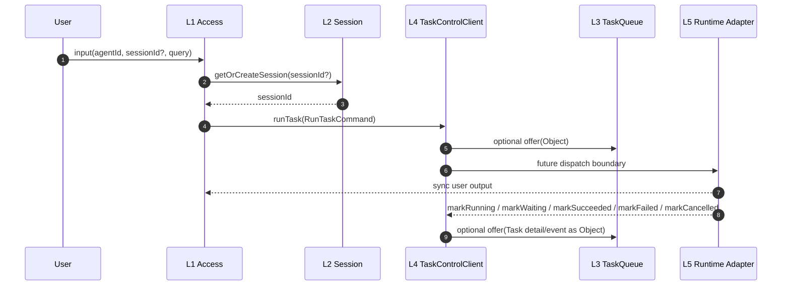
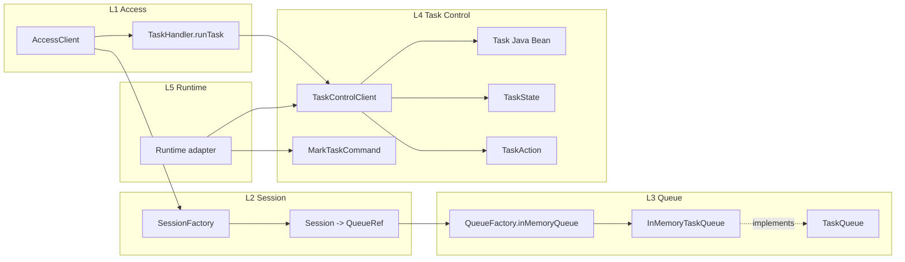
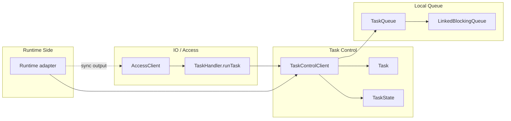
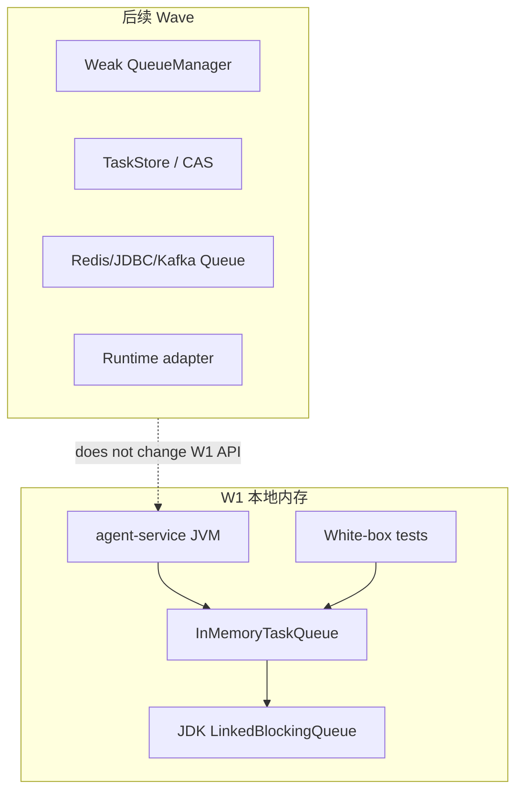
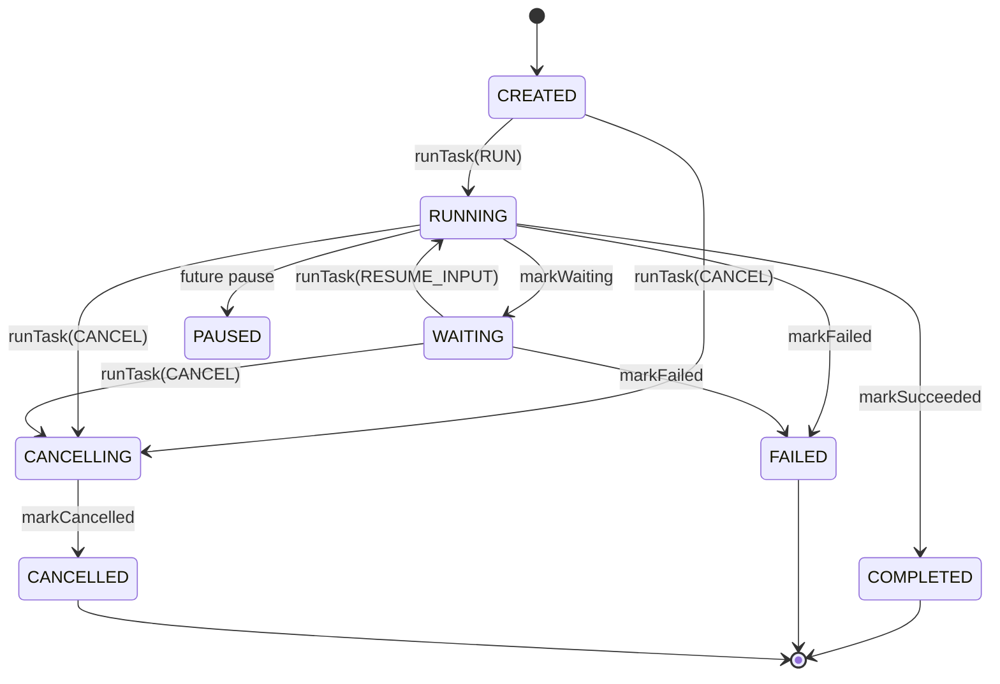
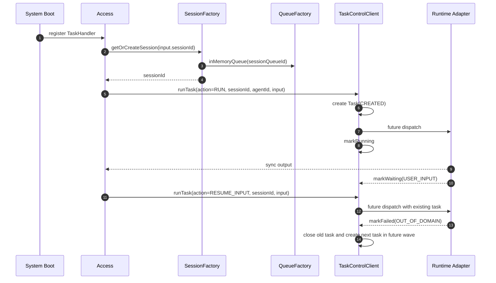

# Agent Service L3/L4 Taskflow Queue/Control 架构提议

本文收敛 2026-05-30 至 2026-06-01 的架构讨论，并同步 PR #102 当前实现。核心目标是先冻结 L3/L4 的最小接口面，避免提前把 Runtime、QueueManager、TaskStore 等后续实现铺得过重。

## 0. 结论

1. L3 是通用 Queue 层，不理解队列内容物类型。
2. L4 是 Task 控制层，拥有 Task、Task 状态、Task 动作和状态标记 API。
3. Session 不持有 Task；Session 可绑定 Queue/QueueRef，但只把 `sessionId` 返回给 Access。
4. L1 只通过一个 `runTask(RunTaskCommand)` 入口提交任务意图。
5. `RUN`、`RESUME_INPUT`、`CANCEL` 通过 `TaskAction` 枚举表达，不拆成多个 `TaskHandler` 方法。
6. `QueueFactory` 在 W1 是静态工厂类，不是 interface。
7. W1 Queue 使用 JDK `LinkedBlockingQueue` 实现内存 FIFO。
8. `QueueManager` 采用弱管理方向，但不进入 W1 必须代码。
9. Runtime 不持有 Queue，不定义 `RuntimeQueueGateway`，不直接发布或消费 Queue。
10. Runtime 状态意图通过 adapter 调用 L4 `TaskControlClient.mark*`。
11. Runtime 面向用户的主输出当前按同步返回路径进入 Access。
12. Task 信号在 L1-L4 内闭环：L1 归一输入，L2 只提供会话绑定，L3 只承载对象，L4 解释信号并维护 Task 状态。
13. `queued` 是处理过程，不是 Task 主状态。
14. `WAITING_FOR_TOOL` 与 `EXPIRED` 不进入 Task 主状态集合。
15. 外部请求携带 `agentId`，L1 只透传；缺失或无效由 Runtime 返回 `AGENT_ID_INVALID`。

一句话版本：

```text
L1 用 runTask 提交意图，L3 提供薄 Queue，L4 维护 Task 状态，Runtime 只通过 adapter 回写 mark* 状态意图。
```

## 1. 与旧设计的冲突解决

| 冲突点 | 收敛结论 |
|---|---|
| Session 是否包含 Task | 不包含。Session 是会话窗口，不是任务聚合。 |
| Queue 是否持有 Task 状态 | 不持有。Queue 只管理对象顺序和读取，不解释对象。 |
| 是否需要三轨 Queue | 暂不需要。当前只冻结一个薄 Queue API；通道语义由调用方和后续 manager/policy 处理。 |
| Runtime 是否消费 Queue | 不消费。Runtime 不拿 Queue，也不发布 Queue 对象。 |
| 是否需要 `RuntimeQueueGateway` | 不需要。Runtime 细节先回到 L4，由 L4 决定是否写 Queue。 |
| `TaskHandler` 是否需要多个方法 | W1 不需要。统一 `runTask + TaskAction`。 |
| `QueueFactory` 是否是 SPI/interface | W1 不是。当前为静态工厂函数。 |
| taskflow 是否新增 SPI 包 | W1 不新增。当前是内部 API 与本地组件。 |

## 2. 4+1 视图

### 2.1 场景视图



说明：

- Access 不需要知道 `queueId`。
- Controller/Control 后续通过 `sessionId` 和内部绑定找到 Queue。
- Runtime 同步返回用户输出，同时通过 adapter 回写状态意图。
- Queue 只看到 `Object`，不知道对象是否代表 Task、上下文或诊断信息。

### 2.2 逻辑视图



### 2.3 开发视图

```text
agent-service/src/main/java/com/huawei/ascend/service/taskflow/
  queue/
    TaskQueue.java
    InMemoryTaskQueue.java
    QueueFactory.java

  control/
    Task.java
    TaskState.java
    TaskFailureCode.java
    WaitingReason.java
    api/
      TaskControlClient.java

agent-service/src/test/java/com/huawei/ascend/service/taskflow/test/
  TaskBeanWhiteboxTest.java
  InMemoryTaskQueueWhiteboxTest.java
  TaskControlClientApiWhiteboxTest.java
```

开发约束：

1. `queue/` 不依赖 `control/`、`access/`、`session/`、Runtime。
2. `control/api/TaskControlClient` 是内部 API，不是 SPI。
3. 当前不新增 `spi/` 包。
4. Runtime adapter 不放进 `queue/`。
5. 后续若接入 PR #100 的 Runtime/Engine 设计，由 Runtime 侧 adapter 转接，L3 Queue 不感知。

### 2.4 进程视图



### 2.5 物理视图



## 3. 接口定义

### 3.1 TaskQueue

```java
public interface TaskQueue<T> {
    String queueId();
    boolean offer(T value);
    Optional<T> poll();
    Optional<T> peek();
    List<T> snapshot();
    int size();
}
```

### 3.2 QueueFactory

```java
public final class QueueFactory {
    private QueueFactory() {
    }

    public static <T> TaskQueue<T> inMemoryQueue(String queueId) {
        return new InMemoryTaskQueue<>(queueId);
    }
}
```

### 3.3 TaskControlClient

```java
public interface TaskControlClient {
    CompletionStage<TaskResult> runTask(RunTaskCommand command);

    CompletionStage<TaskResult> markRunning(MarkTaskCommand command);
    CompletionStage<TaskResult> markWaiting(MarkTaskCommand command);
    CompletionStage<TaskResult> markSucceeded(MarkTaskCommand command);
    CompletionStage<TaskResult> markFailed(MarkTaskCommand command);
    CompletionStage<TaskResult> markCancelled(MarkTaskCommand command);
}
```

动作枚举：

```java
public enum TaskAction {
    RUN,
    RESUME_INPUT,
    CANCEL
}
```

## 4. Task 状态



状态集合：

```text
CREATED
RUNNING
WAITING
PAUSED
CANCELLING
COMPLETED
FAILED
CANCELLED
```

排除项：

- `QUEUED`：这是入队过程，不是 Task 状态。
- `WAITING_FOR_TOOL`：工具等待用 detail/reason 表达。
- `EXPIRED`：过期用失败码或 Runtime detail 表达。

## 5. 开闭原则与依赖倒置

### 5.1 开闭原则

| 扩展点 | 允许方式 | 不允许方式 |
|---|---|---|
| Queue backend | 新增实现类，例如 Redis/JDBC/Kafka Queue。 | 修改 `TaskControlClient` 或让 Queue 理解 Task。 |
| Task 动作 | 优先扩展 `TaskAction`。 | 给 `TaskHandler` 继续加多个入口方法。 |
| Runtime 接入 | Runtime 侧 adapter 调用 `TaskControlClient.mark*`。 | Runtime 直接持有 Queue 或写 Task 字段。 |
| Queue 管理 | 后续新增弱管理 `QueueManager`。 | 把 admin port 挂到 `TaskQueue` 主接口。 |
| Task 存储 | 后续新增 `TaskStore`。 | 在 Queue 里扫描对象来判断当前 Task。 |

### 5.2 依赖倒置

依赖方向：

```text
L1 Access -> L4 TaskControlClient
L4 Control -> L3 TaskQueue
L3 Queue -> JDK only
Runtime adapter -> L4 TaskControlClient.mark*
```

硬约束：

1. `queue/` 不依赖 `control/`。
2. `control/` 不依赖具体 Runtime。
3. Runtime 不依赖完整 Queue。
4. Access 不感知 `queueId`。
5. 后续管理能力通过新组件接入，不污染 W1 主接口。

## 6. QueueManager 裁决

当前结论：采用弱管理方向，但不进入 W1 必须代码。

弱管理含义：

1. Queue 创建仍通过 factory。
2. Manager 记录 Queue 创建事实、归属、销毁事实和监听关系。
3. Manager 不作为唯一强制创建入口。
4. Manager 不要求普通调用方拿 admin port。
5. Manager 不理解 Task 状态。

后续实现建议：

```text
QueueFactory.create -> notify QueueManager.onCreated
QueueFactory.destroy -> notify QueueManager.onDeleted
QueueManager -> list/query/audit/listener registry
```

## 7. Runtime 边界

当前不定义：

- `RuntimeQueueGateway`
- Runtime Queue consumer
- Runtime Queue publisher
- 第二套 Runtime 侧 `TaskControlClient`

当前定义：

1. Runtime 可以同步返回面向用户的输出。
2. Runtime 可以通过 adapter 调用 L4 `markRunning`、`markWaiting`、`markSucceeded`、`markFailed`、`markCancelled`。
3. Runtime 如果产生 checkpoint、诊断、压缩上下文，先作为 detail/result 交给 L4。
4. L4 决定是否把这些对象写入 Queue。

## 8. 用户首次多轮流程



流程备注：

- 第一次没有 Session 时，由 SessionFactory 创建 Session。
- Session 对 Access 只返回 `sessionId`。
- Access 不传 `queueId`。
- 有效 Task 的判断后续由 L4 TaskStore/索引完成，不靠扫描 Queue 内容。
- OOD 后是否立即创建新 Task 是后续 W3 策略，需要单独实现和测试。

## 9. 风险与待确认

| 风险 | 当前处理 |
|---|---|
| Runtime 同步返回 Access，同时回写 TCC，可能出现顺序/失败一致性问题。 | 记录为 W3/W4 风险；需要幂等键、revision 和失败补偿策略。 |
| Access 不知道 `queueId`，Controller 后续如何定位 Queue。 | 通过 Session 内部绑定和弱管理 QueueManager 解决；W1 不实现。 |
| OOD 后谁创建新 Task。 | L4 创建，Runtime 只报告 `OUT_OF_DOMAIN` / `NOT_CURRENT_TASK`。 |
| QueueManager 强管理会带来权限面。 | 采用弱管理，不暴露 admin port。 |
| 当前 API 仍有 `mark*` 多方法。 | 这些是 Runtime adapter 回写状态意图，不是 L1 handler 入口；L1 仍只有 `runTask`。 |
| `agentId` 不校验可能导致晚失败。 | 按决议由 Runtime 返回 `AGENT_ID_INVALID`，L1 不做 fallback。 |

## 10. Wave 计划

### W1：当前 PR #102

交付：

- `TaskQueue`
- `InMemoryTaskQueue`
- `QueueFactory`
- `Task`
- `TaskState`
- `TaskFailureCode`
- `WaitingReason`
- `TaskControlClient`
- 白盒测试

验证：

- Queue FIFO。
- Queue snapshot 只读且不 drain。
- Task Java Bean 可设置状态。
- Task transition 递增 revision。
- `RunTaskCommand` 防御性拷贝 metadata。
- `CANCEL` 必须携带 `taskId`。

### W2：弱管理 QueueManager

交付：

- Queue 生命周期事实登记。
- Queue 查询和审计视图。
- listener registry。
- 不改变 `TaskQueue` 主接口。

### W3：TaskStore 与控制实现

交付：

- 当前 Task 查询。
- `findActiveTask(sessionId)`。
- revision/CAS。
- OOD 后创建新 Task 的策略。

### W4：Runtime adapter

交付：

- 对齐 PR #100 Runtime/Engine SPI。
- Runtime adapter 回写 `TaskControlClient.mark*`。
- Runtime 不直接访问 Queue。

## 11. 当前 PR 检查项

必须满足：

1. Java 代码里没有 `RuntimeQueueGateway`。
2. Java 代码里没有 `resumeInput(...)` / `cancelTask(...)` handler 方法。
3. `TaskControlClient` 只有一个 L1 入站入口 `runTask(...)`。
4. `TaskAction` 包含 `RUN`、`RESUME_INPUT`、`CANCEL`。
5. `QueueFactory` 是 `final` 类，提供静态 `inMemoryQueue(...)`。
6. 白盒测试在 `agent-service/src/test/java/com/huawei/ascend/service/taskflow/test`。
7. 文档位于 `architecture/docs/L1/agent-service/`。
