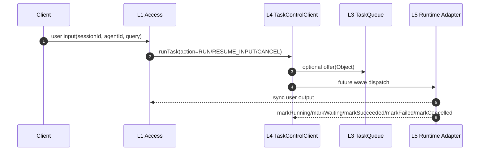
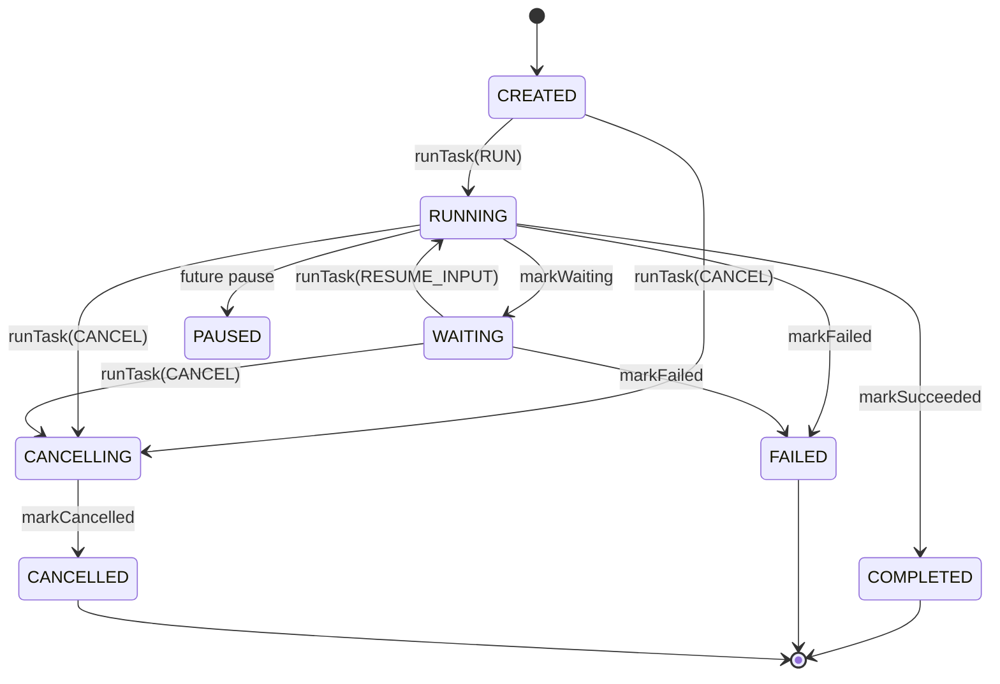

# Agent Service L3/L4 Taskflow Queue/Control 实现规格

本文只说明当前 PR #102 的 W1 实现形态：包结构、接口、数据结构、测试和后续 Wave。本文不重复解释为什么这样设计；原因见同目录架构提议文档。

## 0. W1 实现范围

W1 只保留必须代码：

1. L3 提供一个基于 JDK `LinkedBlockingQueue` 的本地内存队列。
2. `QueueFactory` 是 `final` 工具类，提供静态工厂函数，不是 interface。
3. L4 提供 `Task` Java Bean、Task 状态枚举、失败码、等待原因。
4. L4 提供一个紧凑的 `TaskControlClient` API。
5. L1 侧只有一个任务入口：`runTask(RunTaskCommand)`。
6. `RUN`、`RESUME_INPUT`、`CANCEL` 通过 `TaskAction` 表达，不拆成多个 handler 方法。
7. 当前不实现 `QueueManager`、`TaskStore`、`TaskController`、runtime dispatcher；这些进入后续 Wave。
8. 当前不定义 `RuntimeQueueGateway`。Runtime 不直接发布或消费 Queue。

## 1. 包结构

```text
agent-service/src/main/java/com/huawei/ascend/service/taskflow/
  queue/
    TaskQueue.java
    InMemoryTaskQueue.java
    QueueFactory.java

  control/
    Task.java
    TaskState.java
    TaskFailureCode.java
    WaitingReason.java
    api/
      TaskControlClient.java

agent-service/src/test/java/com/huawei/ascend/service/taskflow/test/
  TaskBeanWhiteboxTest.java
  InMemoryTaskQueueWhiteboxTest.java
  TaskControlClientApiWhiteboxTest.java
```

命名规则：

- `api/` 表示平台内部调用 API。
- 当前没有新增 `spi/` 包；SPI 只用于“本模块定义接口、外部 provider 实现”的扩展点。
- `TaskControlClient` 当前由 L4 拥有，不要求外部 provider 实现，因此不放在 `spi/`。

## 2. L3 Queue 接口

### 2.1 TaskQueue

```java
package com.huawei.ascend.service.taskflow.queue;

import java.util.List;
import java.util.Optional;

public interface TaskQueue<T> {
    String queueId();
    boolean offer(T value);
    Optional<T> poll();
    Optional<T> peek();
    List<T> snapshot();
    int size();
}
```

实现规则：

1. Queue 不关心队列内容物类型。
2. Queue 不解析 Task，不持有 Task 状态。
3. Queue 当前只提供 FIFO、查看快照和读取能力。
4. `snapshot()` 返回只读拷贝，不能 drain 队列。
5. Queue 不暴露 admin port。

### 2.2 InMemoryTaskQueue

```java
public final class InMemoryTaskQueue<T> implements TaskQueue<T> {
    // 使用 JDK LinkedBlockingQueue 作为 W1 本地内存实现。
}
```

实现规则：

1. `queueId` 必须非空白。
2. `offer(null)` 必须拒绝。
3. FIFO 顺序以 JDK 队列语义为准。
4. 该实现仅用于 W1 本地验证；后续 Redis/JDBC/Kafka 等实现不得改变 `TaskQueue` 基础语义。

### 2.3 QueueFactory

```java
public final class QueueFactory {
    private QueueFactory() {
    }

    public static <T> TaskQueue<T> inMemoryQueue(String queueId) {
        return new InMemoryTaskQueue<>(queueId);
    }
}
```

实现规则：

1. `QueueFactory` 不是 interface。
2. W1 只提供静态工厂函数。
3. 后续若引入弱管理 `QueueManager`，可在创建/销毁时通知 manager；W1 不强制实现。
4. 创建 Queue 不要求调用方知道具体实现类。

## 3. L4 Task 数据结构

### 3.1 Task

`Task` 是 Java Bean，有默认构造函数、setter/getter 和一个便捷工厂函数。

关键字段：

```text
tenantId
sessionId
taskId
agentId
state
revision
waitingReason
failureCode
detail
createdAt
updatedAt
```

实现规则：

1. `tenantId`、`sessionId`、`taskId`、`state`、`revision`、`createdAt`、`updatedAt` 必须有效。
2. `agentId` 可为空；缺失或无效由 Runtime 返回 `AGENT_ID_INVALID`，L1 不兜底选择 Agent。
3. `transitionTo(...)` 修改状态并递增 `revision`。
4. `terminal()` 判断 `COMPLETED`、`FAILED`、`CANCELLED`。

### 3.2 TaskState

```java
public enum TaskState {
    CREATED,
    RUNNING,
    WAITING,
    PAUSED,
    CANCELLING,
    COMPLETED,
    FAILED,
    CANCELLED
}
```

实现规则：

1. `QUEUED` 不是 Task 状态；入队只是处理过程。
2. `WAITING_FOR_TOOL` 不进入主状态集合；工具等待由 Runtime detail 或失败原因表达。
3. `EXPIRED` 不进入主状态集合；过期由 Runtime 返回失败原因表达。

### 3.3 TaskFailureCode

```java
public enum TaskFailureCode {
    AGENT_ID_INVALID,
    OUT_OF_DOMAIN,
    NOT_CURRENT_TASK,
    ENGINE_DISPATCH_REJECTED,
    RUNTIME_ERROR,
    CANCELLED_BY_RUNTIME
}
```

说明：

- `OUT_OF_DOMAIN` / `NOT_CURRENT_TASK` 用于表达 Runtime 认为输入不属于当前 Task。
- 是否创建新 Task 由 L4 后续控制实现决定。

### 3.4 WaitingReason

```java
public enum WaitingReason {
    USER_INPUT,
    USER_CONFIRMATION,
    DEPENDENCY
}
```

## 4. L4 TaskControlClient API

`TaskControlClient` 是 L4 对 L1 和 Runtime adapter 暴露的内部 API。

```java
public interface TaskControlClient {
    CompletionStage<TaskResult> runTask(RunTaskCommand command);

    CompletionStage<TaskResult> markRunning(MarkTaskCommand command);
    CompletionStage<TaskResult> markWaiting(MarkTaskCommand command);
    CompletionStage<TaskResult> markSucceeded(MarkTaskCommand command);
    CompletionStage<TaskResult> markFailed(MarkTaskCommand command);
    CompletionStage<TaskResult> markCancelled(MarkTaskCommand command);
}
```

### 4.1 TaskAction

```java
public enum TaskAction {
    RUN,
    RESUME_INPUT,
    CANCEL
}
```

规则：

1. L1 只调用 `runTask`。
2. 首次用户输入使用 `TaskAction.RUN`。
3. 用户补充等待中的 Task 使用 `TaskAction.RESUME_INPUT`。
4. 用户取消使用 `TaskAction.CANCEL`。
5. 后续需要更多动作时扩展 `TaskAction`，不优先增加新的 handler 方法。

### 4.2 RunTaskCommand

```java
public record RunTaskCommand(
        String tenantId,
        String sessionId,
        String taskId,
        String agentId,
        TaskAction action,
        Object input,
        String reason,
        String idempotencyKey,
        Map<String, Object> metadata) {
}
```

校验规则：

1. `tenantId`、`sessionId`、`action` 必须存在。
2. `CANCEL` 必须携带 `taskId`。
3. 非 `CANCEL` 动作必须携带 `input`。
4. `metadata` 防御性拷贝。
5. `agentId` 由外部传入并透传；有效性由 Runtime 判断。

### 4.3 MarkTaskCommand

```java
public record MarkTaskCommand(
        String tenantId,
        String sessionId,
        String taskId,
        long expectedRevision,
        WaitingReason waitingReason,
        TaskFailureCode failureCode,
        Object detail,
        Map<String, Object> metadata) {
}
```

校验规则：

1. `tenantId`、`sessionId`、`taskId` 必须存在。
2. `expectedRevision` 必须为正数。
3. `metadata` 防御性拷贝。
4. Runtime adapter 通过 `mark*` 提交状态意图，真实状态流转由 L4 控制实现裁决。

### 4.4 TaskResult

```java
public record TaskResult(
        String tenantId,
        String sessionId,
        String taskId,
        TaskState state,
        long revision,
        boolean accepted,
        String message) {
}
```

## 5. Runtime 边界

当前 W1 不新增 Runtime 派发接口。

规则：

1. Runtime 不持有 `TaskQueue`。
2. Runtime 不实现 `RuntimeQueueGateway`。
3. Runtime 不直接发布或消费 Queue。
4. Runtime 面向 Access 的输出按同步返回链路处理。
5. Runtime 的状态意图由 adapter 转成 `TaskControlClient.mark*` 调用。
6. Runtime 细节对象如果需要入队，必须先交回 L4，由 L4 决定是否写 Queue。

## 6. 当前流程视图



## 7. 状态转换视图



## 8. 白盒测试

W1 测试目录：

```text
agent-service/src/test/java/com/huawei/ascend/service/taskflow/test/
```

当前测试：

1. `TaskBeanWhiteboxTest`
2. `InMemoryTaskQueueWhiteboxTest`
3. `TaskControlClientApiWhiteboxTest`

最小验证命令：

```powershell
.\mvnw.cmd -pl agent-service -am "-Dtest=TaskBeanWhiteboxTest,InMemoryTaskQueueWhiteboxTest,TaskControlClientApiWhiteboxTest" "-Dsurefire.failIfNoSpecifiedTests=false" -Pquality -B -ntp test
```

## 9. 后续 Wave

### W2：弱管理 QueueManager

目标：

- 记录 Queue 创建者、归属 session、生命周期事实。
- 管理监听注册、审计日志和维护视图。
- 不作为强制创建入口。
- 不在 Queue 主接口上暴露 admin port。

### W3：TaskStore 与状态机实现

目标：

- 实现当前 Task 查询。
- 实现 `findActiveTask(sessionId)`。
- 实现 revision/CAS。
- 实现 Runtime OOD 后由 L4 创建新 Task 的策略。

### W4：Runtime adapter 接入

目标：

- 对齐 PR #100 的 Runtime/Engine SPI。
- Runtime adapter 将执行结果转换成 `TaskControlClient.mark*`。
- Runtime 不直接访问 Queue。

## 10. 已解决的冲突

1. `TaskHandler` 不再暴露 `resumeInput`、`cancelTask`，统一为 `runTask + TaskAction`。
2. `QueueFactory` 不再是 interface，W1 是静态工具类。
3. 当前不实现 `QueueManager` 强管理。
4. 当前不定义 `RuntimeQueueGateway`。
5. taskflow 当前按内部 API 处理，不注册为新的 SPI 面。
6. 白盒测试已经放入 `agent-service/src/test/java/com/huawei/ascend/service/taskflow/test`。
