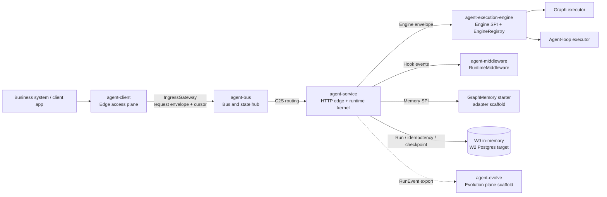
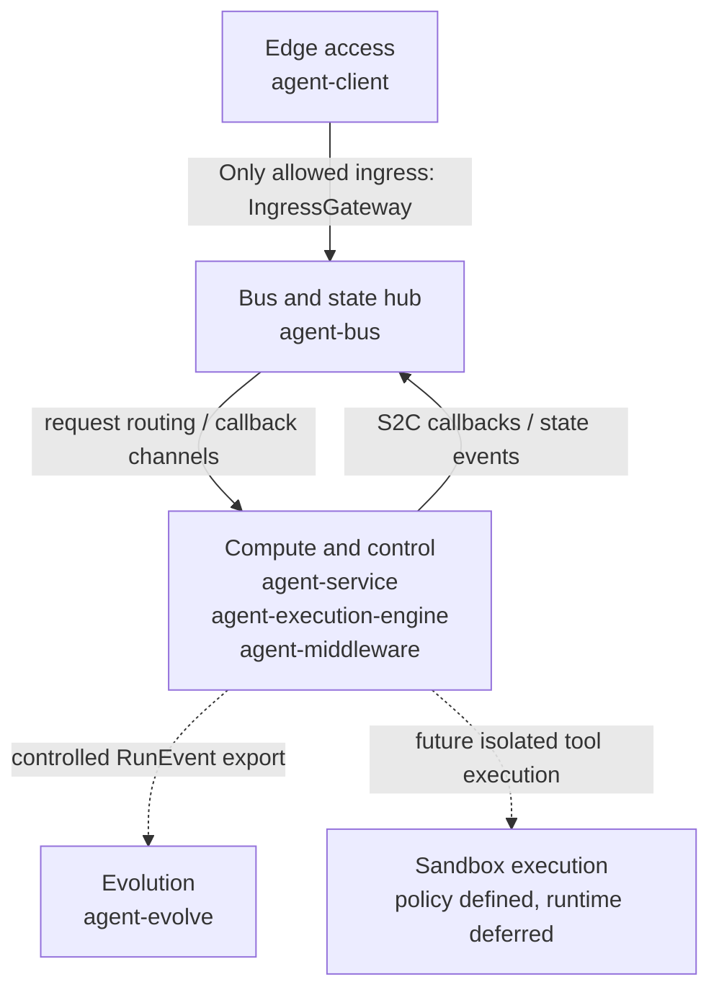
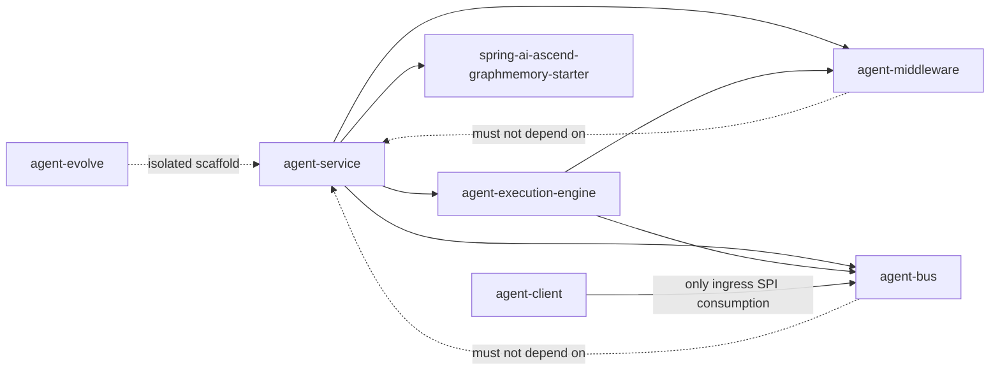
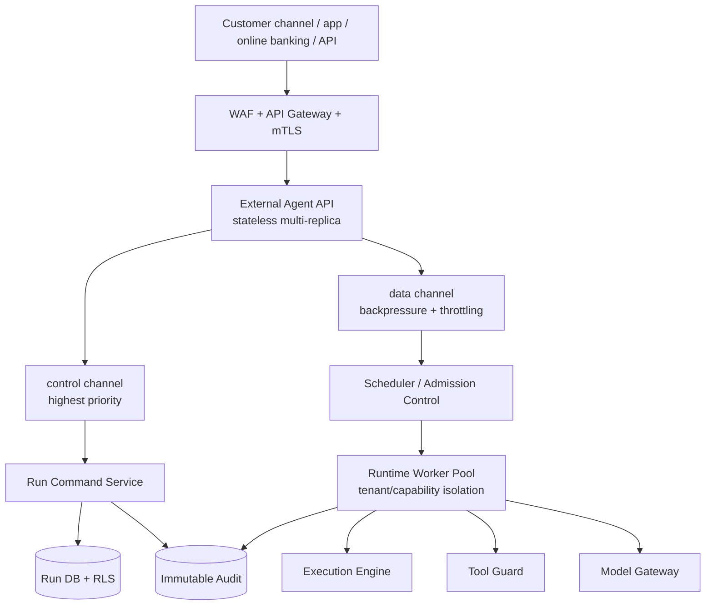
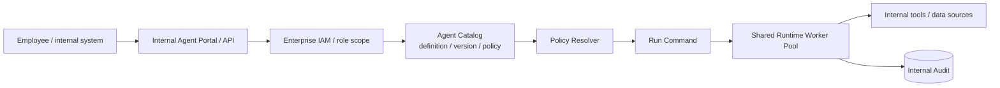
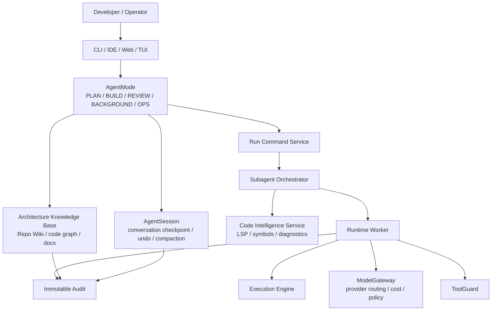
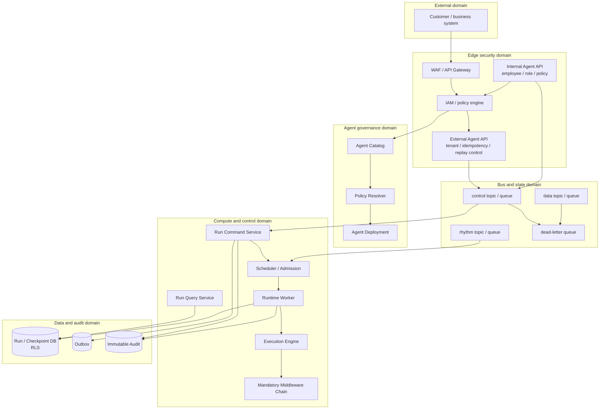

# spring-ai-ascend Architecture and Financial-Grade Readiness Review

> Perspective: independent third-party architecture review  
> Review method: strict financial-grade production criteria  
> Scope: L0/L1 architecture, module decomposition, deployment topology, high availability, security, reliability, customer-facing versus internal-agent deployment modes, development versus operations posture, and cross-module interface requirements  
> Out of scope: detailed evaluation of incomplete model internals, LLM implementations, and tool execution internals  

---

## 1. Executive Summary

`spring-ai-ascend` is best understood today as a governance-heavy Agent Runtime foundation, not as a production-ready financial-grade customer-facing agent platform.

The architecture has strong instincts: it separates L0/L1/L2 concerns, records decisions through ADRs, defines SPI boundaries, uses OpenAPI and YAML contracts, introduces Run state management, adopts Cursor Flow for long-running work, separates execution engines, and defines a bus-centered cross-plane communication model. These are all directionally correct.

The hard criticism is that the architecture is still stronger as a specification corpus than as a production topology. The current L0/L1 design explains many concepts, but it does not yet fully answer the questions that matter most in banking-scale deployment:

1. Which runtime component owns which failure domain?
2. Which interface crosses which trust boundary?
3. Which operations are customer-facing, internal-only, development-only, or offline?
4. Which state transitions are durable, auditable, recoverable, and idempotent?
5. Which agent is being executed, under which version, policy, exposure tier, and lifecycle stage?

The largest architectural gaps are:

- L0 has logical planes, but not enough deployment-domain authority.
- L1 has modules, but not enough runtime-role decomposition.
- `agent-service` is too broad as a production role.
- `agent-bus` owns the right boundary, but its production delivery semantics are under-specified.
- The system models `Run` better than it models a governable `AgentDefinition` or `AgentDeployment`.
- `posture=dev/research/prod` is useful, but insufficient to distinguish customer-facing, internal-operator, developer, and offline workloads.
- Cross-module interfaces need financial-grade metadata for identity, authorization, idempotency, ordering, retry, audit, SLO, and data classification.

Overall judgment:

| Dimension | Rating | Judgment |
|---|---|---|
| Architectural direction | Good | The decomposition is a credible platform foundation |
| Financial production completeness | Weak | HA, DR, audit, security, and runtime enforcement remain incomplete |
| L0 decomposition | Medium | Principles are strong, deployment authority is weak |
| L1 decomposition | Medium | Module boundaries are useful, runtime roles are unclear |
| Customer-facing readiness | Weak | Needs explicit HA, SLO, isolation, audit, and degradation design |
| Internal-agent flexibility | Weak to medium | Needs agent definition, versioning, deployment, and policy abstractions |
| Dev/ops separation | Weak | Posture exists, but exposure and lifecycle dimensions are missing |

The recommended next step is not to add more model features. The next step is to harden the L0/L1 architecture into a production operating model: deployment domains, trust boundaries, runtime roles, agent definitions, lifecycle stages, exposure tiers, and financial-grade interface contracts.

---

## 2. Current Architecture Overview

### 2.1 System Intent

The system aims to provide a self-hostable Agent Runtime platform. Its intended responsibilities include:

- Tenant-aware request ingress.
- Idempotency and replay protection.
- Long-running task submission through Task Cursor semantics.
- Run lifecycle and state-machine governance.
- Graph and agent-loop execution models.
- Heterogeneous engine selection through an explicit engine contract.
- Runtime middleware and hook surfaces.
- Client-to-server ingress through the bus plane.
- Server-to-client capability callback through S2C transport.
- Memory, knowledge, and evolution-plane boundaries.
- Architecture governance through L0/L1/L2 documents, ADRs, gates, and tests.

The current implementation is strongest around the skeleton of the runtime contract: health, Run creation/query/cancel, tenant and idempotency filters, Run state machine, reference in-memory runtime adapters, EngineRegistry, EngineEnvelope, middleware SPI, IngressGateway contract, and S2C callback SPI.

The current implementation is not yet complete around production bus runtime, durable persistence, Postgres RLS, outbox, Temporal-like orchestration, model gateway, tool guard, production agent client SDK, immutable audit, disaster recovery, and capacity governance.

### 2.2 Current Logical Architecture



### 2.3 L0 Five-Plane Model



The five-plane model is directionally correct. The problem is that it is still mostly a logical and module-level model. For financial-grade deployment, each plane must also become a deployment domain, a security domain, a data domain, and a failure domain.

---

## 3. L0 Architecture Review

### 3.1 What L0 Gets Right

L0 correctly emphasizes:

- Business/platform decoupling.
- Cursor Flow for long-running tasks.
- Three-track bus isolation.
- Tenant-centric runtime and storage boundaries.
- Non-blocking runtime I/O expectations.
- Heterogeneous engine contracts.
- Sandbox permission narrowing.
- Governed architecture artifacts and decision traceability.

The Wave-N review adds an important balancing point: these are not merely documentation strengths. `spring-ai-ascend` has a stronger rule-enforcement posture than many agent frameworks because it combines compile-time constraints, runtime validation, architecture tests, and posture gates. That enforcement stack is a real differentiator and should be preserved while other parts of the architecture are simplified.

Preserve as strategic strengths:

| Strength | Why it matters |
|---|---|
| Checked interruption primitive | `SuspendSignal` as a checked exception makes suspension handling visible to callers |
| Run state-machine DFA | Illegal lifecycle transitions are rejected centrally |
| SPI purity rules | Keeps extension interfaces portable and reduces hidden coupling |
| ArchUnit / gate enforcement | Turns architecture constraints into executable checks |
| Posture gate | Prevents development-only defaults from silently becoming production behavior |
| Tenant-first design | Aligns with financial isolation expectations |

These are the right primitives for an agent platform that wants to operate in regulated environments.

### 3.2 L0 Gaps

#### L0-P0-1: Deployment failure domains are not first-class

The five-plane topology does not yet define hard production deployment constraints. It does not clearly state which plane must be independently deployed, scaled, isolated, upgraded, failed over, or recovered.

Impact:

- Logical separation may collapse into a single operational blast radius.
- A failure in API ingress, scheduling, runtime workers, or bus routing could affect all workloads.
- HA claims cannot be verified without deployment-domain mapping.

Recommendations:

- Add an L0 deployment view.
- Define deployment unit, state ownership, scaling model, failure domain, recovery model, and isolation requirement for each plane.
- Introduce `runtime-roles.yaml` or `deployment-plane-contract.yaml`.

#### L0-P0-2: Business-continuity objectives are missing

The architecture does not yet define RTO, RPO, SLO, error budgets, maximum queue delay, maximum recovery delay, or maximum data-loss window per critical capability.

Impact:

- The system can claim recoverability without proving whether recovery is acceptable for banking workloads.
- Customer-facing and internal workloads may accidentally share the same weak continuity assumptions.

Recommendations:

- Define SLO and continuity classes for Run creation, Run query, Run cancellation, S2C callback, audit write, checkpoint recovery, and bus delivery.
- Bind each class to verification evidence.

#### L0-P0-3: Trust boundaries are under-modeled

The architecture includes tenant identity, JWT, and sandbox policy, but lacks a complete trust-boundary matrix.

Impact:

- Internal interfaces may be treated as implicitly trusted.
- Cross-plane calls may lack explicit authentication, authorization, encryption, replay protection, and audit requirements.

Recommendations:

- Add `trust-boundary-matrix.yaml`.
- For every cross-plane call, define caller, callee, trust level, credential type, authorization policy, encryption requirement, replay control, and audit requirement.

#### L0-P1-1: Audit is not yet a first-class vertical

Telemetry is not audit. Trace, metrics, and logs help diagnose systems; they do not by themselves satisfy financial evidence requirements.

Recommendations:

- Add an Audit Vertical.
- Audit must cover authentication, authorization, tenant decisions, Run creation/cancel/resume, state transitions, model calls, tool calls, policy denials, human approvals, and data access.
- Audit storage must be immutable or tamper-evident.

---

## 4. L1 Module Decomposition Review

### 4.1 Current Module Assessment

| Module | Current role | Assessment |
|---|---|---|
| `agent-client` | Edge SDK scaffold | Correct direction, but must be treated as untrusted |
| `agent-bus` | Ingress, S2C, bus contracts | Correct ownership, insufficient production semantics |
| `agent-service` | HTTP edge + runtime kernel + Run owner + reference adapters | Too broad as a runtime role |
| `agent-execution-engine` | Engine SPI, envelope, registry, orchestration SPI | Correct boundary, needs policy and governance metadata |
| `agent-middleware` | Runtime hook surface | Correct abstraction, must become mandatory on governed paths |
| `agent-evolve` | Evolution-plane scaffold | Should remain isolated and opt-in by default |
| `spring-ai-ascend-graphmemory-starter` | Memory starter scaffold | Needs strict data-governance boundaries before production |
| `spring-ai-ascend-dependencies` | BOM/dependency management | Supporting module |

### 4.2 Module Dependency View



### 4.3 Module Findings

#### L1-P0-1: `agent-service` is the primary concentration risk

`agent-service` currently combines HTTP edge, tenant handling, idempotency, JWT concerns, Run entity ownership, repository SPI, runtime reference adapters, S2C reference implementation, resilience, memory SPI, observability, and controller auto-configuration.

This is acceptable for early consolidation, but dangerous as a production runtime role.

Recommendations:

- Keep the Maven module if necessary, but define separate runtime roles:
  - `external-api-role`
  - `internal-api-role`
  - `run-command-role`
  - `run-query-role`
  - `runtime-worker-role`
  - `persistence-worker-role`
- Each role should have separate scaling, isolation, SLO, and failure-management expectations.

#### L1-P0-2: `agent-bus` needs production delivery semantics

The bus owns the right interface boundary, but its contracts need more than envelopes.

Required bus semantics:

| Required semantic | Requirement |
|---|---|
| Global message ID | Stable unique ID for every message |
| Tenant scope | Mandatory tenant ID for partitioning, authorization, and throttling |
| Idempotency key | Mandatory for state-changing commands |
| Causality ID | Link to request, Run, trace, parent event |
| Ordering key | Ordered processing for same-Run state changes |
| Priority | control > data; cancel/pause > normal execution |
| Expiration | Expired messages must not wait forever |
| Retry policy | Max attempts, backoff, retryable error classes |
| DLQ policy | Poison messages must be isolated and audited |
| Backpressure | DEFERRED responses require reason and retry guidance |

#### L1-P0-3: `agent-execution-engine` needs governance metadata

Engine selection should not only decide "which adapter". It must also decide whether execution is allowed under tenant, policy, budget, approval, model, tool, and version constraints.

The existing dual-track execution model is still valuable: `GRAPH` is appropriate for deterministic workflows such as KYC, approval chains, and risk checks; `AGENT_LOOP` is appropriate for open-ended reasoning and tool-use loops such as service assistants or advisory scenarios. The concern is not the existence of the two modes. The concern is that their coordination and recovery contracts must become uniform and explicit.

Recommended engine contract metadata:

- `engine_id`
- `engine_version`
- `adapter_version`
- `agent_id`
- `agent_version`
- `capability_id`
- `tenant_id`
- `run_id`
- `trace_id`
- `audit_id`
- resource budget
- timeout and cancellation token
- approval requirement
- middleware chain version
- explicit fallback policy, defaulting to no silent fallback

Additional dual-track requirements:

- Define one shared resume protocol instead of mode-specific hidden fields.
- Add an explicit coordination state machine for parent/child Run orchestration.
- Define maximum supported nesting depth and enforcement behavior.
- Define how `GRAPH -> AGENT_LOOP`, `AGENT_LOOP -> GRAPH`, and multi-child joins are audited.
- Consider whether event-driven orchestration can simplify parts of the current checked-suspension design without losing financial-grade determinism.

#### L1-P1-1: `agent-middleware` must not remain optional

Middleware is the natural place for governance. In production, it must be mandatory for:

- Model calls.
- Tool calls.
- Run state transitions.
- S2C callbacks.
- Audit emission.
- Terminal status writes.

#### L1-P1-2: `agent-client` must remain untrusted

Even an official SDK is not a trusted execution environment.

Every request coming from `agent-client` must still be authenticated, authorized, signed or protected against tampering, checked for replay, scoped to tenant, and audited.

#### L1-P1-3: `agent-evolve` should remain isolated by default

Evolution workloads involve training data, trace export, model improvement, and potential cross-tenant contamination.

Production export should be opt-in, scoped, anonymized where required, and audited.

---

## 5. Customer-Facing, Internal-Agent, and Development-Mode Review

### 5.1 Three Deployment Modes

| Dimension | Customer-facing agents | Internal individual agents | Development mode |
|---|---|---|---|
| Users | External customers, channels, business systems | Employees, operators, internal processes | Developers and testers |
| Primary goal | Availability, safety, compliance | Flexibility, personalization, fast enablement | Debuggability and fast feedback |
| Deployment | Multi-replica, multi-AZ, strict SLO | Shared pools with policy isolation | Local, mock, in-memory allowed |
| Security | Strongest authentication, authorization, audit | Enterprise identity and role scope | Relaxed only when explicitly marked |
| Data | Strong tenant isolation and retention control | Internal data classification and role access | Test or anonymized data |
| Change control | Canary, approval, rollback | Faster change with guardrails | Rapid iteration |

The current `posture` model is useful, but insufficient. The architecture needs two additional dimensions:

- `exposure_tier`: `external_customer | internal_operator | internal_developer | batch_offline`
- `lifecycle_stage`: `dev | test | pilot | production | retired`

### 5.2 Customer-Facing Agent Deployment

Customer-facing agents must be treated as online financial services.



Required properties:

- Stateless external API tier.
- Multi-replica and multi-AZ deployment.
- Durable Run acceptance after cursor return.
- Physical control/data/rhythm isolation.
- Tenant-level throttling and worker isolation.
- High-priority cancellation and pause path.
- Immutable audit for all customer-visible operations.
- Explicit degradation when model, tool, memory, or downstream services fail.

### 5.3 Internal Individual Agent Deployment

Internal agents need flexibility more than maximum isolation. They should be governed through definitions, versions, policies, and runtime profiles rather than through one deployment per agent.



Required architecture objects:

| Object | Purpose |
|---|---|
| `AgentDefinition` | Model, tools, prompt, policy, data domain |
| `AgentVersion` | Rollback, audit, evaluation, approval |
| `AgentDeployment` | External, internal, development, or offline deployment intent |
| `AgentPolicy` | Authorization, tools, data, approval, quota |
| `AgentRuntimeProfile` | Resource, timeout, retry, concurrency, isolation |

### 5.4 Development versus Operations

| Capability | Development mode | Operations mode |
|---|---|---|
| Storage | In-memory, mock, temporary | Durable, recoverable, auditable |
| Security | Local tokens or simplified auth | Strong auth, authorization, managed keys |
| Tool calls | Mock or local tools | Tool Guard and approval policy |
| Model calls | Test models allowed | Model Gateway required |
| Audit | Simplified but marked non-production | Immutable, complete, searchable |
| Configuration | Hot reload and fast changes | Approval, canary, rollback |
| Data | Test/anonymized samples | Classified, minimized, retained by policy |

Development convenience must be impossible to enable accidentally in operations mode.

---

## 6. Financial-Grade Cross-Module Interface Requirements

Cross-module interfaces must define more than method signatures and payloads.

### 6.1 Runtime Context

Recommended shared context:

```text
RuntimeContext =
  tenant_id
  actor_id
  actor_type
  exposure_tier
  lifecycle_stage
  posture
  agent_id
  agent_version
  run_id
  trace_id
  audit_id
  policy_scope
  data_classification
```

No state-changing call should be allowed without this context or an explicitly documented equivalent.

### 6.2 Interface Metadata

Every cross-module interface should define:

| Field | Purpose |
|---|---|
| `interface_name` | Stable interface name |
| `owner_module` | Owning module |
| `consumer_modules` | Allowed consumers |
| `trust_boundary` | Trust boundary classification |
| `schema_version` | Request/response schema version |
| `compatibility_policy` | Compatibility rules |
| `timeout_policy` | Timeout behavior |
| `retry_policy` | Retry behavior |
| `error_taxonomy` | Stable error classes |
| `slo_class` | Reliability tier |
| `data_classification` | Data sensitivity |

### 6.3 Security Requirements

Every cross-plane interface must define:

- Caller identity.
- Callee identity.
- Authentication mechanism.
- Authorization policy.
- Least-privilege scope.
- Transport encryption.
- Signature or tamper-resistance mechanism.
- Replay protection window.
- Sensitive-field masking rules.
- Key rotation requirements.

### 6.4 Reliability Requirements

Every state-changing interface must define:

- Idempotency semantics.
- Atomicity boundary.
- Retry safety.
- Ordering guarantee or explicit lack of it.
- Conflict behavior.
- Final state after timeout.
- Cancellation semantics.
- Compensation action.
- DLQ handling.
- Recovery scan behavior.

### 6.5 Audit Requirements

Every financially relevant operation must emit an audit event that records:

- Actor.
- Tenant.
- Target Run, agent, capability, or resource.
- Before state.
- After state.
- Policy decision.
- Failure reason.
- Approver or automated policy ID.
- Timestamp.
- Immutable storage location or reference.

---

## 7. Additional Benchmark: Qoder and OpenCode Findings

The Qoder/OpenCode analysis adds a useful missing angle. Claude Code, Cursor, and AgentScope show broad agent architecture patterns; Qoder and OpenCode expose more concrete product and source-level patterns that matter for `spring-ai-ascend`.

Key benchmark signals:

| Benchmark capability | Observation | Architectural implication for `spring-ai-ascend` |
|---|---|---|
| Qoder Repo Wiki | Automatically generates architecture docs, module manuals, dependency maps, API references, flowcharts, UML, and code-reading artifacts | Add a first-class Architecture Knowledge Base / Repo Wiki capability for large enterprise repositories |
| Qoder Quest Mode | Separates complex work into design, execution, and summary | Add explicit task lifecycle: discover → plan → approve → execute → verify → summarize |
| Qoder Plan/Build-style modes | Read-only planning and full-access build modes reduce risk in unfamiliar codebases | Add `AgentMode` and tool-permission profiles |
| Qoder performance complaints | Users report lag and restart needs in large indexed IDE environments | Treat indexing, embedding, repo graph, and memory as production workloads with SLOs and backpressure |
| OpenCode client/server architecture | TUI, desktop, VS Code extension, and web clients communicate with a backend through SDK/API | Separate API clients from runtime server roles; do not collapse all interaction modes into `agent-service` |
| OpenCode session persistence | Uses persistent session state, SSE streaming, and server APIs | Add durable session model distinct from Run; define stream and resume contracts |
| OpenCode Plan/Build agents | Plan and Build are separate primary agents with different permissions | Add permission-scoped agent personas, not just runtime postures |
| OpenCode subagents | Explore/scout/general agents run bounded subtasks with restricted tools | Add first-class subagent dispatch and result aggregation contracts |
| OpenCode LSP integration | LSP gives definition/reference/compiler diagnostics beyond grep | Add Code Intelligence service as an external/plugin capability |
| OpenCode provider abstraction | Many model providers reduce vendor lock-in | Add ModelProvider abstraction and routing policy under ModelGateway |
| OpenCode GitHub Action integration | Agents can be triggered from issues/PR comments with controlled permissions | Add CI/PR integration as a governed operations channel |
| OpenCode undo/compaction lessons | Conversation rollback and cost-aware compaction are product-critical | Add conversation checkpointing, rollback, compaction policy, and cost tiering |

### 7.1 New Gaps Exposed by Qoder/OpenCode

#### Gap A: Missing architecture knowledge-base layer

`spring-ai-ascend` has strong architecture documents, but it does not yet model an always-current Repo Wiki / architecture knowledge base as a runtime or developer capability.

Recommendation:

- Add `ArchitectureKnowledgeBase` as a development and operations capability.
- Inputs: repository graph, module metadata, API specs, ADRs, tests, dependency graph.
- Outputs: module manuals, dependency maps, flow diagrams, API summaries, risk hotspots.
- Governance: generated docs must cite source files and freshness timestamps.

#### Gap B: Missing Plan/Build permission split

Current architecture has posture, but not a clear Plan/Build permission distinction.

Recommendation:

Define agent modes:

| Mode | Permission profile |
|---|---|
| `PLAN_READONLY` | Read/search/list only; no writes or shell mutation |
| `BUILD_APPROVED` | Write and command execution after approval or policy grant |
| `BACKGROUND_ISOLATED` | Runs in isolated environment with durable cursor |
| `REVIEW_ONLY` | Can inspect diffs and tests, cannot mutate |
| `OPS_CONTROL` | Can pause, cancel, resume, adjust limits, never edit code |

#### Gap C: Missing subagent orchestration contracts

OpenCode and Claude-style systems converge on subagent dispatch as a core primitive. `spring-ai-ascend` should not treat subagents as an implementation detail.

The Wave-N comparison with OpenJiuwen sharpens this point: enterprise multi-agent systems need more than parent/child Run nesting. They need persistent agent identity, shared workspace semantics, task claiming, leader/teammate coordination, file/resource locking, and team-level observability.

Recommendation:

Add contracts:

- `AgentSubject`
- `TeamWorkspace`
- `TaskClaim`
- `SubagentTask`
- `SubagentResult`
- `SubagentPermissionProfile`
- `SubagentAggregationPolicy`
- `SubagentIsolationPolicy`
 - `SharedResourceLock`

The platform should continue treating `Run` as an execution record, but it should not treat `Run` as the identity of an agent. `AgentSubject` or an equivalent identity abstraction is required for long-term memory, personalization, team membership, delegation, and audit.

#### Gap D: Missing code-intelligence service boundary

For developer agents, grep is not enough. LSP-backed definitions, references, diagnostics, type information, and symbol indexes are necessary.

Recommendation:

Add `CodeIntelligenceService` as an external/plugin capability with:

- LSP adapter.
- Symbol index.
- Dependency graph.
- Compiler diagnostics.
- Test discovery.
- Change impact analysis.

#### Gap E: Missing session and conversation-state layer

Run state is not the same as conversation/session state. OpenCode’s persisted sessions and SSE interface show that an agent platform needs both.

Recommendation:

Add:

- `AgentSession`
- `ConversationCheckpoint`
- `ConversationCompactionPolicy`
- `UndoPolicy`
- `StreamingResponseContract`

#### Gap F: Missing provider and cost-routing architecture

OpenCode’s provider abstraction and Claude Code’s known multi-model patterns imply that model routing is not a minor adapter concern.

Recommendation:

`ModelGateway` should own:

- provider registry
- model capability matrix
- cost tiering
- fallback policy
- tenant/model allowlist
- data residency policy
- audit of prompt/completion metadata

### 7.2 Updated Target View After Qoder/OpenCode Benchmark



The important change is that developer-agent architecture cannot be represented only by Run, Engine, and Bus. It also needs knowledge base, session state, code intelligence, agent modes, subagent orchestration, provider routing, and rollback/compaction policies.

---

## 8. Recommended Target L0/L1 Architecture



---

## 9. Prioritized Remediation Roadmap

### 9.1 P0: Production Blockers

| ID | Issue | Remediation target |
|---|---|---|
| P0-1 | L0 lacks deployment failure-domain view | Map planes to deployment units, failure domains, recovery domains |
| P0-2 | Missing `exposure_tier` and `lifecycle_stage` | Distinguish customer-facing, internal, developer, offline, production stages |
| P0-3 | `agent-service` runtime roles are unclear | Define API, command, query, worker, persistence roles |
| P0-4 | `agent-bus` lacks production delivery semantics | Add ordering, priority, retry, DLQ, expiration, backpressure |
| P0-5 | No unified `RuntimeContext` | Require common governance context across module calls |
| P0-6 | Audit is not first-class | Add Audit Vertical and immutable audit event catalog |
| P0-7 | Trust boundaries are under-specified | Add trust-boundary matrix |
| P0-8 | No explicit Plan/Build/Review/Background mode model | Add `AgentMode` and permission profiles |
| P0-9 | No durable session/conversation-state model | Add `AgentSession`, checkpoint, undo, compaction policies |
| P0-10 | No persistent agent identity | Add `AgentSubject` distinct from `Run` |
| P0-11 | No shared workspace / task-claim model for multi-agent work | Add `TeamWorkspace`, `TaskClaim`, and resource-lock contracts |

### 9.2 P1: High-Priority Improvements

| ID | Issue | Remediation target |
|---|---|---|
| P1-1 | Missing agent-governance layer | Add `AgentDefinition`, `AgentVersion`, `AgentDeployment`, `AgentPolicy` |
| P1-2 | Engine governance is insufficient | Add policy, budget, approval, version, and audit metadata |
| P1-3 | Middleware can be bypassed | Make mandatory hook points production-enforced |
| P1-4 | Posture is too coarse | Add posture-exposure matrix |
| P1-5 | Internal-agent flexibility lacks a policy model | Add Agent Catalog and Policy Resolver |
| P1-6 | Development conveniences may leak into operations | Guard mock/local/in-memory paths by posture and exposure |
| P1-7 | No architecture knowledge-base capability | Add Repo Wiki / ArchitectureKnowledgeBase |
| P1-8 | No subagent orchestration contract | Add SubagentTask, permission profile, aggregation policy |
| P1-9 | No code-intelligence boundary | Add LSP/symbol/diagnostic CodeIntelligenceService |
| P1-10 | Model provider abstraction is under-modeled | Add ModelGateway provider routing and cost policy |
| P1-11 | Skill/MCP/plugin ecosystem is delayed or under-modeled | Move Skill/MCP/plugin contracts earlier and align them with ToolGuard |
| P1-12 | Dual-track resume semantics are inconsistent | Define a shared resume protocol and coordination state machine |

### 9.3 P2: Medium-Term Cleanup

| ID | Issue | Remediation target |
|---|---|---|
| P2-1 | Governance complexity is high | Separate production-blocking rules from advisory rules |
| P2-2 | Scaffold modules may be misread | Mark non-production runtime roles explicitly |
| P2-3 | OpenAPI surface is thin | Add operations, audit, recovery, and event-subscription APIs |
| P2-4 | GraphMemory data boundary needs detail | Define PII, deletion, retention, tenant isolation |
| P2-5 | CI/PR integration is missing | Add governed GitHub/CI operations channel |
| P2-6 | Indexing and knowledge generation SLOs are absent | Add performance budgets for repo index and documentation generation |

---

## 10. Recommended New Architecture Artifacts

| Artifact | Purpose |
|---|---|
| `docs/governance/exposure-tiers.yaml` | Define external, internal, developer, and offline exposure tiers |
| `docs/governance/runtime-roles.yaml` | Define runtime roles each module may play |
| `docs/contracts/runtime-context.v1.yaml` | Shared runtime context contract |
| `docs/contracts/agent-definition.v1.yaml` | Agent definition contract |
| `docs/contracts/agent-deployment.v1.yaml` | Agent deployment contract |
| `docs/governance/interface-policy-requirements.yaml` | Required security, reliability, audit metadata per interface |
| `docs/governance/posture-exposure-matrix.yaml` | Allowed combinations of posture and exposure tier |
| `docs/governance/trust-boundary-matrix.yaml` | Trust boundary and authentication requirements |
| `docs/governance/audit-event-catalog.yaml` | Financial audit event catalog |
| `docs/contracts/agent-session.v1.yaml` | Session and conversation checkpoint contract |
| `docs/contracts/subagent-task.v1.yaml` | Subagent dispatch and aggregation contract |
| `docs/contracts/agent-subject.v1.yaml` | Persistent agent identity contract |
| `docs/contracts/team-workspace.v1.yaml` | Shared multi-agent workspace contract |
| `docs/contracts/task-claim.v1.yaml` | Task claim and ownership contract |
| `docs/contracts/code-intelligence.v1.yaml` | LSP/symbol/diagnostic service contract |
| `docs/governance/agent-mode-policy.yaml` | Plan/Build/Review/Background permission matrix |
| `docs/governance/model-provider-routing.yaml` | Provider routing, fallback, data residency, and cost policy |
| `docs/governance/architecture-knowledge-base.yaml` | Repo Wiki / architecture knowledge generation contract |

---

## 11. Final Judgment

The L0/L1 architecture has a valuable foundation. The system already contains the right seeds: five planes, SPI boundaries, Run state machine, Cursor Flow, engine envelope, bus ownership, middleware, and governance gates.

However, it is not yet a financial-grade production architecture. It lacks three decisive abstractions:

1. `exposure_tier`: to distinguish customer-facing, internal, developer, and offline workloads.
2. `runtime_role`: to distinguish Maven modules from actual deployable runtime roles.
3. `agent_definition/deployment`: to distinguish a single Run from a governable agent instance.

It also lacks four production-grade loops:

1. Availability loop: deployment domains, failure domains, RTO/RPO, SLO, recovery testing.
2. Security loop: trust boundaries, identity, authorization, encryption, replay protection, least privilege.
3. Reliability loop: idempotency, ordering, retry, DLQ, compensation, recovery scan.
4. Audit loop: immutable evidence, event catalog, policy decisions, operational proof.

The Qoder/OpenCode benchmark adds one more conclusion: the platform also needs a developer-agent operating model. Customer-facing agents need high availability, isolation, audit, and degradation. Internal agents need flexible deployment and policy guardrails. Developer agents need Plan/Build modes, Repo Wiki, code intelligence, subagents, session rollback, and provider-aware model routing.

The Wave-N review adds a second balancing conclusion: `spring-ai-ascend` should not discard its financial differentiators while learning from AgentOS and coding-agent systems. The Run DFA, checked suspension, SPI purity, architecture tests, posture gates, and tenant-first assumptions are valuable. The improvement path is to add Agent identity, team workspace, task claiming, SDK/MCP/plugin ecosystem, and unified dual-track coordination on top of those strengths.

The architecture should next evolve from a well-governed design corpus into a production and developer operating model.
