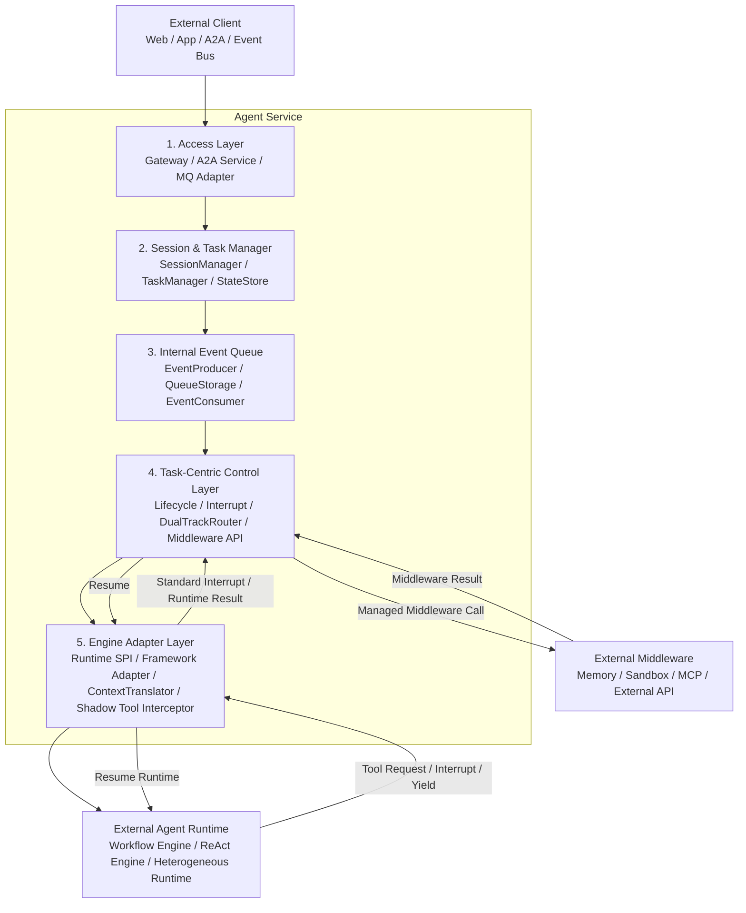
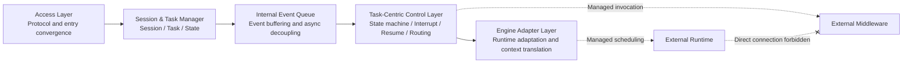
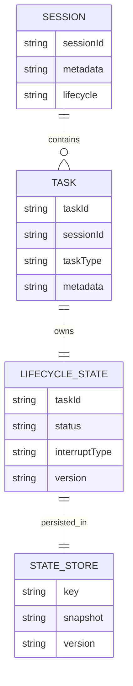
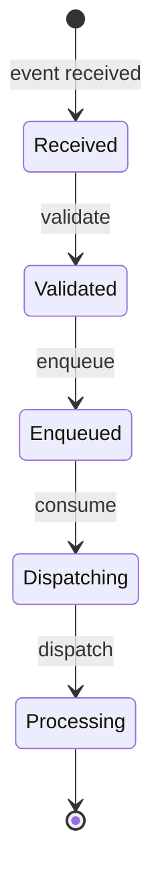
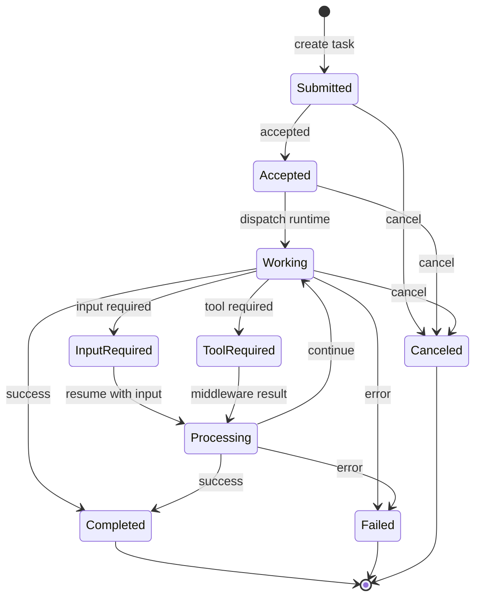
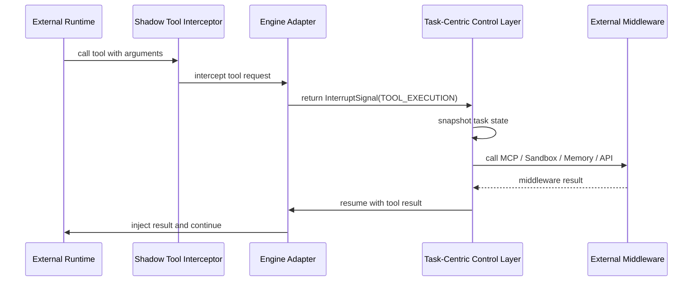
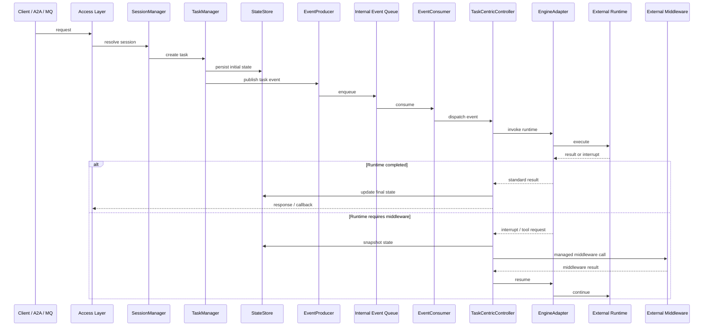
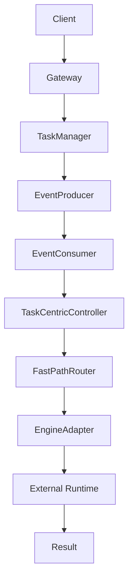
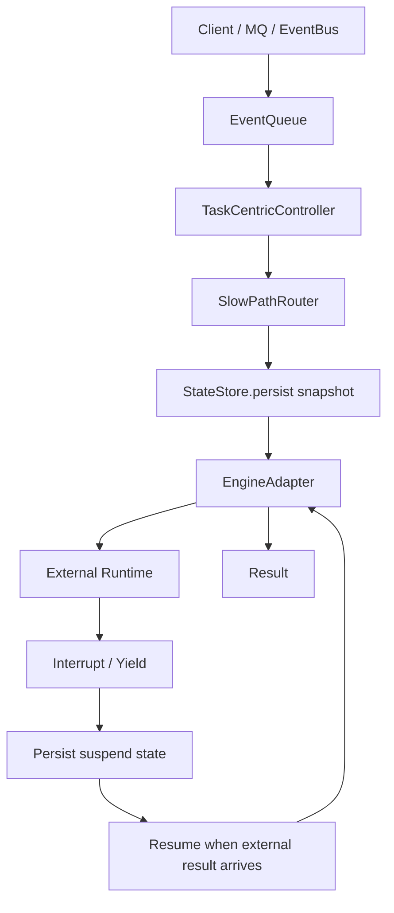
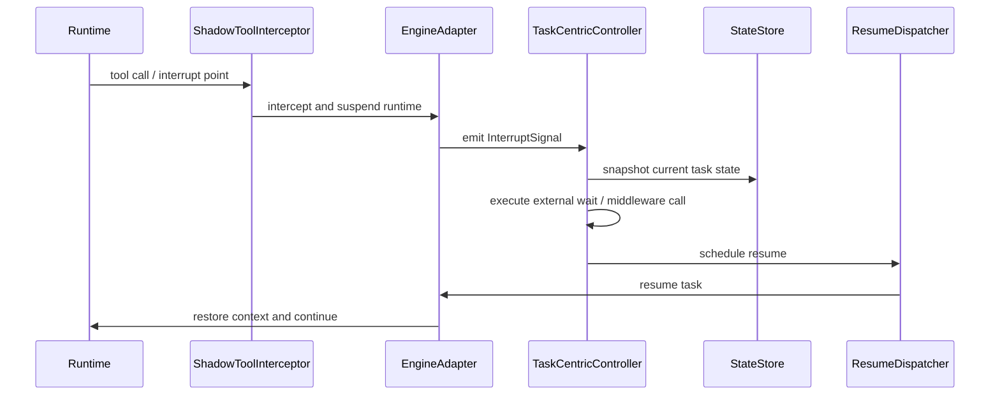

# Agent Service Module L1 Architecture Design Review

> Date: 2026-05-25
> Scope: Covers only the `agent-service` module.
> Goal: Fill the Agent Service L1 design gap with module architecture diagrams, internal module relationships, core feature descriptions, and a feature inventory that can guide L2 design.
> Constraint: Agent Service does not directly host the Workflow Engine, ReAct Engine, Memory, Sandbox, MCP, or external APIs. These capabilities remain external runtimes, external middleware, or external infrastructure. Agent Service owns service-level control, state scheduling, adapter encapsulation, and managed invocation boundaries.

## 1. Architecture Positioning

Agent Service is the unified service-level control layer for agent runtimes. It sits between external Client / A2A / MQ entry points and external Agent Runtime / Middleware capabilities. It owns agent task intake, state management, asynchronous orchestration, runtime adaptation, and middleware invocation governance.

Agent Service has the following core responsibilities:

1. **Unified intake**: Consolidate Web, App, A2A, MQ / Event Bus, and other entry points.
2. **Session / Task lifecycle management**: Manage sessions, tasks, state snapshots, metadata, and recovery data.
3. **Task-centric state control**: Use Task as the scheduling core and drive the task state machine, Interrupt, Resume, and exceptional transitions.
4. **Event-driven asynchronous orchestration**: Use an internal event queue to decouple intake requests, task state control, and external runtime invocation.
5. **Workflow / ReAct dual-mode coordination**: Do not implement engines directly; coordinate graph-mode Workflow and loop-mode ReAct through Engine Adapter.
6. **Multi-agent collaboration control**: Manage cross-agent requests, collaboration sessions, and remote interrupts through A2A Server / A2A Client.
7. **Middleware invocation convergence**: External Runtime must not call Middleware directly. Tool, Memory, Sandbox, MCP, and external API calls must return to the Task-Centric Control Layer for managed execution.

The Agent Service design boundary is:

| Capability | Inside Agent Service | Agent Service responsibility |
|---|---:|---|
| Workflow Engine | No | Schedule, suspend, resume, and normalize results through Engine Adapter |
| ReAct Engine | No | Hide loop-execution differences through Runtime SPI / Adapter |
| Memory | No | Invoke external Memory Adapter and handle context injection plus result return |
| Sandbox | No | Route tool execution requests to external Sandbox and manage suspend / resume |
| MCP | No | Proxy through Middleware Adapter; Runtime cannot connect directly |
| External API | No | Treat as Middleware call targets governed by the control layer |
| Session / Task state | Yes | Lifecycle, state snapshots, persistence, recovery, and scheduling |
| Internal Event Queue | Yes | Decouple intake threads from execution scheduling |
| Engine Adapter | Yes | Isolate runtime differences and normalize execution requests, Yield, and results |

## 2. L1 Overall Architecture

Agent Service uses a five-layer internal architecture:

| Layer | Module | Main responsibilities | External boundary |
|---:|---|---|---|
| 1 | Access Layer | Unified communication entry, protocol translation, A2A intake, MQ async intake, request routing | Faces Web / App / A2A / Event Bus |
| 2 | Session & Task Manager | Session lifecycle, Task lifecycle, metadata, state snapshots, Resume data | Receives intake requests and publishes Task events |
| 3 | Internal Event Queue | Event production, queue storage, event consumption, async broadcast, task buffering | Decouples intake threads from execution scheduling threads |
| 4 | Task-Centric Control Layer | Lifecycle state machine, Interrupt detection, Resume scheduling, fast/slow path routing, Middleware invocation convergence | Agent Service core control plane |
| 5 | Engine Adapter Layer | Runtime SPI, Framework Adapter, Context Translator, Shadow Tool Interceptor, result normalization | Faces external Workflow / ReAct / heterogeneous Runtime |

### 2.1 Module Architecture Diagram

### 2.2 Five-Layer Responsibility Relationship

## 3. Internal Module Design

### 3.1 Access Layer

The Access Layer is the unified entry layer of Agent Service. It converts multiple external invocation forms into standard Task creation requests or Task event publication.

#### 3.1.1 Gateway

Gateway serves synchronous entry points and supports REST, gRPC, WebSocket, and similar protocol forms. It owns request routing, protocol translation, and basic flow control. Gateway does not directly drive Runtime or invoke Middleware; it only converts requests into task inputs that Agent Service can process internally.

#### 3.1.2 A2A Service

A2A Service consists of A2A Server and A2A Client:

| Subcomponent | Responsibility |
|---|---|
| A2A Server | Receive collaboration requests, remote interrupt signals, and collaboration task dispatch requests from other Agents |
| A2A Client | Initiate calls to external Agents, manage cross-agent context, and maintain collaboration sessions |

A2A Service gives Agent Service bidirectional peer capability: it can accept tasks as a server and call other Agents as a client.

#### 3.1.3 MQ / Event Bus Adapter

MQ / Event Bus Adapter serves asynchronous entry points and supports Kafka, RabbitMQ, RocketMQ, Pulsar, and similar event sources. It owns asynchronous message intake, broadcast event consumption, and Event conversion.

### 3.2 Session & Task Manager

This layer manages the core data objects inside Agent Service: Session, Task, LifecycleState, and state snapshots.

| Component | Responsibility | L2 design focus |
|---|---|---|
| SessionManager | Session creation, lifecycle, expiry reclamation, metadata query | Define Session-to-Task relationships, expiry policy, and context query boundaries |
| TaskManager | Task creation, scheduling, metadata management, state persistence | Define Task state structure, creation idempotency, scheduling entry, and transition constraints |
| StateStore | Session / Task state storage, Snapshot persistence, Version management, Resume data recovery | Define snapshot structure, version conflict strategy, recovery semantics, and storage backend modes |

The core Session / Task data relationship is:

### 3.3 Internal Event Queue

Internal Event Queue is the asynchronous decoupling center inside Agent Service. It isolates intake request threads, task scheduling threads, and Runtime execution.

#### 3.3.1 Event Producer

Event Producer creates TaskEvent objects, publishes them to the internal queue, and performs asynchronous broadcast. The design goal is low latency, lightweight processing, and avoiding intake-layer blocking.

#### 3.3.2 Polymorphic Queue Storage

Polymorphic Queue Storage is a unified queue storage abstraction. It supports in-memory mode, semi-persistent mode, and persistent mode.

| Mode | Applicable scenario | Design goal |
|---|---|---|
| In-memory mode | Local lightweight execution, short tasks, business-centric near-side deployment | Low latency, low overhead, fast publication |
| Semi-persistent mode | Some recovery requirement without full workflow hosting | Balance performance and recovery ability |
| Persistent mode | Long-running tasks, distributed scheduling, state drift | Support recovery, scaling, node drift, and task durability |

#### 3.3.3 Event Consumer

Event Consumer pulls, validates, and dispatches events. The event state flow is:

### 3.4 Task-Centric Control Layer

Task-Centric Control Layer is the core scheduling hub of Agent Service. It directly consumes Internal Event Queue events and converts them into Runtime scheduling actions. It also receives Middleware needs returned by Engine and executes external Middleware calls in a managed way.

This layer owns these responsibilities:

1. Manage the Task lifecycle state machine.
2. Detect Interrupt / Tool Request / Yield emitted by Runtime.
3. Route by interrupt type through Fast-Path or Slow-Path.
4. Schedule Resume and recover state.
5. Invoke Memory, Sandbox, MCP, external APIs, and other Middleware in one place.
6. Prevent external Runtime from bypassing the control layer and calling Middleware directly.

#### 3.4.1 Task Lifecycle States

#### 3.4.2 Interrupt Types

| Interrupt type | Meaning | Control-layer action | L2 design focus |
|---|---|---|---|
| INPUT_REQUIRED | Wait for input from user, external Agent, or human approval | Suspend Task, save current context, Resume after input arrives | Input source, timeout, duplicate input handling, recovery idempotency |
| TOOL_EXECUTION | Wait for tool or Middleware invocation | Intercept tool request, route to Middleware Adapter, resume Runtime after result | Tool request shape, permission, sandbox, security audit, result injection |
| COLLABORATION | Wait for multi-agent collaboration | Start collaboration through A2A Client, save local Task state, wait for remote result | Subtask relationship, collaboration session, callback matching, failure compensation |
| SAFETY_CHECK | Wait for safety check or policy approval | Suspend task and delegate to safety / policy component | Policy result model, rejection semantics, human approval chain |

#### 3.4.3 Dual-Track Router

Dual-Track Router routes tasks to Fast-Path or Slow-Path according to task type, interrupt type, execution duration, recovery requirement, and external dependency stability.

| Path | Applicable scenario | Characteristics | Not applicable to |
|---|---|---|---|
| Fast-Path | Local lightweight execution, short tasks, low-latency operation, in-memory state management | Avoid or minimize cross-thread dispatch, no mandatory persistence, local synchronous resume | Long-running external calls, human approval, cross-node collaboration, tasks requiring strong recovery |
| Slow-Path | Long-running tasks, distributed scheduling, state recovery, Suspend / Resume | Persistent, recoverable, supports distributed orchestration and node drift | Very short chains or high-frequency low-cost local reads |

### 3.5 Engine Adapter Layer

Engine Adapter Layer isolates differences across Workflow Runtime, ReAct Runtime, and heterogeneous Agent Frameworks. Agent Service does not implement Runtime; it only owns scheduling, context injection, suspend interception, resume, and output normalization.

| Subcomponent | Responsibility | Design boundary |
|---|---|---|
| Runtime SPI | Define unified input semantics such as TaskSpec, InjectedContext, and Config | Does not prescribe internal Workflow / ReAct execution |
| Framework Adapter | Adapt external frameworks such as LangChain, LlamaIndex, and custom Runtime | Owns lifecycle, initialization, teardown, and framework-difference isolation |
| Context Translator | Convert between InjectedContext and runtime-native context in both directions | Keeps context mapping consistent, validatable, and recoverable |
| Shadow Tool Interceptor | Register shadow tools and intercept tool calls inside Runtime | Runtime cannot call real Middleware directly; calls must become InterruptSignal |
| Result Normalizer | Convert RuntimeResult / Yield Request into Agent Service standard result | Keeps Task-Centric layer handling only one result model |

#### 3.5.1 Shadow Tool Interception Mechanism

## 4. Core Data Flow Design

### 4.1 Standard Request Processing Chain

### 4.2 Fast-Path Data Flow

Fast-Path targets short-chain, low-latency, local lightweight execution scenarios. The typical flow is:

Fast-Path key constraints:

1. Minimize cross-thread and cross-network scheduling.
2. Do not require full persistence.
3. Apply only to operations that complete quickly, have controlled failure impact, and have low recovery requirements.
4. Do not bypass the Task-Centric Control Layer when invoking Middleware.

### 4.3 Slow-Path Data Flow

Slow-Path targets long-running tasks, distributed scheduling, recovery, and Suspend / Resume scenarios.

Slow-Path key constraints:

1. Task state must be recoverable.
2. Runtime must return serializable state or recoverable context before suspension.
3. When an external result returns, the original task must be located through TaskID / SessionID / correlation data.
4. Resume must be initiated by the Task-Centric Control Layer, not by Runtime itself.

### 4.4 Interrupt / Resume Data Flow

## 5. Core Feature Descriptions

### 5.1 Unified Agent Intake

Agent Service converges Web, App, A2A, and MQ / Event Bus entry points into the Access Layer. Different protocols affect only the entry adaptation method; they do not change downstream Task creation, state control, or Runtime scheduling models. L2 design must refine how each entry type maps to TaskSpec, how correlation IDs are generated, and how synchronous responses differ from asynchronous callbacks.

### 5.2 Session / Task Lifecycle Management

Session represents interaction context and collaboration context. Task represents one execution with a clear boundary. Agent Service uses SessionManager and TaskManager to maintain their relationship, while StateStore persists lifecycle state, snapshots, versions, and recovery data. L2 must clarify the concurrent relationship of multiple Tasks under one Session, Task-to-Session detach / migration semantics, snapshot granularity, and recovery conflict handling.

### 5.3 Task-Centric State Control

Agent Service uses Task as the core control object rather than using the Runtime call stack as the control center. Runtime only performs computation. When it needs an external dependency, it must return control to Agent Service through Interrupt / Yield. Task-Centric Control Layer decides whether the task continues, suspends, resumes, cancels, fails, or completes.

### 5.4 Interrupt / Resume Scheduling

Interrupt / Resume is the core capability for long-running agent tasks. When Runtime produces Tool Request, Input Required, Collaboration, or Safety Check, Engine Adapter standardizes it into InterruptSignal. Task-Centric Control Layer saves state and executes the external action. When the result is ready, ResumeDispatcher restores Runtime execution.

### 5.5 Event-Driven Asynchronous Orchestration

Internal Event Queue prevents intake requests from binding directly to Runtime execution threads. Requests are first converted into TaskEvent, then pulled and dispatched to the control layer by EventConsumer. This model supports asynchronous processing, traffic smoothing, recovery, distributed scaling, and future queue storage evolution.

### 5.6 Workflow / ReAct Dual-Mode Coordination

Agent Service does not observe the internal execution details of Workflow / ReAct. It uses Engine Adapter and Runtime SPI to uniformly process TaskSpec, InjectedContext, RuntimeResult, and InterruptSignal. Workflow graph node advancement and ReAct loop reasoning are both abstracted as external Runtime execution.

### 5.7 Multi-Agent Collaboration Control

Agent Service receives external Agent collaboration requests through A2A Server and initiates calls to other Agents through A2A Client. Collaboration remains controlled by the Task lifecycle: when collaboration starts, the local task can suspend; when the remote result returns, Task-Centric Control Layer resumes it.

### 5.8 External Middleware Invocation Convergence

Memory, Sandbox, MCP, and external APIs are never called directly by Runtime. Runtime can only express invocation intent through shadow tools or interrupt signals. Agent Service then applies permission, security, audit, routing, and result-return governance in one place. This keeps the service control layer in charge of external side effects.

### 5.9 Heterogeneous Runtime Anti-Corruption Adaptation

For heterogeneous frameworks such as LangChain, LlamaIndex, or custom Runtime implementations, Agent Service uses Framework Adapter, Context Translator, and Shadow Tool Interceptor as an anti-corruption boundary. External frameworks may keep their execution model, but they cannot break through Agent Service state control or Middleware invocation governance.

### 5.10 Fast-Path / Slow-Path Dual-Track Scheduling

Fast-Path is for low-latency, lightweight, locally completed execution. Slow-Path is for long-running, cross-node, persistently recoverable, or external-wait tasks. Dual-track scheduling lets Agent Service support both high-performance short tasks and recoverable long-running tasks.

## 6. Feature Inventory

| ID | Feature | Detailed description | Key modules | Input | Output | L2 design guidance |
|---:|---|---|---|---|---|---|
| F-01 | Unified external intake | Convert Web, App, A2A, MQ / Event Bus, and other entry points into Agent Service internal task input while hiding protocol differences. The intake layer owns access, protocol translation, flow control, and routing, but does not directly drive Runtime or call Middleware. | Access Layer, Gateway, A2A Service, MQ Adapter | HTTP / gRPC / WebSocket requests, A2A requests, MQ messages | Standard Task creation request or TaskEvent | Define mapping rules from each protocol to TaskSpec / TaskEvent, error response model, synchronous acceptance receipt, and async callback strategy. |
| F-02 | Bidirectional A2A collaboration | Agent Service has both A2A Server and A2A Client capabilities: it can receive collaboration tasks from other Agents and initiate cross-agent calls. Collaboration tasks must enter the local Task lifecycle. | A2A Service, TaskManager, Task-Centric Control Layer | Remote collaboration request, remote interrupt, collaboration result | Local Task, collaboration subtask, Resume signal | Define collaboration session ID, remote Task association, callback matching, collaboration timeout, remote failure mapping, and idempotent recovery strategy. |
| F-03 | Session lifecycle management | Manage session context across multi-turn interaction or multi-agent collaboration, including creation, query, expiry, reclamation, and metadata management. Session is not identical to Task; one Session can contain multiple Tasks. | SessionManager, StateStore | Session create / query request, Task association request | Session metadata, context reference, expiry event | Define Session-to-Task cardinality, concurrent Task semantics, context trimming rules, expiry policy, and Session lookup across node recovery. |
| F-04 | Task lifecycle management | Task is the core control object of Agent Service and describes one bounded agent execution. TaskManager owns creation, scheduling, metadata management, and state persistence. | TaskManager, StateStore, Task-Centric Control Layer | Standardized task input, Session reference, task parameters | TaskID, initial state, TaskEvent | Define Task state model, creation idempotency, cancellation semantics, failure semantics, state version, and concurrent update conflict handling. |
| F-05 | State snapshot and recovery | StateStore saves Session / Task state, LifecycleState, Snapshot, version information, and Resume data to support task recovery and state drift. | StateStore, ResumeDispatcher | State change, InterruptSignal, Runtime context | Persistent snapshot, recovery context, version record | Define snapshot structure, serialization format, version conflict strategy, recovery validation rules, and capability differences across storage backends. |
| F-06 | Internal event production | EventProducer converts Task creation, state changes, and external callbacks into internal events and publishes them to the queue so intake threads are not coupled to execution scheduling. | EventProducer, Internal Event Queue | TaskEvent, state event, callback event | Queue message, broadcast event | Define event types, event fields, idempotency key, publish failure handling, duplicate event handling, and ordering constraints. |
| F-07 | Polymorphic queue storage | QueueStorage supports in-memory, semi-persistent, and persistent forms to adapt to short tasks, partially recoverable tasks, and long-running distributed tasks. | QueueStorage, EventProducer, EventConsumer | Events to publish, queue configuration | Consumable event stream | Define applicable conditions for each mode, switching rules, message visibility, retry strategy, Consumer Group semantics, and node drift handling. |
| F-08 | Internal event consumption | EventConsumer pulls events from the queue, validates and deduplicates them, then dispatches task events to Task-Centric Control Layer. | EventConsumer, TaskLifecycleDispatcher | Queue event | Scheduling call, state-change request | Define validation rules, failure retry, dead-letter handling, backpressure strategy, and consumption concurrency model. |
| F-09 | Task-centric state machine | Maintain states such as submitted, accepted, working, input-required, tool-required, processing, completed, canceled, and failed around Task. | Task-Centric Control Layer, TaskLifecycleDispatcher | TaskEvent, RuntimeResult, InterruptSignal | State transition, scheduling action, error result | Provide a complete transition table, illegal transition handling, terminal idempotency, cancellation priority, and state-change audit fields. |
| F-10 | Interrupt detection | Interrupt Interceptor detects INPUT_REQUIRED, TOOL_EXECUTION, COLLABORATION, SAFETY_CHECK, and other interrupt types, then converts them into control-layer actions. | InterruptInterceptor, EngineAdapter | Runtime Yield, Tool Request, collaboration request | Standard InterruptSignal | Define InterruptSignal fields, type extension model, Payload validation, source identity, and mapping to Task state. |
| F-11 | Resume scheduling | ResumeDispatcher resumes suspended tasks after external input, Middleware result, or collaboration result becomes available, and wakes Runtime through Engine Adapter. | ResumeDispatcher, StateStore, EngineAdapter | Resume request, external result, task snapshot | Runtime resume call, state update | Define Resume idempotency, duplicate result handling, timeout recovery, recovery failure compensation, and pre-resume state validation. |
| F-12 | Fast-Path routing | Use Fast-Path for local lightweight execution, in-memory state management, and low-latency short tasks to reduce persistence and distributed scheduling overhead. | DualTrackRouter, FastPathRouter, Task-Centric Control Layer | Lightweight TaskEvent, lightweight InterruptSignal | Local execution result, fast Resume | Define Fast-Path eligibility, maximum duration, callable resource scope, failure fallback, and boundary with Slow-Path. |
| F-13 | Slow-Path routing | Use Slow-Path for long-running tasks, distributed scheduling, state recovery, external waiting, and Suspend / Resume scenarios. | DualTrackRouter, SlowPathRouter, StateStore | Long task, external dependency interrupt, collaboration wait | Persistent snapshot, suspended state, recovery task | Define Slow-Path persistence strategy, recovery trigger, task migration, callback matching, and cleanup rules for long suspension. |
| F-14 | Unified Engine Adapter | Hide differences across Workflow Runtime, ReAct Runtime, and heterogeneous Runtime by converting Agent Service TaskSpec / InjectedContext into executable Runtime requests. | Engine Adapter Layer, Runtime SPI, Framework Adapter | TaskSpec, InjectedContext, Config | RuntimeResult, Yield Request, Task Interrupt | Define adapter interface boundary, Runtime lifecycle, exception mapping, timeout handling, and capability declaration for each Runtime. |
| F-15 | Context Translator | Convert bidirectionally between Agent Service standard context and external Runtime native context, ensuring consistent context injection, recovery, and result return. | ContextTranslator, EngineAdapter | InjectedContext, RuntimeContext, StateDelta | Translated context, standard result | Define field mapping, unmappable field handling, protocol validation, context version, and compatibility strategy. |
| F-16 | Shadow Tool Interceptor | Register shadow tools into heterogeneous Runtime, intercept tool calls, and convert them into TOOL_EXECUTION InterruptSignal so Runtime cannot directly invoke real Middleware. | ShadowToolInterceptor, Framework Adapter, Task-Centric Control Layer | Runtime Tool Request, tool arguments | TOOL_EXECUTION InterruptSignal | Define shadow tool registration lifecycle, tool argument capture, interception exception model, tool permission, and audit fields. |
| F-17 | Middleware invocation convergence | Memory, Sandbox, MCP, and external API calls are all initiated by Task-Centric Control Layer. Runtime can only express invocation intent. | Task-Centric Control Layer, Middleware Adapter | InterruptSignal, tool arguments, context | Middleware Result, Resume input | Define Middleware Adapter categories, permission check, failure mapping, audit, retry, and result injection format. |
| F-18 | Workflow / ReAct dual-mode coordination | Workflow graph mode and ReAct loop mode both connect as external Runtime capabilities. Agent Service only performs unified scheduling and state control. | EngineAdapter, Runtime SPI, Task-Centric Control Layer | TaskSpec, Runtime type, context | Standard RuntimeResult or InterruptSignal | Define task type fields for Workflow and ReAct, execution mode declaration, result normalization, and interrupt semantic alignment. |
| F-19 | Heterogeneous Runtime anti-corruption | Adapt LangChain, LlamaIndex, custom Runtime, and other existing frameworks while preventing them from penetrating Agent Service governance boundaries. | Framework Adapter, ContextTranslator, ShadowToolInterceptor | Heterogeneous Runtime configuration, native context, native result | Standard context, standard interrupt, standard result | Define each framework adapter contract, lifecycle, state save method, recovery method, and capability limits. |
| F-20 | External collaboration and Middleware result return | Results from external Agents, Middleware, or human input must return to Task-Centric Control Layer, which decides whether to resume, fail, cancel, or keep waiting. | Task-Centric Control Layer, ResumeDispatcher, A2A Service, Middleware Adapter | External callback, collaboration result, human input | Task state update, Runtime Resume, final response | Define callback authentication, correlation, duplicate callback handling, late callback handling, callback failure, and terminal-state callback behavior. |
| F-21 | Recoverable state | For Slow-Path and suspended tasks, Agent Service must ensure state can be persisted, replayed, and recovered. | StateStore, TaskManager, ResumeDispatcher | Task state, Runtime snapshot, Middleware request | Recoverable task context | Define the minimum recovery dataset, snapshot consistency, pre-recovery validation, compensation after recovery failure, and cleanup mechanism. |
| F-22 | Module boundary governance | Agent Service must maintain clear boundaries among access, session/task, event queue, state control, and engine adaptation. External Runtime and Middleware are outside the module. | All internal layers | Inter-module calls, external dependencies | Clear invocation boundaries and responsibility split | Specify each submodule interface, input/output, exception model, and dependency direction so Runtime or Middleware logic does not leak into Agent Service. |

## 7. L2 Design Decomposition Guidance

Future L2 designs should be split by topic to avoid concentrating all details in one document:

| L2 topic | Suggested coverage | Dependent L1 features |
|---|---|---|
| Access Layer L2 | Gateway, A2A, MQ Adapter protocol mapping, acceptance response, error model, correlation rules | F-01, F-02 |
| Session / Task L2 | Session / Task data model, state table, snapshot, version, expiry, recovery, idempotency | F-03, F-04, F-05 |
| Internal Event Queue L2 | Event model, QueueStorage polymorphic implementation, Consumer Group, retry, dead letter, backpressure | F-06, F-07, F-08 |
| Task-Centric Control L2 | State machine, Interrupt type, Resume scheduling, cancellation, failure, terminal idempotency | F-09, F-10, F-11, F-20 |
| Dual-Track Router L2 | Fast-Path / Slow-Path decision, switching, persistence, fallback, and recovery strategy | F-12, F-13, F-21 |
| Engine Adapter L2 | Runtime SPI, Framework Adapter, Context Translator, Shadow Tool Interceptor | F-14, F-15, F-16, F-18, F-19 |
| Middleware Control L2 | Middleware Adapter categories, permission, security, audit, result return, and failure mapping | F-17, F-20 |

## 8. Architecture Constraints and Non-Goals

### 8.1 Architecture Constraints

1. Agent Service must use Task as the control core; it must not let the Runtime call stack decide service-layer lifecycle.
2. Runtime must not directly connect to Memory, Sandbox, MCP, or external APIs.
3. Middleware invocation must converge through Task-Centric Control Layer.
4. Fast-Path applies only to lightweight, short-lived operations with controlled failure impact; tasks requiring recovery, external waiting, or cross-node collaboration must enter Slow-Path.
5. Engine Adapter must isolate Workflow, ReAct, and heterogeneous Runtime differences and must not leak a specific Runtime internal model into the upper control layer.
6. StateStore must support state snapshots, version management, and recovery for Slow-Path.
7. A2A collaboration must enter the Task lifecycle and must not become a side-channel outside the Task state machine.

### 8.2 Non-Goals

1. Do not implement Workflow Engine inside Agent Service.
2. Do not implement ReAct Engine inside Agent Service.
3. Do not implement Memory, Sandbox, MCP, or external APIs inside Agent Service.
4. Do not adjust or add SPI in this document.
5. Do not define concrete code package layout or class-level implementation details in this document.
6. Do not mandate one concrete queue, database, or Runtime framework implementation.

## 9. Summary

Agent Service L1 architecture is an agent control plane. It uses Task as the core state-control object, uses Internal Event Queue for asynchronous decoupling, adapts external Runtime through Engine Adapter, and converges Interrupt, Resume, and Middleware invocation inside Task-Centric Control Layer.

The core value of this architecture is:

- Unified Agent intake and multi-protocol adaptation.
- Unified Session / Task lifecycle management.
- Unified Runtime scheduling and Workflow / ReAct dual-mode coordination.
- Unified Tool / Middleware invocation governance.
- Support for long-running task suspension, recovery, and state drift.
- Support for multi-agent collaboration and asynchronous callbacks.
- Coexistence of Fast-Path low-latency execution and Slow-Path recoverable orchestration.
