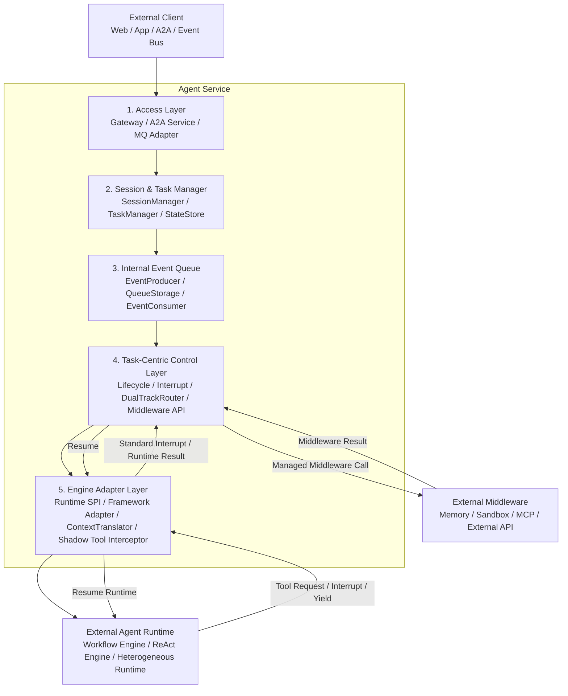
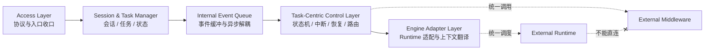
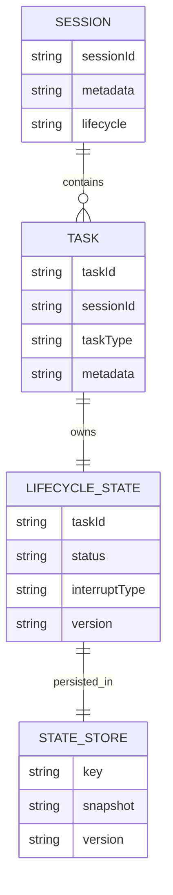
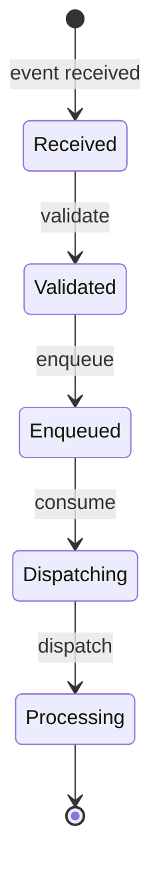
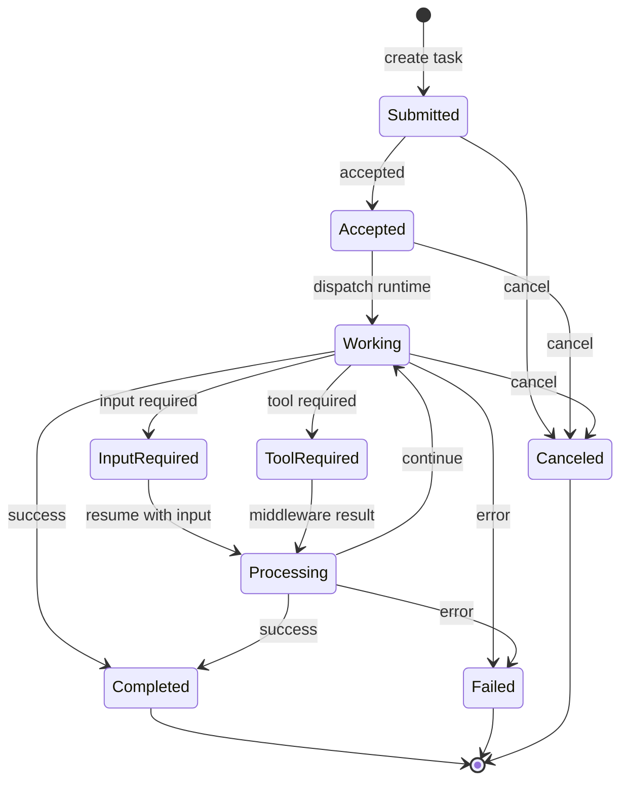
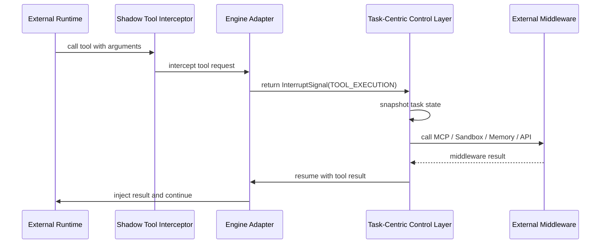
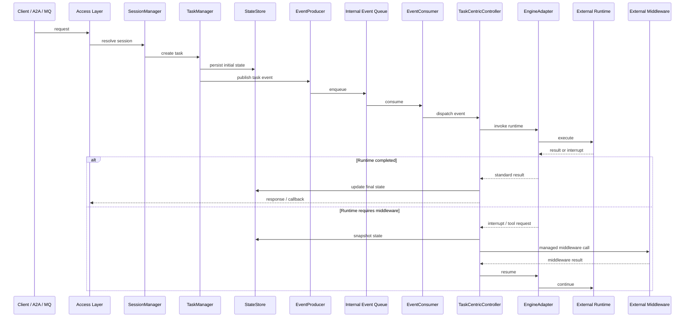
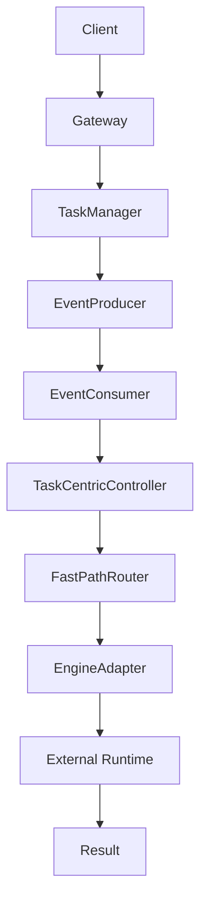
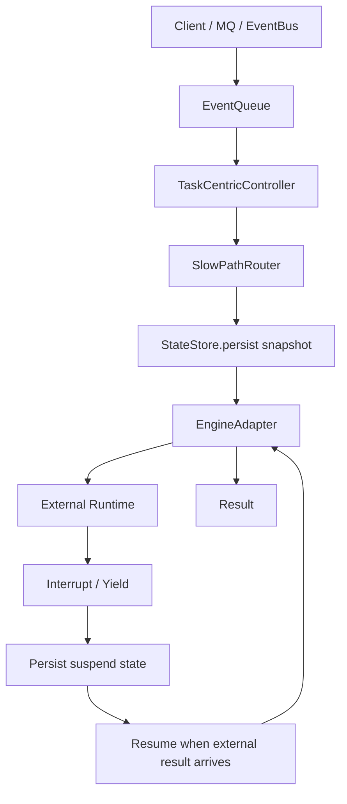
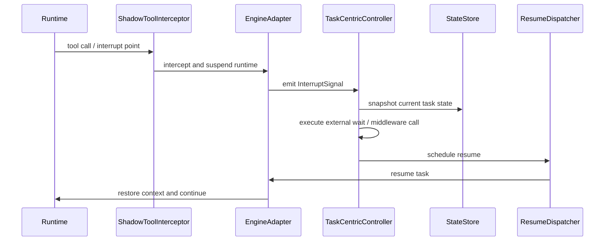

# Agent Service 模块 L1 架构设计评审稿

> 日期：2026-05-25
> 范围：仅覆盖 `agent-service` 模块。
> 目标：补齐 Agent Service 的 L1 模块架构图、内部模块关系、核心特性描述与面向 L2 设计的特性清单。
> 约束：Agent Service 不直接承载 Workflow Engine、ReAct Engine、Memory、Sandbox、MCP 或外部 API；这些能力作为外部 Runtime、外部 Middleware 或外部基础设施存在，Agent Service 只负责服务化控制、状态调度、适配封装与调用收口。

## 1. 架构定位

Agent Service 是面向智能体运行时的统一服务化控制层。它位于外部 Client / A2A / MQ 入口与外部 Agent Runtime / Middleware 之间，承担智能体任务的接入、状态管理、异步编排、运行时适配和中间件调用治理。

Agent Service 的核心职责是：

1. **统一接入**：收口 Web、App、A2A、MQ / Event Bus 等多类入口。
2. **Session / Task 生命周期管理**：管理会话、任务、状态快照、元数据与恢复信息。
3. **Task-Centric 状态控制**：以 Task 为调度核心，驱动任务状态机、Interrupt、Resume 与异常状态流转。
4. **异步事件驱动编排**：通过内部事件队列隔离入口请求、任务状态控制和外部 Runtime 调用。
5. **Workflow / ReAct 双模态协调**：不实现引擎本身，只通过 Engine Adapter 统一适配图模式 Workflow 与循环模式 ReAct。
6. **多 Agent 协作控制**：通过 A2A Server / A2A Client 管理跨 Agent 请求、协作会话与远程中断。
7. **Middleware 调用收口**：外部 Runtime 不能直接调用 Middleware；所有工具、Memory、Sandbox、MCP、外部 API 调用必须回到 Task-Centric Control Layer 统一处理。

Agent Service 的设计边界如下：

| 能力 | 是否属于 Agent Service 内部 | Agent Service 职责 |
|---|---:|---|
| Workflow Engine | 否 | 通过 Engine Adapter 调度、挂起、恢复和结果标准化 |
| ReAct Engine | 否 | 通过 Runtime SPI / Adapter 屏蔽循环执行差异 |
| Memory | 否 | 调用外部 Memory Adapter，处理上下文注入和结果回传 |
| Sandbox | 否 | 将工具执行请求路由到外部 Sandbox，并管理挂起 / 恢复 |
| MCP | 否 | 通过 Middleware Adapter 代理调用，不允许 Runtime 直连 |
| 外部 API | 否 | 作为 Middleware 调用目标，由控制层统一治理 |
| Session / Task 状态 | 是 | 生命周期、状态快照、持久化、恢复与调度 |
| Internal Event Queue | 是 | 解耦入口请求与任务执行调度 |
| Engine Adapter | 是 | 隔离 Runtime 差异，标准化执行请求、Yield 与结果 |

## 2. L1 总体架构

Agent Service 内部采用五层核心架构：

| 层级 | 模块 | 主要职责 | 对外边界 |
|---:|---|---|---|
| 1 | 对外接入层（Access Layer） | 统一通信入口、协议转换、A2A 接入、MQ 异步接入、请求路由 | 面向 Web / App / A2A / Event Bus |
| 2 | 会话与任务管理层（Session & Task Manager） | Session 生命周期、Task 生命周期、元数据、状态快照、Resume 数据 | 向上承接入口请求，向下发布 Task 事件 |
| 3 | 内部事件队列层（Internal Event Queue） | 事件生产、队列存储、事件消费、异步广播、任务缓冲 | 解耦入口线程与执行调度线程 |
| 4 | Task-Centric 状态控制层（Task-Centric Control Layer） | 生命周期状态机、Interrupt 识别、Resume 调度、快慢路径路由、Middleware 调用收口 | Agent Service 的核心控制面 |
| 5 | 引擎适配层（Engine Adapter Layer） | Runtime SPI、Framework Adapter、Context Translator、Shadow Tool Interceptor、结果标准化 | 面向外部 Workflow / ReAct / 异构 Runtime |

### 2.1 模块总体架构图

### 2.2 五层职责关系

## 3. 内部模块设计

### 3.1 对外接入层（Access Layer）

Access Layer 是 Agent Service 的统一入口层，负责把多种外部调用形态转换为标准 Task 创建或 Task 事件发布。

#### 3.1.1 Gateway

Gateway 面向同步入口，支持 REST、gRPC、WebSocket 等协议形态。它负责请求路由、协议转换和基础流控限流。Gateway 不直接驱动 Runtime，也不直接调用 Middleware；它只负责把请求转换为 Agent Service 内部可处理的任务输入。

#### 3.1.2 A2A Service

A2A Service 由 A2A Server 与 A2A Client 两部分组成：

| 子组件 | 职责 |
|---|---|
| A2A Server | 接收其他 Agent 发起的协作请求、远程中断信号和协作任务分发请求 |
| A2A Client | 发起外部 Agent 调用、管理跨 Agent 上下文、维护协作会话 |

A2A Service 使 Agent Service 具备双向对等能力：既能作为服务端接受其他 Agent 的任务，也能作为客户端调用其他 Agent。

#### 3.1.3 MQ / Event Bus Adapter

MQ / Event Bus Adapter 面向异步入口，支持 Kafka、RabbitMQ、RocketMQ、Pulsar 等事件来源。它负责异步消息接入、广播事件消费和 Event 转换。

### 3.2 会话与任务管理层（Session & Task Manager）

该层负责 Agent Service 内部最核心的数据管理对象：Session、Task、LifecycleState 与状态快照。

| 组件 | 职责 | L2 设计关注点 |
|---|---|---|
| SessionManager | Session 创建、生命周期、过期回收、Metadata 查询 | 需要定义 Session 与 Task 的关联关系、过期策略、上下文查询边界 |
| TaskManager | Task 创建、调度、Metadata 管理、状态持久化 | 需要定义 Task 状态结构、创建幂等性、调度入口与状态转移约束 |
| StateStore | Session / Task 状态存储、Snapshot 持久化、Version 管理、Resume 数据恢复 | 需要定义快照结构、版本冲突策略、恢复语义与存储后端模式 |

Session / Task 的核心数据关系如下：

### 3.3 内部事件队列层（Internal Event Queue）

Internal Event Queue 是 Agent Service 内部异步解耦中心，用于隔离入口请求线程、任务调度线程和 Runtime 执行过程。

#### 3.3.1 Event Producer

Event Producer 负责生成 TaskEvent、投递到内部队列并进行异步广播。设计目标是低延迟、轻量化、避免入口层阻塞。

#### 3.3.2 Polymorphic Queue Storage

Polymorphic Queue Storage 是统一队列存储抽象，支持内存模式、半持久化模式和持久化模式。

| 模式 | 适用场景 | 设计目标 |
|---|---|---|
| 内存模式 | 本地轻量执行、短任务、业务中心近端部署 | 低延迟、低开销、快速投递 |
| 半持久化 | 需要一定恢复能力但不要求完整工作流托管 | 平衡性能与恢复能力 |
| 持久化 | 长周期任务、分布式调度、状态漂移 | 支持恢复、扩展、节点漂移和任务不丢失 |

#### 3.3.3 Event Consumer

Event Consumer 负责拉取、校验和分发事件。事件状态流为：

### 3.4 Task-Centric 状态控制层

Task-Centric Control Layer 是 Agent Service 的核心调度中枢。它直接消费 Internal Event Queue，将事件转换为 Runtime 调度行为；同时接收 Engine 返回的 Middleware 诉求，并统一执行外部 Middleware 调用。

该层承担以下职责：

1. 管理 Task 生命周期状态机。
2. 识别 Runtime 抛出的 Interrupt / Tool Request / Yield。
3. 根据中断类型进行 Fast-Path / Slow-Path 路由。
4. 负责 Resume 调度和状态恢复。
5. 统一调用 Memory、Sandbox、MCP、外部 API 等 Middleware。
6. 禁止外部 Runtime 绕过控制层直连 Middleware。

#### 3.4.1 Task 生命周期状态

#### 3.4.2 Interrupt 类型

| 中断类型 | 含义 | 控制层动作 | L2 设计关注点 |
|---|---|---|---|
| INPUT_REQUIRED | 等待用户、外部 Agent 或人工审批输入 | 挂起 Task，保存当前上下文，等待输入后 Resume | 输入来源、超时、重复输入处理、恢复幂等性 |
| TOOL_EXECUTION | 等待工具或 Middleware 调用 | 拦截工具请求，路由到 Middleware Adapter，返回后恢复 Runtime | 工具请求结构、权限、沙箱、安全审计、结果注入 |
| COLLABORATION | 等待多 Agent 协作 | 通过 A2A Client 发起协作，保存本地 Task 状态，等待远端结果 | 子任务关系、协作会话、回调匹配、失败补偿 |
| SAFETY_CHECK | 等待安全校验或策略审批 | 将任务挂起并交给安全 / 策略组件处理 | 策略结果模型、拒绝语义、人工审批链路 |

#### 3.4.3 Dual-Track Router

Dual-Track Router 根据任务类型、中断类型、执行时长、恢复要求和外部依赖稳定性，将任务路由到 Fast-Path 或 Slow-Path。

| 路径 | 适用场景 | 特点 | 不适用场景 |
|---|---|---|---|
| Fast-Path | 本地轻量执行、短任务、低延迟操作、内存级状态管理 | 不跨线程或尽量少跨线程、不强制持久化、本地同步恢复 | 长耗时外部调用、人工审批、跨节点协作、需要强恢复的任务 |
| Slow-Path | 长周期任务、分布式调度、状态恢复、Suspend / Resume | 可持久化、可恢复、支持分布式编排和节点漂移 | 极短链路、高频低开销的本地数据读取 |

### 3.5 引擎适配层（Engine Adapter Layer）

Engine Adapter Layer 用于隔离 Workflow Runtime、ReAct Runtime 与异构 Agent Framework 差异。Agent Service 不实现 Runtime，只负责调度、上下文注入、挂起拦截、恢复和输出标准化。

| 子组件 | 职责 | 设计边界 |
|---|---|---|
| Runtime SPI | 定义 TaskSpec、InjectedContext、Config 等统一入参语义 | 不规定具体 Workflow / ReAct 内部执行方式 |
| Framework Adapter | 适配 LangChain、LlamaIndex、自定义 Runtime 等外部框架 | 负责生命周期、初始化、销毁和框架差异屏蔽 |
| Context Translator | InjectedContext 与 Runtime 原生上下文之间的双向转换 | 保证上下文映射一致、可校验、可恢复 |
| Shadow Tool Interceptor | 注册影子工具并拦截 Runtime 内部 Tool 调用 | Runtime 不能直连真实 Middleware，必须转为 InterruptSignal |
| Result Normalizer | 将 RuntimeResult / Yield Request 转换为 Agent Service 标准结果 | 保持 Task-Centric 层只处理统一结果模型 |

#### 3.5.1 Shadow Tool 拦截机制

## 4. 核心数据流设计

### 4.1 标准请求处理链路

### 4.2 Fast-Path 数据流

Fast-Path 面向短链路、低延迟、本地轻量执行场景。典型链路如下：

Fast-Path 的关键约束：

1. 尽量减少跨线程与跨网络调度。
2. 不强制进行完整持久化。
3. 仅适用于可快速完成、失败影响可控、恢复要求较低的操作。
4. 不能绕过 Task-Centric Control Layer 调用 Middleware。

### 4.3 Slow-Path 数据流

Slow-Path 面向长周期任务、分布式调度、恢复和 Suspend / Resume 场景。

Slow-Path 的关键约束：

1. Task 状态必须可恢复。
2. Runtime 挂起前必须返回可序列化的状态或可恢复上下文。
3. 外部结果返回后必须能通过 TaskID / SessionID / Correlation 信息定位原任务。
4. Resume 必须由 Task-Centric Control Layer 发起，而不是由 Runtime 自行恢复。

### 4.4 Interrupt / Resume 数据流

## 5. 核心特性描述

### 5.1 统一 Agent 接入

Agent Service 将 Web、App、A2A 和 MQ / Event Bus 的入口统一收口到 Access Layer。不同协议只影响入口适配方式，不影响下游 Task 创建、状态控制和 Runtime 调度模型。L2 设计需要进一步细化每类入口如何映射为 TaskSpec、如何生成 Correlation ID、如何处理同步返回与异步回调。

### 5.2 Session / Task 生命周期管理

Session 表示交互上下文和协作上下文，Task 表示一次具有明确执行边界的任务。Agent Service 通过 SessionManager 与 TaskManager 维护两者关系，并由 StateStore 持久化生命周期状态、快照、版本与恢复数据。L2 需要明确一个 Session 下多个 Task 的并发关系、Task 与 Session 的解绑 / 迁移语义、状态快照粒度和恢复冲突处理方式。

### 5.3 Task-Centric 状态控制

Agent Service 以 Task 为核心控制对象，而不是以 Runtime 调用栈为核心。Runtime 只执行计算，遇到外部依赖时必须通过 Interrupt / Yield 将控制权交回 Agent Service。Task-Centric Control Layer 决定任务是否继续、挂起、恢复、取消、失败或完成。

### 5.4 Interrupt / Resume 调度

Interrupt / Resume 是 Agent Service 支持长周期智能体任务的核心能力。Runtime 产生 Tool Request、Input Required、Collaboration 或 Safety Check 时，Engine Adapter 将其标准化为 InterruptSignal。Task-Centric Control Layer 保存状态并执行外部动作，结果就绪后通过 ResumeDispatcher 恢复 Runtime。

### 5.5 事件驱动异步编排

Internal Event Queue 让入口请求不直接绑定 Runtime 执行线程。请求进入后先被转化为 TaskEvent，再由 EventConsumer 拉取并分发到控制层。该模型支持异步处理、削峰、恢复、分布式扩展和后续队列存储策略演进。

### 5.6 Workflow / ReAct 双模态协调

Agent Service 不感知 Workflow / ReAct 的内部执行细节，只通过 Engine Adapter 和 Runtime SPI 统一处理 TaskSpec、InjectedContext、RuntimeResult 和 InterruptSignal。Workflow 的图节点推进与 ReAct 的循环推理都被抽象为外部 Runtime 执行过程。

### 5.7 多 Agent 协作控制

Agent Service 通过 A2A Server 接收外部 Agent 协作请求，通过 A2A Client 发起对其他 Agent 的调用。协作过程仍然以 Task 为状态控制核心：发起协作时本地任务可挂起，远端结果返回后由 Task-Centric Control Layer 恢复。

### 5.8 外部 Middleware 调用收口

Memory、Sandbox、MCP、外部 API 均不由 Runtime 直接调用。Runtime 只能通过影子工具或中断信号表达调用意图，Agent Service 再统一执行权限、安全、审计、路由和结果回传。该机制保证服务控制层始终掌握外部副作用边界。

### 5.9 异构 Runtime 防腐适配

对 LangChain、LlamaIndex 或自定义 Runtime 等异构框架，Agent Service 通过 Framework Adapter、Context Translator 和 Shadow Tool Interceptor 做防腐隔离。外部框架可以保留自身执行模型，但不能直接突破 Agent Service 的状态控制和 Middleware 调用治理。

### 5.10 Fast-Path / Slow-Path 双轨调度

Fast-Path 用于低延迟、轻量级、本地可快速完成的执行；Slow-Path 用于长周期、跨节点、需持久化恢复或需等待外部结果的任务。双轨调度让 Agent Service 同时支持高性能短任务和可恢复长任务。

## 6. 特性清单

| 编号 | 特性 | 详细描述 | 关键模块 | 输入 | 输出 | L2 设计指导 |
|---:|---|---|---|---|---|---|
| F-01 | 统一对外接入 | 将 Web、App、A2A、MQ / Event Bus 等入口统一转换为 Agent Service 内部任务输入，屏蔽协议差异。入口层只负责接入、协议转换、流控和路由，不直接驱动 Runtime 或调用 Middleware。 | Access Layer、Gateway、A2A Service、MQ Adapter | HTTP / gRPC / WebSocket 请求、A2A 请求、MQ 消息 | 标准化 Task 创建请求或 TaskEvent | L2 需定义各协议到 TaskSpec / TaskEvent 的映射规则、错误响应模型、同步受理回执与异步回调策略。 |
| F-02 | A2A 双向协作 | Agent Service 同时具备 A2A Server 与 A2A Client 能力：既能接收其他 Agent 的协作任务，也能主动发起跨 Agent 调用。协作任务必须纳入本地 Task 生命周期管理。 | A2A Service、TaskManager、Task-Centric Control Layer | 远端协作请求、远端中断、协作结果 | 本地 Task、协作子任务、Resume 信号 | L2 需定义协作会话 ID、远端 Task 关联、回调匹配、协作超时、远端失败映射和幂等恢复策略。 |
| F-03 | Session 生命周期管理 | 管理多轮交互或多 Agent 协作中的会话上下文，包括创建、查询、过期、回收和 Metadata 管理。Session 不直接等同于 Task，一个 Session 可以包含多个 Task。 | SessionManager、StateStore | Session 创建 / 查询请求、Task 关联请求 | Session 元数据、上下文引用、过期事件 | L2 需明确 Session 与 Task 的基数关系、并发 Task 语义、上下文裁剪规则、过期策略和跨节点恢复时的 Session 定位方式。 |
| F-04 | Task 生命周期管理 | Task 是 Agent Service 的核心控制对象，负责描述一次明确边界的智能体执行。TaskManager 负责创建、调度、Metadata 管理和状态持久化。 | TaskManager、StateStore、Task-Centric Control Layer | 标准化任务输入、Session 引用、任务参数 | TaskID、初始状态、TaskEvent | L2 需定义 Task 状态模型、创建幂等性、取消语义、失败语义、状态版本号和并发更新冲突处理。 |
| F-05 | 状态快照与恢复 | StateStore 保存 Session / Task 状态、LifecycleState、Snapshot、版本信息和 Resume 所需数据，支撑任务恢复和状态漂移。 | StateStore、ResumeDispatcher | 状态变更、InterruptSignal、Runtime 上下文 | 持久化快照、恢复上下文、版本记录 | L2 需定义快照结构、序列化格式、版本冲突策略、恢复时校验规则和不同存储后端的能力差异。 |
| F-06 | 内部事件生产 | EventProducer 将 Task 创建、状态变化、外部回调等转换为内部事件并投递到队列，避免入口线程直接耦合执行调度。 | EventProducer、Internal Event Queue | TaskEvent、状态事件、回调事件 | 队列消息、广播事件 | L2 需定义事件类型、事件字段、事件幂等键、投递失败处理、重复事件处理和事件顺序约束。 |
| F-07 | 多态队列存储 | QueueStorage 支持内存、半持久化和持久化多种形态，以适配短任务、半恢复任务和长周期分布式任务。 | QueueStorage、EventProducer、EventConsumer | 待投递事件、队列配置 | 可消费事件流 | L2 需定义不同队列模式的适用条件、切换规则、消息可见性、重试策略、Consumer Group 语义和节点漂移处理。 |
| F-08 | 内部事件消费 | EventConsumer 从队列拉取事件，执行校验、去重和分发，将任务事件交给 Task-Centric Control Layer。 | EventConsumer、TaskLifecycleDispatcher | 队列事件 | 调度调用、状态变更请求 | L2 需定义事件校验规则、失败重试、死信处理、背压策略和消费并发模型。 |
| F-09 | Task-Centric 状态机 | 以 Task 为核心维护 submitted、accepted、working、input-required、tool-required、processing、completed、canceled、failed 等状态。 | Task-Centric Control Layer、TaskLifecycleDispatcher | TaskEvent、RuntimeResult、InterruptSignal | 状态转移、调度动作、错误结果 | L2 需给出完整状态转移表、非法转移处理、终态幂等、取消优先级和状态变更审计字段。 |
| F-10 | Interrupt 识别 | Interrupt Interceptor 识别 INPUT_REQUIRED、TOOL_EXECUTION、COLLABORATION、SAFETY_CHECK 等中断类型，并将其转为控制层动作。 | InterruptInterceptor、EngineAdapter | Runtime Yield、Tool Request、协作请求 | 标准 InterruptSignal | L2 需定义 InterruptSignal 字段、类型扩展方式、Payload 校验、来源标识和与 Task 状态的映射关系。 |
| F-11 | Resume 调度 | ResumeDispatcher 在外部输入、Middleware 结果或协作结果就绪后恢复挂起任务，并通过 Engine Adapter 唤醒 Runtime。 | ResumeDispatcher、StateStore、EngineAdapter | Resume 请求、外部结果、任务快照 | Runtime 恢复调用、状态更新 | L2 需定义 Resume 幂等性、重复结果处理、超时恢复、恢复失败补偿和恢复前状态校验。 |
| F-12 | Fast-Path 路由 | 对本地轻量执行、内存级状态管理、低延迟短任务采用 Fast-Path，减少持久化和分布式调度开销。 | DualTrackRouter、FastPathRouter、Task-Centric Control Layer | 轻量 TaskEvent、轻量 InterruptSignal | 本地执行结果、快速 Resume | L2 需定义 Fast-Path 判定条件、最大耗时、可调用资源范围、失败降级规则和与 Slow-Path 的切换边界。 |
| F-13 | Slow-Path 路由 | 对长周期任务、分布式调度、状态恢复、外部等待和 Suspend / Resume 场景采用 Slow-Path。 | DualTrackRouter、SlowPathRouter、StateStore | 长任务、外部依赖中断、协作等待 | 持久化快照、挂起状态、恢复任务 | L2 需定义 Slow-Path 持久化策略、恢复触发条件、任务迁移、回调匹配和长时间挂起的清理规则。 |
| F-14 | Engine Adapter 统一适配 | 屏蔽 Workflow Runtime、ReAct Runtime 和异构 Runtime 的执行差异，将 Agent Service 的 TaskSpec / InjectedContext 转换为 Runtime 可执行请求。 | Engine Adapter Layer、Runtime SPI、Framework Adapter | TaskSpec、InjectedContext、Config | RuntimeResult、Yield Request、Task Interrupt | L2 需定义适配器接口边界、Runtime 生命周期、异常映射、超时处理和不同 Runtime 的能力声明方式。 |
| F-15 | Context Translator | 在 Agent Service 标准上下文与外部 Runtime 原生上下文之间做双向转换，保证上下文注入、恢复和结果回传一致。 | ContextTranslator、EngineAdapter | InjectedContext、RuntimeContext、StateDelta | 转换后的上下文、标准结果 | L2 需定义字段映射、不可映射字段处理、协议校验、上下文版本和兼容性策略。 |
| F-16 | Shadow Tool Interceptor | 向异构 Runtime 注册影子工具，拦截工具调用并转为 TOOL_EXECUTION InterruptSignal，阻止 Runtime 直接调用真实 Middleware。 | ShadowToolInterceptor、Framework Adapter、Task-Centric Control Layer | Runtime Tool Request、工具参数 | TOOL_EXECUTION InterruptSignal | L2 需定义影子工具注册生命周期、工具参数捕获、拦截异常模型、工具权限与审计字段。 |
| F-17 | Middleware 调用收口 | Memory、Sandbox、MCP、外部 API 调用全部由 Task-Centric Control Layer 发起，Runtime 只能表达调用意图。 | Task-Centric Control Layer、Middleware Adapter | InterruptSignal、工具参数、上下文 | Middleware Result、Resume 输入 | L2 需定义 Middleware Adapter 分类、权限校验、失败映射、审计、重试和结果注入格式。 |
| F-18 | Workflow / ReAct 双模态协调 | Workflow 图模式和 ReAct 循环模式均作为外部 Runtime 能力接入，Agent Service 只负责统一调度与状态控制。 | EngineAdapter、Runtime SPI、Task-Centric Control Layer | TaskSpec、Runtime 类型、上下文 | 标准 RuntimeResult 或 InterruptSignal | L2 需定义 Workflow 与 ReAct 的任务类型字段、执行模式声明、结果差异归一化和中断语义对齐。 |
| F-19 | 异构 Runtime 防腐 | 对 LangChain、LlamaIndex、自定义 Runtime 等存量框架进行适配，防止其直接穿透 Agent Service 的治理边界。 | Framework Adapter、ContextTranslator、ShadowToolInterceptor | 异构 Runtime 配置、原生上下文、原生结果 | 标准上下文、标准中断、标准结果 | L2 需定义每类框架的 Adapter 契约、生命周期、状态保存方式、恢复方式和能力限制。 |
| F-20 | 外部协作与 Middleware 结果回传 | 外部 Agent、Middleware 或人工输入完成后，结果必须回到 Task-Centric Control Layer，由控制层决定恢复、失败、取消或继续等待。 | Task-Centric Control Layer、ResumeDispatcher、A2A Service、Middleware Adapter | 外部回调、协作结果、人工输入 | Task 状态更新、Runtime Resume、最终响应 | L2 需定义回调鉴权、Correlation、重复回调、迟到回调、回调失败和终态后回调处理。 |
| F-21 | 状态可恢复 | 对 Slow-Path 和需要挂起的任务，Agent Service 必须保证状态可持久化、可回放、可恢复。 | StateStore、TaskManager、ResumeDispatcher | Task 状态、Runtime 快照、Middleware 请求 | 可恢复任务上下文 | L2 需定义恢复最小数据集、快照一致性、恢复前置校验、恢复失败后的补偿和清理机制。 |
| F-22 | 模块边界治理 | Agent Service 内部应保持接入、会话任务、事件队列、状态控制、引擎适配的清晰边界；外部 Runtime 与 Middleware 不属于模块内部。 | 全部内部层 | 模块间调用、外部依赖 | 清晰的调用边界与职责划分 | L2 需将每个子模块的接口、输入输出、异常模型和依赖方向写清楚，避免 Runtime 或 Middleware 逻辑侵入 Agent Service。 |

## 7. 面向 L2 的设计拆解建议

后续 L2 设计应围绕以下专题分别展开，避免把所有细节堆叠在同一篇文档中：

| L2 专题 | 建议覆盖内容 | 依赖的 L1 特性 |
|---|---|---|
| Access Layer L2 | Gateway、A2A、MQ Adapter 的协议映射、受理响应、错误模型、Correlation 规则 | F-01、F-02 |
| Session / Task L2 | Session / Task 数据模型、状态表、快照、版本、过期、恢复、幂等 | F-03、F-04、F-05 |
| Internal Event Queue L2 | 事件模型、QueueStorage 多态实现、Consumer Group、重试、死信、背压 | F-06、F-07、F-08 |
| Task-Centric Control L2 | 状态机、Interrupt 类型、Resume 调度、取消、失败、终态幂等 | F-09、F-10、F-11、F-20 |
| Dual-Track Router L2 | Fast-Path / Slow-Path 判定、切换、持久化、降级和恢复策略 | F-12、F-13、F-21 |
| Engine Adapter L2 | Runtime SPI、Framework Adapter、Context Translator、Shadow Tool Interceptor | F-14、F-15、F-16、F-18、F-19 |
| Middleware Control L2 | Middleware Adapter 分类、权限、安全、审计、结果回传与失败映射 | F-17、F-20 |

## 8. 架构约束与非目标

### 8.1 架构约束

1. Agent Service 必须以 Task 为控制核心，不能让 Runtime 调用栈决定服务层生命周期。
2. Runtime 不允许直连 Memory、Sandbox、MCP 或外部 API。
3. Middleware 调用必须通过 Task-Centric Control Layer 统一收口。
4. Fast-Path 只适用于轻量、短时、可控失败的执行；需要恢复、外部等待或跨节点协作的任务必须进入 Slow-Path。
5. Engine Adapter 必须隔离 Workflow、ReAct 与异构 Runtime 差异，不能把某一种 Runtime 的内部模型泄漏到上层控制层。
6. StateStore 必须支撑 Slow-Path 的状态快照、版本管理和恢复。
7. A2A 协作必须纳入 Task 生命周期，不能形成脱离 Task 状态机的旁路调用。

### 8.2 非目标

1. 不在 Agent Service 内实现 Workflow Engine。
2. 不在 Agent Service 内实现 ReAct Engine。
3. 不在 Agent Service 内实现 Memory、Sandbox、MCP 或外部 API。
4. 不在本文中调整或新增 SPI。
5. 不在本文中定义具体代码包结构或类级实现细节。
6. 不在本文中规定具体队列、数据库或 Runtime 框架的唯一实现选型。

## 9. 总结

Agent Service 的 L1 架构本质上是一个智能体控制面：它以 Task 为核心状态控制对象，通过内部事件队列实现异步解耦，通过 Engine Adapter 适配外部 Runtime，通过 Task-Centric Control Layer 统一收口 Interrupt、Resume 和 Middleware 调用。

该架构的核心价值是：

- 统一 Agent 接入与多协议适配。
- 统一 Session / Task 生命周期管理。
- 统一 Runtime 调度与 Workflow / ReAct 双模态协调。
- 统一 Tool / Middleware 调用治理。
- 支持长周期任务的挂起、恢复和状态漂移。
- 支持多 Agent 协作与异步回调。
- 支持 Fast-Path 低延迟执行与 Slow-Path 可恢复编排并存。
