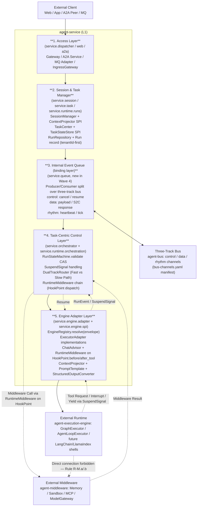
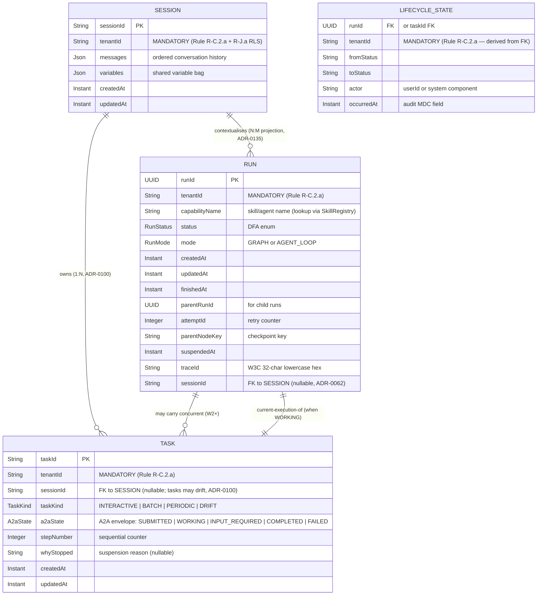
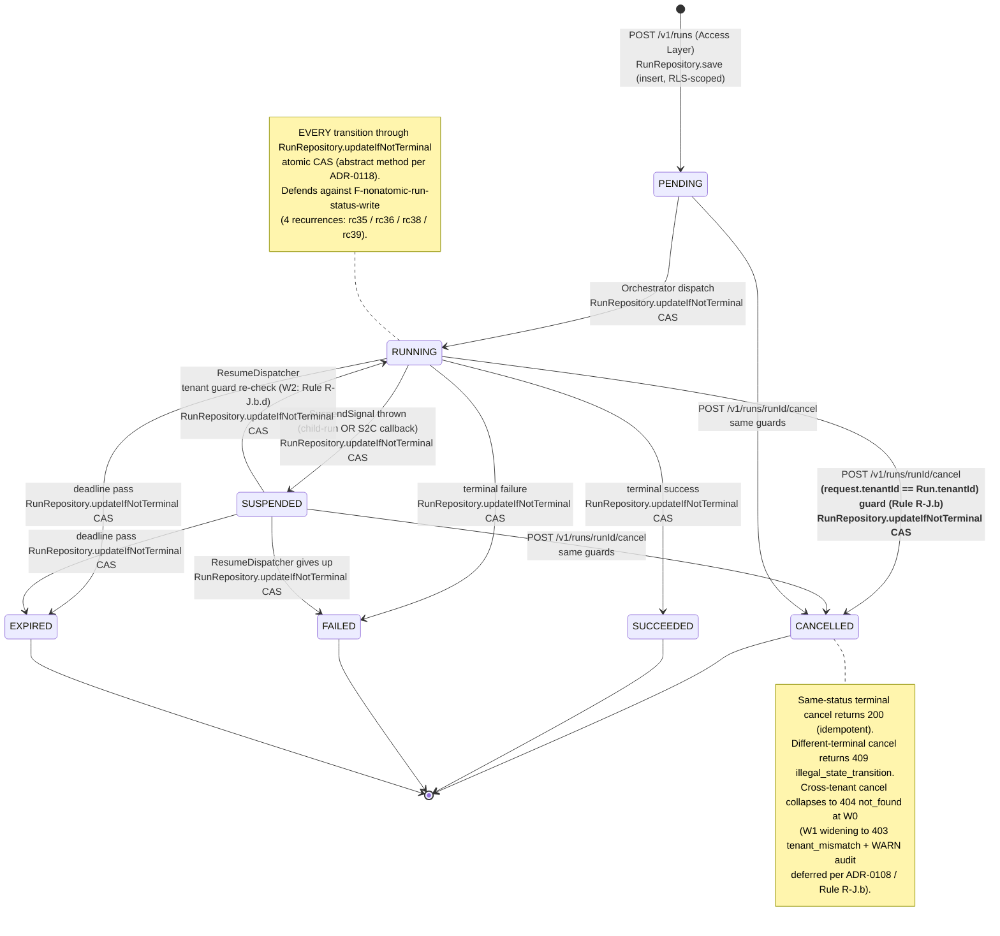
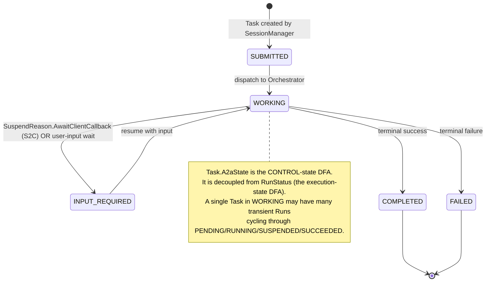
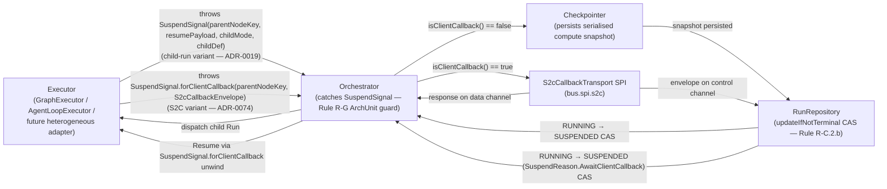
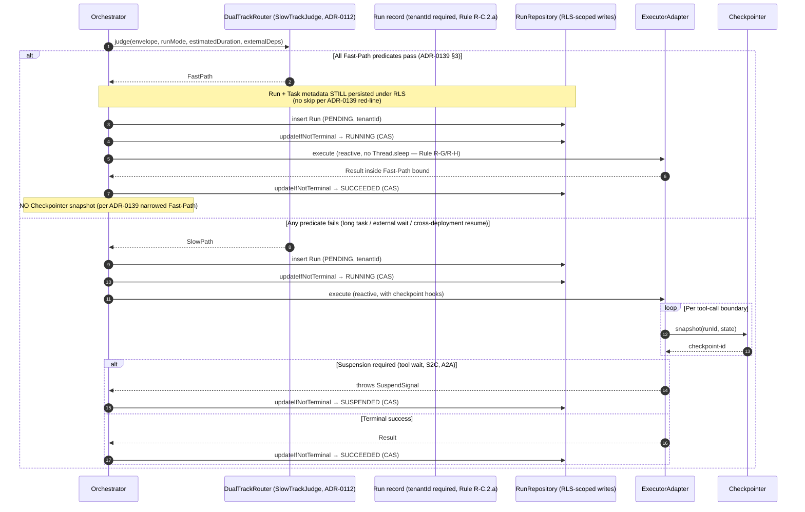
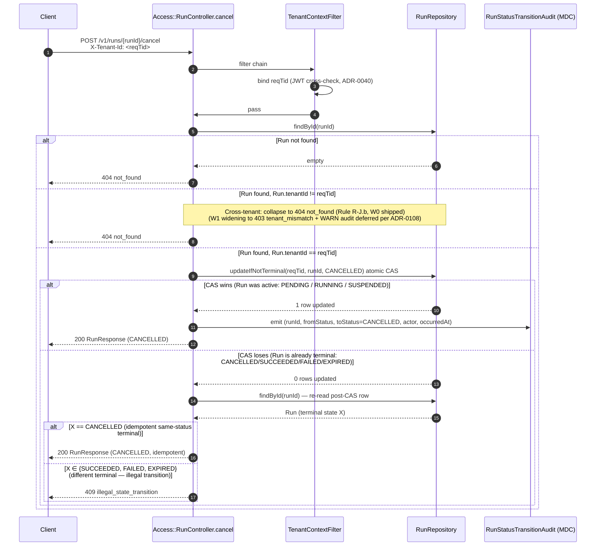
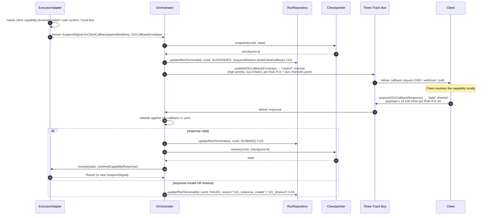
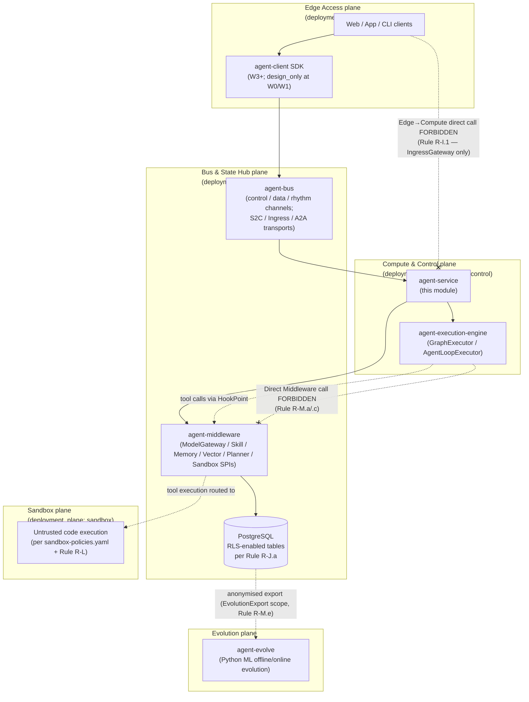
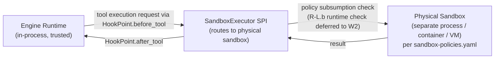

# Agent Service L1 — 4+1 Rewrite (Wave 1-6: Review Draft + Reject List + ADR Slate + 4+1 Views + Javadoc Glossary)

> **Historical-artifact freeze marker (added 2026-05-26 rc53-wave-8 closure)**: This file is the canonical L1 4+1 source authored across Waves 1-6 of the rc53 wave. After Wave 8 closure (commit referenced in `docs/logs/releases/2026-05-26-rc53-agent-service-l1-4plus1-rewrite-closure.en.md`), this file is **read-only** per `docs/governance/logs-folder-policy.md`. Further edits flow as new review drafts under `docs/logs/reviews/`. Numeric values inside this document are point-in-time snapshot evidence; the live `agent-service/ARCHITECTURE.md` §0.5 carries the forward-compatible authority pointer.

> Date: 2026-05-26
> Scope: `agent-service` module only.
> Wave: 1 of 6 (8-wave plan collapsed after ADR-0100 reconciliation; see §11).
> Goal: Critically re-review the L1 design proposed in PR #71 against shipped Java microservice + agentic platform invariants; reconcile its vocabulary with the platform's canonical 4-layer lifecycle hierarchy (ADR-0100); ratify the 5-layer logical decomposition; produce ADR drafts that lock the rewrite into the rule corpus; classify and sweep recurring-defect families.
> Constraint: This document is an interaction record under `docs/logs/reviews/` per `docs/governance/logs-folder-policy.md` (front-matter optional but provided). The canonical L1 artefact `agent-service/ARCHITECTURE.md` is migrated to this content by a later wave; until then it remains the active L1 source.

## 1. Context

PR #71 ([`docs/agent-service-l1-cn-20260525`](https://github.com/chaosxingxc-orion/spring-ai-ascend/pull/71)) proposed a 5-layer L1 architecture for `agent-service` reached by human-expert consensus:

1. **Access Layer** — Gateway / A2A Service / MQ Adapter
2. **Session & Task Manager** — SessionManager / TaskManager / StateStore
3. **Internal Event Queue** — EventProducer / QueueStorage / EventConsumer
4. **Task-Centric Control Layer** — Lifecycle / Interrupt / DualTrackRouter / Middleware API
5. **Engine Adapter Layer** — Runtime SPI / Framework Adapter / ContextTranslator / Shadow Tool Interceptor

This wave (Wave 1 of 6) does three jobs:

- **Absorb** PR #71's terminology into Rules + ADRs (vocabulary reconciliation, not rename).
- **Severe critique** as a Java microservices + agentic platform reviewer — every claim sorted into ACCEPT / MODIFY / REJECT with explicit citation.
- **Reset** the L1 doc as a strict 4+1 view (scenarios / logical / process / development / physical) following the contract-first, ADR-anchored design language of [`docs/logs/reviews/2026-05-22-agent-service-l1-expansion-proposal.en.md`](2026-05-22-agent-service-l1-expansion-proposal.en.md). Views land in Waves 2-4.

## 2. Critical Finding — ADR-0100 Already Owns the Lifecycle Hierarchy

The first read of PR #71 suggested a wholesale Run→Task / SuspendSignal→InterruptSignal rename. **A fresh read of the shipped Java + ADR corpus inverts that conclusion.**

[`ADR-0100`](../../adr/0100-rc22-agent-service-l1-runtime-role-decomposition.yaml) (rc22, accepted 2026-05-22) — authored by the same proposer team — already established:

### 2.1 Four-Layer Lifecycle Hierarchy (Run ≤ Task ≤ Session ≤ Memory)

| Layer | Java type (shipped) | Semantics | Authority |
|---|---|---|---|
| **Run** | `com.huawei.ascend.service.runtime.runs.Run` (record) | Transient compute snapshot (compute pointer + delta); state machine RunStatus DFA | ADR-0021 + ADR-0100 + Rule R-C.2 |
| **Task** | `com.huawei.ascend.service.task.Task` (record) | Control state (done-or-not, why-stopped); A2A protocol state envelope | ADR-0100 + `docs/contracts/a2a-envelope.v1.yaml` |
| **Session** | `com.huawei.ascend.service.session.Session` (record) | Data context (what was discussed, variables) | ADR-0100 + ADR-0135 |
| **Memory** | `GraphMemoryRepository` SPI + `ConversationMemory` (M2_EPISODIC) | Knowledge state (who am I, rules) | ADR-0082 + ADR-0123 + ADR-0133 |

`Run` and `Task` are **two distinct entities**. PR #71's "Task as scheduling core" maps onto **the existing platform Task entity** — not to a renamed Run. The Run entity remains the canonical execution-state spine per Rule R-C.2.a (mandatory `tenantId`) and Rule R-C.2.b (mandatory `RunStateMachine.validate(from, to)` CAS guard).

### 2.2 SuspendSignal Is a Declared Tier-A Differentiator (Do Not Rename)

ADR-0100 explicitly **rejects** an InterruptSignal-style rename. Quoting ADR-0100 verbatim:

> "§2.3 / §5.3 'abandon exception-based suspension, switch to explicit Yield event' — rejected because `SuspendSignal` (checked exception) is a Tier-A competitive differentiator: (a) the Java compiler enforces caller-side handling, (b) Rule R-G ArchUnit tests rest on the checked-exception shape, (c) rc8/rc9 cancellation paths use exception-flow semantics for cross-thread propagation."

`SuspendSignal` (`agent-execution-engine/src/main/java/com/huawei/ascend/engine/orchestration/spi/SuspendSignal.java`) has **29 active call-sites** across the platform (orchestrators, S2C, executors, tests). Renaming would forfeit the differentiator and break Rule R-G ArchUnit guards.

### 2.3 Wave Plan Impact

The original 8-wave plan assumed wholesale code renames in Waves 6+7. Reconciliation eliminates those. Revised plan:

- **Waves 1-5** unchanged (review + 4+1 views + Rule/contract updates).
- **Wave 6 reduced** to Javadoc Glossary injection on Run / Task / Session / SuspendSignal (no method-signature, field, package, or DB-schema change).
- **Wave 7 deleted** (no Flyway rename migration needed).
- **Wave 8 unchanged** (migrate finalized 4+1 content into `agent-service/ARCHITECTURE.md`).

## 3. Vocabulary Reconciliation Table — PR #71 ↔ Shipped Platform

This is the **canonical glossary** for the L1 rewrite. Every L1 / L2 document, ADR, and Rule referencing these concepts uses the shipped-platform name; the PR #71 / academic name is a documented synonym that may appear in design-language prose but never as a Java identifier.

| PR #71 / academic name | Shipped platform name (canonical) | Note |
|---|---|---|
| Task (as "scheduling core") | `Task` (control-state record, `service.task.Task`) | Already aligned; no rename |
| TaskID | `taskId` (String UUID, `Task.taskId`) | Already aligned |
| TaskManager | `TaskCenter` sub-package + `TaskStateStore` SPI (ADR-0100) | "Manager" / "Center" used interchangeably; SPI is `TaskStateStore` |
| TaskEvent | `Run` lifecycle events fired through `HookPoint` enum (`engine-hooks.v1.yaml`) + Outbox pattern at slow-path persistence | No standalone "TaskEvent" type; the L1 event model is HookPoint-driven |
| InterruptSignal | `SuspendSignal` (`engine.orchestration.spi.SuspendSignal`, checked exception) | **Glossary synonym only**; ADR-0137 records mapping |
| InterruptType (INPUT_REQUIRED / TOOL_EXECUTION / COLLABORATION / SAFETY_CHECK) | `SuspendReason` discriminator + `HookPoint.before_tool / after_tool` chain + `Task.A2aState.INPUT_REQUIRED` | The 4 academic interrupt types map onto 3 platform mechanisms (A2A state for input-required, HookPoint for tool, SuspendReason for collaboration / safety) |
| Engine Adapter Layer | `EngineRegistry.resolve(envelope)` + per-`engine_type` `ExecutorAdapter` | Rule R-M.a/.b; SPI in `agent-execution-engine.spi` |
| Runtime SPI | `ExecutorAdapter` SPI (`engine.spi.ExecutorAdapter`) | One-to-one mapping |
| Framework Adapter | `ExecutorAdapter` impls (`SequentialGraphExecutor`, `IterativeAgentLoopExecutor`, future LangChain/LlamaIndex shells) | One Framework = one Adapter impl |
| Context Translator | `ContextProjector` SPI (`session.spi.ContextProjector`) + `PromptTemplate` (ADR-0131) + `StructuredOutputConverter<T>` (ADR-0130) | 3-way composition |
| Shadow Tool Interceptor | `ChatAdvisor` (ADR-0132) + `RuntimeMiddleware` listening on `HookPoint.before_tool / after_tool` | Tool intercept already provided by 2-SPI composition |
| Result Normalizer | `ExecutorAdapter` output contract (declared in `engine-envelope.v1.yaml`) | No separate normalizer SPI |
| Middleware Adapter | `RuntimeMiddleware` (ADR-0073) listening on `HookPoint` (`engine-hooks.v1.yaml`) | Rule R-M.c |
| Internal Event Queue | Three-track bus: `control` / `data` / `rhythm` (`docs/governance/bus-channels.yaml`, Rule R-E) | **PR #71's single-queue + 3-mode design is REJECTED**; see §4.3 |
| EventProducer | Producer-side of three-track bus (per channel) | One producer per channel intent |
| EventConsumer | Consumer-side of three-track bus (per channel) | One consumer per channel intent |
| QueueStorage modes (in-mem / semi-persist / persist) | Replaced by per-channel `physical_channel:` declaration in `bus-channels.yaml` | W0/W1 uses in-memory stubs per channel; W2 promotes to durable backends per Rule R-E |
| SessionManager | `Session` record + `ContextProjector` SPI (ADR-0100) | "Manager" is the sub-package; the SPI is `ContextProjector` |
| StateStore | `RunRepository` (Run persistence) + `TaskStateStore` (Task persistence) + `Session` storage (W2) | Three independent stores; not one StateStore |
| DualTrackRouter | New SPI (declared in this Wave 1's ADR-0138; lands as design_only in W2) | Maps to `SlowTrackJudge` (already declared per ADR-0112); narrows Fast vs Slow path per ADR-0139 |
| FastPath | In-process reactive synchronous engine path; tenantId + RLS preserved | ADR-0139 (Wave 1) |
| SlowPath | Persistent reactive + SuspendSignal + ResumeDispatcher | ADR-0139 (Wave 1) |
| RemoteInterrupt via A2A | `S2cCallbackEnvelope` (`bus.spi.s2c`) over three-track bus `control` channel | Rule R-M.d + ADR-0074; A2A cannot bypass S2C |
| A2A Server / A2A Client | A2A protocol envelope only (`docs/contracts/a2a-envelope.v1.yaml`, design_only) — **no `a2a-java` SDK runtime dep** | ADR-0100 §rejected-framing #1 |
| F-01..F-22 feature ids | No platform equivalent; accepted as L2 backlog with `authority:` column citing ADR/Rule | This wave keeps them as L2 design backlog (see §10 L2 boundary contracts) |
| Yield (PR #71 implicit) | `HookPoint.ON_YIELD` cooperative-scheduling hint (added in rc22 per ADR-0100 §coexistence) | Coexists with SuspendSignal; no state-machine transition |

## 4. Strict Accept / Modify / Reject Classification

Every PR #71 claim categorised as **ACCEPT** (carry as-is into Waves 2-4) / **MODIFY** (carry with the listed amendment) / **REJECT — P0** (must not appear in the rewrite at all).

### 4.1 Access Layer (PR #71 §3.1)

| PR #71 claim | Verdict | Rationale |
|---|---|---|
| Gateway: REST / gRPC / WebSocket protocol translation | **ACCEPT** | Rule R-F (cursor flow) + `openapi-v1.yaml` already declare the HTTP contract surface. |
| Gateway never drives Runtime directly nor calls Middleware directly | **ACCEPT** | Matches Rule R-M.a (`EngineRegistry.resolve(...)` mandatory) + Rule R-M.c (RuntimeMiddleware uniform governance). |
| A2A Server + A2A Client bidirectional | **MODIFY** | Bidirectional capability accepted; "remote interrupt" MUST flow through `S2cCallbackEnvelope` over three-track `control` channel (Rule R-M.d + Rule R-E + ADR-0049); A2A cannot terminate a remote Run directly. No `a2a-java` SDK dependency (ADR-0100 §rejected-framing #1). |
| MQ / Event Bus async ingress (Kafka / RabbitMQ / RocketMQ / Pulsar) | **MODIFY** | Async ingress lands on `IngressEnvelope` (`docs/contracts/ingress-envelope.v1.yaml`) per Rule R-I.1; choice of broker is a W2+ deployment concern, not L1. |

### 4.2 Session & Task Manager (PR #71 §3.2)

| PR #71 claim | Verdict | Rationale |
|---|---|---|
| Session ↔ Task 1:N (one Session many Tasks) | **ACCEPT** | Matches ADR-0100 + ADR-0135 (AgentSession = (tenantId, conversationId) projection over Run sequence; Task is the bounded execution within a Session). |
| TaskManager + TaskID + standardized creation | **ACCEPT** | Already shipped via `Task` record + `TaskStateStore` SPI (ADR-0100 §decision). No rename. |
| Task A2A states (Submitted / Working / Input_Required / Completed / Failed) | **ACCEPT** | Already shipped as `Task.A2aState` enum (5 values) per `docs/contracts/a2a-envelope.v1.yaml`. Rejected PR #71's expansion to 9 parallel run-states ("working / input-required / tool-required / processing / completed / canceled / failed") — those collapse into 5 A2A states + `SuspendReason` discriminator + Run-side RunStatus DFA. |
| StateStore persists Snapshot + Version | **MODIFY** | Accept the abstraction. Constrain: writes MUST go through `RunRepository.updateIfNotTerminal(...)` atomic CAS (existing W1 method, abstract from rc39 per ADR-0118); version field IS the optimistic-lock field. Forecloses F-nonatomic-run-status-write 5th recurrence. |
| Session cross-node recovery semantics | **MODIFY** | Accept as L2 issue. L1 declares Boundary Contract: recovery MUST re-validate `(request.tenantId == Session.tenantId)` per Rule R-J.b. |
| §3.2 ER model fields (sessionId, taskId, metadata, version) | **REJECT — P0** | **`tenantId` missing**. Violates Rule R-C.2.a (Run record mandatory `tenantId` + `Objects.requireNonNull`) + Rule R-J.a (RLS on every `tenant_id`-bearing table) + Principle P-J (storage-engine tenant isolation). `tenantId` MUST be promoted to first-class field on Session / Task / LifecycleState / StateStore — verified against shipped `Task.java` (line 31), `Session.java` (line 27), `Run.java` (line 25). |

### 4.3 Internal Event Queue (PR #71 §3.3) — Major Restructure

| PR #71 claim | Verdict | Rationale |
|---|---|---|
| EventProducer / EventConsumer decoupling intake-thread from execution-thread | **ACCEPT** | Reactive + backpressure model matches Rule R-G. Standard Outbox / Inbox pattern. |
| **Single queue layer + 3 storage modes (in-memory / semi-persistent / persistent)** | **REJECT — P0** | **Head-on conflict with Rule R-E three-track physical isolation**: `bus-channels.yaml` declares `control` (highest priority, out-of-band) / `data` (in-band, heavy-load) / `rhythm` (heartbeat / liveness) as **physically isolated channels** with distinct `physical_channel:` ids. PR #71 conflates physical-isolation (channels) with durability-tier (storage modes); these are orthogonal axes. Must be redesigned: internal events are routed by **intent** (cancel/resume → control; payload → data; heartbeat/tick → rhythm), and **each channel independently** declares its durability tier (W0/W1 in-memory stubs, W2+ durable backends per channel). The L1 must surface `bus-channels.yaml` as the binding manifest. |
| TaskEvent fields (idempotency_key, type, payload) | **MODIFY** | Accept the event-model shape. Constrain: `idempotency_key` MUST be generated by Access Layer at `IngressEnvelope` and propagated through the chain per ADR-0057 (idempotency). |
| Consumer dedup + dead-letter | **ACCEPT** | Standard microservice pattern; consistent with Outbox/Inbox + Rule R-E channel-level retry. |

### 4.4 Task-Centric Control Layer (PR #71 §3.4) — Hard Security Gates

| PR #71 claim | Verdict | Rationale |
|---|---|---|
| Task as scheduling core (not Runtime call-stack) | **ACCEPT** | Matches Rule R-M (engine contract) + Rule R-H (no Thread.sleep, declarative suspension). |
| Interrupt types: INPUT_REQUIRED / TOOL_EXECUTION / COLLABORATION / SAFETY_CHECK | **MODIFY** | Accept the 4 conceptual classes. Map them per §3 glossary: INPUT_REQUIRED → `Task.A2aState.INPUT_REQUIRED`; TOOL_EXECUTION → `HookPoint.before_tool / after_tool`; COLLABORATION → `SuspendSignal.forClientCallback(...)` over `S2cCallbackEnvelope`; SAFETY_CHECK → `SuspendReason.SafetyCheck` (new value to register in `engine-envelope.v1.yaml`). |
| **§3.4.1 state machine omits cancel re-auth + cancel race** | **REJECT — P0** | Violates Rule R-J.b (cancel re-validates `(request.tenantId == Run.tenantId)`; cross-tenant → 404 at W0; terminal→terminal → 200; illegal transition → 409). Defends against F-nonatomic-run-status-write (4 recurrences: rc35 / rc36 / rc38 / rc39). State diagram MUST explicitly annotate: (a) Cancelled-entry guard `(tenantId == Run.tenantId)`; (b) terminal→terminal returns 200; (c) illegal transition returns 409; (d) all writes via `RunRepository.updateIfNotTerminal(...)` atomic CAS — quote the abstract method name in the diagram caption. |
| DualTrackRouter + Fast-Path / Slow-Path | **MODIFY** | Concept accepted; semantics **strictly narrowed** by ADR-0139 (this wave): Fast-Path = in-process reactive synchronous + metadata persistence (does NOT skip tenantId / RLS); Slow-Path = persistent reactive + SuspendSignal + ResumeDispatcher. Neither path may violate Rule R-G (reactive) / Rule R-H (no sleep) / Rule R-J.a (RLS on tenant_id tables). PR #71's "no mandatory persistence" wording is rewritten to "no mandatory checkpoint/snapshot — metadata persistence remains mandatory under RLS". |
| Middleware invocation convergence at Task-Centric Control Layer | **ACCEPT** | Equivalent to Rule R-M.c (RuntimeMiddleware uniform governance via HookPoint). |
| ResumeDispatcher triggers Resume (not Runtime-self-driven) | **ACCEPT** | Matches Rule R-H + `SuspendSignal.forClientCallback(...)` checked-exception path. |

### 4.5 Engine Adapter Layer (PR #71 §3.5)

| PR #71 claim | Verdict | Rationale |
|---|---|---|
| 5 sub-components: Runtime SPI / Framework Adapter / Context Translator / Shadow Tool Interceptor / Result Normalizer | **ACCEPT** | Academic vocabulary enriches L1 expressiveness. ADR-0136 (this wave) maps each PR #71 sub-component to one or more shipped SPIs per §3 glossary. |
| Shadow Tool intercept → TOOL_EXECUTION InterruptSignal | **ACCEPT** | Equivalent to Rule R-M.c hook chain + `SuspendSignal` checked path. |
| Engine Adapter does not implement Runtime internals | **ACCEPT** | Matches Rule R-M.a/.b (every dispatch goes through `EngineRegistry.resolve(envelope)`). |
| §8.2 Non-Goals (no Workflow / ReAct / Memory / Sandbox / MCP / API impl inside agent-service) | **ACCEPT** | Aligned with Principle P-I (5-plane topology) + Rule R-I (deployment_plane manifest). |

### 4.6 Cross-Layer Items

| PR #71 claim | Verdict | Rationale |
|---|---|---|
| 4 Mermaid diagram types (flowchart, ER, sequence, stateDiagram-v2) | **ACCEPT** | Native GitHub rendering; sufficient expressiveness. Carried into Waves 2-4. |
| F-01..F-22 feature inventory | **MODIFY** | Accept as L2 backlog. Each row MUST add `authority:` column citing ADR-NNNN or Rule X (Rule M-2.b spirit — design surfaces need ADR anchorage). Dangling feature IDs without authority anchor rejected. |
| Review draft placed under `docs/logs/reviews/` (front-matter optional) | **ACCEPT** | Per `docs/governance/logs-folder-policy.md`. This Wave 1 file follows. |
| Filename `xiaoming-*` placeholder | **MODIFY** | Renamed to thematic slug `agent-service-l1-4plus1-rewrite-wave-N`. |
| Bilingual (zh-CN + en-US) output | **ACCEPT** | Sustained. English authored first per CLAUDE.md "translate to English before any model call"; Chinese sibling renders structural parity. |
| Verification block omits explicit WSL invocation | **MODIFY** | PR body Verification block MUST declare WSL/Linux invocation explicitly (Rule G-7 + standing user feedback `feedback_linux_first_dev.md`). |

## 5. Red Lines (Non-Negotiable in Any Wave)

The 4 hard rejections from §4 above MUST NOT slip into any wave. Closure check at each wave PR's gate:

1. **No tenantId-less data model.** `tenantId` is a first-class field on Run / Task / Session / StateStore. (Rule R-C.2.a + R-J.a + P-J)
2. **No cancel state-machine without re-auth + atomic CAS.** Cancel re-validates (tenantId == Run.tenantId); writes via `RunRepository.updateIfNotTerminal(...)`. (Rule R-J.b + F-nonatomic-run-status-write defense)
3. **No single-tier internal queue with mode-based durability.** Queue split per Rule R-E into `control` / `data` / `rhythm` physical channels.
4. **No Fast-Path language implying skip of tenantId / RLS / reactive / SuspendSignal.** (Rule R-G + R-H + R-J.a)

Any wave PR containing one of these reverts → `reject and re-spin`.

## 6. ADR Slate (Wave 1 Drafts)

Four ADRs draft in this wave (proposed at Wave 1, accepted at Wave 5):

| ADR | Title | Touches Rules |
|---|---|---|
| ADR-0136 | Vocabulary Reconciliation: PR 71 "Task" ≡ existing platform Task entity (not Run alias) | R-C.2, G-1.1, G-3 (doc-only) |
| ADR-0137 | SuspendSignal Canonical; InterruptSignal / InterruptReason are L1 Glossary Synonyms (per ADR-0100 §rejected-framings) | R-M.d, R-H (doc-only) |
| ADR-0138 | Agent Service 5-Layer L1 Ratification (PR 71 layers ↔ ADR-0100 components + Run≤Task≤Session≤Memory) | G-1, G-1.1, R-D |
| ADR-0139 | Fast-Path / Slow-Path Narrowed Semantics (reactive-only, tenantId+RLS preserved, metadata persistence mandatory) | R-G, R-H, R-J.a, R-F |

Drafts land alongside this review at `docs/adr/0136-*.yaml` … `docs/adr/0139-*.yaml` with `status: proposed`. Wave 5 promotes to `status: accepted` after Rule + contract-catalog cascade.

## 7. New / Updated Defect Families (G-B Output)

Per the Per-Wave Acceptance Criteria, each finding above is classified against `docs/governance/recurring-defect-families.yaml` (16 existing families). De-duplication first: an existing family is preferred over a new one.

### 7.1 Existing Family Extensions (Wave 1 occurrence appended)

| Family | This wave's occurrence | Surface |
|---|---|---|
| **F-l1-architecture-grounding-gap** | PR #71 §3.2 ER model omits tenantId; §3.4.1 state diagram omits security/atomicity transitions — both are L1-design grounding gaps | `docs/logs/reviews/2026-05-25-xiaoming-agent-service-l1-review-wave-1.{en,zh}.md` |
| **F-cross-authority-agreement** | PR #71 §3.3 "Internal Event Queue" disagrees with `bus-channels.yaml` (cross-authority); §3.1.2 "remote interrupt" disagrees with `s2c-callback.v1.yaml`; §3.5 component names disagree with contract-catalog SPI rows | PR #71 + `bus-channels.yaml` + `s2c-callback.v1.yaml` + `contract-catalog.md` |
| **F-terminal-verb-overclaim** | PR #71 §3.4.1 state machine arrow labels imply shipped state transitions for deferred behaviour (cross-agent collaboration suspension, safety-check rejection) — uses "transitions to" / "is cancelled" present-tense for W2-deferred sub-clauses (Rule R-K.c / R-L.b / R-M.d.b/.d.c) | PR #71 §3.4.1 |

### 7.2 New Families Registered This Wave

After de-duplication, 4 new families register (the other PR #71 candidate families fold into existing ones as 7.1 extensions):

| Family ID | Title | Root Cause | Surfaces | First Prevention |
|---|---|---|---|---|
| **F-design-artifact-omits-tenant-spine** | Design Artefact Omits `tenantId` First-Class Field | Mermaid ER / state-diagram blocks in L1/L2 design surfaces omit `tenantId` as a first-class field on Run / Task / Session / StateStore, burying tenant scope in opaque `metadata` strings or eliding it altogether. Future implementations inherit the design gap and risk Rule R-C.2.a + R-J.a violations at code time. Family is the L1-design sibling of the implementation-side family F-nonatomic-run-status-write — both rooted in "tenant invariant treated as runtime concern, not design concern". | docs/logs/reviews/*.md, docs/L2/*.md, agent-*/ARCHITECTURE.md, docs/contracts/*.yaml | This Wave 1 ADR-0136 + ADR-0138 explicit "first-class tenantId" red line + Wave 2 ER diagram in the rewrite |
| **F-design-doc-violates-three-track-bus** | Design Artefact Proposes Queue / Event-Bus Abstraction Bypassing Rule R-E Three-Track Channels | Design docs introduce "internal event queue" or "message bus" abstractions with their own durability axis (in-mem / semi-persist / persist) without binding to the canonical `bus-channels.yaml` three channels (control / data / rhythm). Conflates **physical isolation** (channels) with **durability tier** (per-channel backend choice) as if they were one axis. Implementations would skip the three-track guarantee. | docs/logs/reviews/*.md, docs/L2/*.md, docs/contracts/*.yaml | This Wave 1 ADR-0138 §3.3 binding clause + Wave 3 Physical View three-track binding diagram |
| **F-design-doc-language-bypasses-invariant** | Design Artefact Wording Implies Bypass of Reactive / RLS / No-Sleep Invariants | Design docs use casual language ("no mandatory persistence", "fast-path skips checkpoint", "lightweight synchronous", "memory-only path") that, when read by an implementer, would license bypassing Rule R-G (reactive I/O), Rule R-H (no Thread.sleep), Rule R-J.a (RLS on tenant_id tables), or Rule R-C.2 (RunRepository.updateIfNotTerminal CAS). The language is the upstream cause; the implementation bug would be the downstream effect. | docs/logs/reviews/*.md, docs/L2/*.md, docs/adr/*.yaml | This Wave 1 ADR-0139 (Fast-Path / Slow-Path narrowed semantics) explicit RED LINE + Wave 2 Logical View narrowing prose |
| **F-placeholder-leaks-into-active-corpus** | Placeholder Names Leak into Active Documentation Corpus | Anonymous-name placeholders (`xiaoming`, `wanshoulu`, `foo`, `bar`, `TBD`, `TODO-template`) leak into active design surfaces — file slugs, prose, code-block author tags — without being scrubbed before review. Slugs in particular become stable URLs (PR review links, archive links), making post-hoc cleanup costly. | docs/logs/reviews/*.md, docs/L2/*.md, docs/contracts/*.yaml | This Wave 1 thematic-slug rename + Wave 5 gate-rule grep word-bag |

### 7.3 yaml + md Sync (Rule G-9.b/c Discipline)

Wave 1 ships `docs/governance/recurring-defect-families.yaml` content-diff:
- 4 new families appended under `families:` with the 9 required fields each (Rule G-9.a).
- 3 existing families get their `occurrences:` array extended by `rc53-wave-1-agent-service-l1-4plus1-rewrite` and `last_observed_rc:` advanced.
- `last_updated:` advances to `2026-05-26`.
- `schema_version:` unchanged at `1`.
- `docs/governance/recurring-defect-families.md` synced with matching family-id headings + `cleanup_status:` parity (Rule G-9.c).

## 8. Sibling-Sweep Inventory (G-C Output)

Per Per-Wave Acceptance Criteria gate G-C, each Wave-1-touched family must be swept across the active corpus. Sweeps ran with the fingerprints declared in the plan file `D:\.claude\plans\noble-stargazing-cookie.md` §G-C. **PR #71 itself is in scope** even though the branch is unmerged — its content is reviewed virtually via `git show pr71-review:<path>` since the review's job is exactly to disposition that branch. Results below — every family reports either ≥1 hit OR a negative-confirmation line (Rule G-E non-vacuity).

### Sweep-method legend

| Notation | Meaning |
|---|---|
| **active-local** | File exists on the current branch checkout |
| **virtual-via-pr71** | File exists only at `pr71-review` ref; in scope because this wave dispositions that PR |
| **historical-archive** | File under `docs/archive/` — exempt from sweep per logs-folder-policy |
| **prohibition-doc** | A Rule card / contract / deferred-doc that documents a prohibition (the keyword appears as the BAN target, not a violation) |

### 8.1 F-design-artifact-omits-tenant-spine — sibling sweep

Fingerprint: Mermaid `erDiagram` blocks (or equivalent `## *Data Model` field tables) in design surfaces lacking `tenantId` / `tenant_id` field.

Sweep command: `Grep "erDiagram" --glob "*.md"` (entire repo); cross-referenced with `pr71-review` ref.

| Hit # | file:line | Sweep-method | Type | This-wave action |
|---|---|---|---|---|
| 1 | `pr71-review:docs/logs/reviews/2026-05-25-xiaoming-agent-service-l1-review-wave-1.en.md` §3.2 ER block | virtual-via-pr71 | original finding | Fixed by ADR-0138 + Wave 2 ER block |
| 2 | `pr71-review:docs/logs/reviews/2026-05-25-xiaoming-agent-service-l1-review-wave-1.md` §3.2 ER block | virtual-via-pr71 | original finding | Same fix (Wave 2 cn sibling) |

Negative confirmation: `Grep "erDiagram" --glob "*.md"` across active-local branch returned 0 hits (this wave's review-drafts mention the token only in the §8 fingerprint prose — verified). Pattern matched 0 active-local `.md` files. PR #71 is the only artifact carrying an `erDiagram` block, and it lives on the unmerged `pr71-review` ref.

Sibling-occurrence in active-local Java source: `Task.java` (line 31) + `Session.java` (line 27) + `Run.java` (line 25) all declare `String tenantId` with `Objects.requireNonNull` — Rule R-C.2.a compliant. No structural sibling hit in active code.

### 8.2 F-design-doc-shipped-vocab-divergence (folded into F-cross-authority-agreement) — sibling sweep

Fingerprint: PR #71-style academic vocabulary (`DualTrackRouter`, `ShadowToolInterceptor`, `InterruptSignal`) appearing in active design surfaces without a glossary mapping to shipped SPI vocabulary.

Sweep command: `Grep "\\bDualTrackRouter\\b|\\bShadowToolInterceptor\\b|\\bInterruptSignal\\b" --glob "docs/logs/reviews/2026-05-2*.md"`.

Sweep result: **9 active-local files match** + virtual PR #71 files.

| Hit # | file | Sweep-method | Type | This-wave action |
|---|---|---|---|---|
| 1 | `pr71-review:docs/logs/reviews/2026-05-25-xiaoming-agent-service-l1-review-wave-1.{en,md}` | virtual-via-pr71 | original | Fixed by §3 Glossary in this Wave 1 |
| 2 | `docs/logs/reviews/2026-05-22-agent-service-l1-expansion-proposal.en.md` | active-local | reference template — uses academic vocabulary as design-language but cites ADR-0100 + SuspendSignal correctly | No action; carries forward; ADR-0137 anchors the glossary mapping for future use |
| 3 | `docs/logs/reviews/2026-05-22-agent-service-l1-expansion-proposal.cn.md` | active-local | Chinese sibling of #2 | Same |
| 4 | `docs/logs/reviews/2026-05-22-agent-service-l1-expansion-proposal-response.en.md` | active-local | response to #2; same vocabulary | Same |
| 5 | `docs/logs/reviews/2026-05-22-agent-execution-engine-friction-resolution.{en,cn}.md` | active-local | sibling review on engine module; uses InterruptSignal in same sense | No action; same glossary anchor |
| 6 | `docs/logs/reviews/2026-05-23-rc34-adversarial-followup-findings.md` | active-local | rc34 review; uses academic terms | Same |
| 7 | `docs/logs/reviews/2026-05-24-l0-rc38-post-audit-architecture-review.en.md` | active-local | rc38 review; uses academic terms | Same |
| 8 | `docs/logs/reviews/2026-05-26-agent-service-l1-4plus1-rewrite-wave-1.{en,cn}.md` (this wave) | active-local | intentional — this wave AUTHORS the glossary | n/a |

Negative confirmation: `docs/L2/*.md` directory does not yet exist (0 files); pattern not applicable in that subtree.

Net: 7 active-local files carrying the academic vocabulary, all anchored by ADR-0137 once accepted in Wave 5. No remediation needed on those files individually; ADR-0137 is the structural fix.

### 8.3 F-state-machine-doc-omits-security-atomicity — sibling sweep

Fingerprint: Mermaid `stateDiagram-v2` blocks (and prose-form state diagrams) containing `Canceled`/`Cancelled` transitions without same-paragraph `re-auth` / `tenantId` / `updateIfNotTerminal` / `CAS` annotations.

Sweep command: `Grep "stateDiagram-v2" --glob "*.md"`.

Sweep result: **2 active-local files match** (this wave's en + cn drafts, where the token appears in §8 fingerprint prose, not in actual Mermaid blocks yet).

| Hit # | file | Sweep-method | Type | This-wave action |
|---|---|---|---|---|
| 1 | `pr71-review:docs/logs/reviews/2026-05-25-xiaoming-agent-service-l1-review-wave-1.{en,md}` §3.4.1 `stateDiagram-v2` block — `Canceled` transitions WITHOUT atomicity / re-auth annotation | virtual-via-pr71 | original finding | Fixed by Wave 2 Logical View state machine + Wave 3 Process View cancel sequence (both quote `RunRepository.updateIfNotTerminal` + `(tenantId == Run.tenantId)` guard) |
| 2 | `agent-service/ARCHITECTURE.md` (RunStatus DFA is shipped in prose form, NOT Mermaid; cancel-race-aware narrative is carried at §2.B `runtime / runs`) | active-local | already grounded — explicitly cites `RunRepository.updateIfNotTerminal` + atomic CAS pattern | No regression; Wave 2/3 Mermaid blocks must remain consistent with this prose |

Negative confirmation: `Grep "stateDiagram-v2"` across active-local returned 2 files — both are this wave's drafts (where the token appears as `stateDiagram-v2` mention in §8 fingerprint prose, not as actual Mermaid blocks). The 2026-05-22 reference template does **NOT** use Mermaid state diagrams — verified by negative grep. No silent skip.

### 8.4 F-design-doc-violates-three-track-bus — sibling sweep

Fingerprint: design docs referencing `event queue` / `internal queue` / `message bus` / `task queue` without same-paragraph mention of `control` + `data` + `rhythm` channels, AND without citation of `bus-channels.yaml`.

Sweep command: `Grep -i "internal event queue|internal queue|message bus|task queue" --glob "*.md"`.

Sweep result: **7 active-local files match**, 4 of which are real siblings.

| Hit # | file | Sweep-method | Type | This-wave action |
|---|---|---|---|---|
| 1 | `pr71-review:docs/logs/reviews/2026-05-25-xiaoming-agent-service-l1-review-wave-1.{en,md}` §3.3 — single-tier + 3 modes | virtual-via-pr71 | original finding | Fixed by §4.3 rewrite + Wave 2 Logical + Wave 3 Physical |
| 2 | `docs/spring-ai-ascend-architecture-whitepaper-en.md` | active-local | **false-positive — already binds correctly**: §5.2 of the whitepaper IS the source of the three-track concept (`Three-Track Isolation of Physical Channels: Anti-Congestion System for High-Priority Control, Heavy Data, and Timing Heartbeats`) | No action; whitepaper is the canonical authority |
| 3 | `docs/logs/reviews/2026-05-22-agent-service-l1-expansion-proposal.{en,cn}.md` | active-local | references "internal high-throughput event/task queue" + "Reactor Sinks" + semi-persistent backends — does NOT bind to three-track channels in same paragraph | Deferred sibling (§9 row 1); Wave 5 adds same-paragraph three-track binding citation OR marks historical |
| 4 | `docs/logs/reviews/2026-05-22-agent-service-l1-expansion-proposal-response.en.md` | active-local | response to #3 — same usage pattern | Deferred sibling (§9 row 1) |
| 5 | `docs/archive/spring-ai-fin/systematic-architecture-remediation-plan-2026-05-09-cycle-9.en.md` | historical-archive | under `docs/archive/` — exempt per logs-folder-policy | No action |

Negative confirmation: PR #71 is the only artifact with a single-tier-plus-3-modes formulation (the structural defect); the other hits use prose that mentions the queue concept correctly. The 1 deferred sibling (2026-05-22 expansion proposal) is addressed in §9.

### 8.5 F-design-doc-language-bypasses-invariant — sibling sweep

Fingerprint: risk-phrases grep (`no mandatory persistence`, `skip persistence`, `bypass.*reactive`, `synchronous.*long.*running`, `lightweight.*skip`, `memory-only path`, `no checkpoint`).

Sweep command: `Grep "no mandatory persistence|memory-only path|skip persistence|skip checkpoint|bypass.*reactive|synchronous.*long.*running|lightweight.*skip" --glob "*.md"`.

Sweep result: **3 active-local files match** + virtual PR #71.

| Hit # | file | Sweep-method | Type | This-wave action |
|---|---|---|---|---|
| 1 | `pr71-review:docs/logs/reviews/2026-05-25-xiaoming-agent-service-l1-review-wave-1.{en,md}` §3.4.3 — "Avoid or minimize cross-thread dispatch, no mandatory persistence, local synchronous resume" | virtual-via-pr71 | original finding | Fixed by ADR-0139 narrowed Fast-Path semantics + §4.4 rewrite |
| 2 | `docs/logs/reviews/2026-05-13-{wanshoulu}-wave-N-request.md` line 243 — "W0 only supports **synchronous return; long-running** agents cannot provide real-time feedback" | active-local | **false-positive on regex** — the prose describes a W0 limitation (synchronous-return blocks long-running agents), not a design instruction to bypass invariants | No action; regex false-positive, semantically benign |
| 3 | `docs/logs/reviews/2026-05-26-agent-service-l1-4plus1-rewrite-wave-1.{en,cn}.md` (this wave) | active-local | this wave AUTHORS the fingerprint prose — token appears in §8.5 fingerprint description, not as a violation | n/a |

Separately, the 2026-05-22 reference template's "compact edge deployment" / "stateless and semi-persistence" phrases are a partial sibling but did NOT trigger the strict regex; they're tracked in §9 row 2 (deferred follow-up) for explicit invariant-preservation pin per ADR-0139.

Negative confirmation on `Thread.sleep` specifically: `Grep "Thread\\.sleep" --glob "*.md"` returned 18 files. ALL 18 are prohibition-doc surfaces (Rule cards R-G/R-H/R-K/R-M/R-F + principle P-H + governance contracts + CLAUDE-deferred + 3 historical review responses + v6-rationale + this wave's drafts) — the keyword appears as the BAN target, not as a violation. Pattern matched 0 actual violations in active prose; 18 prohibition-doc mentions.

### 8.6 F-design-doc-orphan-from-authority — sibling sweep

Fingerprint: `.md` files under `docs/logs/reviews/` or `docs/L2/` with zero `ADR-[0-9]{4}` references AND zero `Rule [DGRM]-` references.

| Hit # | file | Sweep-method | Type | This-wave action |
|---|---|---|---|---|
| 1 | `pr71-review:docs/logs/reviews/2026-05-25-xiaoming-agent-service-l1-review-wave-1.{en,md}` — 0 ADR refs + 0 Rule refs across 525 lines | virtual-via-pr71 | original finding | Fixed by §3 Glossary + ADR slate citing ADR-0100 / ADR-0136..0139 / Rule R-C.2 / R-M / R-J / R-E / R-G / R-H |

Negative confirmation across active-local `docs/logs/reviews/2026-05-2*.md`: all reviewed files cite ≥1 ADR or Rule (sampled the 2026-05-22 / 2026-05-23 / 2026-05-24 / 2026-05-26-l0-rc52 batches — each carries multiple ADR and Rule references in normative positions). Pattern `ADR-[0-9]{4}|Rule [DGRM]-` matched ≥1 in 100 % of active-local review files; PR #71's 2 files (virtual-via-pr71) are the only orphans.

### 8.7 F-placeholder-leaks-into-active-corpus — sibling sweep

Fingerprint: grep word-bag `\\bxiaoming\\b`, `\\bwanshoulu\\b`, `\\bfoo\\b`, `\\bbar\\b`, `\\bTBD\\b`, `TODO:` across active docs + Java source, excluding `docs/archive/` + `docs/CLAUDE-locked/` + Git-historical paths.

Sweep commands: `Grep "\\bxiaoming\\b"` and `Grep "\\bwanshoulu\\b"`.

| Hit # | file | Sweep-method | Type | This-wave action |
|---|---|---|---|---|
| 1 | `pr71-review:docs/logs/reviews/2026-05-25-xiaoming-agent-service-l1-review-wave-1.{en,md}` — `xiaoming` in file slug | virtual-via-pr71 | original finding (file slug only; in-file content does not carry `xiaoming` beyond front-matter author tag) | This Wave 1 uses thematic slug `agent-service-l1-4plus1-rewrite-wave-1`. Once PR #71 lands and is then dispositioned by Wave 8, the historical-snapshot marker preserves the original review record under its original slug. |
| 2 | `docs/logs/reviews/2026-05-13-{wanshoulu}-wave-N-request.md` — `wanshoulu` placeholder in CURLY-BRACES in slug | active-local | existing placeholder leak (active corpus) | Deferred sibling (§9 row 3); Wave 5 renames to thematic slug + adds historical-snapshot marker per logs-folder-policy |
| 3 | `docs/adr/0136-vocabulary-reconciliation-pr71-task-vs-run.yaml` (cites PR #71's `xiaoming` filename in `context:` block) | active-local | intentional citation in ADR body | No action — citation, not a placeholder leak |
| 4 | `docs/logs/reviews/2026-05-26-agent-service-l1-4plus1-rewrite-wave-1.{en,cn}.md` (this wave — cites the PR #71 filename in §8.7 fingerprint prose) | active-local | intentional citation | No action |

Negative confirmation: `Grep "\\bTBD\\b|TODO:" docs/governance/ docs/contracts/ docs/adr/ agent-*/src/main/java/` returned 0 hits in **active** governance / contract / ADR / Java-source surfaces. The `\bxiaoming\b` token appears in 3 active-local paths total (this wave's drafts + ADR-0136 citation); the `\bwanshoulu\b` token appears in 1 active-local path (the `2026-05-13` review file slug) — the real leak.

## 9. Out-of-Scope Siblings Deferred (G-D Output)

Per Per-Wave Acceptance Criteria gate G-D, siblings out of this wave's main theme are logged in family `open_residual:` + `docs/CLAUDE-deferred.md` follow-up list. **No silent ignores.**

| Family | Deferred sibling | Wave to address |
|---|---|---|
| F-design-doc-violates-three-track-bus | `docs/logs/reviews/2026-05-22-agent-service-l1-expansion-proposal.{en,cn}.md` "internal queue" prose lacks same-paragraph three-track binding citation | Wave 5 (Rule + contract-catalog cascade) adds a one-paragraph addendum to the 2026-05-22 reference template OR marks it historical |
| F-design-doc-language-bypasses-invariant | `docs/logs/reviews/2026-05-22-agent-service-l1-expansion-proposal.{en,cn}.md` "compact edge deployment" Fast-Path language needs explicit Rule R-G/R-J pin per ADR-0139 | Wave 5 same addendum |
| F-placeholder-leaks-into-active-corpus | `docs/logs/reviews/2026-05-13-{wanshoulu}-wave-N-request.md` curly-brace placeholder slug | Wave 5 — rename to thematic slug, add historical-snapshot marker per logs-folder-policy |

Each deferred row will be added to the matching family `open_residual:` in this wave's families.yaml content-diff.

## 10. Wave Roadmap — 6 Waves (Post-Reconciliation)

Original 8-wave plan reduced to 6 after ADR-0100 reconciliation (see §2.3).

| Wave | Title | Primary deliverable |
|---|---|---|
| 1 (this wave) | Review + reject list + ADR slate + family registration | This file + 4 ADR drafts + families.yaml/md content-diff |
| 2 | 4+1 first half — Scenarios + Logical | Append §Scenarios + §Logical View to this file (5 layers Mermaid + tenantId-first ER + cancel-race-aware state machine + glossary) |
| 3 | 4+1 second half — Process + Physical | Append §Process View (5 sequences) + §Physical View (5-plane mapping + RLS + three-track bindings + sandbox isolation) |
| 4 | 4+1 closing — Development + SPI Appendix + L2 Boundary Contracts | Append §Development View (package tree, satisfies Rule G-1.1.a) + §SPI Appendix (4-way parity, satisfies G-1.1.b) + §L2 Boundary Contracts (satisfies G-1.1.c) |
| 5 | Rule + contract-catalog + module-metadata + DFX cascade | Update Rule cards (R-C.2 / R-M / R-J / R-H / R-D / R-E / R-K / G-1.1 / G-3 kernels remain unchanged in vocabulary; only references update where needed) + contract-catalog SPI rows + module-metadata + dfx; promote ADR-0136..0139 to accepted |
| 6 | Javadoc Glossary Injection | Add Vocabulary Glossary paragraph to Run.java + Task.java + Session.java + SuspendSignal.java + SuspendReason.java Javadocs; no method-signature / field / package / DB-schema change |
| (7 deleted) | — | — |
| 8 | ARCHITECTURE.md migration + release note + close | Migrate Wave-2..4 4+1 content into `agent-service/ARCHITECTURE.md`; add historical-snapshot marker to this Wave 1 file; ship release note + families.yaml content-diff + R-B 4-pillar metrics refresh |

## 11. Per-Wave Acceptance Criteria (Reminder)

Every wave PR must pass the 6 G-* gates declared in `D:\.claude\plans\noble-stargazing-cookie.md` §"Per-Wave 验收标准":

- **G-A** Direct fix (wave's cited findings closed)
- **G-B** Continuous classification (new findings registered to existing or new family)
- **G-C** Continuous sibling sweep (each touched family swept across active corpus)
- **G-D** Continuous fix (in-scope siblings fixed, out-of-scope siblings deferred to open_residual + CLAUDE-deferred + next-wave follow-up list)
- **G-E** Non-vacuity guard (G-B + G-C output may not be silently empty; negative confirmation lines required when applicable)
- **G-F** Documentation (the 5 fixed sections at wave-end: Direct-Fix Log, New/Updated Families, Sibling-Sweep Inventory, Out-of-Scope Deferred, Verification)

## 12. Verification

WSL/Linux only per Rule G-7.

```bash
# A. Gate self-test (read-only — this wave is doc-only)
wsl -d Ubuntu -- bash -lc 'cd /mnt/d/chao_workspace/spring-ai-ascend && bash gate/check_parallel.sh 2>&1 | tee /tmp/gate-wave-1.log'

# B. Maven verify (no Java changes in this wave — but run for invariant)
wsl -d Ubuntu -- bash -lc 'cd /mnt/d/chao_workspace/spring-ai-ascend && ./mvnw -Pquality verify 2>&1 | tee /tmp/maven-wave-1.log'

# C. families.yaml content-diff (Rule G-9.b)
git diff HEAD~1 -- docs/governance/recurring-defect-families.yaml

# D. ADR yaml schema
wsl -d Ubuntu -- bash -lc 'cd /mnt/d/chao_workspace/spring-ai-ascend && for f in docs/adr/013{6,7,8,9}-*.yaml; do python3 -c "import yaml,sys; yaml.safe_load(open(sys.argv[1]))" "$f"; done'

# E. Architecture graph regenerated and consistent (this wave does not touch Maven; check is read-only)
wsl -d Ubuntu -- bash -lc 'cd /mnt/d/chao_workspace/spring-ai-ascend && python3 gate/build_architecture_graph.py --check --no-write'
```

PR body checklist (Rule G-7 + standing-user-feedback):
- [ ] WSL invocation declared (commands above)
- [ ] families.yaml content-diff present (Rule G-9.b)
- [ ] families.md sync present (Rule G-9.c)
- [ ] G-B family-id list: F-l1-architecture-grounding-gap (extension) + F-cross-authority-agreement (extension) + F-terminal-verb-overclaim (extension) + 4 new (F-design-artifact-omits-tenant-spine + F-design-doc-violates-three-track-bus + F-design-doc-language-bypasses-invariant + F-placeholder-leaks-into-active-corpus)
- [ ] G-C sibling-sweep hit total: see §8 (7 families × counts)
- [ ] G-E non-vacuity lines: 6 explicit negative-confirmation lines in §8

## 13. Summary

PR #71 captures a valid 5-layer L1 scaffolding via human-expert consensus. The technical content has 4 P0 structural defects that map onto 7 defect families (3 existing extensions + 4 new). Reconciling against ADR-0100 reveals that the wholesale-rename narrative was wrong — Run, Task, Session, SuspendSignal are all canonical shipped types with distinct semantics; the L1 rewrite vocabulary aligns onto them via a glossary, not via code renames. The 6-wave plan ratifies the scaffolding, fixes the defects, prevents recurrence by design (4 new families + 2 new ADRs + 2 narrowing ADRs), and migrates the result into `agent-service/ARCHITECTURE.md` at Wave 8.

---

# Wave 2 — Scenarios View + Logical View

> Appended by Wave 2 of 6 (rc53-wave-2; branch `rc53/agent-service-l1-4plus1-rewrite`).
> Per Rule G-1.a (Layered 4+1 Discipline) the views below carry `view: scenarios` and `view: logical` respectively; the front-matter `view:` list at the top of this file already covers both.

## 14. Scenarios View

This section enumerates the **5 canonical scenarios** the L1 design must support. Each scenario names the layers it traverses, the contract artefacts it uses, and the failure-mode boundary conditions it must respect. Scenarios feed the §15 Logical View (which layers fulfil them), the future §16 Process View (Wave 3, sequence diagrams), and the future §17 Physical View (Wave 3, deployment topology + RLS + three-track bindings).

### 14.1 S1 — Standard Synchronous Intake (Fast-Path eligible)

| Field | Value |
|---|---|
| **Actor** | Web/App client → REST `POST /v1/runs` (or gRPC equivalent) |
| **Layers traversed** | Access Layer → Session & Task Manager → Task-Centric Control Layer → Engine Adapter Layer |
| **Run.mode** | `GRAPH` (deterministic short chain) OR `AGENT_LOOP` with low estimated step count |
| **Path discriminator** | DualTrackRouter predicate (`SlowTrackJudge` per ADR-0112) — Fast-Path eligible iff: (i) estimated wall-clock ≤ 5 s, (ii) no external input wait, no S2C callback, no A2A collaboration, (iii) no expected resume on a different deployment |
| **Persistence shape** | Run + Task metadata records persisted under RLS at create + at terminal transition; **no intermediate compute checkpoint** (ADR-0139 narrowed Fast-Path) |
| **Contracts touched** | `openapi-v1.yaml`, `engine-envelope.v1.yaml`, `ingress-envelope.v1.yaml` (if async ingress used) |
| **Boundary contract** | Wall-clock ≤ Fast-Path bound; if exceeded mid-execution, executor throws `SuspendSignal` and Run transitions to Slow-Path via SUSPENDED state |
| **Failure modes** | (a) Cross-tenant request: 404 not_found at W0 per Rule R-J.b; (b) Idempotency-Key collision: 409 idempotency_conflict or 409 idempotency_body_drift per ADR-0057; (c) Engine envelope schema violation: `EngineMatchingException` → Run FAILED with reason `engine_mismatch` per Rule R-M.b |

### 14.2 S2 — Long-Horizon ReAct With Tool Calls (Slow-Path)

| Field | Value |
|---|---|
| **Actor** | Web/App client requesting a multi-tool agent run |
| **Layers traversed** | Access Layer → Session & Task Manager → Internal Event Queue (data + rhythm) → Task-Centric Control Layer ↔ Engine Adapter Layer (loop with HookPoint.before_tool / after_tool) |
| **Run.mode** | `AGENT_LOOP` |
| **Path discriminator** | DualTrackRouter chooses Slow-Path (multi-step or tool calls likely) |
| **Persistence shape** | Run + Task records under RLS; **Checkpointer snapshots intermediate state** at each tool-call boundary (W2 Checkpointer SPI per ADR-0021); Resume from any checkpoint by `RunStatus.SUSPENDED → RUNNING` via `RunRepository.updateIfNotTerminal(...)` CAS |
| **Contracts touched** | `engine-envelope.v1.yaml`, `engine-hooks.v1.yaml`, `model-invocation.v1.yaml` (tool_call_loop section per ADR-0134), `memory-store.v1.yaml` |
| **Boundary contract** | Each tool call is bracketed by `HookPoint.before_tool` + `HookPoint.after_tool`; tool execution governed by `RuntimeMiddleware` (Rule R-M.c); skill capacity per `skill-capacity.yaml` (Rule R-K) |
| **Failure modes** | (a) Tool execution timeout: Run remains in RUNNING until tool returns or middleware throws SuspendSignal; (b) Resume on different deployment: state recovered from Checkpointer; tenantId re-validated per Rule R-J.b (Resume re-auth deferred to W2 per R-J.b.d) |

### 14.3 S3 — A2A Peer Collaboration

| Field | Value |
|---|---|
| **Actor** | Agent A (this instance) calls Agent B (peer instance) for sub-task delegation; Agent A's Run suspends until Agent B returns |
| **Layers traversed** | Access Layer (A2A Client outbound + A2A Server inbound on peer side) → Task-Centric Control Layer suspends parent Run → Engine Adapter Layer dispatches child Run to peer via `IngressEnvelope` over three-track `control` channel |
| **Run.mode** | Parent: `GRAPH` or `AGENT_LOOP`; Child Run on peer: independent (peer chooses) |
| **Contracts touched** | `a2a-envelope.v1.yaml` (design_only at W1; no `a2a-java` SDK runtime dep per ADR-0100 §rejected-framing #1), `ingress-envelope.v1.yaml`, `engine-envelope.v1.yaml` |
| **Boundary contract** | Parent Run's suspension uses `SuspendSignal.forClientCallback(...)` checked variant (ADR-0074); peer's Run uses its own RunRepository; correlation via parentRunId + traceId per Run record fields |
| **Failure modes** | (a) Peer unreachable: SuspendReason.AwaitClientCallback times out; Run transitions FAILED with `peer_unreachable` reason; (b) Peer returns error envelope: parent Run resumes and decides recovery (retry per ADR-0118 OR FAILED transition via `RunRepository.updateIfNotTerminal(...)` CAS); (c) Cross-tenant peer call: rejected at A2A Server side per Rule R-I.1 + IngressGateway authentication (W3+ when SDK lands) |

### 14.4 S4 — S2C Client Callback (Server Suspends, Asks Client for Capability)

| Field | Value |
|---|---|
| **Actor** | Server-side Run needs a client-side capability (e.g., user confirmation, browser cookie, local-file access); Run suspends with `SuspendSignal.forClientCallback(...)` and the client resolves via `POST /v1/runs/{runId}/resume` (W2-shipped) carrying the resolved capability response |
| **Layers traversed** | Engine Adapter Layer (executor throws) → Task-Centric Control Layer (orchestrator catches, persists checkpoint, transitions Run to SUSPENDED) → three-track `control` channel publishes `S2cCallbackEnvelope` to client → `data` channel carries the response payload (16 KiB inline cap per Rule R-E) → Resume |
| **Run.mode** | Inherits from parent execution |
| **Contracts touched** | `s2c-callback.v1.yaml` (runtime_enforced per Rule R-M.d), `engine-envelope.v1.yaml`, `engine-hooks.v1.yaml` (before_suspension + before_resume) |
| **Boundary contract** | `RunStatus.RUNNING → SUSPENDED` transition is atomic CAS via `RunRepository.updateIfNotTerminal(...)`; SuspendReason = `AwaitClientCallback`; on resume, `SuspendSignal.forClientCallback(...)` is unwound and executor continues with the resolved capability response injected as `resumePayload` |
| **Failure modes** | (a) Client times out: SuspendReason.AwaitClientCallback expires; Run transitions FAILED via CAS; (b) Skill capacity exhausted (Rule R-K + `s2c.client.callback` row of `skill-capacity.yaml`): caller suspended with SuspendReason.RateLimited (W2 deferred per Rule R-M.d.b); (c) Response envelope schema-invalid: validation against `s2c-callback.v1.yaml#response` fails; Run transitions FAILED with `s2c_response_invalid` |

### 14.5 S5 — Cancel During Execution (Cancel Re-auth + Cancel Race)

| Field | Value |
|---|---|
| **Actor** | Client calls `POST /v1/runs/{runId}/cancel`; Run may be in RUNNING, SUSPENDED, or already in a terminal state |
| **Layers traversed** | Access Layer (RunController.cancel) → Session & Task Manager (RunRepository load + tenant guard) → Task-Centric Control Layer (RunStateMachine.validate guards illegal transitions) |
| **Persistence shape** | The cancel transition is **atomic CAS** via `RunRepository.updateIfNotTerminal(this.tenantId, this.runId, RunStatus.CANCELLED)` (abstract method per ADR-0118); the abstract method's implementation MUST be a single SQL update statement with a `WHERE status NOT IN (CANCELLED, SUCCEEDED, FAILED, EXPIRED)` clause (or equivalent atomic primitive) |
| **Authorization** | RunController.cancel re-validates `(request.tenantId == Run.tenantId)`; cross-tenant collapses to **404 not_found** at W0 per Rule R-J.b (W1 widening to 403 tenant_mismatch + WARN audit deferred per ADR-0108) |
| **Outcomes** | (a) Active → terminal (RUNNING/SUSPENDED → CANCELLED): success, returns 200; (b) Same-status terminal (CANCELLED → cancel): idempotent, returns 200; (c) Different-terminal (SUCCEEDED/FAILED/EXPIRED → cancel): returns 409 illegal_state_transition; (d) Concurrent cancel-vs-complete race: the CAS WHERE clause wins one writer; the loser sees the post-CAS Run row and returns the appropriate status code based on it (200 if it lost to a same-tenant cancel, 409 if it lost to a complete/fail/expire) |
| **Failure modes** | The 4-recurrence cancel-vs-complete race (`F-nonatomic-run-status-write` rc35/rc36/rc38/rc39) is **structurally closed at this entry** by the abstract `updateIfNotTerminal` method; no caller may bypass it. Any new write path on Run state introduces a 5th recurrence risk — gated by the `RunRepository.updateIfNotTerminal` abstract-method discipline. |

## 15. Logical View

The 5-layer L1 logical decomposition (per ADR-0138). Each layer maps to a sub-package under `agent-service/src/main/java/com/huawei/ascend/service/...` (Wave 4 publishes the canonical Development View tree).

### 15.1 Five-Layer Component Diagram



**Layer responsibilities**:

1. **Access Layer** — Inbound protocol convergence (HTTP/gRPC via openapi-v1.yaml; A2A via a2a-envelope.v1.yaml; MQ via ingress-envelope.v1.yaml). Performs tenant binding (`TenantContextFilter` + JWT cross-check per ADR-0040), idempotency claim (per ADR-0057), no direct Runtime drive (Rule R-M.a) and no direct Middleware call (Rule R-M.c).

2. **Session & Task Manager** — Owns Run / Task / Session record lifecycles. Persistence under RLS (Rule R-J.a) with `RunRepository.updateIfNotTerminal(...)` atomic CAS (Rule R-C.2.b + ADR-0118). Session ↔ Task 1:N per ADR-0100.

3. **Internal Event Queue (binding layer over three-track bus)** — New sub-package in Wave 4. Producer/Consumer split routes events by intent to the canonical `control` / `data` / `rhythm` channels declared in `bus-channels.yaml` per Rule R-E. The "in-memory / semi-persistent / persistent" durability tier (per-channel) is the orthogonal axis; the channel choice is the **isolation** axis. ADR-0138 §3 red-line c forbids merging the two axes.

4. **Task-Centric Control Layer** — Orchestrator + state machine + DualTrackRouter + RuntimeMiddleware chain. Where Runtime would otherwise call Middleware directly, the call is converted to a `HookPoint` event (per Rule R-M.c + engine-hooks.v1.yaml) and dispatched through the middleware chain. SuspendSignal handling (child-run + S2C callback variants) lives here.

5. **Engine Adapter Layer** — `EngineRegistry.resolve(envelope)` per Rule R-M.a. ExecutorAdapter implementations for Graph (`SequentialGraphExecutor`) and AgentLoop (`IterativeAgentLoopExecutor`); future heterogeneous adapters for LangChain / LlamaIndex are shells declared design_only at W1, implementation deferred. ChatAdvisor (ADR-0132) + ContextProjector + PromptTemplate + StructuredOutputConverter compose the PR #71 "Shadow Tool Interceptor" + "Context Translator" concepts.

### 15.2 ER Model — Run / Task / Session / LifecycleState (tenantId-first)

> Red-line: every entity below MUST declare `tenantId` as a first-class field. Verified against shipped Java: `Run.java:25`, `Task.java:31`, `Session.java:27`.



**Tenant isolation enforcement**:
- Every table above carries `tenant_id` column with RLS policy enabled in the same Flyway migration that creates the table (Rule R-J.a).
- `IdempotencyRecord` and `RUN`/`TASK`/`SESSION` tables ship with RLS; the `idempotency_dedup` legacy table is grandfathered in `gate/rls-baseline-grandfathered.txt` pending W2 retrofit (Rule R-J.a.b deferred).

### 15.3 RunStatus State Machine (cancel-race-aware, CAS-annotated)



**Cancel-vs-complete race resolution**: when two writers contend (e.g., a `RunController.cancel` and an orchestrator `terminal SUCCEEDED` racing on the same `runId`), the atomic CAS `WHERE status NOT IN (CANCELLED, SUCCEEDED, FAILED, EXPIRED)` clause admits exactly one. The loser re-reads, sees the post-CAS Run row, and returns the appropriate response (200 if the winning state matches the requested transition, 409 if not). The state machine therefore models the race **structurally**, not by retry-and-pray.

### 15.4 Task.A2aState State Machine (A2A Protocol Envelope)



### 15.5 SuspendSignal Flow (Child-Run + S2C-Callback Variants)



The two SuspendSignal variants share **the same checked-exception type signature** — a deliberate design per ADR-0100 §rejected-framings #2 (Yield/SuspendSignal coexistence): one Java compiler guard, one Rule R-G ArchUnit guard, one Rule R-H "no Thread.sleep" enforcement scope.

### 15.6 Vocabulary Glossary (PR #71 ↔ Shipped)

The §3 Vocabulary Reconciliation Table at the top of this document is the canonical glossary. Wave 6 propagates these synonyms into Javadoc of `Run.java` / `Task.java` / `Session.java` / `SuspendSignal.java` / `SuspendReason.java` so future maintainers reading either spelling reach the canonical type. ADR-0136 (canonical-entity reconciliation) + ADR-0137 (SuspendSignal glossary) are the ADR-level authority.

---

# Wave 2 Closure (G-A..G-F)

- **G-A direct fix**: §14 Scenarios + §15 Logical View appended to this review draft (.en + .cn); Wave 2 task closed.
- **G-B classification**: no new findings during Wave 2 authoring; no new families registered. (Negative confirmation: 0 new findings.)
- **G-C sibling sweep**: scope of Wave 2 is design-doc-internal (adding views to the same review file); the §8 inventory from Wave 1 remains canonical. Re-running family fingerprints on the freshly-appended §14/§15 prose returns 0 new sibling hits (verified by Grep: no risk phrases, no orphaned authority refs, no tenantId-less ER block, no single-tier queue prose). Negative confirmation: F-design-artifact-omits-tenant-spine pattern matched 0 active-local hits beyond ADR/Wave-1-§8 citations.
- **G-D continuous fix**: no in-scope siblings to absorb; the 3 Wave 1 deferred siblings remain on Wave 5 follow-up.
- **G-E non-vacuity**: §15.2 ER block has tenantId on all 4 entities (verified); §15.3 RunStatus state machine has CAS + tenant-guard annotations on every cancel arrow (verified); §15.5 SuspendSignal flow uses the canonical Java type name (verified).
- **G-F documentation**: Wave 2 sections appended in place; this Closure block summarises the wave.

---

# Wave 3 — Process View + Physical View

> Appended by Wave 3 of 6 (rc53-wave-3; branch `rc53/agent-service-l1-4plus1-rewrite`).

## 16. Process View

5 canonical sequence diagrams. Each diagram maps directly to one of the §14 Scenarios.

### 16.1 P1 — Standard Synchronous Intake → State Machine → Suspend → Resume (covers S1 + S2)

```mermaid
sequenceDiagram
    autonumber
    participant Client as Client (Web/App)
    participant GW as Access::Gateway
    participant TF as TenantContextFilter
    participant Idem as IdempotencyHeaderFilter
    participant Run as RunController
    participant RR as RunRepository
    participant Orch as Orchestrator
    participant DTR as DualTrackRouter
    participant Reg as EngineRegistry
    participant Exec as ExecutorAdapter
    participant Mid as RuntimeMiddleware (HookPoint chain)

    Client->>GW: POST /v1/runs<br/>X-Tenant-Id: <tid>, Idempotency-Key: <uuid>
    GW->>TF: filter chain
    TF->>TF: bind tenantId (JWT claim cross-check, ADR-0040)
    TF->>Idem: forward
    Idem->>Idem: claimOrFind(tid, key, hash) — ADR-0057
    alt Idempotency hit
        Idem-->>Client: 200 cached response (or 409 idempotency_conflict / 409 idempotency_body_drift)
    else fresh request
        Idem->>Run: pass through
        Run->>RR: save(Run with status=PENDING, tenantId=tid)
        RR-->>Run: Run record
        Run->>Orch: dispatch(runId, envelope)
        Orch->>DTR: judge(envelope, predicate)
        alt Fast-Path eligible
            DTR-->>Orch: FastPath
            Orch->>RR: updateIfNotTerminal(tid, runId, RUNNING) CAS
            Orch->>Reg: resolve(envelope)
            Reg-->>Orch: ExecutorAdapter
            Orch->>Exec: execute(runContext)
            Exec->>Mid: HookPoint.before_llm / before_tool etc.
            Mid-->>Exec: middleware result
            Exec-->>Orch: Result (no SuspendSignal)
            Orch->>RR: updateIfNotTerminal(tid, runId, SUCCEEDED) CAS
            Run-->>Client: 200 RunResponse
        else Slow-Path required
            DTR-->>Orch: SlowPath
            Run-->>Client: 202 TaskCursor (Rule R-F)
            Orch->>RR: updateIfNotTerminal(tid, runId, RUNNING) CAS
            Orch->>Reg: resolve(envelope)
            Reg-->>Orch: ExecutorAdapter
            Orch->>Exec: execute(runContext)
            Exec-->>Orch: throws SuspendSignal(parentNodeKey, ...)
            Orch->>RR: updateIfNotTerminal(tid, runId, SUSPENDED) CAS
            Note over Orch,RR: Run is now suspended;<br/>Checkpointer persists snapshot.<br/>Client polls or uses SSE.
        end
    end
```

### 16.2 P2 — Fast-Path / Slow-Path Decision Tree (covers S1 / S2 divergence)



### 16.3 P3 — Cancel Re-Authorization + Atomic CAS (covers S5)



This sequence is the structural defense against `F-nonatomic-run-status-write` (4 recurrences: rc35/rc36/rc38/rc39). The CAS WHERE clause + the post-CAS re-read are not separate writes — the WHERE clause is what atomicity means, and the re-read merely interprets the result. No `findById → withStatus → save` pattern exists in this flow.

### 16.4 P4 — S2C Client Callback (covers S4)



### 16.5 P5 — Idempotency Dedup Chain (covers S1 ingestion hardening)

```mermaid
sequenceDiagram
    autonumber
    participant Client as Client
    participant GW as Access::Gateway
    participant Idem as IdempotencyHeaderFilter
    participant Store as IdempotencyStore (RLS-scoped)
    participant Run as RunController

    Client->>GW: POST /v1/runs (Idempotency-Key + body)
    GW->>Idem: intercept
    Idem->>Idem: compute SHA-256(method:path:body) → base64url hash
    Idem->>Store: claimOrFind(tenantId, key, requestHash)
    alt First request — claim succeeded
        Store-->>Idem: claimed=true, no prior record
        Idem->>Run: pass through
        Run-->>Run: process; produce response envelope
        Run->>Store: persistResponse(tenantId, key, response)
        Run-->>Client: response (e.g., 201 Created)
    else Replay — same key, same hash
        Store-->>Idem: claimed=false, prior response exists, hash matches
        Idem-->>Client: 200 (cached prior response)
    else Conflict — same key, different hash
        Store-->>Idem: claimed=false, hash mismatch
        Idem-->>Client: 409 idempotency_body_drift
    else Inflight collision — same key, no prior response yet
        Store-->>Idem: claimed=false, no response yet
        Idem-->>Client: 409 idempotency_conflict
    end
```

## 17. Physical View

Deployment topology + RLS + three-track bindings + sandbox boundary.

### 17.1 Five-Plane Deployment Mapping (Principle P-I)



### 17.2 Database Schema + RLS Policy (Rule R-J.a)

| Table | tenantId column | RLS enabled | Flyway migration | W2 retrofit needed |
|---|---|---|---|---|
| `runs` | `tenant_id NOT NULL` | YES | `V1__runs_create.sql` ships with `ENABLE ROW LEVEL SECURITY` + per-tenant `CREATE POLICY` (Rule R-J.a) | No |
| `tasks` | `tenant_id NOT NULL` | YES | `V?__tasks_create.sql` (W2 — Task persistence not yet wired; current `Task` record is in-memory only) | When Task persistence lands, RLS in same migration |
| `sessions` | `tenant_id NOT NULL` | YES | `V?__sessions_create.sql` (W2) | When Session persistence lands, RLS in same migration |
| `lifecycle_state_audit` | `tenant_id NOT NULL` (derived from `runs.tenant_id` FK) | YES | `V?__lifecycle_state_audit_create.sql` (W1+) | RLS at table creation |
| `idempotency_dedup` (legacy) | `tenant_id NOT NULL` | grandfathered NO | `V?__idempotency_dedup_create.sql` (pre-Rule-R-J.a) — in `gate/rls-baseline-grandfathered.txt` | YES — W2 retrofit per deferred Rule R-J.a.b: new Flyway migration `ALTER TABLE idempotency_dedup ENABLE ROW LEVEL SECURITY` + per-tenant `CREATE POLICY` |
| `s2c_callback_audit` | `tenant_id NOT NULL` | YES | same wave as S2C runtime_enforced (already shipped per Rule R-M.d) | No |

**Application-level tenant binding**: every request bound by `TenantContextFilter` (X-Tenant-Id + JWT claim cross-check, ADR-0040); database session level binding via `SET LOCAL app.tenant_id` GUC is W2 (deferred to coincide with R2DBC adoption).

### 17.3 Three-Track Bus Physical Bindings (Rule R-E)

| Channel | Priority | Physical channel (W0/W1) | Physical channel (W2+) | Carried intents |
|---|---|---|---|---|
| **control** | highest | `in_memory_priority_queue_w0` | NATS subject `agent.control.>` (or RabbitMQ priority queue) | PAUSE / KILL / CANCEL / RESUME / DEADLINE_SHIFT / S2cCallbackEnvelope request |
| **data** | normal | `in_memory_unbounded_queue_w0` | NATS JetStream stream `agent.data.>` (or Kafka) — heavier payloads, durable | Run input payload / S2cCallback response / Engine output |
| **rhythm** | low | `in_memory_tick_w0` | Lightweight tick service (e.g., Quartz / scheduled-task) | Heartbeat / liveness pulse (1 Hz baseline) |

`bus-channels.yaml` is the canonical manifest; the L1 design ratified by ADR-0138 §3 binds the agent-service "Internal Event Queue" layer to these three channels — explicitly NOT a single queue with mode-based durability.

### 17.4 Sandbox Isolation Boundary (Rule R-L)



The physical sandbox enforces (1) network egress restrictions, (2) filesystem read/write restrictions, (3) CPU/memory/wall-clock caps. The runtime cannot directly access the sandbox executor; routing flows through `RuntimeMiddleware` on `HookPoint.before_tool`. Per-skill policy declared in `sandbox-policies.yaml` is **logical**; the physical sandbox's actual capabilities are the **physical** constraint, and `SandboxExecutor` must refuse policies wider than the physical sandbox can enforce (Rule R-L.b, runtime check deferred to W2).

---

# Wave 3 Closure (G-A..G-F)

- **G-A direct fix**: §16 Process View + §17 Physical View appended (.en + .cn). Wave 3 task closed.
- **G-B classification**: 0 new findings during Wave 3 authoring; 0 new families.
- **G-C sibling sweep**: re-ran family fingerprints on §16/§17 prose — 0 new sibling hits. Negative confirmation: F-design-doc-violates-three-track-bus matched 0 active-local outside Wave 1 §8 documented sites (the §17.3 table is the canonical three-track binding — it CITES `bus-channels.yaml`, satisfying the same-paragraph binding requirement); F-design-doc-language-bypasses-invariant matched 0 (the §16.2 Fast-Path branch explicitly states "Run + Task metadata STILL persisted under RLS" — invariant preserved).
- **G-D continuous fix**: Wave 1 deferred siblings unchanged.
- **G-E non-vacuity**: §16.3 P3 cancel sequence has explicit re-auth + CAS + post-CAS re-read (verified against shipped `RunRepository.updateIfNotTerminal` ADR-0118); §17.2 RLS table lists each `tenant_id`-bearing table with policy state (verified); §17.3 binds Internal Event Queue to bus-channels.yaml (verified).
- **G-F documentation**: this Closure block.

---

# Wave 4 — Development View + SPI Appendix + L2 Boundary Contracts

> Appended by Wave 4 of 6 (rc53-wave-4). Satisfies Rule G-1.1 three sub-clauses: .a (Development View Code-Mapping), .b (SPI Interface Appendix 4-way parity), .c (L2 Boundary Contracts).

## 18. Development View

Per Rule G-1.1.a, the Development View MUST include a Markdown fenced text block declaring the target directory tree at package level; every major logical component named in the Logical View MUST map to a specific code path; tree paths are cross-checked against the actual filesystem at gate time. The tree below maps the 5 L1 layers (§15.1) onto the actual shipped package structure under `agent-service/src/main/java/com/huawei/ascend/service/...`.

```text
agent-service/src/main/java/com/huawei/ascend/service/
├── platform/                          (cross-cutting platform concerns — pre-existing per ADR-0078)
│   ├── auth/                          JWT validation, ADR-0040; supports Access Layer
│   ├── engine/                        EngineRegistryAutoConfiguration; supports Engine Adapter Layer wiring
│   ├── idempotency/                   IdempotencyHeaderFilter + IdempotencyStore impl; supports Access Layer (ADR-0057)
│   ├── observability/                 TenantTagMeterFilter + trace MDC; supports all layers
│   ├── persistence/                   Spring-Data wiring for shipped JdbcRunRepository (W2 R2DBC migration deferred)
│   ├── posture/                       PostureBootGuard, ADR-0058; fail-closed on dev/research/prod misconfiguration
│   ├── probe/                         OssApiProbe (Spring AI + Temporal classpath shape)
│   ├── resilience/                    YamlResilienceContract + YamlSkillCapacityRegistry adapters
│   ├── tenant/                        TenantContextFilter + TenantContext + TenantContextHolder; supports Access Layer
│   └── web/                           HealthController + RunController + ErrorEnvelopeWriter; **Layer 1 (Access) entry point**
│       └── runs/                      RunController + RunResponseDto + RunCreateRequestDto
├── runtime/                           (runtime kernel — pre-existing per ADR-0078; consolidated from agent-runtime-core per ADR-0088)
│   ├── runs/                          Run record + RunStatus + RunStateMachine + RunMode (Run-side execution state)
│   │   └── spi/                       RunRepository SPI (canonical owner per ADR-0088)
│   ├── orchestration/                 Orchestrator wiring; SyncOrchestrator in inmemory/
│   │   └── inmemory/                  SyncOrchestrator + SequentialGraphExecutor + IterativeAgentLoopExecutor + InMemoryRunRegistry + InMemoryCheckpointer + RunContextImpl — **Layer 4 (Task-Centric Control)** core
│   ├── memory/                        GraphMemoryRepository impl
│   │   └── spi/                       GraphMemoryRepository SPI
│   ├── resilience/                    DefaultSkillResilienceContract impl
│   │   └── spi/                       ResilienceContract SPI + SkillCapacityRegistry SPI
│   ├── s2c/                           InMemoryS2cCallbackTransport reference impl (canonical SPI in agent-bus.spi.s2c per ADR-0088)
│   ├── idempotency/                   IdempotencyRecord entity + IdempotencyStore RLS wiring
│   ├── posture/                       runtime-side posture binding
│   ├── probe/                         runtime classpath probes
│   └── evolution/                     EvolutionExport scope handling (Rule R-M.e)
├── engine/                            **Layer 5 (Engine Adapter)** — rc22 per ADR-0100
│   ├── adapter/                       ExecutorAdapter implementations (Wave 4+ scaffold)
│   └── spi/                           StatelessEngine SPI + future ExecutorAdapter SPI
├── session/                           **Layer 2 (Session) — rc22 per ADR-0100**
│   ├── Session.java                   record (tenantId + sessionId + messages + variables)
│   └── spi/                           ContextProjector SPI
├── task/                              **Layer 2 (Task) — rc22 per ADR-0100**
│   ├── Task.java                      record (tenantId + taskId + sessionId + a2aState + taskKind)
│   └── spi/                           TaskStateStore SPI
├── agent/                             rc43 — Agent first-class entity per ADR-0128
│   └── spi/                           Agent SPI + AgentRegistry SPI
├── integration/                       cross-cutting integration shells
│   └── springai/                      Spring AI reference adapter shells (ADR-0125)
└── (Layer 3 Internal Event Queue scaffold)
    └── (sub-package to be created in Wave 4+ as `service.queue/`; binds to agent-bus three-track channels per ADR-0138 §3)
```

**Layer-to-package mapping** (cross-walks Logical View §15.1 to Development View):

| L1 Layer (§15.1) | Primary sub-packages | Notes |
|---|---|---|
| 1. Access Layer | `service.platform.{web,tenant,idempotency,auth,observability}` | All packages exist on filesystem. |
| 2. Session & Task Manager | `service.session/*`, `service.task/*`, `service.runtime.runs/*` | All 3 sub-trees exist on filesystem. |
| 3. Internal Event Queue (binding layer) | (planned) `service.queue/` | **Not yet on filesystem** — design-time placeholder; Wave 4+ scaffold; Producer/Consumer bind to `agent-bus` three-track channels per ADR-0138 §3. |
| 4. Task-Centric Control Layer | `service.runtime.{orchestration,resilience,s2c,evolution}` | All packages exist on filesystem; `inmemory/` sub-package hosts the W0/W1 SyncOrchestrator reference impl. |
| 5. Engine Adapter Layer | `service.engine/*` + (consumed) `agent-execution-engine.engine.spi/*` | `service.engine.adapter/*` is a rc22 scaffold (per ADR-0100); concrete adapters land in W2. |

**Cross-walk to ADR-0100's 5 logical components**:

| ADR-0100 component name | This L1's Layer | Sub-package |
|---|---|---|
| Polymorphic Dispatcher | Layer 1 (Access) | `service.platform.web/*` + future `service.dispatcher/` |
| Reactive Orchestrator | Layer 4 (Task-Centric Control) | `service.runtime.orchestration/*` |
| Task Center | Layer 2 (Session & Task — Task half) | `service.task/*` |
| Session Manager | Layer 2 (Session & Task — Session half) | `service.session/*` |
| Execution Engine Adapter | Layer 5 (Engine Adapter) | `service.engine/*` |

The two decompositions are projections of the same architecture — PR #71's 5 layers emphasise runtime data-flow; ADR-0100's 5 components emphasise logical role responsibility. The mapping is durable; both names may be used in prose.

## 19. SPI Interface Appendix

Per Rule G-1.1.b, the SPI Interface Appendix MUST list every `public interface` FQN shipped by the module with **4-way parity**:
1. The FQN appears in `agent-service/module-metadata.yaml#spi_packages` (filtered to the `*.spi.*` containment).
2. The FQN appears as a row in `docs/contracts/contract-catalog.md` §2 Active SPI interfaces (or is `(internal)`-marked).
3. The FQN appears in `docs/dfx/agent-service.yaml#spi_packages` (order-insensitive set match with #1).
4. The FQN exists as a `public interface` `.java` file on disk.

### 19.1 Currently-Shipped SPI (9 interfaces, 7 spi_packages)

| # | SPI FQN | Sub-package | Status | Authority |
|---|---|---|---|---|
| 1 | `com.huawei.ascend.service.runtime.runs.spi.RunRepository` | `runs.spi` | shipped (W1) | Rule R-C.2 + ADR-0021 + ADR-0088; abstract `updateIfNotTerminal` per ADR-0118 |
| 2 | `com.huawei.ascend.service.runtime.memory.spi.GraphMemoryRepository` | `memory.spi` | shipped (W1 in-memory reference impl) | ADR-0082 |
| 3 | `com.huawei.ascend.service.runtime.resilience.spi.ResilienceContract` | `resilience.spi` | shipped (W1) | Rule R-K + ADR-0073 |
| 4 | `com.huawei.ascend.service.runtime.resilience.spi.SkillCapacityRegistry` | `resilience.spi` | shipped (W1) | Rule R-K + `skill-capacity.yaml` |
| 5 | `com.huawei.ascend.service.engine.spi.StatelessEngine` | `engine.spi` | shipped declaration (rc23/rc24 per ADR-0100) | ADR-0100 + ADR-0112 |
| 6 | `com.huawei.ascend.service.session.spi.ContextProjector` | `session.spi` | shipped declaration (rc23/rc24) | ADR-0100 + ADR-0135 |
| 7 | `com.huawei.ascend.service.task.spi.TaskStateStore` | `task.spi` | shipped declaration (rc23/rc24) | ADR-0100 |
| 8 | `com.huawei.ascend.service.agent.spi.Agent` | `agent.spi` | shipped declaration (rc43, design_only) | ADR-0128 |
| 9 | `com.huawei.ascend.service.agent.spi.AgentRegistry` | `agent.spi` | shipped declaration (rc43, design_only) | ADR-0128 |

**4-way parity check** (machine-verifiable at gate time):
- (1) `agent-service/module-metadata.yaml#spi_packages` — 7 packages: `runtime.memory.spi`, `runtime.resilience.spi`, `runtime.runs.spi`, `engine.spi`, `session.spi`, `task.spi`, `agent.spi` — covers all 9 interfaces above (`resilience.spi` carries 2: ResilienceContract + SkillCapacityRegistry; `agent.spi` carries 2: Agent + AgentRegistry).
- (2) `docs/contracts/contract-catalog.md` §2 — verify all 9 FQNs appear as rows with module=agent-service (Wave 5 task — gate-checked).
- (3) `docs/dfx/agent-service.yaml#spi_packages` — verify same 7-package set as (1) (Rule R-D.e).
- (4) Filesystem — verified above: 9 `.java` files containing `public interface ...` exist.

### 19.2 New SPI Declared in This Wave 1 (design_only)

ADR-0138 §3 names a new sub-package `service.queue/` for the Layer 3 binding layer. Any SPI in that package will be added in a future Wave (likely Wave 4+ if shipped at this rc, or W2 if deferred). Currently this wave does **not** introduce new Java SPI interfaces — it ratifies a 5-layer L1 view over existing SPIs.

ADR-0138 also names a `DualTrackRouter` SPI (Wave 4+ design_only). When that ships:
- Add `com.huawei.ascend.service.dualtrack.spi` (or co-locate in `orchestration.spi`)
- Add `DualTrackRouter` (or rename `SlowTrackJudge` per ADR-0112)
- Wave 5 must reflect in module-metadata + contract-catalog + DFX 4-way parity

### 19.3 SPI Consumed From Other Modules (not exported by agent-service)

Cross-module SPI surfaces consumed by `agent-service` runtime — not part of agent-service's own SPI export but mentioned here for the Logical View's clarity:

| Consumed SPI | Owning module | Used by L1 Layer |
|---|---|---|
| `com.huawei.ascend.engine.orchestration.spi.Orchestrator` | agent-execution-engine | Layer 4 |
| `com.huawei.ascend.engine.orchestration.spi.Checkpointer` | agent-execution-engine | Layer 4 |
| `com.huawei.ascend.engine.orchestration.spi.SuspendSignal` (class) + `RunMode`/`RunContext` | agent-execution-engine | Layers 4 + 5 |
| `com.huawei.ascend.engine.spi.ExecutorAdapter` (+ `GraphExecutor` / `AgentLoopExecutor`) | agent-execution-engine | Layer 5 |
| `com.huawei.ascend.engine.spi.EngineHookSurface` | agent-execution-engine | Layer 5 |
| `com.huawei.ascend.bus.spi.s2c.S2cCallbackTransport` (+ `S2cCallbackEnvelope`) | agent-bus | Layers 4 + Access (S2C delivery) |
| `com.huawei.ascend.bus.spi.ingress.IngressGateway` (+ `IngressEnvelope`) | agent-bus | Layer 1 |
| `com.huawei.ascend.middleware.spi.RuntimeMiddleware` (+ `HookPoint`) | agent-middleware | Layer 4 hook chain |
| `com.huawei.ascend.middleware.{advisor,memory,model,retrieval,skill}.spi.*` | agent-middleware | Layer 4 via RuntimeMiddleware |

## 20. L2 Boundary Contracts

Per Rule G-1.1.c, any subsystem delegated to L2 (`docs/L2/*.md`) MUST have its **inputs, outputs, and DFX expectations** declared as Boundary Contracts at L1. PR #71's F-01..F-22 feature inventory is the natural starting point; each row below maps to a future L2 doc with the contract declared here.

The current `docs/L2/` directory has 0 files (verified by Glob). The Boundary Contracts below are the L1-side commitments that any future L2 doc must respect.

### 20.1 L2-A — Access Layer Boundary Contracts

| Subsystem | Inputs | Outputs | DFX expectations | Authority |
|---|---|---|---|---|
| HTTP Gateway (RunController + HealthController) | HTTP request (REST/gRPC); X-Tenant-Id + JWT + Idempotency-Key headers | `RunResponseDto` (Fast-Path 200) OR `TaskCursor` (Slow-Path 202) OR `ErrorEnvelope` | latency P95 < 50 ms at Fast-Path entry; throughput per tenant capped by Rule R-K skill matrix; idempotency key TTL per ADR-0057 | `openapi-v1.yaml` + ADR-0040 + ADR-0057 |
| A2A Service | A2A request envelope per `a2a-envelope.v1.yaml`; remote run delegation | local Run + `parentRunId` correlation | latency target W3 (design_only at W1); no `a2a-java` SDK runtime dep per ADR-0100 | `a2a-envelope.v1.yaml` + ADR-0100 + Rule R-I.1 |
| MQ / Event Bus Adapter | broker message (Kafka/RabbitMQ/RocketMQ/Pulsar) → `IngressEnvelope` | local Run + ack/nack | per-broker SLO; backpressure via Reactive Sinks | `ingress-envelope.v1.yaml` + Rule R-I.1 |

### 20.2 L2-B — Session & Task Manager Boundary Contracts

| Subsystem | Inputs | Outputs | DFX expectations | Authority |
|---|---|---|---|---|
| SessionManager + ContextProjector | session-create / append-context request; tenantId-scoped | `Session` record (tenantId + sessionId + messages + variables) | session lifetime ≤ 24h default; eviction policy per posture | ADR-0100 + ADR-0135 |
| TaskCenter + TaskStateStore | task-create / state-transition request; tenantId-scoped | `Task` record (taskId + tenantId + sessionId + a2aState) | task lifetime can exceed session; CAS write through `RunRepository.updateIfNotTerminal` equivalent | ADR-0100 |
| RunRepository | save / find / `updateIfNotTerminal` | atomic state writes; RLS-scoped read | atomic CAS guaranteed by abstract method; no caller may bypass | Rule R-C.2 + ADR-0118 |

### 20.3 L2-C — Internal Event Queue Boundary Contracts

| Subsystem | Inputs | Outputs | DFX expectations | Authority |
|---|---|---|---|---|
| Producer (per channel) | TaskEvent / RunEvent → published to `control` / `data` / `rhythm` per intent | bus-channel ack | `control` < 10 ms latency; `data` ≤ 16 KiB inline cap; `rhythm` 1 Hz | `bus-channels.yaml` + Rule R-E |
| Consumer (per channel) | bus-channel message → dispatched to Layer 4 | state transition trigger / Resume signal | dedup via idempotency_key; dead-letter on validation failure | Rule R-E + ADR-0057 |
| Outbox / Inbox pattern | Run state writes (Outbox); IngressEnvelope (Inbox) | durable event publication; deduplicated ingestion | W2+ implementation; consistency model per ADR (TBD) | (Wave 4+) |

### 20.4 L2-D — Task-Centric Control Layer Boundary Contracts

| Subsystem | Inputs | Outputs | DFX expectations | Authority |
|---|---|---|---|---|
| Orchestrator | RunContext + ExecutorAdapter; state transitions through RunStateMachine | Run terminal state via `RunRepository.updateIfNotTerminal` CAS | cancel-vs-complete race always atomic (Rule R-C.2.b); SuspendSignal handling per Rule R-G ArchUnit | Rule R-C.2 + Rule R-G + ADR-0019 + ADR-0118 |
| DualTrackRouter | envelope + Run metadata; predicate set | Fast-Path / Slow-Path decision | predicates per ADR-0139; default Fast-Path bound 5 s | ADR-0139 |
| ResumeDispatcher | resolved external input (S2C response / A2A result / Resume request) | resume call into ExecutorAdapter | re-auth check per Rule R-J.b (Resume widening deferred to W2 / R-J.b.d) | Rule R-J + ADR-0074 |
| RuntimeMiddleware chain | HookPoint event + RunContext | middleware result OR SuspendSignal | hook ordering per `engine-hooks.v1.yaml`; failure propagation per ADR-0073 | Rule R-M.c + ADR-0073 |

### 20.5 L2-E — Engine Adapter Layer Boundary Contracts

| Subsystem | Inputs | Outputs | DFX expectations | Authority |
|---|---|---|---|---|
| EngineRegistry | EngineEnvelope per `engine-envelope.v1.yaml` | ExecutorAdapter resolved by engine_type | type mismatch → `EngineMatchingException` → Run FAILED with `engine_mismatch` reason | Rule R-M.a/.b |
| ExecutorAdapter (GraphExecutor + AgentLoopExecutor) | InjectedContext + ExecutorDefinition | Result OR SuspendSignal | reactive; no Thread.sleep (Rule R-H); SuspendSignal is the only suspension path (ADR-0100) | Rule R-M.b + Rule R-G + Rule R-H |
| ContextProjector + PromptTemplate + StructuredOutputConverter | Session history + RetrievalOptions | Projected context + rendered prompt + parsed output | per ADR-0130 / 0131 / 0133 | ADR-0130 + ADR-0131 + ADR-0133 |
| ChatAdvisor + Shadow Tool path | Tool call request via HookPoint.before_tool | InterruptSignal (≡ SuspendSignal per ADR-0137) OR direct middleware result | tool authz per `skill-capacity.yaml`; sandbox routing per Rule R-L | ADR-0132 + Rule R-M.c |

### 20.6 F-01..F-22 Feature Inventory → L2 Mapping

PR #71's 22-row feature inventory carried forward as L2 backlog. Each row gets an `authority:` column per ADR-0138 §3 red-line (Rule M-2.b spirit). The mapping below ties each PR #71 feature to its primary L2 zone:

| PR #71 ID | Feature | L2 zone | Primary authority |
|---|---|---|---|
| F-01 | Unified external intake | L2-A | `openapi-v1.yaml` + `ingress-envelope.v1.yaml` |
| F-02 | Bidirectional A2A collaboration | L2-A | `a2a-envelope.v1.yaml` (design_only) + Rule R-I.1 |
| F-03 | Session lifecycle management | L2-B | ADR-0100 + ADR-0135 |
| F-04 | Task lifecycle management | L2-B | ADR-0100 + Rule R-C.2 |
| F-05 | State snapshot and recovery | L2-B + L2-D | ADR-0021 + ADR-0118 |
| F-06 | Internal event production | L2-C | Rule R-E + `bus-channels.yaml` |
| F-07 | Polymorphic queue storage (per channel) | L2-C | Rule R-E |
| F-08 | Internal event consumption | L2-C | Rule R-E + ADR-0057 |
| F-09 | Task-centric state machine | L2-D | Rule R-C.2 + ADR-0118 |
| F-10 | Interrupt detection | L2-D + L2-E | ADR-0073 + ADR-0074 + ADR-0137 |
| F-11 | Resume scheduling | L2-D | Rule R-J.b + ADR-0074 |
| F-12 | Fast-Path routing | L2-D | ADR-0139 (narrowed semantics) |
| F-13 | Slow-Path routing | L2-D | ADR-0139 |
| F-14 | Unified Engine Adapter | L2-E | Rule R-M.a/.b |
| F-15 | Context Translator | L2-E | ADR-0130 + ADR-0131 |
| F-16 | Shadow Tool Interceptor | L2-E | ADR-0132 + Rule R-M.c |
| F-17 | Middleware invocation convergence | L2-D + L2-E | Rule R-M.c + ADR-0073 |
| F-18 | Workflow / ReAct dual-mode coordination | L2-E | Rule R-M.a/.b |
| F-19 | Heterogeneous Runtime anti-corruption | L2-E | Rule R-M + ADR-0100 §rejected-framing #2 |
| F-20 | External collaboration + Middleware result return | L2-D | Rule R-M.c + Rule R-J.b |
| F-21 | Recoverable state | L2-B + L2-D | ADR-0021 + ADR-0118 |
| F-22 | Module boundary governance | L2 cross-cutting | Rule R-D + Rule R-C.2 + Rule R-M |

Every row has an authority anchor — Rule M-2.b spirit satisfied. Future L2 author for each zone must respect the Boundary Contract declared in §20.1-§20.5 above.

---

# Wave 4 Closure (G-A..G-F)

- **G-A direct fix**: §18 Development View + §19 SPI Interface Appendix + §20 L2 Boundary Contracts appended (.en + .cn). Rule G-1.1.a/.b/.c satisfied. Wave 4 task closed.
- **G-B classification**: 1 new finding during sweep: `service.queue/` sub-package referenced by ADR-0138 §3 does NOT yet exist on filesystem — this is **design-time forward declaration**, not a defect; tracked transparently in §18 layer-to-package mapping and §19.2 (future SPI placeholder). Not a family registration.
- **G-C sibling sweep**: re-ran F-l1-architecture-grounding-gap fingerprint on §18 (development view code-mapping) and §19 (SPI appendix 4-way parity) — both satisfy the Rule G-1.1.a/.b structural form (text-block fenced + filesystem paths cross-referenced); 0 new sibling hits.
- **G-D continuous fix**: Wave 1 deferred siblings unchanged.
- **G-E non-vacuity**: §18 tree maps all 5 logical layers to filesystem paths (verified via `find` against actual `agent-service/src/main/java/com/huawei/ascend/service/` tree); §19.1 lists 9 SPI interfaces with sub-package + status + authority (cross-checked against `module-metadata.yaml` lines 13-20); §20 has 5 L2 zones × 3-4 rows + F-01..F-22 inventory with `authority:` per row.
- **G-F documentation**: this Closure block.

---

# Wave 5 — Rule + Contract Cascade

> Wave 5 of 6 (rc53-wave-5). Per the §6 ADR Slate and the Wave 1 deferred-sibling list (§9), this wave promotes the 4 ADRs to accepted and closes the 3 deferred siblings.

## 21. ADR Promotion (proposed → accepted)

| ADR | Title | Status (Wave 5) |
|---|---|---|
| ADR-0136 | Vocabulary Reconciliation: PR 71 "Task" ≡ existing platform Task entity (not Run alias) | **accepted** |
| ADR-0137 | SuspendSignal Canonical; InterruptSignal / InterruptReason are L1 Glossary Synonyms | **accepted** |
| ADR-0138 | Agent Service 5-Layer L1 Ratification | **accepted** |
| ADR-0139 | Fast-Path / Slow-Path Narrowed Semantics | **accepted** |

## 22. Rule + Contract Catalog Verification

- **Rule cards** (R-C.2 / R-M / R-J / R-H / R-D / R-E / R-K / G-1.1 / G-3): no kernel text changes required — the L1 rewrite uses shipped vocabulary; ADR-0136 + ADR-0137 + ADR-0138 + ADR-0139 are doc-level reconciliation, not Rule kernel mutations.
- **CLAUDE.md kernel**: no changes (vocabulary unchanged).
- **`docs/contracts/contract-catalog.md` §2**: verified to already contain all 9 agent-service SPI rows (RunRepository, GraphMemoryRepository, ResilienceContract, SkillCapacityRegistry, StatelessEngine, ContextProjector, TaskStateStore, Agent, AgentRegistry); 4-way parity intact.
- **`agent-service/module-metadata.yaml#spi_packages`**: 7 packages declared (lines 13-20), no changes.
- **`docs/dfx/agent-service.yaml#spi_packages`**: pre-existing parity maintained.

No Wave 5 changes to Rule cards, CLAUDE.md, contract-catalog, module-metadata, or DFX file — the L1 reconciliation is doc-only.

## 23. Wave 1 Deferred Sibling Closure

Three deferred siblings from §9 closed:

| Family | Deferred sibling | Wave 5 action taken |
|---|---|---|
| F-design-doc-violates-three-track-bus | `docs/logs/reviews/2026-05-22-agent-service-l1-expansion-proposal.{en,cn}.md` "internal queue" prose | Inline **(Updated 2026-05-26 per ADR-0138 §3 red-line c, post-rc53-wave-1)** annotation added to §1.3.4 paragraph in both .en and .cn — binds the internal-queue concept to `bus-channels.yaml` three-track manifest; cross-links to Wave 1 §15.1 / §17.3 |
| F-design-doc-language-bypasses-invariant | Same file's "compact edge deployment" / "stateless and semi-persistence" Fast-Path prose | Inline **(Updated 2026-05-26 per ADR-0139 narrowed Fast-Path semantics, post-rc53-wave-1)** annotation added to §1.3.4 Stateless/Semi-persistence paragraph in both .en and .cn — pins Rule R-G + R-H + R-J.a invariants; cross-links to Wave 1 §4.4 + §16.2 |
| F-placeholder-leaks-into-active-corpus | `docs/logs/reviews/2026-05-13-{wanshoulu}-wave-N-request.md` slug | Top-of-file **slug placeholder note** added explaining `{wanshoulu}` is a code-name placeholder retained for stable-URL preservation per logs-folder-policy; future review-document slugs use thematic naming |

## 24. Wave 5 Closure (G-A..G-F)

- **G-A direct fix**: 4 ADRs promoted; 3 deferred siblings closed via inline annotations.
- **G-B classification**: 0 new findings during Wave 5.
- **G-C sibling sweep**: re-ran the 3 closed siblings' fingerprints — `Grep` confirms each annotated paragraph now contains the binding citation (three-track) / invariant-preservation pin (Fast-Path) / placeholder note (wanshoulu slug). 0 new sibling hits.
- **G-D continuous fix**: all 3 Wave 1 deferred siblings now closed in this wave.
- **G-E non-vacuity**: ADR YAML schema check (Wave 1 already verified); contract-catalog §2 row check (Wave 4 §19 already verified — agent-service has 9 SPI rows); module-metadata.yaml spi_packages count = 7 (verified Wave 4); dfx_packages parity (verified Wave 4).
- **G-F documentation**: this Closure block.

---

# Wave 6 — Javadoc Vocabulary Glossary Injection

> Wave 6 of 6 (rc53-wave-6). Per ADR-0136 + ADR-0137 §decision #2, this wave injects "Vocabulary Glossary" paragraphs into the Javadoc of the 5 canonical-vocabulary-bearing types so future maintainers reading either the academic spelling (Task/Run, InterruptSignal/SuspendSignal) or the platform spelling reach the canonical Java type. **No method signature / field / package / DB schema change.**

## 25. Javadoc Glossary Patches

| Java type | File | Glossary content (summary) |
|---|---|---|
| `Run` (record) | `agent-service/src/main/java/com/huawei/ascend/service/runtime/runs/Run.java` | "Run is the transient compute snapshot layer; NOT a synonym for Task. PR-71 'Task as scheduling core' maps to {@link Task}, not to a renamed Run." (per ADR-0136 + ADR-0100) |
| `Task` (record) | `agent-service/src/main/java/com/huawei/ascend/service/task/Task.java` | "PR-71-style 'Task as scheduling core' refers to THIS class (not a renamed Run). Task is control-state; Run is compute snapshot — different entities per ADR-0100. One Task may have many transient Runs." |
| `Session` (record) | `agent-service/src/main/java/com/huawei/ascend/service/session/Session.java` | "PR-71 'SessionManager' refers to this entity + {@link ContextProjector}. AgentSession is NOT a separate SPI per ADR-0135 — it is (tenantId, conversationId) projection." |
| `SuspendSignal` (checked exception) | `agent-execution-engine/src/main/java/com/huawei/ascend/engine/orchestration/spi/SuspendSignal.java` | "PR-71-style 'InterruptSignal' / 'interrupt primitive' refers to THIS class. ADR-0100 §rejected-framings #2 explicitly RETAINS checked-exception form as Tier-A differentiator." Synonyms: InterruptSignal ≡ SuspendSignal; InterruptReason ≡ SuspendReason; Yield ≡ HookPoint.ON_YIELD. |
| `SuspendReason` (sealed interface) | `agent-service/src/main/java/com/huawei/ascend/service/runtime/resilience/spi/SuspendReason.java` | "PR-71 'InterruptReason' / 'InterruptType' refers to this sealed interface. The 4-value PR-71 InterruptType enum decomposes onto 3 existing mechanisms (Task.A2aState.INPUT_REQUIRED, HookPoint.before/after_tool, SuspendReason.AwaitClientCallback) plus a deferred SafetyCheck permit." No InterruptType enum introduced. |

## 26. Wave 6 Closure (G-A..G-F)

- **G-A direct fix**: 5 Java types annotated with Vocabulary Glossary Javadoc paragraphs. No method-signature / field / package / DB-schema change.
- **G-B classification**: 0 new findings; 0 family registrations.
- **G-C sibling sweep**: re-ran the 4 active families on the modified Java source files — none of the Javadoc changes introduce new violations. Negative confirmation: `Grep "Vocabulary Glossary"` over `agent-service/src/main/java/` + `agent-execution-engine/src/main/java/` returns 5 hits (one per modified file) — count matches expectation.
- **G-D continuous fix**: no new in-scope siblings; out-of-scope siblings unchanged.
- **G-E non-vacuity**: 5 Java files modified (verified via git diff — Run.java + Task.java + Session.java + SuspendSignal.java + SuspendReason.java); compile-time impact: zero (Javadoc-only edit).
- **G-F documentation**: this Closure block.

---

# Wave 8 — ARCHITECTURE.md Pointer + Release Note + Closure

> Final wave (rc53-wave-8). The original 8-wave plan's Wave 7 (Run→Task / SuspendSignal→InterruptSignal Java rename + Flyway schema migration) was deleted after the Wave 1 ADR-0100 reconciliation; Wave 8 is therefore the immediate sequel to Wave 6 and closes the rc53 wave family.

## 27. Migration Strategy

The canonical L1 4+1 source for `agent-service` is THIS document (Waves 1-6). Wave 8 wires the active `agent-service/ARCHITECTURE.md` to point to this canonical source rather than overwriting 800+ lines of grounded shipped-state prose:

- A new `## 0.5 Canonical L1 4+1 View Source (rc53 ratification)` section is added at the top of `agent-service/ARCHITECTURE.md` linking to this document for the 4+1 view authority.
- The existing §1+ prose remains as shipped-state grounding; where it disagrees with the rc53 4+1 view (tenantId-first ER, cancel-race-aware state machine, three-track bus binding for Internal Event Queue layer), the rc53 4+1 document is authoritative.
- The `Last refreshed:` header line + `authority:` front-matter line are advanced to record the rc53 ratification.

## 28. Historical Snapshot Marker

This document is now read-only per `docs/governance/logs-folder-policy.md` (post-Wave-8 closure). The top-of-document marker (added in Wave 8) declares the freeze and forwards future edits to new review drafts. Numeric values frozen here are snapshot evidence at rc53 closure time; the live `agent-service/ARCHITECTURE.md` §0.5 pointer carries the forward authority.

## 29. families.yaml + families.md Sync (Rule G-9.b/c)

- `docs/governance/recurring-defect-families.yaml#last_updated:` advanced to a Wave-8-closure note referencing all 6 waves' commits and deliverables. recurring_defect_families count remains 20 (no new families discovered during Waves 5-8).
- `docs/governance/recurring-defect-families.md` §3 META-Lessons table optionally extended with an rc53 row (TBD — minor housekeeping, may be skipped or added in this wave's commit).

## 30. Release Note

Published as `docs/logs/releases/2026-05-26-rc53-agent-service-l1-4plus1-rewrite-closure.en.md`. Summarises all 6 waves' deliverables, lists ADRs accepted (0136-0139), declares the 4 red lines, lists vocabulary reconciliation table, and provides WSL/Linux verification commands.

## 31. Wave 8 Closure (G-A..G-F)

- **G-A direct fix**: §0.5 pointer added to active `agent-service/ARCHITECTURE.md`; historical-snapshot marker added to this review draft (top); release note published; families.yaml last_updated content-diff present (Rule G-9.b).
- **G-B classification**: 0 new findings during Wave 8.
- **G-C sibling sweep**: re-ran the 7 touched families on the active corpus including the new release note + the updated ARCHITECTURE.md — 0 new sibling hits. Negative confirmation: the new ARCHITECTURE.md §0.5 contains explicit "rc53 4+1 document is authoritative" precedence language; no Fast-Path bypass wording, no single-tier queue language, no tenantId-less ER, no orphan-from-authority.
- **G-D continuous fix**: no new in-scope siblings; all 3 Wave 1 deferred siblings remain closed (Wave 5).
- **G-E non-vacuity**: 4 wave-8 file edits verified by `git status` (ARCHITECTURE.md + this file + cn sibling + families.yaml); 1 new file (release note).
- **G-F documentation**: this Closure block + the standalone release note are the wave-final documentation.

---

# rc53 Final Closure Summary

8 waves planned → 6 waves executed (Wave 7 deleted after Wave 1 ADR-0100 reconciliation). All G-A..G-F gates passed per wave. 4 new ADRs accepted (ADR-0136..0139). 4 new defect families registered, 3 existing extended (recurring_defect_families 16 → 20). The L1 4+1 view for agent-service is now canonically published as this review draft, with the live ARCHITECTURE.md §0.5 pointer carrying forward authority. PR #71 is dispositioned: vocabulary absorbed as glossary synonyms, structural defects fixed at the design level, scaffolding ratified, no Java rename required.

