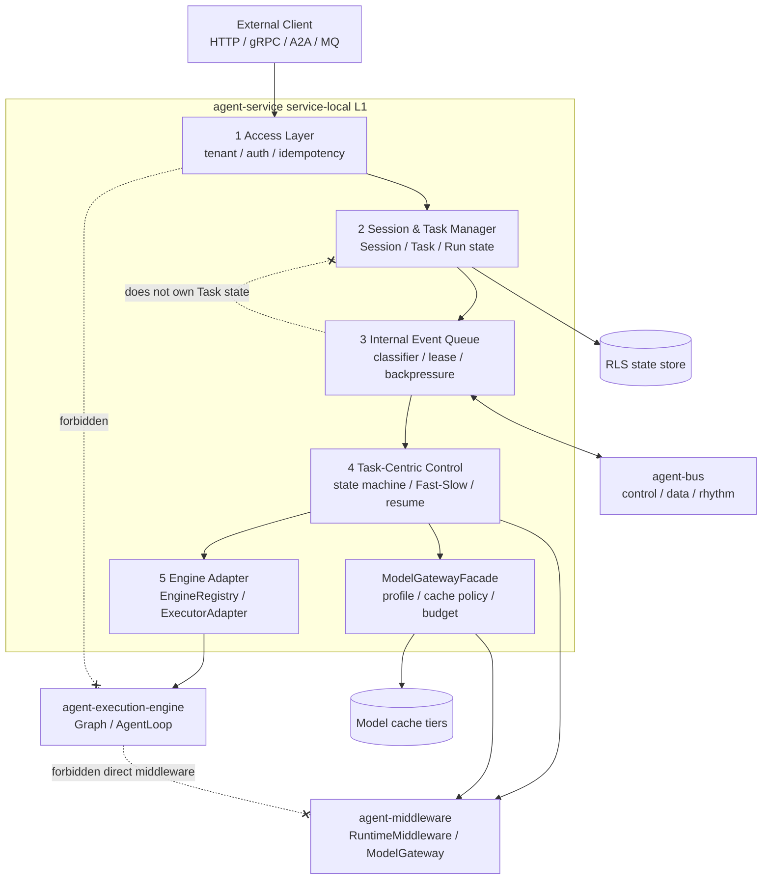
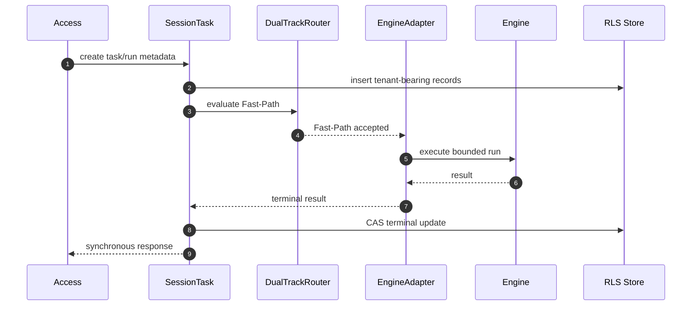
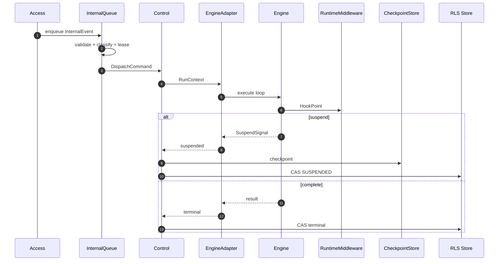
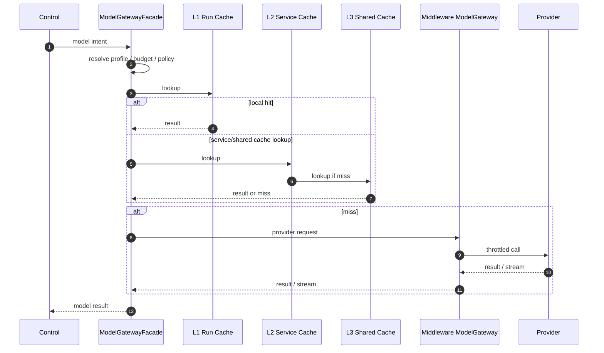
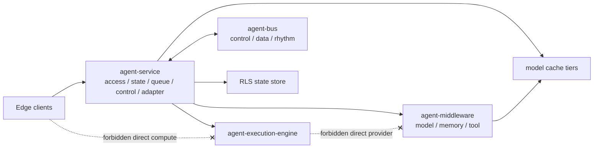
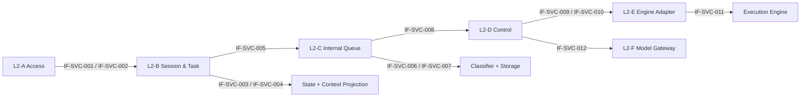
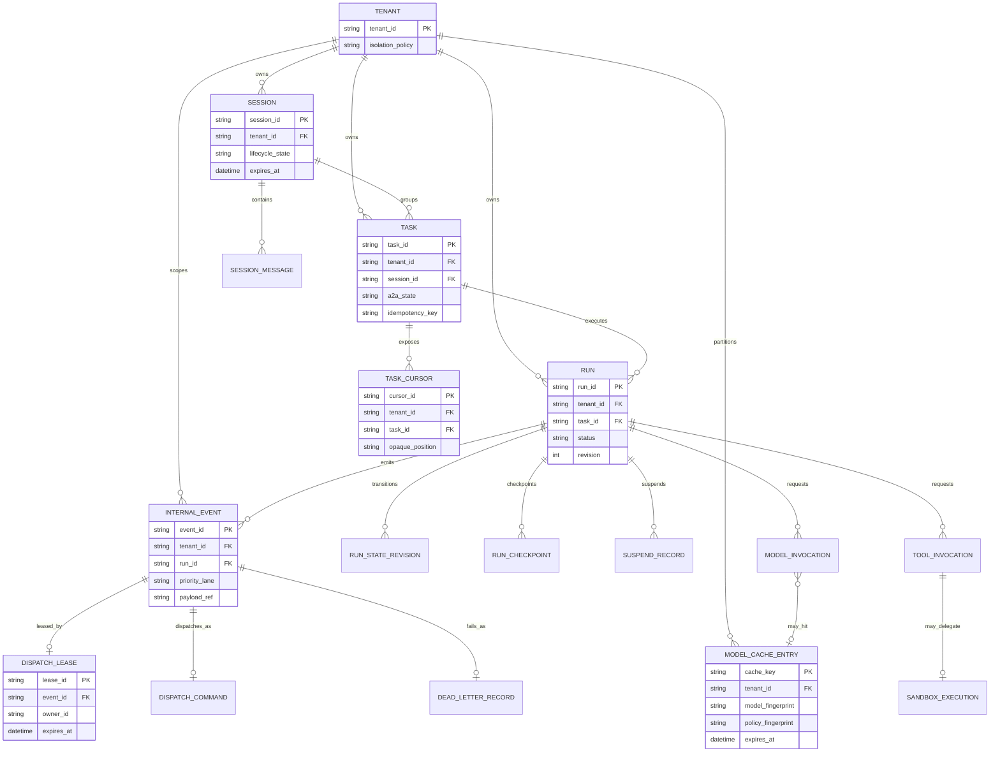

# Agent Service L1：Service-Local 高性能特性与并行交付计划

> 日期：2026-05-26
> 范围：`agent-service` 局部 L1 特点、L2 依赖拆分、接口边界、模块级开发计划，以及本地问题记录机制。
> 来源：已冻结的 canonical L1 4+1 review draft：`docs/logs/reviews/2026-05-26-agent-service-l1-4plus1-rewrite-wave-1.cn.md`。
> 约束：canonical L1 snapshot 已是只读历史记录；本文是新的 review draft，用于交付规划和后续问题记录。

## 1. 背景

PR #72 已经确认 `agent-service` 的 L1 4+1 视图，并接受 ADR-0136..0139。现在架构核心已经稳定，下一步需要把五层模型转成可执行的多人开发计划：

1. 对外接入层。
2. 会话与任务管理层。
3. 内部事件队列。
4. Task-Centric 状态控制层。
5. Engine Adapter 层。

本文不替代 canonical L1 文档。本文刻意限定为 service-local：只从 `agent-service` 局部的时延、并发性能、依赖拆分、接口定义、并行开发和 TDD 验收角度，对 L1 特点做交付化表达。系统级高性能规划见 `2026-05-26-agent-system-l1-performance-and-parallel-delivery-plan.*.md`。

## 2. 根因分析与最强解释

### 2.1 根因

L1 4+1 文档已经锁定五层职责，但工程团队下一步需要一个交付契约：既能并行开发，又不丢失低时延、高并发、租户隔离和状态机正确性。

证据：

- `CLAUDE.md:47` 要求在计划前执行 Root-Cause + Strongest-Interpretation。
- `CLAUDE.md:176` 要求遵守 4+1 架构纪律。
- `CLAUDE.md:183` 要求 L1 文档具备 development mapping、SPI appendix 和 L2 boundary contracts。
- `docs/logs/reviews/2026-05-26-agent-service-l1-4plus1-rewrite-wave-1.en.md:21` 标记 canonical L1 source 为 read-only，并要求后续工作进入新的 review draft。
- `docs/logs/reviews/2026-05-26-agent-service-l1-4plus1-rewrite-wave-1.en.md:1161` 声明 L2 Boundary Contracts 是后续 L2 设计的交接面。

### 2.2 最强解释

最强解释不是“所有层串行实现”，而是：

- 先保住 L1 红线；
- 前置定义接口和测试契约；
- 各模块 owner 在稳定接口背后并行推进；
- 后期按依赖顺序串行集成；
- 所有后续发现的问题都写入本文的 Findings Ledger，而不是只留在聊天记录里。

## 3. 权威来源与红线

| 约束 | 对本文计划的含义 | 权威 |
|---|---|---|
| Run / Task / Session / Memory 分离 | 不合并计算快照、控制状态、上下文和知识状态。 | ADR-0100 + ADR-0136 |
| SuspendSignal canonical | 不改名，不用临时 interrupt primitive 绕过 suspension。 | ADR-0137 |
| 五层 L1 | Access、Session/Task、Queue、Control、Adapter 边界必须清晰。 | ADR-0138 |
| Fast/Slow Path 收窄语义 | Fast-Path 只能减少 checkpoint 开销，不能绕过 tenant metadata、RLS、CAS、reactive I/O 和 SuspendSignal。 | ADR-0139 |
| 三轨 bus | control、data、rhythm 是隔离轴；持久化方式是另一条独立轴。 | Rule R-E + `docs/governance/bus-channels.yaml` |
| Engine 边界 | Engine 做计算；service 拥有治理、middleware 路由、tenant 隔离、状态和模型 provider 中介。 | Rule R-M |

## 4. L1 高性能特点

### 4.1 时延策略

低时延来自热路径上的有限工作：

- Access 只做 tenant binding、idempotency 和请求规范化，不直接驱动 Engine。
- Fast-Path 处理短链路确定性 run，或低 step 数的 agent loop。
- Fast-Path 在 create 和 terminal transition 时仍持久化带 tenant 的 Run / Task metadata，但不强制中间 compute checkpoint。
- service-owned model gateway 提供低时延模型路径，包含 L1 run-local cache、L2 service-local cache、L3 distributed/shared cache。

所以 Fast-Path 是 checkpoint 优化，不是治理绕过。

### 4.2 并发策略

高并发来自隔离和职责边界：

- `control` 承载 cancel、resume、pause、deadline shift 和 S2C request。
- `data` 承载 payload、token chunk、S2C response 和较重的结果流。
- `rhythm` 承载 heartbeat 和 liveness pulse。
- Run 状态变化通过 `RunRepository.updateIfNotTerminal` 做 atomic CAS。
- Queue lease 防止同一个 event 被并发重复处理。
- Backpressure 必须发生在派发到 Task-Centric Control Layer 之前。

### 4.3 恢复策略

恢复能力按路径区分：

- Fast-Path：不强制中间 compute checkpoint，但 terminal state 和 audit metadata 必须持久化。
- Slow-Path：在 suspend、tool、callback、跨部署 resume 边界 checkpoint。
- Resume 在重新进入 Engine Adapter 前，必须重新校验 tenant 和 state。

### 4.4 模型网关策略

模型网关是 `agent-service` 拥有的性能增强。它可以为 executor-engine workload 优化，但不能移动到 `agent-execution-engine`。

```text
Task-Centric Control Layer
  -> ModelGatewayFacade
  -> L1 run-local cache
  -> L2 service-local cache
  -> L3 distributed/shared cache
  -> provider adapter
```

Engine 只发出模型调用意图。Service 负责 provider 选择、cache policy、tenant isolation、provider budget、throttling 和 audit metadata。

## 5. 场景视图

| 场景 | 性能目标 | 必要隔离 | TDD 锚点 |
|---|---|---|---|
| S1 短同步请求 | 有界任务快速返回 | 保留 tenant metadata + CAS | Fast-Path metadata 和 terminal transition 测试 |
| S2 长 ReAct + 工具调用 | 长任务稳定执行 | data load 不得阻塞 control | Slow-Path checkpoint/resume 测试 |
| S3 A2A 协作 | 委派时不阻塞本地控制面 | parent Run suspension 走 control path | A2A envelope + parent/child correlation 测试 |
| S4 S2C callback | 安全挂起并用 client result 恢复 | request 走 control，response 走 data | S2C callback validation 和 timeout 测试 |
| S5 执行中 cancel | cancel latency 有上界 | cancel 必须通过 CAS 决胜 | cancel-vs-complete race 测试 |
| S6 高并发模型调用 | cache hit 和 throttle 下低模型时延 | cache key 携带 tenant/policy/model fingerprint | cache isolation 和 provider throttling 测试 |

## 6. 逻辑视图

```text
External Clients
  -> Access Layer
  -> Session & Task Manager
  -> Internal Event Queue
  -> Task-Centric Control Layer
  -> Engine Adapter Layer
  -> agent-execution-engine

Task-Centric Control Layer
  -> agent-middleware RuntimeMiddleware
  -> service-owned ModelGatewayFacade
  -> agent-bus control/data/rhythm channels
```

### 6.1 Service-Local 组件图



各层职责：

| L1 层 | 性能职责 | 不应拥有 |
|---|---|---|
| Access Layer | 低成本准入、tenant binding、idempotency、ingress normalization | Engine execution、middleware calls |
| Session & Task Manager | 带 tenant 的状态、Task 控制生命周期、Session projection | queue lease、Engine compute |
| Internal Event Queue | priority、backpressure、lease、dispatch safety | Task business state |
| Task-Centric Control Layer | state machine、Fast/Slow 选择、suspend/resume、middleware dispatch | provider-specific model cache storage |
| Engine Adapter Layer | strict Engine matching、context injection、异构适配边界 | tenant policy、DB writes、direct middleware access |

## 7. 进程视图

### 7.1 Fast-Path

```text
Access
  -> Session/Task metadata create
  -> DualTrackRouter accepts Fast-Path
  -> Engine Adapter executes bounded run
  -> terminal Run/Task metadata update
  -> response
```

必要不变量：不强制中间 checkpoint，但 tenant metadata、RLS、reactive execution、CAS transition 和 SuspendSignal 语义仍然强制保留。



### 7.2 Slow-Path

```text
Access
  -> Session/Task metadata create
  -> Queue admission and lease
  -> Control dispatch
  -> Engine Adapter loop
  -> Checkpoint at suspension/tool/callback boundary
  -> Resume through control path
```

必要不变量：每次 resume 都必须重新通过 service-owned state 和 policy check。



### 7.3 模型网关

```text
Control receives model intent
  -> ModelGatewayFacade checks tenant/model/profile budget
  -> cache lookup L1/L2/L3
  -> provider call if miss
  -> audit hit/miss/throttle metadata
  -> return model result or stream event
```

必要不变量：streaming token chunk 是 data-heavy event，不得阻塞 control-priority event。



## 8. 物理视图



| Plane | Components | 性能职责 |
|---|---|---|
| Edge | client SDK、web/app、future A2A clients | 不允许直接绕过 compute-control |
| Compute & Control | `agent-service`、`agent-execution-engine` | Fast/Slow execution、state machine、Engine adapter |
| Bus & State Hub | `agent-bus`、state stores、middleware stores | 三轨隔离、RLS persistence、shared model cache |
| Sandbox | untrusted tool execution | 隔离 CPU、memory、network、filesystem |
| Evolution | offline/online learning exports | 只消费 in-scope events |

物理性能规则：即便 W0 使用 in-process stub，channel isolation 仍然是强制语义。Durability mode 按 channel 选择，不能替代三轨拆分。

## 9. 开发视图

| 模块 owner | 主要 package 或 seam | 可并行工作 |
|---|---|---|
| Access owner | `service.platform.web`，未来 dispatcher/a2a/mq adapters | ingress carrier、idempotency tests、tenant-binding tests |
| Session/Task owner | `service.session`、`service.task`、`service.runtime.runs` | SessionManager、TaskManager、TaskCursor、store contracts |
| Queue owner | future `service.queue` | InternalEvent、classifier、storage SPI、lease、backpressure |
| Control owner | `service.runtime.orchestration`、`service.runtime.resilience`、`service.runtime.s2c` | DualTrackRouter、ResumeDispatcher、state transitions |
| Engine Adapter owner | `service.engine`，consumed engine SPI | EngineRegistry、ExecutorAdapter mapping、context injection |
| Model Gateway owner | service facade over `agent-middleware` ModelGateway | cache policy、provider budget、throttling、audit metadata |
| TDD/Governance owner | tests、gate、contracts、docs | contract tests、architecture tests、performance baselines、Findings Ledger hygiene |

## 10. SPI 与接口附录

### 10.1 已有锚点

| Interface or carrier | 当前角色 |
|---|---|
| `RunRepository` | atomic Run state persistence 和 CAS transition boundary |
| `TaskStateStore` | Task control-state store |
| `ContextProjector` | Session-to-Engine projection boundary |
| `StatelessEngine` | service-side Engine abstraction |
| `ExecutorAdapter` | execution-engine adapter boundary |
| `RuntimeMiddleware` | hook-based middleware dispatch |
| `ModelGateway` | middleware-owned model provider SPI，通过 service facade 消费 |
| `IngressGateway` | edge-to-compute ingress contract |
| `S2cCallbackTransport` | server-to-client callback transport |

### 10.2 建议 L2 接口

| Proposed seam | Owning L2 zone | 目的 |
|---|---|---|
| `SessionManager` | L2-B | create、append、close、expire、query Session |
| `TaskManager` | L2-B | create Task、transition Task state、issue TaskCursor |
| `InternalEvent` | L2-C | 带 tenant、intent、priority、correlation、payload reference 的规范化 event |
| `EventClassifier` | L2-C | 将 intent 映射到 priority 和可选 control/data/rhythm channel |
| `QueueStorage` | L2-C | 将逻辑队列语义绑定到 in-memory 或 external channel storage |
| `BackpressureController` | L2-C | dispatch 前执行 accept、delay、reject、yield、shed |
| `DispatchCommand` | L2-C/L2-D | queue 到 control 的 validated handoff |
| `DualTrackRouter` | L2-D | 按 ADR-0139 predicate 选择 Fast-Path 或 Slow-Path |
| `ResumeDispatcher` | L2-D | tenant/state validation 后恢复 suspended run |
| `ModelGatewayFacade` | L2-F | service-owned gateway，承载 model cache policy 和 provider adapters |
| `ModelCachePolicy` | L2-F | tenant/model/policy/version cache key 与 invalidation contract |

### 10.3 Service 接口定义契约

每个 service-local interface 都必须精确到可以先写 contract test，再进入实现。owner 必须定义：

| 字段 | 必填含义 |
|---|---|
| `interfaceId` | 稳定评审编号，使用 `IF-SVC-NNN` |
| `owner` | 负责该接口的 L2 zone 和 implementation owner |
| `visibility` | public SPI、internal seam 或 persistence boundary |
| `authority` | ADR、CLAUDE rule、schema、governance file 或本文章节 |
| `inputCarrier` | command、query、event、envelope 或 resume payload |
| `outputCarrier` | state record、cursor、event、command、result、stream 或 rejection |
| `errorCarrier` | structured error、conflict、not-found、dead-letter 或 `SuspendSignal` |
| `tenantScope` | tenant binding 和 cross-tenant not-found behavior |
| `stateMutation` | none、append-only、CAS transition、checkpoint 或 lease mutation |
| `idempotency` | key scope 和 duplicate handling |
| `ordering` | run、task、session、event、priority lane，或显式 unordered behavior |
| `backpressure` | accept、delay、reject、yield、shed 或 provider throttle behavior |
| `timeout` | synchronous target、slow-path deadline 或 `pending benchmark` |
| `observability` | 必需 log、metric、trace、audit 或 DFX catalog entry |
| `firstPositiveTest` | 第一条 happy-path contract test |
| `firstNegativeTest` | 第一条 rejection、race、tenant 或 schema test |
| `status` | proposed、pending implementation、measured 或 closed |

### 10.4 Service 接口注册表

| ID | Interface | Owner | Visibility | 必需 carrier 边界 | 错误与背压契约 | 第一组测试 |
|---|---|---|---|---|---|---|
| `IF-SVC-001` | `SessionManager` | L2-B Session | internal seam | command 携带 tenant、sessionId、participant、append payload、close/expire intent、trace | not-found、tenant mismatch、expired session、append conflict 均结构化；非 control read pressure 可 delay | create/load/append/close session；reject cross-tenant load 和 append after close |
| `IF-SVC-002` | `TaskManager` | L2-B Task | internal seam | command 携带 tenant、taskId、runId、A2A state、cursor request、idempotency key、deadline | duplicate command 返回 existing task 或 conflict；illegal state 在 dispatch 前拒绝 | create task and issue cursor；reject duplicate body drift 和 illegal A2A transition |
| `IF-SVC-003` | `TaskStateStore` | L2-B store | persistence boundary | CAS command 携带 tenant、taskId、expected revision、next state、cause | stale revision、terminal mutation、cross-tenant access 折叠为 conflict/not-found | CAS accepted transition；reject cancel-vs-complete race |
| `IF-SVC-004` | `ContextProjector` | L2-B projection | internal seam | projection input 携带 tenant、sessionId、taskId、projection policy、token budget、memory references | missing policy、oversized projection、forbidden field 返回 structured projection error | build bounded injected context；reject policyless projection |
| `IF-SVC-005` | `InternalEvent` | L2-C event | carrier contract | event 包含 tenantId、eventId、intent、priority、correlationId、causationId、traceId、deadline、payloadRef 或 bounded inline payload | inline payload 超 cap 拒绝；missing tenant 拒绝，除非显式 stateless rhythm event | accept valid event；reject oversized inline payload 和 missing tenant |
| `IF-SVC-006` | `EventClassifier` | L2-C event | internal seam | classifier input 是 event intent、source、priority hint、tenant、deadline、payload class | unknown intent 拒绝或进入 configured default；classifier 不阻塞 provider I/O | classify control/data/rhythm；reject unknown mandatory intent |
| `IF-SVC-007` | `QueueStorage` | L2-C queue | persistence or broker boundary | enqueue、lease、ack、dead-letter command 携带 tenant、eventId、lane、lease owner、revision | duplicate lease 拒绝；saturated data lane shed/delay，不能阻塞 control/rhythm | enqueue and lease once；prove control bypass and rhythm survival |
| `IF-SVC-008` | `DispatchCommand` | L2-C/L2-D handoff | carrier contract | command 携带 tenant、runId、taskId、eventId、route decision inputs、lease token、deadline、idempotency context | missing lease token 或 stale task state 在 control execution 前拒绝 | produce command from lease；reject dispatch without lease |
| `IF-SVC-009` | `DualTrackRouter` | L2-D control | internal seam | decision input 携带 task/run/session metadata、event priority、suspendability、budget、checkpoint requirement | 不允许 silent fallback；decision 输出 reason、target path、overrun rule | choose Fast-Path when predicates hold；force Slow-Path on suspendable or over-budget work |
| `IF-SVC-010` | `ResumeDispatcher` | L2-D control | internal seam | resume payload 携带 tenant、runId、taskId、checkpoint/ref、resume token、result/error、state revision | resume 必须重新校验 tenant/state；stale token 或 terminal run 拒绝 | resume valid suspended run；reject stale resume and tenant mismatch |
| `IF-SVC-011` | `EngineRegistry` / `ExecutorAdapter` | L2-E adapter | public SPI | envelope 携带 engine id/version、task spec、injected context、execution config、resume state | 必须 strict adapter match；Engine 不能写 DB 或直接调用 middleware | select matched adapter；reject mismatched engine and missing context |
| `IF-SVC-012` | `ModelGatewayFacade` / `ModelCachePolicy` | L2-F model gateway | internal seam plus provider SPI | invocation 携带 tenant、model、policy、safety、parameter fingerprint、projection hash、budget、stream preference | cache key 缺 isolation field 则拒绝；provider throttle 发 event/metric，且不能饿死 control | L1/L2/L3 hit/miss；reject unsafe cache key and emit throttle signal |

### 10.5 Service 接口依赖图



### 10.6 Service 实体关系视图

这个 ER 视图补充上面的 class/interface-style dependency diagram。它定义 service-local interfaces 必须保护的数据实体边界。它不是最终 physical schema。W0 in-memory store、RLS database 或 broker-backed queue 都可以用不同方式承载这些实体，但 entity boundary、tenant scope 和 cardinality 必须稳定到足以编写 contract tests 与 state tests。



Service ER 规则：

- `Session` 组织用户或协作上下文；`Task` 拥有对外可见工作状态；`Run` 拥有一次执行尝试和 CAS revision。
- `TaskCursor` 是 opaque 且 tenant scoped 的；consumer 不能从中推断 storage offset。
- `InternalEvent`、`DispatchLease`、`DispatchCommand`、`DeadLetterRecord` 是 queue entities，不是 task business-state entities。
- `RunCheckpoint` 和 `SuspendRecord` 是 Slow-Path resume entities；Fast-Path 可以避免中间 checkpoint，但不能跳过 tenant metadata。
- `ModelCacheEntry` 通过 model gateway facade 由 service 治理，不能落入 Engine ownership。
- 任何 physical schema 如果折叠这些实体，都必须保留逻辑测试：tenant isolation、CAS、lease uniqueness、dead-letter audit 和 cache-key isolation。

## 11. L2 Boundary Contracts

| Zone | Inputs | Outputs | DFX expectations |
|---|---|---|---|
| L2-A Access | 带 tenant 和 idempotency context 的 HTTP/gRPC/A2A/MQ request | normalized ingress command 或 error envelope | admission latency 有界；不直接驱动 Engine |
| L2-B Session & Task | tenant-scoped session/task/run commands | Session、Task、TaskCursor、state records | RLS 和 CAS-compatible stores；Task lifetime 可超过 Session |
| L2-C Queue | 带 intent 和 priority 的 InternalEvent | leased DispatchCommand 或 rejection | control 绕过 data backlog；rhythm 在 saturation 下存活 |
| L2-D Control | DispatchCommand、RunContext、Resume payload | Run/Task transition、middleware result、SuspendSignal handling | 无非法状态转换；无 Thread.sleep；只走 reactive path |
| L2-E Engine Adapter | EngineEnvelope、InjectedContext、ExecutorDefinition | Result、stream 或 SuspendSignal | strict engine matching；不直连 middleware 或 DB |
| L2-F Model Gateway | model invocation intent、cache policy、provider budget | model result、stream chunks、cache audit | tenant-safe cache keys；发出 throttle 和 cache metrics |

## 12. 并行交付计划

### 12.1 Phase A：并行 Contract Work

所有 owner 并行推进：

- 定义最小 carrier 和 interface；
- 先写 contract tests，再写实现；
- 对发现的 drift 或缺失 authority 增加 Findings Ledger 记录；
- 在接口稳定前避免跨模块实现耦合。

退出标准：

- 每个模块都有 contract tests；
- 每个建议 public seam 都有 owner；
- Findings Ledger 中没有缺少 recommended action 的 blocker。

### 12.2 Phase B：半串行集成

集成顺序：

1. Access 接入 Queue Producer。
2. Session/Task store 接入 Control state machine。
3. Queue Consumer 接入 Control DispatchCommand。
4. Control 接入 Engine Adapter。
5. Control/Middleware 接入 ModelGatewayFacade。

退出标准：

- S1/S2 跑通本地 reference implementations；
- queue priority tests 证明 control 和 rhythm isolation；
- model gateway cache tests 证明 tenant-safe keying。

### 12.3 Phase C：串行场景加固

端到端跑 canonical scenarios S1..S6：

- S1 short synchronous Fast-Path。
- S2 long ReAct with tool calls。
- S3 A2A collaboration。
- S4 S2C callback。
- S5 cancel during execution。
- S6 high-concurrency model gateway path。

退出标准：

- 所有 TDD acceptance rows 通过；
- 未解决 Findings Ledger rows 标记为 `open` 或 `deferred`，并写明 owner 和 next action；
- architecture gate 和 quality profile 可进入正式执行。

## 13. Wave Roadmap：8 个 Wave 逐步刷新

目标不是一次性大改，而是按 Wave 刷新 L1 性能与交付计划，让各模块 owner 前期并行，后期按依赖顺序集成。

| Wave | 主题 | 主要产物 | 并行度 | 串行依赖 |
|---|---|---|---|---|
| 1 | Baseline and risk ledger | 红线清单、Findings Ledger、权威来源地图 | 高 | 无 |
| 2 | Scenario and SLO refresh | S1..S6 场景契约，附时延/并发目标 | 高 | Wave 1 authority map |
| 3 | Logical dependency split | 模块依赖图、owner map、forbidden edges | 高 | Wave 2 scenario contracts |
| 4 | Interface and carrier contracts | L2 interfaces、carrier fields、schema authority table | 高 | Wave 3 dependency graph |
| 5 | Process and backpressure design | Fast/Slow decision tree、queue lifecycle、model gateway flow | 中 | Wave 4 carriers |
| 6 | Physical and storage design | 三轨 bus binding、RLS/storage plan、model cache placement | 中 | Wave 5 process flow |
| 7 | TDD and performance harness | contract/state/queue/model/perf test matrix 和 baseline commands | 中 | Waves 2..6 contracts |
| 8 | Integration closure | owner handoff、open/deferred findings、implementation wave gate | 低 | 前面所有 Wave |

每个 Wave 都必须追加一个 G-A..G-F 形态的 closure block：

- **G-A Direct fix**：关闭本 Wave 引用的问题或缺失章节。
- **G-B Continuous classification**：新增问题必须登记到本文 Findings Ledger。
- **G-C Continuous sibling sweep**：对本 Wave 触及的概念，在 active local design surface 中做同类扫描。
- **G-D Continuous fix**：范围内 siblings 直接修复；范围外 siblings 标记 deferred，并写 owner。
- **G-E Non-vacuity guard**：如果结果为空，必须写 explicit negative-confirmation。
- **G-F Documentation**：本 Wave 的输出、证据和残余风险都写到本地文档。

## 14. Wave-by-Wave Refresh Plan

### 14.1 Wave 1：Baseline and Risk Ledger

目标：

- 在任何模块 owner 开始实现设计前，先确认不可违反的 L1 红线。
- 确认已冻结的 canonical L1 文档仍是权威来源。
- 建立后续所有问题必须使用的本地问题账本。

输入：

- `CLAUDE.md` Rule D-1、G-1、G-1.1、R-C.2、R-J、R-M。
- `docs/logs/reviews/2026-05-26-agent-service-l1-4plus1-rewrite-wave-1.cn.md`。
- ADR-0136..0139。
- `docs/governance/bus-channels.yaml`。

交付物：

- L1 红线 authority table。
- 初始 Findings Ledger rows。
- L1、L2、ADR、bus、SPI、test surfaces 的 source-of-truth map。

验证：

```text
wsl bash -lc "rg -n 'Historical-artifact freeze marker|## 20. L2 Boundary Contracts' docs/logs/reviews/2026-05-26-agent-service-l1-4plus1-rewrite-wave-1.en.md"
wsl bash -lc "rg -n 'Rule D-1|Rule G-1|Rule G-1.1|Rule R-C.2|Rule R-J|Rule R-M' CLAUDE.md"
wsl bash -lc "rg -n 'control|data|rhythm' docs/governance/bus-channels.yaml"
```

退出标准：

- 本文每条红线都有 authority citation。
- 每个发现的问题都有 Findings Ledger 记录，或者有 explicit negative confirmation。
- 不直接修改冻结的 canonical L1 snapshot。

Closure 模板：

```text
# Wave 1 Closure (G-A..G-F)
- G-A direct fix: baseline authority map and initial Findings Ledger added.
- G-B classification: all discovered issues mapped to Findings Ledger rows.
- G-C sibling sweep: checked L1 snapshot, L2 proposal, ADR-0136..0139, bus manifest.
- G-D continuous fix: in-scope documentation drift fixed in this review draft; out-of-scope rows marked open/deferred.
- G-E non-vacuity: negative confirmation if no additional findings.
- G-F documentation: closure block appended.
```

### 14.2 Wave 2：Scenario and SLO Refresh

目标：

- 将场景视图从 S1..S5 扩展为 S1..S6，新增高并发模型网关场景。
- 给每个场景挂上可验证的时延/并发目标。

场景契约：

| Scenario | Trigger | Fast/Slow path | Primary SLO | Failure proof |
|---|---|---|---|---|
| S1 short intake | REST/gRPC create run | Fast-Path eligible | bounded entry latency and terminal metadata write | idempotency and tenant rejection |
| S2 long ReAct | multi-step tool loop | Slow-Path | stable checkpoint/resume under tool latency | tool timeout and checkpoint replay |
| S3 A2A collaboration | peer delegation | Slow-Path suspension | parent control flow remains responsive | peer failure maps to controlled failure |
| S4 S2C callback | client capability needed | Slow-Path suspension | request emits on control, response on data | timeout and invalid response handling |
| S5 cancel race | cancel while active | control-priority | cancel latency not blocked by data backlog | CAS winner/loser behavior |
| S6 model gateway | high-volume model calls | Fast-Path cache or Slow-Path provider call | cache hit latency and provider throttle behavior | tenant/policy/model cache isolation |

交付物：

- 包含 actor、path、contracts touched、DFX target、failure modes 的场景表。
- SLO vocabulary table：entry latency、dispatch latency、cache hit latency、resume latency、cancel latency、heartbeat survival。
- 与未来测试名关联的 TDD scenario list。

验证：

```text
wsl bash -lc "rg -n 'S1|S2|S3|S4|S5|S6|Fast-Path|Slow-Path|model gateway' docs/logs/reviews/2026-05-26-agent-service-l1-service-local-performance-and-parallel-delivery-plan.cn.md"
wsl bash -lc "rg -n 'Fast-Path eligible|S2C|Cancel During Execution' docs/logs/reviews/2026-05-26-agent-service-l1-4plus1-rewrite-wave-1.en.md"
```

退出标准：

- 每个场景都指定一个 primary owner 和至少一个 TDD anchor。
- S6 不暗示 Engine 拥有模型 provider state。
- 所有时延描述必须是 target 或 required benchmark；除非已有证据，否则不能写成 shipped fact。

### 14.3 Wave 3：Logical Dependency Split

目标：

- 将五层 L1 转成实现者可遵循的依赖图，避免引入 forbidden direct calls。
- 分离 performance-critical dependency 和 governance dependency。

允许的依赖图：

```text
Access
  -> SessionTask
  -> Queue
  -> Control
  -> EngineAdapter
  -> Engine

Control
  -> RuntimeMiddleware
  -> ModelGatewayFacade
  -> S2cCallbackTransport
  -> RunRepository

Queue
  -> Bus channel binding
  -> DispatchCommand
```

禁止依赖：

```text
Access -> Engine direct drive
Access -> Middleware direct call
Queue -> Task business-state ownership
Engine -> Middleware direct call
Engine -> DB write
Engine -> Model provider connection/cache ownership
Fast-Path -> tenant/RLS/CAS bypass
```

交付物：

- Dependency graph。
- Owner matrix。
- 带 authority 的 forbidden-edge table。
- 对现有文档或代码中暗示 forbidden edge 的内容做 Findings Ledger sweep。

验证：

```text
wsl bash -lc "rg -n 'Direct connection forbidden|Direct Middleware call FORBIDDEN|EngineRegistry.resolve|RuntimeMiddleware' docs/logs/reviews/2026-05-26-agent-service-l1-4plus1-rewrite-wave-1.en.md"
wsl bash -lc "rg -n 'ModelGateway|RuntimeMiddleware|EngineRegistry|RunRepository|TaskStateStore|ContextProjector' agent-service agent-middleware agent-execution-engine agent-bus"
```

退出标准：

- 每个模块 owner 都知道上游和下游依赖。
- 每条 forbidden edge 都有 test 或 future gate candidate。
- Findings Ledger 记录所有尚未消除的歧义。

### 14.4 Wave 4：Interface and Carrier Contracts

目标：

- 在实现前定义最小 L2 interfaces 和 carriers。
- 在最终 storage 或 broker 选择前，也能先开展 TDD。

接口分组：

| Group | Interfaces / carriers | First tests |
|---|---|---|
| Admission | ingress command、idempotency context、tenant context | duplicate key、tenant mismatch、body drift |
| State | `SessionManager`、`TaskManager`、`TaskCursor`、store commands | session lifecycle、task transition、cursor opacity |
| Queue | `InternalEvent`、`EventClassifier`、`QueueStorage`、`DispatchLease`、`DeadLetterRecord` | classification、lease duplication、DLQ audit |
| Control | `DispatchCommand`、`DualTrackRouter`、`ResumeDispatcher` | fast/slow predicate、resume validation |
| Adapter | `EngineRegistry`、`ExecutorAdapter`、injected context | engine mismatch、strict adapter selection |
| Model | `ModelGatewayFacade`、`ModelCachePolicy`、model budget、cache key | cache key isolation、throttle handling |

Carrier 字段规则：

- 每个 stateful carrier 都包含 `tenantId`；
- event carrier 包含 `intent`、`priority`、`correlationId`、`causationId`、`traceId`；
- data-heavy carrier 超过 inline cap 后使用 `payloadRef`；
- model cache key 包含 tenant、model、policy、prompt/projection、safety、parameter fingerprints；
- public fixed vocabulary 必须引用 schema 或 ADR authority。

验证：

```text
wsl bash -lc "rg -n 'public interface' agent-service/src/main/java agent-middleware/src/main/java agent-bus/src/main/java agent-execution-engine/src/main/java"
wsl bash -lc "rg -n 'spi_packages|contract-catalog|dfx' agent-service/module-metadata.yaml docs/contracts/contract-catalog.md docs/dfx/agent-service.yaml"
```

退出标准：

- 每个 proposed interface 都有明确 owner 和 authority。
- 没有任何 interface 让 Engine 拥有 service governance。
- 每个 carrier 都有计划中的 contract test。

### 14.5 Wave 5：Process and Backpressure Design

目标：

- 把 runtime 行为写到可以实现的粒度：event lifecycle、Fast/Slow decision tree、resume、backpressure、model gateway flow。

需要写清楚的 process diagrams：

1. Fast-Path synchronous intake。
2. Slow-Path checkpoint/resume。
3. Queue receive -> validate -> enqueue -> lease -> dispatch -> ack/dead-letter。
4. Cancel-vs-complete CAS race。
5. S2C request/response split over control/data。
6. Model gateway cache hit/miss/throttle。

Backpressure decisions：

```text
ACCEPT
DELAY
REJECT
YIELD
SHED_LOW_PRIORITY
THROTTLE_PROVIDER
```

优先级规则：

- control events 可以绕过 data backlog；
- rhythm 必须与 data saturation 隔离；
- provider throttling 不能耗尽 control workers；
- 由 policy/model version 变化触发的 cache invalidation 是 control-priority；
- stream chunks 仍然是 data-heavy。

验证：

```text
wsl bash -lc "rg -n 'Fast-Path|Slow-Path|RunRepository.updateIfNotTerminal|S2cCallbackEnvelope|control|data|rhythm' docs/logs/reviews/2026-05-26-agent-service-l1-4plus1-rewrite-wave-1.en.md docs/adr/0139-fast-slow-path-narrowed-semantics.yaml docs/governance/bus-channels.yaml"
```

退出标准：

- 每个 process 都有 success path 和至少一个 failure path。
- 每个 backpressure decision 都有 downstream behavior。
- Fast-Path language 保留 ADR-0139 的所有不变量。

### 14.6 Wave 6：Physical, Storage, and Cache Placement

目标：

- 按部署模式决定 state、queue、cache 放在哪里，但不改变 ownership semantics。

放置矩阵：

| Concern | W0 local | Platform-centric | Business-centric / onsite |
|---|---|---|---|
| Run state | current repository/store | RLS-enabled DB | local or colocated RLS-compatible store |
| Task state | in-memory first, persistent later | RLS-enabled tasks table | local persistent store optional |
| Session state | in-memory first, persistent later | RLS-enabled sessions table | compact local store with tenant metadata |
| Queue control | in-memory priority queue | dedicated broker channel/topic | local high-priority channel |
| Queue data | in-memory data stream | durable data stream/object refs | local bounded stream |
| Queue rhythm | scheduler tick | tick service / lightweight channel | colocated tick |
| Model cache L1 | run-local | run-local | run-local |
| Model cache L2 | service-local | replica-local | colocated service-local |
| Model cache L3 | absent or stub | shared distributed cache | optional business-owned shared cache |

物理红线：

- RLS 适用于 persistent tenant-bearing tables。
- Queue channel isolation 必须跨部署模式保留。
- Model cache key 不得包含 secrets 或 full prompt text。
- Engine 保持 compute-only。

验证：

```text
wsl bash -lc "rg -n 'tenant_id|ENABLE ROW LEVEL SECURITY|RunRepository|TaskStateStore|Session' agent-service/src/main/resources agent-service/src/main/java docs/logs/reviews/2026-05-26-agent-service-l1-4plus1-rewrite-wave-1.en.md"
wsl bash -lc "rg -n 'payload_size_cap_bytes|control|data|rhythm' docs/governance/bus-channels.yaml"
```

退出标准：

- 每个 storage/cache plane 都有 owner 和 invalidation path。
- 每个 persistent tenant-bearing store 都有 RLS plan。
- 部署模式变化不会改变 L1 ownership model。

### 14.7 Wave 7：TDD and Performance Harness

目标：

- 将设计主张转成可执行测试和性能 baseline。

测试套件：

| Suite | Purpose | Minimum acceptance |
|---|---|---|
| Contract tests | validate carrier shape and schema constraints | every public carrier has positive and negative cases |
| State tests | protect Run/Task state machines | illegal transitions rejected; CAS race deterministic |
| Queue tests | prove isolation and backpressure | control bypass and rhythm survival under data load |
| Model tests | prove cache and provider controls | tenant-safe cache key; throttle event emitted |
| Scenario tests | prove S1..S6 flows | each scenario has one end-to-end happy path and one failure path |
| Architecture tests | protect forbidden dependencies | Engine cannot import service governance or middleware provider paths |
| Performance tests | capture latency/concurrency baseline | baseline recorded even if thresholds remain provisional |

建议验证命令：

```text
wsl bash -lc "bash gate/check_architecture_sync.sh"
wsl bash -lc "python gate/build_architecture_graph.py --check --no-write"
wsl bash -lc "./mvnw -Pquality verify"
wsl bash -lc "git diff --check"
```

如果环境无法运行某个命令，必须把精确 blocker 写进 Findings Ledger，不能声称通过。

退出标准：

- Test matrix 写清 owner、package、expected command、first implementation target。
- Performance baseline 明确是 measured 或 pending，不能暗示已经达成。
- 每个 blocked command 或 missing test seam 都有 Findings Ledger row。

### 14.8 Wave 8：Integration Closure and Handoff

目标：

- 将 planning review draft 转成 implementation-ready handoff material。
- 确保所有 open risks 都已 closed、assigned 或 explicitly deferred。

Closure outputs：

- final owner matrix；
- implementation PRs 的 dependency order；
- Findings Ledger status sweep；
- L2 proposals link map；
- verification summary；
- 按 module 分组的 implementation backlog。

Implementation PR order：

1. Interface/carrier contracts and tests。
2. Queue scaffold and tests。
3. Session/Task manager persistence and cursor tests。
4. Control router/resume tests。
5. Engine adapter integration tests。
6. Model gateway cache/throttle tests。
7. S1..S6 scenario tests。
8. gate/architecture documentation synchronization。

验证：

```text
wsl bash -lc "rg -n 'Status \\| open|Status \\| deferred|L1-PERF-' docs/logs/reviews/2026-05-26-agent-service-l1-service-local-performance-and-parallel-delivery-plan.cn.md"
wsl bash -lc "git status --short"
wsl bash -lc "git diff --check"
```

退出标准：

- 没有 blocker row 缺少 owner 或 recommended action；
- deferred rows 引用 future wave 或 module owner；
- 下一个 implementation agent 不需要再做架构决策即可开工。

## 15. 功能拆解与依赖 Backlog

### 15.1 Feature Split

| Feature | Primary owner | Depends on | Can start in parallel? | First TDD proof |
|---|---|---|---|---|
| Unified intake | Access | tenant/idempotency contracts | yes | duplicate idempotency request folds/rejects deterministically |
| A2A collaboration | Access + Control | ingress envelope, S2C semantics | yes, after carrier draft | parent run suspends and child correlation is recorded |
| Session lifecycle | Session/Task | Session carrier and store contract | yes | session create/append/expire preserves tenant |
| Task lifecycle | Session/Task | Task carrier and TaskStateStore | yes | Task state transition and cursor generation |
| Run state writes | Session/Task + Control | RunRepository CAS | yes | cancel-vs-complete deterministic race |
| Event production | Queue | InternalEvent | yes | intent maps to channel/priority |
| Queue storage | Queue | QueueStorage SPI | yes | lease prevents duplicate processing |
| Event consumption | Queue + Control | DispatchCommand | after event production | leased event dispatches once |
| Fast-Path routing | Control | DualTrackRouter | yes | eligible request avoids intermediate checkpoint |
| Slow-Path routing | Control | Checkpointer and ResumeDispatcher | after state contract | suspended run resumes through state validation |
| Engine adapter | Engine Adapter | EngineEnvelope and registry | yes | mismatched engine fails with controlled reason |
| Context translation | Engine Adapter + Session | ContextProjector | yes | full session does not leak directly to Engine |
| Shadow tool path | Engine Adapter + Middleware | HookPoint and RuntimeMiddleware | after adapter contract | tool call routes through middleware |
| Model gateway | Model Gateway + Control | ModelGatewayFacade and cache policy | yes | tenant-safe cache hit/miss behavior |
| Governance | TDD/Governance | all seams | continuous | gate/test matrix detects drift |

### 15.2 Dependency Order

```text
Contract carriers
  -> module-local unit tests
  -> queue classification
  -> state manager contracts
  -> control dispatch
  -> engine adapter
  -> model gateway
  -> scenario tests
  -> performance baselines
  -> architecture gate closure
```

集成前可并行：

- Access carriers and idempotency tests。
- Session/Task carriers and store tests。
- Queue event/classifier/lease tests。
- Control Fast/Slow predicate tests。
- Engine adapter registry tests。
- Model cache key and policy tests。

集成后需串行：

- Queue Consumer to Control DispatchCommand。
- Control to Engine Adapter。
- Control to ModelGatewayFacade。
- S2C/A2A resume through persisted state。
- End-to-end scenario tests。

### 15.3 Interface Readiness Checklist

每个 proposed interface 在实现前必须回答：

| Question | Required answer |
|---|---|
| Who owns the interface? | one L2 owner |
| What is the interface ID? | stable `IF-SVC-*` row |
| Is it public SPI or internal seam? | explicit status |
| What is the authority? | ADR, Rule, schema, or review section |
| What are the input/output carriers? | named carrier fields or explicit pending field row |
| What is the error carrier? | structured error、conflict、not-found、dead-letter 或 `SuspendSignal` |
| What is the first negative test? | named failure case |
| Does it carry tenant? | yes, or reason why stateless |
| Does it introduce a fixed vocabulary? | schema/ADR citation |
| What is the backpressure behavior? | accept、delay、reject、yield、shed 或 throttle |
| What is the observability surface? | metric、log、trace、audit 或 DFX entry |
| Can it block? | no blocking path unless explicitly outside runtime hot path |
| What records findings? | Findings Ledger row if ambiguous |

## 16. Verification Matrix

| Wave | Verification evidence | Required result |
|---|---|---|
| 1 | authority grep + Findings Ledger rows | all red lines cited |
| 2 | scenario grep + SLO table | S1..S6 present with TDD anchors |
| 3 | dependency graph + forbidden-edge table | no unowned dependency |
| 4 | interface table + carrier rules | every proposed seam has owner/test |
| 5 | process diagrams + backpressure decisions | success/failure path per process |
| 6 | physical placement matrix | no deployment mode changes ownership |
| 7 | test matrix + commands | each claim has test or pending row |
| 8 | closure summary + open/deferred sweep | no blocker lacks action |

文档刷新最低本地验证：

```text
wsl bash -lc "git diff --check"
wsl bash -lc "rg -n 'Wave 1|Wave 2|Wave 3|Wave 4|Wave 5|Wave 6|Wave 7|Wave 8' docs/logs/reviews/2026-05-26-agent-service-l1-service-local-performance-and-parallel-delivery-plan.cn.md"
wsl bash -lc "rg -n 'Findings Ledger|L1-PERF-' docs/logs/reviews/2026-05-26-agent-service-l1-service-local-performance-and-parallel-delivery-plan.cn.md"
```

实现 closure 前完整验证：

```text
wsl bash -lc "bash gate/check_architecture_sync.sh"
wsl bash -lc "python gate/build_architecture_graph.py --check --no-write"
wsl bash -lc "./mvnw -Pquality verify"
```

## 17. TDD 验收矩阵

| Test group | Required tests |
|---|---|
| Contract | envelope、event、DispatchCommand、TaskCursor、model cache key schema |
| SPI parity | metadata、contract catalog、DFX、Java interface parity |
| State | RunStatus CAS、Task.A2aState、cancel-vs-complete race、cross-tenant not-found |
| Queue | control bypasses data backlog、rhythm survives saturation、data inline cap、lease duplicate prevention、dead-letter audit |
| Fast/Slow Path | Fast-Path persists metadata without intermediate checkpoint、overrun/suspension enters Slow-Path、Slow-Path checkpoint/resume validates tenant |
| Model Gateway | L1/L2/L3 cache hit/miss、tenant/policy/model fingerprint isolation、provider throttle event and metric |
| End-to-end | S1..S6 scenario flows |

## 18. Findings Ledger

后续所有与本文交付计划相关的架构、代码或测试问题，都必须记录在这里，或者记录到后续 review draft 中。问题不能只留在聊天记录里。

| ID | Severity | Module | Evidence | Conflict / Drift | Impact | Recommended Action | Status |
|---|---|---|---|---|---|---|---|
| L1-PERF-001 | info | docs | `docs/logs/reviews/2026-05-26-agent-service-l1-4plus1-rewrite-wave-1.en.md:21` | Canonical L1 snapshot 已 read-only；交付计划需要新的 follow-up artifact。 | 直接修改冻结 L1 source 会违背 logs-folder policy 意图。 | 使用本文作为可变 planning record。 | recorded |
| L1-PERF-002 | warn | queue | `docs/logs/reviews/2026-05-26-agent-service-l1-4plus1-rewrite-wave-1.en.md:1092` | `service.queue/` 仍是 planned package，不是已实现 filesystem subtree。 | Queue owner 不能假定包结构已经 shipped。 | 先做 interface/carrier 和 tests，再在单独 implementation wave 增加 scaffold。 | open |
| L1-PERF-003 | warn | model-gateway | `docs/logs/reviews/2026-05-26-agent-service-session-task-and-event-queue-l2-proposal.en.md` | model gateway performance path 已在 L2 中提出，但还未进入 canonical L1 boundary contract table。 | 实现者可能对 gateway 属于 service 还是 engine 产生分歧。 | 本计划默认 service ownership；如果团队要 canonical promotion，再提出 ADR/L1 update。 | open |
| L1-PERF-004 | warn | planning | 本文第一版在 Wave Roadmap 扩展前 | 第一版过于摘要化，没有明确 L1 应如何分 Wave 刷新，也没有说明每个 Wave 如何验证。 | 后续工程师仍需要自行做架构计划决策，无法直接执行。 | 增加 Wave 1..8 roadmap、每波交付物、验证命令和退出标准。 | closed |
| L1-PERF-005 | warn | docs | 本文在 Mermaid 扩展前 | service-local performance plan 只有文字 flow，缺少可视化图。 | reviewer 需要在脑中重建层次和进程关系。 | 增加 Mermaid component、sequence 和 physical diagrams。 | closed |
| L1-PERF-006 | warn | verification | 本文在 WSL command normalization 前 | 验证示例混用了 generic shell command 和旧文件路径，没有统一 WSL-first。 | Windows 开发者可能在错误命令面或旧文件名上验证。 | 将验证示例改为 `wsl bash -lc`，并更新重命名后的文件路径。 | closed |
| L1-PERF-007 | warn | reviewability | Mermaid/WSL pass 后的人工评审 | service-local plan 没有明确说明 AI reader 和 human reviewer 应如何解释 normative claims、targets、diagrams 和 evidence。 | 读者可能把 planning target 过度推断为 shipped behavior，或把 diagram 看得比 table 更权威。 | 增加 AI-neutral and human-reviewable interpretation contract。 | closed |
| L1-PERF-008 | warn | interfaces | 人工评审要求更强调 interface definition | service-local plan 只列 proposed seams，但没有充分定义 interface fields、carrier constraints、errors、backpressure behavior 和 first tests。 | L2 owner 可能在接口名一致的情况下实现出不兼容的 seam。 | 增加 `IF-SVC-001..012`、service interface definition contract、interface registry 和 dependency diagram。 | closed |
| L1-PERF-009 | warn | entities | 人工评审要求在 class-style diagrams 中补充 ER relationships | service-local interface diagram 没有展示 interfaces 需要保护的数据实体与 cardinalities。 | 实现者可能为了性能合并 queue、task、run、cache entities，或丢失 tenant/CAS/lease invariants。 | 增加 service ER view，并写明 Session、Task、Run、Queue、Checkpoint、ModelCache entities 的 ER 规则。 | closed |

后续追加模板：

```text
| L1-PERF-00N | severity | module | file:line or symbol | conflict/drift | impact | action | open/deferred/closed |
```

## 19. AI-Neutral and Human-Reviewable Interpretation Contract

本节是文档契约的一部分，用于让 LLM agent 和人类 reviewer 以同一套规则理解 service-local plan。

### 19.1 术语解释规则

| Term | Meaning | Review rule |
|---|---|---|
| `must` / `MUST` | 已由 rule、ADR、schema 或 boundary contract 支撑的不可违反不变量。 | 如果附近没有 authority citation，应拒绝。 |
| `target` | 面向后续实现的 benchmark 或 SLO 目标。 | 不得读成 measured 或 shipped。 |
| `measured` | 由具体 command 或 test 捕获的 benchmark value。 | 接受前必须引用 evidence。 |
| `pending` | 已知 implementation 或 benchmark gap。 | 必须有 owner 或 Findings Ledger entry。 |
| `owner` | 角色 owner，不是具体个人。 | 人员分配可以后置。 |
| `forbidden` | 违反边界的调用边或行为。 | 后续应转成 test、gate、allowlist rule 或 finding。 |

### 19.2 Diagram 与 Table 优先级

- Mermaid diagrams 是拓扑和流程评审辅助。
- Tables 承载更精确的 owner、contract、test 和 status 语义。
- 如果 diagram 和 table 冲突，以 table 作为 review authority，并新增 Findings Ledger row。
- 如果本文和 canonical L1 snapshot 冲突，canonical L1 snapshot 优先，除非后续 ADR 修改它。
- 如果本文和 shipped code 冲突，记录 drift，不得静默重新解释任一方。

### 19.3 Bias and Overclaim Controls

- 本计划不得通过把无界 latency、state 或 risk 推给 Engine、Bus、Middleware 或 provider layers 来优化 `agent-service`。
- 性能词默认是目标，除非绑定 measured evidence。
- Fast-Path language 不得暗示绕过 tenant metadata、RLS、CAS、reactive I/O 或 SuspendSignal。
- Model gateway language 不得暗示 Engine 拥有 provider connections 或 cache invalidation。
- Role owners 不得被解读成具体个人或组织责任分配。

### 19.4 Human Review Checklist

Reviewer 应按顺序检查：

1. 每个 service-local layer 是否都有 diagram、table 和 test anchor？
2. 每个 target 是否有 test 或 benchmark plan？
3. 每条 forbidden edge 是否有 future enforcement path？
4. 每个 open finding 是否包含 evidence、impact、recommended action？
5. 所有 verification commands 是否 WSL-first？

### 19.5 AI Agent Checklist

AI agent 阅读本文时必须：

1. 保留 shipped facts、targets、pending baselines 的区别。
2. 抽取任务时优先使用 tables，而不是 prose summaries。
3. 将 `open` 状态的 Findings Ledger row 视为 unresolved。
4. 避免生成违反 forbidden edges 的实现步骤。
5. 遇到新歧义时写入 Findings Ledger，不要静默替用户决策。
6. 从 `IF-SVC-*` rows 开始做 service implementation planning；不得自行补脑缺失的 carrier、error 或 backpressure fields。

## 20. 假设与默认值

- 不编辑 canonical L1 snapshot。
- 本文和英文镜像作为本地 planning 与 findings record。
- Owner 指角色 owner，不指具体个人姓名。
- 本步骤只改文档；不改 Java code、schema、package 或 generated governance files。
- 三轨 channel 权威来自 Rule R-E、`docs/governance/bus-channels.yaml` 和 ADR-0138。
- `docs/adr/0031-three-track-channel-isolation.md` 不作为 locked authority。
