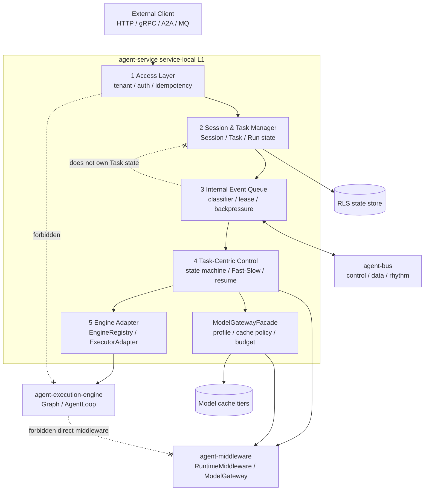
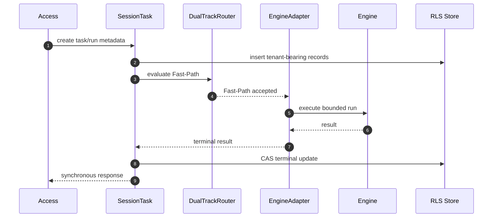
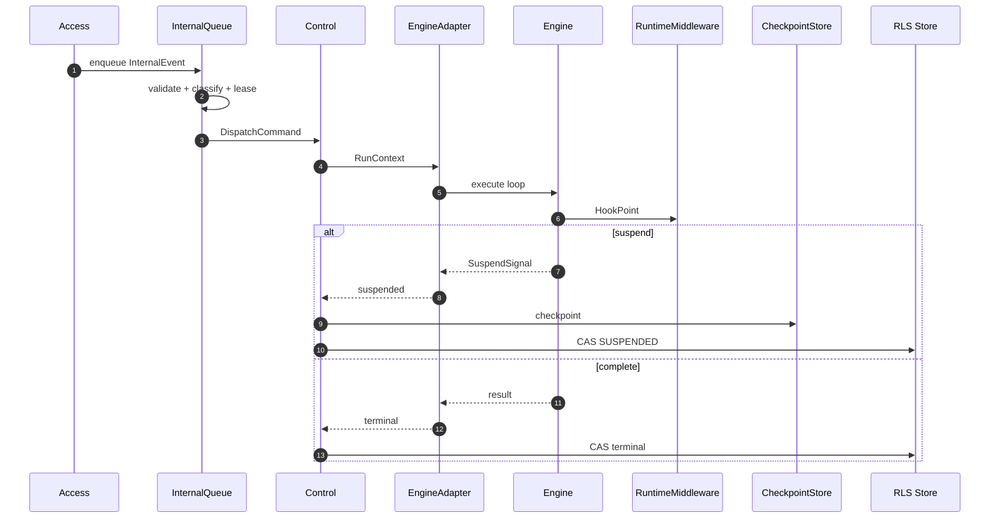
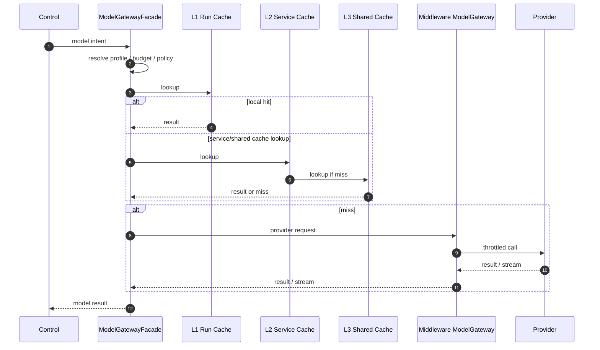
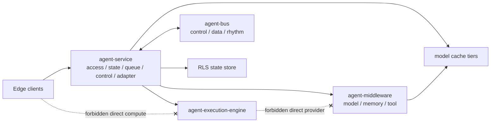
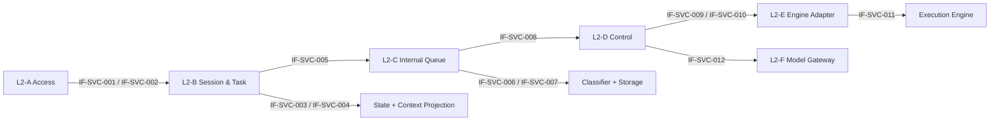
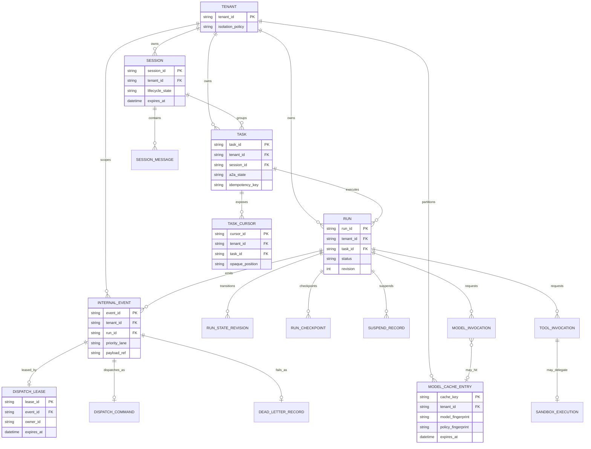

# Agent Service L1 — Service-Local Performance Characteristics and Parallel Delivery Plan

> Date: 2026-05-26
> Scope: `agent-service` local L1 characteristics, L2 dependency split, interface seams, module-level delivery plan, and local findings capture.
> Source: The frozen canonical L1 4+1 review draft at `docs/logs/reviews/2026-05-26-agent-service-l1-4plus1-rewrite-wave-1.en.md`.
> Constraint: The canonical L1 snapshot is read-only after closure; this document is a new review draft for delivery planning and follow-up findings.

## 1. Context

PR #72 ratified the `agent-service` L1 4+1 view and accepted ADR-0136..0139. The architectural core is now stable enough to turn the five-layer model into a delivery plan:

1. Access Layer.
2. Session & Task Manager.
3. Internal Event Queue.
4. Task-Centric Control Layer.
5. Engine Adapter Layer.

This document does not replace the canonical L1 source. It is intentionally service-local: it restates the performance-relevant `agent-service` L1 characteristics and decomposes that module into dependency seams, feature points, interfaces, and test-first module plans. System-wide performance planning lives in `2026-05-26-agent-system-l1-performance-and-parallel-delivery-plan.*.md`.

## 2. Root Cause and Strongest Interpretation

### 2.1 Root Cause

The L1 4+1 document locks the five-layer responsibility split, but the next engineering step needs a delivery contract that turns architecture into parallel work without losing latency, concurrency, tenant isolation, or state-machine correctness.

Evidence:

- `CLAUDE.md:47` requires Root-Cause + Strongest-Interpretation before planning.
- `CLAUDE.md:176` requires 4+1 architecture discipline.
- `CLAUDE.md:183` requires L1 development mapping, SPI appendix, and L2 boundary contracts.
- `docs/logs/reviews/2026-05-26-agent-service-l1-4plus1-rewrite-wave-1.en.md:21` marks the canonical L1 source read-only and routes follow-up work to new review drafts.
- `docs/logs/reviews/2026-05-26-agent-service-l1-4plus1-rewrite-wave-1.en.md:1161` declares L2 Boundary Contracts as the handoff surface.

### 2.2 Strongest Interpretation

The strongest valid interpretation is not "implement all layers serially." It is:

- preserve L1 red lines first;
- define interfaces and test contracts early;
- let module owners work in parallel behind stable seams;
- integrate later in dependency order;
- record every discovered issue locally in the Findings Ledger rather than leaving it in chat history.

## 3. Authority and Red Lines

| Constraint | Meaning for this plan | Authority |
|---|---|---|
| Run / Task / Session / Memory separation | Do not collapse compute snapshot, control state, context, and knowledge state. | ADR-0100 + ADR-0136 |
| SuspendSignal canonical | Do not rename or bypass suspension with ad hoc interrupt primitives. | ADR-0137 |
| Five-layer L1 | Keep Access, Session/Task, Queue, Control, Adapter boundaries explicit. | ADR-0138 |
| Fast/Slow Path narrowed semantics | Fast-Path may reduce checkpoint overhead only; it must preserve tenant metadata, RLS, CAS, reactive I/O, and SuspendSignal. | ADR-0139 |
| Three-track bus | Control, data, and rhythm traffic are isolated concerns; storage durability is a separate axis. | Rule R-E + `docs/governance/bus-channels.yaml` |
| Engine sovereignty boundary | Engine does computation; service owns governance, middleware routing, tenant isolation, state, and model-provider mediation. | Rule R-M |

## 4. L1 Performance Characteristics

### 4.1 Latency Strategy

Low latency comes from bounded work on the hot path:

- Access performs tenant binding, idempotency, and request normalization without driving Engine directly.
- Fast-Path handles short deterministic runs or low-step agent loops inside a reactive synchronous path.
- Fast-Path persists tenant-bearing Run and Task metadata at create and terminal transitions, but does not require intermediate compute checkpoint.
- Service-owned model gateway provides a low-latency model path with L1 run-local cache, L2 service-local cache, and L3 distributed/shared cache.

Fast-Path is therefore a checkpoint optimization, not a governance bypass.

### 4.2 Concurrency Strategy

High concurrency comes from isolation and ownership clarity:

- `control` traffic carries cancel, resume, pause, deadline shift, and S2C request signals.
- `data` traffic carries payloads, token chunks, S2C responses, and heavier result streams.
- `rhythm` traffic carries heartbeat and liveness pulses.
- Run state changes use atomic CAS through `RunRepository.updateIfNotTerminal`.
- Queue leases prevent duplicate concurrent processing of the same event.
- Backpressure is applied before dispatch into the Task-Centric Control Layer.

### 4.3 Recovery Strategy

Recoverability differs by path:

- Fast-Path: no mandatory intermediate compute checkpoint; terminal state and audit metadata remain persisted.
- Slow-Path: checkpoint at suspend, tool, callback, or cross-deployment resume boundaries.
- Resume re-validates tenant and state before handing control back to the Engine Adapter.

### 4.4 Model Gateway Strategy

The model gateway is an `agent-service` owned performance enhancement. It may be optimized for executor-engine workloads but must not move into `agent-execution-engine`.

```text
Task-Centric Control Layer
  -> ModelGatewayFacade
  -> L1 run-local cache
  -> L2 service-local cache
  -> L3 distributed/shared cache
  -> provider adapter
```

The Engine emits model invocation intent. Service owns provider selection, cache policy, tenant isolation, provider budget, throttling, and audit metadata.

## 5. Scenarios View

| Scenario | Performance objective | Required isolation | TDD anchor |
|---|---|---|---|
| S1 Short synchronous intake | Fast response for bounded work | tenant metadata + CAS preserved | Fast-Path metadata and terminal transition tests |
| S2 Long ReAct with tools | Stable long-running execution | data load must not block control | Slow-Path checkpoint/resume tests |
| S3 A2A collaboration | Delegate without blocking local control | parent Run suspension over control path | A2A envelope + parent/child correlation tests |
| S4 S2C callback | Suspend safely and resume with client result | request on control, response on data | S2C callback validation and timeout tests |
| S5 Cancel during execution | Cancel latency remains bounded | cancel must win or lose through CAS | cancel-vs-complete race tests |
| S6 High-concurrency model invocation | Low provider latency under cache hits and throttling | cache key carries tenant/policy/model fingerprints | cache isolation and provider throttling tests |

## 6. Logical View

```text
External Clients
  -> Access Layer
  -> Session & Task Manager
  -> Internal Event Queue
  -> Task-Centric Control Layer
  -> Engine Adapter Layer
  -> agent-execution-engine

Task-Centric Control Layer
  -> agent-middleware RuntimeMiddleware
  -> service-owned ModelGatewayFacade
  -> agent-bus control/data/rhythm channels
```

### 6.1 Service-Local Component Diagram



Layer responsibilities:

| L1 layer | Performance role | Must not own |
|---|---|---|
| Access Layer | Cheap admission, tenant binding, idempotency, ingress normalization | Engine execution, middleware calls |
| Session & Task Manager | Tenant-bearing state, Task control lifecycle, Session projection | queue leases, Engine compute |
| Internal Event Queue | priority, backpressure, leasing, dispatch safety | Task business state |
| Task-Centric Control Layer | state machine, Fast/Slow selection, suspend/resume, middleware dispatch | provider-specific model cache storage |
| Engine Adapter Layer | strict Engine matching, context injection, heterogeneous adapter boundary | tenant policy, DB writes, direct middleware access |

## 7. Process View

### 7.1 Fast-Path

```text
Access
  -> Session/Task metadata create
  -> DualTrackRouter accepts Fast-Path
  -> Engine Adapter executes bounded run
  -> terminal Run/Task metadata update
  -> response
```

Required invariant: no intermediate checkpoint is mandatory, but tenant metadata, RLS, reactive execution, CAS transitions, and SuspendSignal semantics remain mandatory.



### 7.2 Slow-Path

```text
Access
  -> Session/Task metadata create
  -> Queue admission and lease
  -> Control dispatch
  -> Engine Adapter loop
  -> Checkpoint at suspension/tool/callback boundary
  -> Resume through control path
```

Required invariant: each resume re-enters through service-owned state and policy checks.



### 7.3 Model Gateway

```text
Control receives model intent
  -> ModelGatewayFacade checks tenant/model/profile budget
  -> cache lookup L1/L2/L3
  -> provider call if miss
  -> audit hit/miss/throttle metadata
  -> return model result or stream event
```

Required invariant: streaming token chunks are data-heavy events and must not block control-priority events.



## 8. Physical View



| Plane | Components | Performance responsibility |
|---|---|---|
| Edge | client SDK, web/app, future A2A clients | no direct compute-control bypass |
| Compute & Control | `agent-service`, `agent-execution-engine` | Fast/Slow execution, state machine, Engine adapter |
| Bus & State Hub | `agent-bus`, state stores, middleware stores | three-track isolation, RLS persistence, shared model cache |
| Sandbox | untrusted tool execution | isolate CPU, memory, network, filesystem |
| Evolution | offline/online learning exports | consume only in-scope events |

Physical performance rule: channel isolation is mandatory even when W0 uses in-process stubs. Durability mode is selected per channel; it does not replace the three-track split.

## 9. Development View

| Module owner | Primary package or seam | Parallel-ready work |
|---|---|---|
| Access owner | `service.platform.web`, future dispatcher/a2a/mq adapters | ingress carriers, idempotency tests, tenant-binding tests |
| Session/Task owner | `service.session`, `service.task`, `service.runtime.runs` | SessionManager, TaskManager, TaskCursor, store contracts |
| Queue owner | future `service.queue` | InternalEvent, classifier, storage SPI, lease, backpressure |
| Control owner | `service.runtime.orchestration`, `service.runtime.resilience`, `service.runtime.s2c` | DualTrackRouter, ResumeDispatcher, state transitions |
| Engine Adapter owner | `service.engine`, consumed engine SPI | EngineRegistry, ExecutorAdapter mapping, context injection |
| Model Gateway owner | service facade over `agent-middleware` ModelGateway | cache policy, provider budget, throttling, audit metadata |
| TDD/Governance owner | tests, gate, contracts, docs | contract tests, architecture tests, performance baselines, Findings Ledger hygiene |

## 10. SPI and Interface Appendix

### 10.1 Existing Anchors

| Interface or carrier | Current role |
|---|---|
| `RunRepository` | atomic Run state persistence and CAS transition boundary |
| `TaskStateStore` | Task control-state store |
| `ContextProjector` | Session-to-Engine projection boundary |
| `StatelessEngine` | service-side Engine abstraction |
| `ExecutorAdapter` | execution-engine adapter boundary |
| `RuntimeMiddleware` | hook-based middleware dispatch |
| `ModelGateway` | middleware-owned model provider SPI consumed through service facade |
| `IngressGateway` | edge-to-compute ingress contract |
| `S2cCallbackTransport` | server-to-client callback transport |

### 10.2 Proposed L2 Interfaces

| Proposed seam | Owning L2 zone | Purpose |
|---|---|---|
| `SessionManager` | L2-B | create, append, close, expire, and query Session |
| `TaskManager` | L2-B | create Task, transition Task state, issue TaskCursor |
| `InternalEvent` | L2-C | normalized event carrier with tenant, intent, priority, correlation, payload reference |
| `EventClassifier` | L2-C | map intent to priority and optional control/data/rhythm channel |
| `QueueStorage` | L2-C | bind logical queue semantics to in-memory or external channel storage |
| `BackpressureController` | L2-C | accept, delay, reject, yield, or shed before dispatch |
| `DispatchCommand` | L2-C/L2-D | validated handoff from queue to control |
| `DualTrackRouter` | L2-D | choose Fast-Path or Slow-Path using ADR-0139 predicates |
| `ResumeDispatcher` | L2-D | resume suspended runs after tenant/state validation |
| `ModelGatewayFacade` | L2-F | service-owned gateway over model cache policy and provider adapters |
| `ModelCachePolicy` | L2-F | tenant/model/policy/version cache key and invalidation contract |

### 10.3 Service Interface Definition Contract

Every service-local interface must be precise enough for a contract test before implementation. The owner must define:

| Field | Required meaning |
|---|---|
| `interfaceId` | stable review identifier, using `IF-SVC-NNN` |
| `owner` | accountable L2 zone and implementation owner |
| `visibility` | public SPI, internal seam, or persistence boundary |
| `authority` | ADR, CLAUDE rule, schema, governance file, or this review section |
| `inputCarrier` | command, query, event, envelope, or resume payload |
| `outputCarrier` | state record, cursor, event, command, result, stream, or rejection |
| `errorCarrier` | structured error, conflict, not-found, dead-letter, or `SuspendSignal` |
| `tenantScope` | tenant binding and cross-tenant not-found behavior |
| `stateMutation` | none, append-only, CAS transition, checkpoint, or lease mutation |
| `idempotency` | key scope and duplicate handling |
| `ordering` | run, task, session, event, priority lane, or explicit unordered behavior |
| `backpressure` | accept, delay, reject, yield, shed, or provider throttle behavior |
| `timeout` | synchronous target, slow-path deadline, or `pending benchmark` |
| `observability` | required log, metric, trace, audit, or DFX catalog entry |
| `firstPositiveTest` | first happy-path contract test |
| `firstNegativeTest` | first rejection, race, tenant, or schema test |
| `status` | proposed, pending implementation, measured, or closed |

### 10.4 Service Interface Registry

| ID | Interface | Owner | Visibility | Required carrier boundary | Error and backpressure contract | First tests |
|---|---|---|---|---|---|---|
| `IF-SVC-001` | `SessionManager` | L2-B Session | internal seam | commands carry tenant, sessionId, participant, append payload, close/expire intent, and trace | not-found, tenant mismatch, expired session, and append conflict are structured; read pressure can delay non-control reads | create/load/append/close session; reject cross-tenant load and append after close |
| `IF-SVC-002` | `TaskManager` | L2-B Task | internal seam | commands carry tenant, taskId, runId, A2A state, cursor request, idempotency key, and deadline | duplicate command returns existing task or conflict; illegal state rejects before dispatch | create task and issue cursor; reject duplicate body drift and illegal A2A transition |
| `IF-SVC-003` | `TaskStateStore` | L2-B store | persistence boundary | CAS command carries tenant, taskId, expected revision, next state, and cause | stale revision, terminal mutation, and cross-tenant access collapse to conflict/not-found | CAS accepted transition; reject cancel-vs-complete race |
| `IF-SVC-004` | `ContextProjector` | L2-B projection | internal seam | projection input carries tenant, sessionId, taskId, projection policy, token budget, and memory references | missing policy, oversized projection, or forbidden field returns structured projection error | build bounded injected context; reject policyless projection |
| `IF-SVC-005` | `InternalEvent` | L2-C event | carrier contract | event has tenantId, eventId, intent, priority, correlationId, causationId, traceId, deadline, payloadRef or bounded inline payload | inline payload above cap rejects; missing tenant rejects unless explicitly stateless rhythm event | accept valid event; reject oversized inline payload and missing tenant |
| `IF-SVC-006` | `EventClassifier` | L2-C event | internal seam | classifier input is event intent, source, priority hint, tenant, deadline, and payload class | unknown intent rejects or routes to configured default; classifier never blocks on provider I/O | classify control/data/rhythm; reject unknown mandatory intent |
| `IF-SVC-007` | `QueueStorage` | L2-C queue | persistence or broker boundary | enqueue, lease, ack, dead-letter commands carry tenant, eventId, lane, lease owner, and revision | duplicate lease rejects; saturated data lane sheds/delays without blocking control/rhythm | enqueue and lease once; prove control bypass and rhythm survival |
| `IF-SVC-008` | `DispatchCommand` | L2-C/L2-D handoff | carrier contract | command carries tenant, runId, taskId, eventId, route decision inputs, lease token, deadline, and idempotency context | missing lease token or stale task state rejects before control execution | produce command from lease; reject dispatch without lease |
| `IF-SVC-009` | `DualTrackRouter` | L2-D control | internal seam | decision input carries task/run/session metadata, event priority, suspendability, budget, and checkpoint requirement | no silent fallback; decision emits reason, target path, and overrun rule | choose Fast-Path when predicates hold; force Slow-Path on suspendable or over-budget work |
| `IF-SVC-010` | `ResumeDispatcher` | L2-D control | internal seam | resume payload carries tenant, runId, taskId, checkpoint/ref, resume token, result/error, and state revision | resume revalidates tenant/state; stale token or terminal run rejects | resume valid suspended run; reject stale resume and tenant mismatch |
| `IF-SVC-011` | `EngineRegistry` / `ExecutorAdapter` | L2-E adapter | public SPI | envelope carries engine id/version, task spec, injected context, execution config, and resume state | strict adapter match required; Engine cannot write DB or call middleware directly | select matched adapter; reject mismatched engine and missing context |
| `IF-SVC-012` | `ModelGatewayFacade` / `ModelCachePolicy` | L2-F model gateway | internal seam plus provider SPI | invocation carries tenant, model, policy, safety, parameter fingerprint, projection hash, budget, and stream preference | cache key missing isolation field rejects; provider throttle emits event/metric and never starves control | L1/L2/L3 hit/miss; reject unsafe cache key and emit throttle signal |

### 10.5 Service Interface Dependency Diagram



### 10.6 Service Entity Relationship View

This ER view complements the class/interface-style dependency diagram above. It defines the service-local data entities that the interfaces must protect. It is not a final physical schema. A W0 in-memory store, an RLS database, or a broker-backed queue can materialize these entities differently, but the entity boundaries, tenant scope, and cardinality must stay stable enough for contract and state tests.



Service ER rules:

- `Session` groups user or collaboration context; `Task` owns externally visible work state; `Run` owns one execution attempt and CAS revision.
- `TaskCursor` is opaque and tenant scoped. Consumers must not infer storage offsets from it.
- `InternalEvent`, `DispatchLease`, `DispatchCommand`, and `DeadLetterRecord` are queue entities, not task business-state entities.
- `RunCheckpoint` and `SuspendRecord` are Slow-Path resume entities; Fast-Path may avoid intermediate checkpoints but cannot skip tenant metadata.
- `ModelCacheEntry` is service-governed through the model gateway facade and must remain outside Engine ownership.
- Any physical schema that collapses these entities must preserve their logical tests: tenant isolation, CAS, lease uniqueness, dead-letter audit, and cache-key isolation.

## 11. L2 Boundary Contracts

| Zone | Inputs | Outputs | DFX expectations |
|---|---|---|---|
| L2-A Access | HTTP/gRPC/A2A/MQ request with tenant and idempotency context | normalized ingress command or error envelope | admission latency remains bounded; no direct Engine drive |
| L2-B Session & Task | tenant-scoped session/task/run commands | Session, Task, TaskCursor, state records | RLS and CAS-compatible stores; Task lifetime may exceed Session |
| L2-C Queue | InternalEvent with intent and priority | leased DispatchCommand or rejection | control bypasses data backlog; rhythm survives saturation |
| L2-D Control | DispatchCommand, RunContext, Resume payload | Run/Task transition, middleware result, SuspendSignal handling | no illegal state transition; no Thread.sleep; reactive path only |
| L2-E Engine Adapter | EngineEnvelope, InjectedContext, ExecutorDefinition | Result, stream, or SuspendSignal | strict engine matching; no direct middleware or DB access |
| L2-F Model Gateway | model invocation intent, cache policy, provider budget | model result, stream chunks, cache audit | tenant-safe cache keys; throttle and cache metrics emitted |

## 12. Parallel Delivery Plan

### 12.1 Phase A — Parallel Contract Work

All owners work in parallel:

- define minimal carriers and interfaces;
- write contract tests before implementations;
- add Findings Ledger entries for discovered drift or missing authority;
- avoid cross-module implementation coupling until interfaces are stable.

Exit criteria:

- each module has contract tests;
- every proposed public seam has an owner;
- Findings Ledger has no blocker without recommended action.

### 12.2 Phase B — Semi-Serial Integration

Integration order:

1. Access to Queue Producer.
2. Session/Task store to Control state machine.
3. Queue Consumer to Control DispatchCommand.
4. Control to Engine Adapter.
5. Control/Middleware to ModelGatewayFacade.

Exit criteria:

- S1/S2 run through local reference implementations;
- queue priority tests prove control and rhythm isolation;
- model gateway cache tests prove tenant-safe keying.

### 12.3 Phase C — Serial Scenario Hardening

Run canonical scenarios S1..S6 end to end:

- S1 short synchronous Fast-Path.
- S2 long ReAct with tool calls.
- S3 A2A collaboration.
- S4 S2C callback.
- S5 cancel during execution.
- S6 high-concurrency model gateway path.

Exit criteria:

- all TDD acceptance rows pass;
- unresolved Findings Ledger rows are marked `open` or `deferred` with owner and next action;
- architecture gate and quality profile are ready for formal execution.

## 13. Wave Roadmap — 8 Waves for Progressive Refresh

The target is not a single large rewrite. The L1 performance plan should be refreshed in waves so that independent owners can work early and integration risk is paid down later.

| Wave | Theme | Primary output | Parallelism level | Serial dependency |
|---|---|---|---|---|
| 1 | Baseline and risk ledger | Red-line inventory, Findings Ledger, source-of-truth map | high | none |
| 2 | Scenario and SLO refresh | S1..S6 scenario contracts with latency/concurrency objectives | high | Wave 1 authority map |
| 3 | Logical dependency split | module dependency graph, ownership map, forbidden edges | high | Wave 2 scenario contracts |
| 4 | Interface and carrier contracts | proposed L2 interfaces, carrier fields, schema authority table | high | Wave 3 dependency graph |
| 5 | Process and backpressure design | Fast/Slow decision tree, queue lifecycle, model gateway flow | medium | Wave 4 carriers |
| 6 | Physical and storage design | three-track bus binding, RLS/storage plan, model cache placement | medium | Wave 5 process flow |
| 7 | TDD and performance harness | contract/state/queue/model/perf test matrix and baseline commands | medium | Waves 2..6 contracts |
| 8 | Integration closure | owner handoff, open/deferred findings, implementation wave gate | low | all previous waves |

Every wave must append a closure block using the G-A..G-F shape from the canonical L1 review:

- **G-A Direct fix**: the wave's cited findings or missing sections are closed.
- **G-B Continuous classification**: new findings are registered in this document's Findings Ledger.
- **G-C Continuous sibling sweep**: touched concepts are checked across the active local design surface.
- **G-D Continuous fix**: in-scope siblings are fixed; out-of-scope siblings are marked deferred with owner.
- **G-E Non-vacuity guard**: empty results need explicit negative-confirmation lines.
- **G-F Documentation**: the wave's outputs, evidence, and residual risks are written locally.

## 14. Wave-by-Wave Refresh Plan

### 14.1 Wave 1 — Baseline and Risk Ledger

Goal:

- Establish the non-negotiable L1 red lines before any module owner starts implementation design.
- Confirm that the frozen canonical L1 document remains the authority source.
- Create the local issue ledger that future discoveries must use.

Inputs:

- `CLAUDE.md` Rule D-1, G-1, G-1.1, R-C.2, R-J, R-M.
- `docs/logs/reviews/2026-05-26-agent-service-l1-4plus1-rewrite-wave-1.en.md`.
- ADR-0136..0139.
- `docs/governance/bus-channels.yaml`.

Deliverables:

- Authority table covering L1 red lines.
- Initial Findings Ledger rows.
- Source-of-truth map for L1, L2, ADR, bus, SPI, and test surfaces.

Verification:

```text
wsl bash -lc "rg -n 'Historical-artifact freeze marker|## 20. L2 Boundary Contracts' docs/logs/reviews/2026-05-26-agent-service-l1-4plus1-rewrite-wave-1.en.md"
wsl bash -lc "rg -n 'Rule D-1|Rule G-1|Rule G-1.1|Rule R-C.2|Rule R-J|Rule R-M' CLAUDE.md"
wsl bash -lc "rg -n 'control|data|rhythm' docs/governance/bus-channels.yaml"
```

Exit criteria:

- Every red line in this document has an authority citation.
- Every discovered issue has a Findings Ledger entry or explicit negative confirmation.
- No direct edit is made to the frozen canonical L1 snapshot.

Closure template:

```text
# Wave 1 Closure (G-A..G-F)
- G-A direct fix: baseline authority map and initial Findings Ledger added.
- G-B classification: all discovered issues mapped to Findings Ledger rows.
- G-C sibling sweep: checked L1 snapshot, L2 proposal, ADR-0136..0139, bus manifest.
- G-D continuous fix: in-scope documentation drift fixed in this review draft; out-of-scope rows marked open/deferred.
- G-E non-vacuity: negative confirmation if no additional findings.
- G-F documentation: closure block appended.
```

### 14.2 Wave 2 — Scenario and SLO Refresh

Goal:

- Expand the scenario view from S1..S5 to S1..S6 by adding the high-concurrency model gateway scenario.
- Attach a measurable latency/concurrency objective to every scenario.

Scenario contracts:

| Scenario | Trigger | Fast/Slow path | Primary SLO | Failure proof |
|---|---|---|---|---|
| S1 short intake | REST/gRPC create run | Fast-Path eligible | bounded entry latency and terminal metadata write | idempotency and tenant rejection |
| S2 long ReAct | multi-step tool loop | Slow-Path | stable checkpoint/resume under tool latency | tool timeout and checkpoint replay |
| S3 A2A collaboration | peer delegation | Slow-Path suspension | parent control flow remains responsive | peer failure maps to controlled failure |
| S4 S2C callback | client capability needed | Slow-Path suspension | request emits on control, response on data | timeout and invalid response handling |
| S5 cancel race | cancel while active | control-priority | cancel latency not blocked by data backlog | CAS winner/loser behavior |
| S6 model gateway | high-volume model calls | Fast-Path cache or Slow-Path provider call | cache hit latency and provider throttle behavior | tenant/policy/model cache isolation |

Deliverables:

- Scenario table with actor, path, contracts touched, DFX target, and failure modes.
- SLO vocabulary table: entry latency, dispatch latency, cache hit latency, resume latency, cancel latency, heartbeat survival.
- TDD scenario list linked to future test names.

Verification:

```text
wsl bash -lc "rg -n 'S1|S2|S3|S4|S5|S6|Fast-Path|Slow-Path|model gateway' docs/logs/reviews/2026-05-26-agent-service-l1-service-local-performance-and-parallel-delivery-plan.en.md"
wsl bash -lc "rg -n 'Fast-Path eligible|S2C|Cancel During Execution' docs/logs/reviews/2026-05-26-agent-service-l1-4plus1-rewrite-wave-1.en.md"
```

Exit criteria:

- Each scenario names exactly one primary owner and at least one TDD anchor.
- S6 does not imply Engine ownership of model provider state.
- Every latency claim is phrased as a target or required benchmark, not as shipped fact unless evidence exists.

### 14.3 Wave 3 — Logical Dependency Split

Goal:

- Convert five L1 layers into a dependency graph that implementers can follow without introducing forbidden direct calls.
- Separate performance-critical dependencies from governance dependencies.

Allowed dependency graph:

```text
Access
  -> SessionTask
  -> Queue
  -> Control
  -> EngineAdapter
  -> Engine

Control
  -> RuntimeMiddleware
  -> ModelGatewayFacade
  -> S2cCallbackTransport
  -> RunRepository

Queue
  -> Bus channel binding
  -> DispatchCommand
```

Forbidden edges:

```text
Access -> Engine direct drive
Access -> Middleware direct call
Queue -> Task business-state ownership
Engine -> Middleware direct call
Engine -> DB write
Engine -> Model provider connection/cache ownership
Fast-Path -> tenant/RLS/CAS bypass
```

Deliverables:

- Dependency graph.
- Owner matrix.
- Forbidden-edge table with authority.
- Findings Ledger sweep for any existing doc or code that implies forbidden edges.

Verification:

```text
wsl bash -lc "rg -n 'Direct connection forbidden|Direct Middleware call FORBIDDEN|EngineRegistry.resolve|RuntimeMiddleware' docs/logs/reviews/2026-05-26-agent-service-l1-4plus1-rewrite-wave-1.en.md"
wsl bash -lc "rg -n 'ModelGateway|RuntimeMiddleware|EngineRegistry|RunRepository|TaskStateStore|ContextProjector' agent-service agent-middleware agent-execution-engine agent-bus"
```

Exit criteria:

- Every module owner knows upstream and downstream dependencies.
- Every forbidden edge has a test or future gate candidate.
- Findings Ledger records any unresolved ambiguity.

### 14.4 Wave 4 — Interface and Carrier Contracts

Goal:

- Define minimal L2 interfaces and carriers before implementation.
- Make TDD possible without waiting for final storage or broker choices.

Interface groups:

| Group | Interfaces / carriers | First tests |
|---|---|---|
| Admission | ingress command, idempotency context, tenant context | duplicate key, tenant mismatch, body drift |
| State | `SessionManager`, `TaskManager`, `TaskCursor`, store commands | session lifecycle, task transition, cursor opacity |
| Queue | `InternalEvent`, `EventClassifier`, `QueueStorage`, `DispatchLease`, `DeadLetterRecord` | classification, lease duplication, DLQ audit |
| Control | `DispatchCommand`, `DualTrackRouter`, `ResumeDispatcher` | fast/slow predicate, resume validation |
| Adapter | `EngineRegistry`, `ExecutorAdapter`, injected context | engine mismatch, strict adapter selection |
| Model | `ModelGatewayFacade`, `ModelCachePolicy`, model budget, cache key | cache key isolation, throttle handling |

Carrier field rules:

- every stateful carrier includes `tenantId`;
- event carriers include `intent`, `priority`, `correlationId`, `causationId`, `traceId`;
- data-heavy carriers use `payloadRef` beyond inline cap;
- model cache keys include tenant, model, policy, prompt/projection, safety, and parameter fingerprints;
- public fixed vocabularies must cite schema or ADR authority.

Verification:

```text
wsl bash -lc "rg -n 'public interface' agent-service/src/main/java agent-middleware/src/main/java agent-bus/src/main/java agent-execution-engine/src/main/java"
wsl bash -lc "rg -n 'spi_packages|contract-catalog|dfx' agent-service/module-metadata.yaml docs/contracts/contract-catalog.md docs/dfx/agent-service.yaml"
```

Exit criteria:

- Each proposed interface has a clear owner and authority.
- No interface makes Engine own service governance.
- Every carrier has a planned contract test.

### 14.5 Wave 5 — Process and Backpressure Design

Goal:

- Make runtime behavior explicit enough for implementation: event lifecycle, Fast/Slow decision tree, resume, backpressure, and model gateway flow.

Process diagrams to write:

1. Fast-Path synchronous intake.
2. Slow-Path checkpoint/resume.
3. Queue receive -> validate -> enqueue -> lease -> dispatch -> ack/dead-letter.
4. Cancel-vs-complete CAS race.
5. S2C request/response split over control/data.
6. Model gateway cache hit/miss/throttle.

Backpressure decisions:

```text
ACCEPT
DELAY
REJECT
YIELD
SHED_LOW_PRIORITY
THROTTLE_PROVIDER
```

Priority rules:

- control events can bypass data backlog;
- rhythm must remain isolated from data saturation;
- provider throttling must not consume all control workers;
- cache invalidation caused by policy/model version change is control-priority;
- stream chunks remain data-heavy.

Verification:

```text
wsl bash -lc "rg -n 'Fast-Path|Slow-Path|RunRepository.updateIfNotTerminal|S2cCallbackEnvelope|control|data|rhythm' docs/logs/reviews/2026-05-26-agent-service-l1-4plus1-rewrite-wave-1.en.md docs/adr/0139-fast-slow-path-narrowed-semantics.yaml docs/governance/bus-channels.yaml"
```

Exit criteria:

- Every process has success path and at least one failure path.
- Every backpressure decision has downstream behavior.
- Fast-Path language preserves ADR-0139 invariants.

### 14.6 Wave 6 — Physical, Storage, and Cache Placement

Goal:

- Decide where state, queues, and caches live by deployment mode without changing ownership semantics.

Placement matrix:

| Concern | W0 local | Platform-centric | Business-centric / onsite |
|---|---|---|---|
| Run state | current repository/store | RLS-enabled DB | local or colocated RLS-compatible store |
| Task state | in-memory first, persistent later | RLS-enabled tasks table | local persistent store optional |
| Session state | in-memory first, persistent later | RLS-enabled sessions table | compact local store with tenant metadata |
| Queue control | in-memory priority queue | dedicated broker channel/topic | local high-priority channel |
| Queue data | in-memory data stream | durable data stream/object refs | local bounded stream |
| Queue rhythm | scheduler tick | tick service / lightweight channel | colocated tick |
| Model cache L1 | run-local | run-local | run-local |
| Model cache L2 | service-local | replica-local | colocated service-local |
| Model cache L3 | absent or stub | shared distributed cache | optional business-owned shared cache |

Physical red lines:

- RLS applies to persistent tenant-bearing tables.
- Queue channel isolation survives deployment mode changes.
- Model cache keys never contain secrets or full prompt text.
- Engine remains compute-only.

Verification:

```text
wsl bash -lc "rg -n 'tenant_id|ENABLE ROW LEVEL SECURITY|RunRepository|TaskStateStore|Session' agent-service/src/main/resources agent-service/src/main/java docs/logs/reviews/2026-05-26-agent-service-l1-4plus1-rewrite-wave-1.en.md"
wsl bash -lc "rg -n 'payload_size_cap_bytes|control|data|rhythm' docs/governance/bus-channels.yaml"
```

Exit criteria:

- Every storage/cache plane has owner and invalidation path.
- Every persistent tenant-bearing store has RLS plan.
- Deployment mode changes do not change the L1 ownership model.

### 14.7 Wave 7 — TDD and Performance Harness

Goal:

- Turn design claims into executable tests and performance baselines.

Test suites:

| Suite | Purpose | Minimum acceptance |
|---|---|---|
| Contract tests | validate carrier shape and schema constraints | every public carrier has positive and negative cases |
| State tests | protect Run/Task state machines | illegal transitions rejected; CAS race deterministic |
| Queue tests | prove isolation and backpressure | control bypass and rhythm survival under data load |
| Model tests | prove cache and provider controls | tenant-safe cache key; throttle event emitted |
| Scenario tests | prove S1..S6 flows | each scenario has one end-to-end happy path and one failure path |
| Architecture tests | protect forbidden dependencies | Engine cannot import service governance or middleware provider paths |
| Performance tests | capture latency/concurrency baseline | baseline recorded even if thresholds remain provisional |

Recommended verification commands:

```text
wsl bash -lc "bash gate/check_architecture_sync.sh"
wsl bash -lc "python gate/build_architecture_graph.py --check --no-write"
wsl bash -lc "./mvnw -Pquality verify"
wsl bash -lc "git diff --check"
```

If the environment cannot run one command, record the exact blocker in Findings Ledger instead of claiming success.

Exit criteria:

- Test matrix has owner, package, expected command, and first implementation target.
- Performance baselines are documented as measured or pending, never implied.
- Findings Ledger has rows for every blocked command or missing test seam.

### 14.8 Wave 8 — Integration Closure and Handoff

Goal:

- Convert the planning review draft into implementation-ready handoff material.
- Ensure all open risks are either closed, assigned, or explicitly deferred.

Closure outputs:

- final owner matrix;
- dependency order for implementation PRs;
- Findings Ledger status sweep;
- link map to L2 proposals;
- verification summary;
- implementation backlog grouped by module.

Implementation PR order:

1. Interface/carrier contracts and tests.
2. Queue scaffold and tests.
3. Session/Task manager persistence and cursor tests.
4. Control router/resume tests.
5. Engine adapter integration tests.
6. Model gateway cache/throttle tests.
7. S1..S6 scenario tests.
8. gate/architecture documentation synchronization.

Verification:

```text
wsl bash -lc "rg -n 'Status \\| open|Status \\| deferred|L1-PERF-' docs/logs/reviews/2026-05-26-agent-service-l1-service-local-performance-and-parallel-delivery-plan.en.md"
wsl bash -lc "git status --short"
wsl bash -lc "git diff --check"
```

Exit criteria:

- no blocker row lacks owner or recommended action;
- deferred rows cite the future wave or module owner;
- the next implementation agent can start without making architecture decisions.

## 15. Functional Decomposition and Dependency Backlog

### 15.1 Feature Split

| Feature | Primary owner | Depends on | Can start in parallel? | First TDD proof |
|---|---|---|---|---|
| Unified intake | Access | tenant/idempotency contracts | yes | duplicate idempotency request folds/rejects deterministically |
| A2A collaboration | Access + Control | ingress envelope, S2C semantics | yes, after carrier draft | parent run suspends and child correlation is recorded |
| Session lifecycle | Session/Task | Session carrier and store contract | yes | session create/append/expire preserves tenant |
| Task lifecycle | Session/Task | Task carrier and TaskStateStore | yes | Task state transition and cursor generation |
| Run state writes | Session/Task + Control | RunRepository CAS | yes | cancel-vs-complete deterministic race |
| Event production | Queue | InternalEvent | yes | intent maps to channel/priority |
| Queue storage | Queue | QueueStorage SPI | yes | lease prevents duplicate processing |
| Event consumption | Queue + Control | DispatchCommand | after event production | leased event dispatches once |
| Fast-Path routing | Control | DualTrackRouter | yes | eligible request avoids intermediate checkpoint |
| Slow-Path routing | Control | Checkpointer and ResumeDispatcher | after state contract | suspended run resumes through state validation |
| Engine adapter | Engine Adapter | EngineEnvelope and registry | yes | mismatched engine fails with controlled reason |
| Context translation | Engine Adapter + Session | ContextProjector | yes | full session does not leak directly to Engine |
| Shadow tool path | Engine Adapter + Middleware | HookPoint and RuntimeMiddleware | after adapter contract | tool call routes through middleware |
| Model gateway | Model Gateway + Control | ModelGatewayFacade and cache policy | yes | tenant-safe cache hit/miss behavior |
| Governance | TDD/Governance | all seams | continuous | gate/test matrix detects drift |

### 15.2 Dependency Order

```text
Contract carriers
  -> module-local unit tests
  -> queue classification
  -> state manager contracts
  -> control dispatch
  -> engine adapter
  -> model gateway
  -> scenario tests
  -> performance baselines
  -> architecture gate closure
```

Parallelizable before integration:

- Access carriers and idempotency tests.
- Session/Task carriers and store tests.
- Queue event/classifier/lease tests.
- Control Fast/Slow predicate tests.
- Engine adapter registry tests.
- Model cache key and policy tests.

Serial after integration starts:

- Queue Consumer to Control DispatchCommand.
- Control to Engine Adapter.
- Control to ModelGatewayFacade.
- S2C/A2A resume through persisted state.
- End-to-end scenario tests.

### 15.3 Interface Readiness Checklist

Every proposed interface must answer these before implementation:

| Question | Required answer |
|---|---|
| Who owns the interface? | one L2 owner |
| What is the interface ID? | stable `IF-SVC-*` row |
| Is it public SPI or internal seam? | explicit status |
| What is the authority? | ADR, Rule, schema, or review section |
| What are the input/output carriers? | named carrier fields or explicit pending field row |
| What is the error carrier? | structured error, conflict, not-found, dead-letter, or `SuspendSignal` |
| What is the first negative test? | named failure case |
| Does it carry tenant? | yes, or reason why stateless |
| Does it introduce a fixed vocabulary? | schema/ADR citation |
| What is the backpressure behavior? | accept, delay, reject, yield, shed, or throttle |
| What is the observability surface? | metric, log, trace, audit, or DFX entry |
| Can it block? | no blocking path unless explicitly outside runtime hot path |
| What records findings? | Findings Ledger row if ambiguous |

## 16. Verification Matrix

| Wave | Verification evidence | Required result |
|---|---|---|
| 1 | authority grep + Findings Ledger rows | all red lines cited |
| 2 | scenario grep + SLO table | S1..S6 present with TDD anchors |
| 3 | dependency graph + forbidden-edge table | no unowned dependency |
| 4 | interface table + carrier rules | every proposed seam has owner/test |
| 5 | process diagrams + backpressure decisions | success/failure path per process |
| 6 | physical placement matrix | no deployment mode changes ownership |
| 7 | test matrix + commands | each claim has test or pending row |
| 8 | closure summary + open/deferred sweep | no blocker lacks action |

Minimum local verification for documentation-only refresh:

```text
wsl bash -lc "git diff --check"
wsl bash -lc "rg -n 'Wave 1|Wave 2|Wave 3|Wave 4|Wave 5|Wave 6|Wave 7|Wave 8' docs/logs/reviews/2026-05-26-agent-service-l1-service-local-performance-and-parallel-delivery-plan.en.md"
wsl bash -lc "rg -n 'Findings Ledger|L1-PERF-' docs/logs/reviews/2026-05-26-agent-service-l1-service-local-performance-and-parallel-delivery-plan.en.md"
```

Full verification before implementation closure:

```text
wsl bash -lc "bash gate/check_architecture_sync.sh"
wsl bash -lc "python gate/build_architecture_graph.py --check --no-write"
wsl bash -lc "./mvnw -Pquality verify"
```

## 17. TDD Acceptance Matrix

| Test group | Required tests |
|---|---|
| Contract | envelope, event, DispatchCommand, TaskCursor, model cache key schema |
| SPI parity | metadata, contract catalog, DFX, Java interface parity |
| State | RunStatus CAS, Task.A2aState, cancel-vs-complete race, cross-tenant not-found |
| Queue | control bypasses data backlog, rhythm survives saturation, data inline cap, lease duplicate prevention, dead-letter audit |
| Fast/Slow Path | Fast-Path persists metadata without intermediate checkpoint, overrun/suspension enters Slow-Path, Slow-Path checkpoint/resume validates tenant |
| Model Gateway | L1/L2/L3 cache hit/miss, tenant/policy/model fingerprint isolation, provider throttle event and metric |
| End-to-end | S1..S6 scenario flows |

## 18. Findings Ledger

Every later architecture, code, or test finding related to this delivery plan must be recorded here or in a follow-up review draft. Findings must not live only in chat.

| ID | Severity | Module | Evidence | Conflict / Drift | Impact | Recommended Action | Status |
|---|---|---|---|---|---|---|---|
| L1-PERF-001 | info | docs | `docs/logs/reviews/2026-05-26-agent-service-l1-4plus1-rewrite-wave-1.en.md:21` | Canonical L1 snapshot is read-only; delivery planning needs a follow-up artifact. | Direct edits to frozen L1 source would violate logs-folder policy intent. | Use this new review draft as the mutable planning record. | recorded |
| L1-PERF-002 | warn | queue | `docs/logs/reviews/2026-05-26-agent-service-l1-4plus1-rewrite-wave-1.en.md:1092` | `service.queue/` is still a planned package, not an implemented filesystem subtree. | Queue owner cannot rely on shipped package structure yet. | Start with interface/carrier and tests, then add scaffold in a separate implementation wave. | open |
| L1-PERF-003 | warn | model-gateway | `docs/logs/reviews/2026-05-26-agent-service-session-task-and-event-queue-l2-proposal.en.md` | Model gateway performance path is L2-proposed, but not yet part of the canonical L1 boundary contract table. | Implementers may disagree whether gateway belongs to service or engine. | Treat service ownership as the default in this plan; raise ADR/L1 update if the team wants canonical promotion. | open |
| L1-PERF-004 | warn | planning | this document before Wave Roadmap expansion | The first version was too summary-level and did not specify how to refresh L1 in waves or how each wave is verified. | Another engineer could not implement without making architecture-planning decisions. | Add Wave 1..8 roadmap, per-wave deliverables, verification commands, and exit criteria. | closed |
| L1-PERF-005 | warn | docs | this document before Mermaid expansion | Service-local performance plan used text-only flow descriptions and lacked visual diagrams. | Reviewers had to mentally reconstruct layer and process relationships. | Add Mermaid component, sequence, and physical diagrams. | closed |
| L1-PERF-006 | warn | verification | this document before WSL command normalization | Verification examples mixed generic shell commands and stale file paths instead of WSL-first commands. | A Windows developer could run the wrong command surface or validate the old file name. | Convert verification examples to `wsl bash -lc` and update renamed file paths. | closed |
| L1-PERF-007 | warn | reviewability | user review after Mermaid/WSL pass | The service-local plan did not explicitly state how AI readers and human reviewers should interpret normative claims, targets, diagrams, and evidence. | A reader could over-infer shipped behavior from planning targets or treat diagrams as more authoritative than tables. | Add an AI-neutral and human-reviewable interpretation contract. | closed |
| L1-PERF-008 | warn | interfaces | user review requesting stronger interface definition emphasis | The service-local plan listed proposed seams but did not define enough interface fields, carrier constraints, errors, backpressure behavior, or first tests. | L2 owners could implement incompatible seams even while agreeing on interface names. | Add `IF-SVC-001..012`, a service interface definition contract, an interface registry, and a dependency diagram. | closed |
| L1-PERF-009 | warn | entities | user review requesting ER relationships in class-style diagrams | The service-local interface diagram did not show the data entities and cardinalities protected by the interfaces. | Implementers could merge queue, task, run, and cache entities or lose tenant/CAS/lease invariants while optimizing performance. | Add a service ER view and ER rules for Session, Task, Run, Queue, Checkpoint, and ModelCache entities. | closed |

Finding template for future additions:

```text
| L1-PERF-00N | severity | module | file:line or symbol | conflict/drift | impact | action | open/deferred/closed |
```

## 19. AI-Neutral and Human-Reviewable Interpretation Contract

This section is part of the document contract. It exists so both LLM agents and human reviewers interpret the service-local plan consistently.

### 19.1 Terms of Interpretation

| Term | Meaning | Review rule |
|---|---|---|
| `must` / `MUST` | Non-negotiable invariant already backed by a rule, ADR, schema, or boundary contract. | Reject if no authority is cited nearby. |
| `target` | Desired benchmark or SLO for later implementation. | Do not read as measured or shipped. |
| `measured` | Benchmark value captured by a named command or test. | Must cite evidence before being accepted. |
| `pending` | Known implementation or benchmark gap. | Must have owner or Findings Ledger entry. |
| `owner` | Role owner, not a named individual. | Human assignment can happen later. |
| `forbidden` | Edge or behavior violating a boundary. | Should become a test, gate, allowlist rule, or finding. |

### 19.2 Diagram and Table Precedence

- Mermaid diagrams are review aids for topology and flow.
- Tables carry the precise owner, contract, test, and status semantics.
- If a diagram and table disagree, treat the table as review authority and add a Findings Ledger row.
- If this document and the canonical L1 snapshot disagree, the canonical L1 snapshot wins unless a later ADR changes it.
- If this document and shipped code disagree, record the drift instead of silently reinterpreting either side.

### 19.3 Bias and Overclaim Controls

- The plan must not optimize `agent-service` by pushing unbounded latency, state, or risk into Engine, Bus, Middleware, or provider layers.
- Performance words are goals unless attached to measured evidence.
- Fast-Path language must not imply bypass of tenant metadata, RLS, CAS, reactive I/O, or SuspendSignal.
- Model gateway language must not imply Engine ownership of provider connections or cache invalidation.
- Role owners must not be interpreted as named people or organizational assignments.

### 19.4 Human Review Checklist

Reviewers should check, in order:

1. Does every service-local layer have a diagram, table, and test anchor?
2. Does every target have a test or benchmark plan?
3. Does each forbidden edge have a future enforcement path?
4. Does each open finding have evidence, impact, and recommended action?
5. Are all verification commands WSL-first?

### 19.5 AI Agent Checklist

An AI agent reading this document must:

1. Preserve the difference between shipped facts, targets, and pending baselines.
2. Prefer tables over prose summaries when extracting tasks.
3. Treat every `open` Findings Ledger row as unresolved.
4. Avoid implementation steps that violate forbidden edges.
5. Record new ambiguity in the Findings Ledger instead of resolving it silently.
6. Start service implementation planning from `IF-SVC-*` rows; do not invent missing carrier, error, or backpressure fields.

## 20. Assumptions and Defaults

- The canonical L1 snapshot is not edited.
- This document and its CN mirror are the local planning and findings record.
- Owners are role owners, not named people.
- This step is documentation only; Java code, schema, packages, and generated governance files are unchanged.
- Three-track channel authority comes from Rule R-E, `docs/governance/bus-channels.yaml`, and ADR-0138.
- `docs/adr/0031-three-track-channel-isolation.md` is not treated as locked authority.
