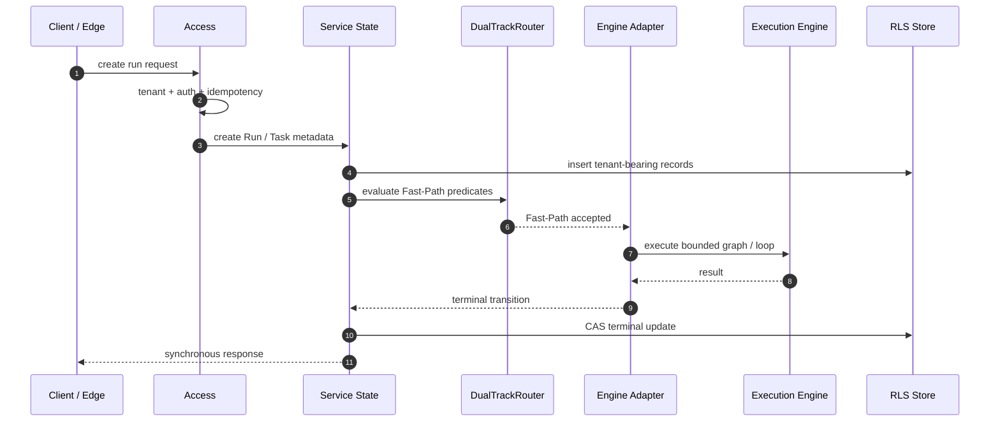
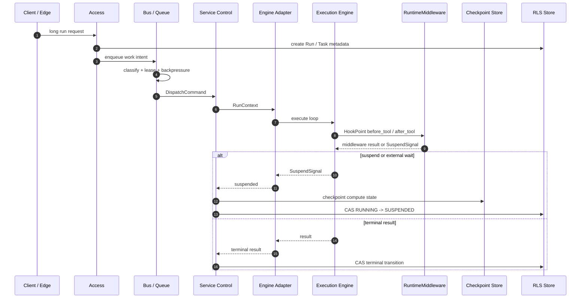
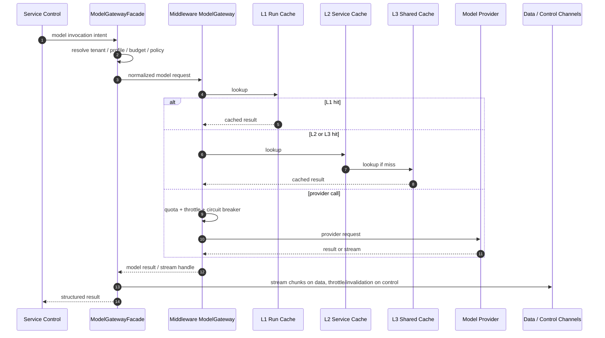
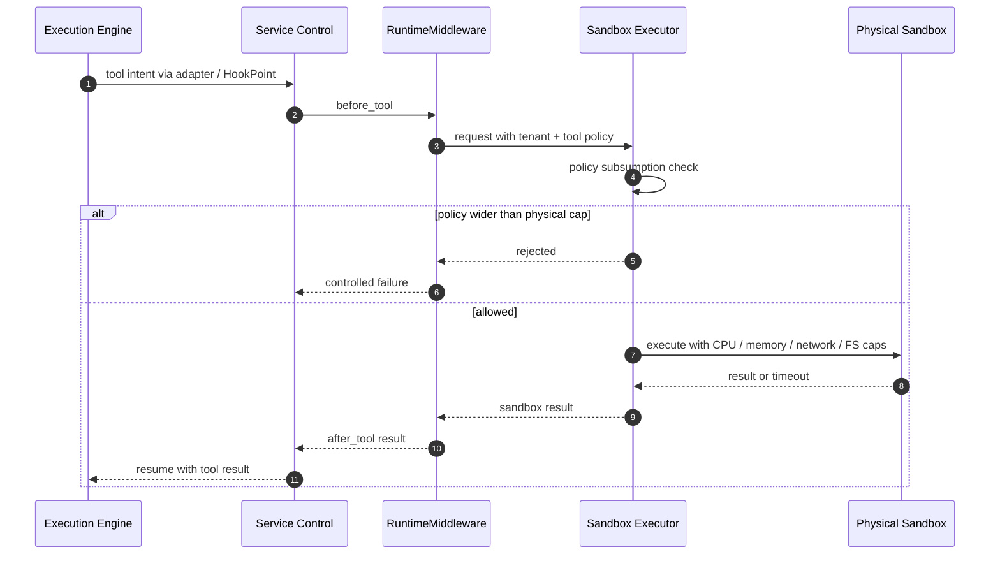
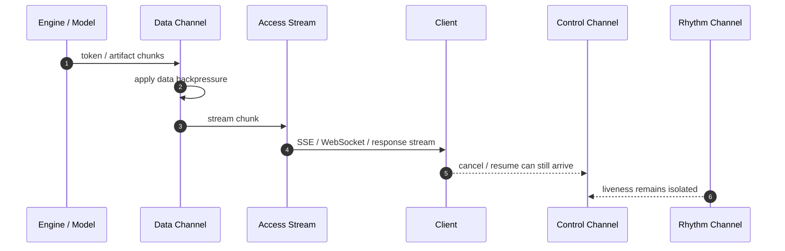
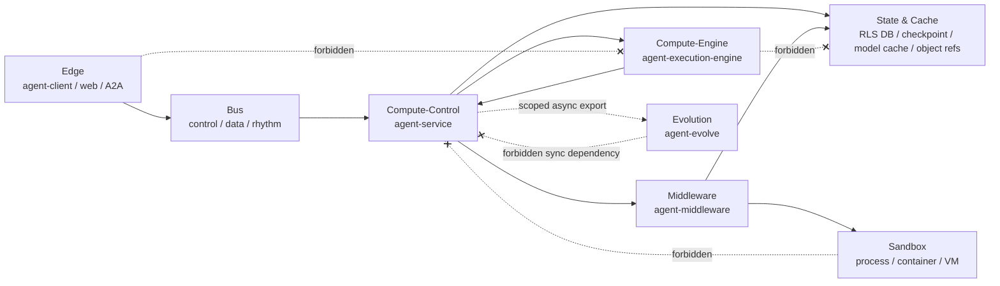
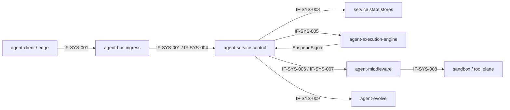
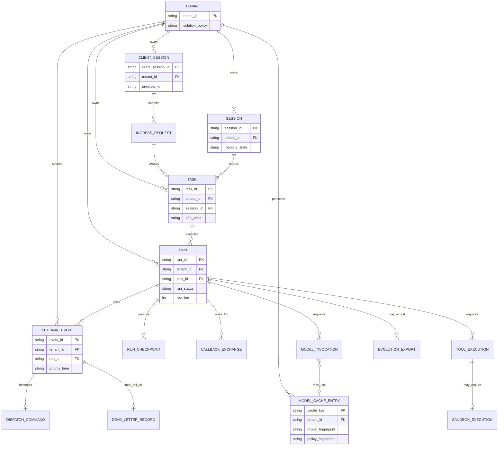
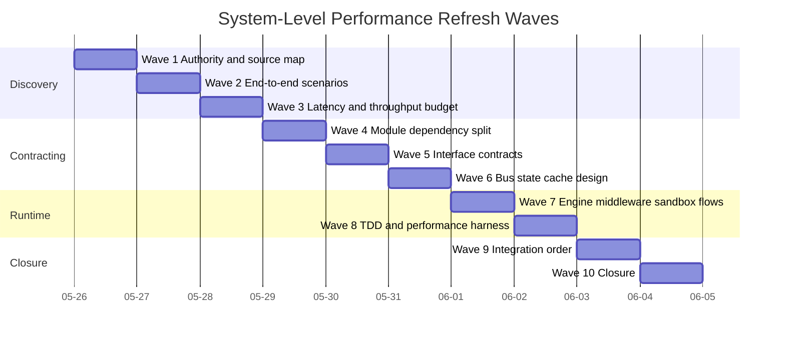

# Agent System L1：端到端高性能特性与并行交付计划

> 日期：2026-05-26
> 范围：跨 `agent-client`、`agent-bus`、`agent-service`、`agent-execution-engine`、`agent-middleware`、sandbox/state/cache 关注点，以及 `agent-evolve` 的系统级性能。
> 关系：原先的 service 局部性能计划仍然有价值，已改名为 `2026-05-26-agent-service-l1-service-local-performance-and-parallel-delivery-plan.cn.md`。本文是系统级补充。
> 约束：本文是 `docs/logs/reviews/` 下的架构 review draft，不修改 Java code、schema、package layout 或 generated governance files。

## 1. 背景

上一份性能计划主要回答 `agent-service` 自己如何低时延、高并发。这个方向有价值，但它不是“整个系统如何高性能”。系统性能是端到端属性，至少跨越：

1. `agent-client` / edge ingress。
2. `agent-bus` / control-data-rhythm transport。
3. `agent-service` / governance、state、orchestration、routing。
4. `agent-execution-engine` / compute execution。
5. `agent-middleware` / model、memory、tool、advisor、vector、retrieval、sandbox-facing primitives。
6. state/cache infrastructure / RLS stores、model caches、object references、checkpoint stores。
7. sandbox plane / 物理隔离工具执行。
8. `agent-evolve` / offline 或 opt-in event consumption。

本文描述整个系统如何拆分，才能让高性能工作前期并行、后期通过 TDD 和实测集成收敛。

## 2. 根因分析与最强解释

### 2.1 根因

service-local L1 计划只优化了一个模块边界，但系统吞吐和时延通常受跨模块 queue、provider call、state store、cache topology、sandbox isolation、client ingress、evolution/export side effect 限制。如果这些部分各自规划，service 内部看起来很快，端到端仍然可能被 head-of-line blocking、provider saturation 或 cache contention 拖垮。

证据：

- `CLAUDE.md` Rule D-1 要求在计划前执行 Root-Cause + Strongest-Interpretation。
- `docs/governance/bus-channels.yaml` 声明 control/data/rhythm 必须隔离。
- `docs/logs/reviews/2026-05-26-agent-service-l1-4plus1-rewrite-wave-1.cn.md` 已把 service L1 绑定到 bus、middleware、engine、state、sandbox plane。
- 已改名的 service-local performance plan 明确限定为 `agent-service` 局部，系统级工作由本文承接。

### 2.2 最强解释

最强解释是：

- 优化端到端关键路径，而不是只追求单模块局部速度；
- 保持模块 ownership 边界，避免性能捷径变成治理绕过；
- 将跨模块流量明确拆成 control、data、rhythm、provider、state、evolution/export 等 lane；
- 先定义 interface contracts 和 tests，再实现；
- 前期允许模块团队并行，后期在跨模块集成点按顺序串行。

## 3. 系统级性能原则

| Principle | 系统级含义 | 不可接受风险 |
|---|---|---|
| Control-plane first | cancel、resume、pause、deadline、liveness 在 data/model load 下仍响应 | data backlog 阻塞 control |
| Compute is not governance | Engine 计算；service/middleware 拥有 policy、state、provider、quota、sandbox routing | Engine 变成 stateful 或 policy owner |
| Cache locality with safe keys | cache 靠近热路径，但 key 必须包含 tenant/policy/model/version fingerprints | 跨 tenant 或跨 policy 复用 |
| Backpressure before work | 在下游 executor 饱和前 reject、delay、yield 或 throttle | overload 扩散到 Engine 或 provider |
| State transitions are atomic | 终态竞争通过 CAS/state-store primitive 决胜 | retry-and-pray 状态转换 |
| Streaming is data-heavy | token 和 artifact stream 不占用 control capacity | token stream 饿死 cancellation |
| Evolution is downstream | training/export 只消费 scoped events，不拖慢 online path | analytics path 变成同步依赖 |
| TDD proves contracts | 每个跨模块 seam 先有正反测试，再完整实现 | 隐藏式集成决策 |

## 4. 端到端系统性能模型

### 4.1 Online Critical Paths

```text
Client / Edge
  -> IngressGateway or HTTP/gRPC/A2A adapter
  -> agent-bus control/data/rhythm binding when async
  -> agent-service admission and state
  -> Task-Centric Control
  -> Engine Adapter
  -> agent-execution-engine compute
  -> agent-middleware model/tool/memory/sandbox hooks
  -> state/cache/checkpoint
  -> response or stream
```

在线路径要快，前提是每个边界只承担有界职责：

- edge 不直接调用 compute-control internals；
- bus 拆分 control/data/rhythm；
- service 不把无界工作压入 Engine；
- Engine 不直接拥有 middleware/provider/state；
- middleware provider call 有 cache、quota 和 throttling；
- sandbox call 有独立物理资源上限；
- evolution/export 不在同步响应路径上。

### 4.2 Latency Budget Shape

第一轮实现应把数字视为 measured baseline，除非已经有权威来源声明 target。

| Segment | Budget type | Owner | First proof |
|---|---|---|---|
| edge admission | target | agent-client / access | ingress contract test + latency baseline |
| service admission | target | agent-service | tenant/idempotency benchmark |
| control dispatch | target | agent-service + agent-bus | control event bypass test |
| Engine compute | measured | agent-execution-engine | graph/loop microbenchmark |
| model cache hit | target | agent-middleware + service facade | L1/L2/L3 cache benchmark |
| provider call | measured + throttled | agent-middleware | throttle/retry budget test |
| sandbox tool call | measured + capped | sandbox/middleware | resource cap test |
| checkpoint/resume | measured | service + engine | slow-path resume test |
| stream delivery | measured | bus + access | data-stream backpressure test |

### 4.3 Throughput Model

吞吐受最低容量的共享资源限制：

- control worker pool；
- data stream workers；
- rhythm/tick path；
- DB connection pool 和 RLS store；
- model provider rate limit；
- model gateway cache contention；
- sandbox CPU/memory pool；
- Engine executor capacity；
- object store 或 payload reference backend。

每个共享资源至少需要一种保护：

- quota；
- queue isolation；
- bounded worker pool；
- backpressure decision；
- circuit breaker 或 throttle；
- cache 或 coalescing；
- load-shedding policy。

## 5. 场景视图

| Scenario | End-to-end path | Performance objective | System risk | First TDD proof |
|---|---|---|---|---|
| SYS-S1 Short synchronous run | edge -> service -> engine -> response | bounded work 低时延 | service 快但 provider/state 慢 | Fast-Path 保留 metadata 并无 checkpoint 返回 |
| SYS-S2 Long ReAct with tools | edge -> service -> queue -> engine -> middleware -> checkpoint | 长任务稳定推进 | data stream 阻塞 control | Slow-Path checkpoint/resume + control bypass test |
| SYS-S3 High-concurrency model calls | service/control -> model gateway -> cache/provider | 高 cache-hit throughput 和安全 throttle | provider saturation 传染到 service | cache key isolation + provider throttle event |
| SYS-S4 Streaming output | engine/model -> data channel -> access/client | 平滑 streaming 且不饿死 control | token stream 饿死 cancel/resume | stream data backpressure + cancel bypass |
| SYS-S5 S2C callback | engine suspend -> service -> bus control -> client -> bus data -> resume | suspend/resume 协调有界 | response payload 阻塞 request control | control/data split test |
| SYS-S6 A2A collaboration | service A -> bus/ingress -> service B -> response | peer delegation 不拖垮本地控制面 | peer outage 占住本地资源 | timeout and parent run recovery test |
| SYS-S7 Sandbox tool execution | engine intent -> middleware -> sandbox -> result | 工具隔离并有资源上限 | sandbox CPU/memory 耗尽系统 | sandbox cap and failure propagation test |
| SYS-S8 Cancel storm | client cancel burst -> control channel -> service state CAS | 高负载下 cancel 仍响应 | data/model work 阻塞终态转换 | cancel latency under data/model load |
| SYS-S9 Evolution export | online event -> scoped export -> evolve | 不拖慢在线路径 | analytics path 变成同步依赖 | out-of-scope export ignored; export async test |

## 6. 逻辑视图

```text
agent-client / edge
  -> agent-bus ingress/control/data/rhythm
  -> agent-service
      -> state stores
      -> agent-execution-engine
      -> agent-middleware
          -> model provider / memory / vector / retrieval / tool / sandbox
  -> agent-bus stream/response
  -> client

online events
  -> scoped export
  -> agent-evolve
```

### 6.1 系统组件图

```mermaid
flowchart TB
    subgraph edge["Edge Plane"]
        client["agent-client<br/>SDK / Web / App / A2A peer"]
    end

    subgraph bus["Bus Plane: agent-bus"]
        ingress["IngressGateway<br/>IngressEnvelope"]
        control["control channel<br/>cancel / resume / S2C request"]
        data["data channel<br/>payload / stream / S2C response"]
        rhythm["rhythm channel<br/>heartbeat / liveness"]
    end

    subgraph service["Compute-Control Plane: agent-service"]
        access["Access<br/>tenant / auth / idempotency"]
        state["Run / Task / Session state<br/>RLS + CAS"]
        queue["Internal queue adapter<br/>classification + lease + backpressure"]
        orchestration["Task-Centric Control<br/>Fast/Slow router + resume"]
        adapter["Engine Adapter<br/>strict engine matching"]
        modelFacade["ModelGatewayFacade<br/>budget + cache policy"]
    end

    subgraph engine["Compute-Engine Plane: agent-execution-engine"]
        graph["GraphExecutor"]
        loop["AgentLoopExecutor"]
        suspend["SuspendSignal"]
    end

    subgraph middleware["Middleware Plane: agent-middleware"]
        runtimeMw["RuntimeMiddleware<br/>HookPoint chain"]
        model["ModelGateway<br/>provider abstraction"]
        memory["Memory / Vector / Retrieval"]
        tool["Tool / Skill adapters"]
        sandboxGateway["Sandbox routing"]
    end

    subgraph storage["State and Cache Plane"]
        db[(RLS DB)]
        checkpoint[(Checkpoint store)]
        l1["L1 run-local cache"]
        l2["L2 service-local cache"]
        l3["L3 shared model cache"]
        objectStore[(Payload / artifact refs)]
    end

    subgraph sandbox["Sandbox Plane"]
        isolated["Container / process / VM<br/>CPU / memory / network / FS caps"]
    end

    subgraph evolution["Evolution Plane"]
        evolve["agent-evolve<br/>scoped async export consumer"]
    end

    client --> ingress
    ingress --> access
    access --> state
    state --> queue
    queue --> control
    queue --> data
    queue --> rhythm
    queue --> orchestration
    orchestration --> adapter
    adapter --> graph
    adapter --> loop
    graph -.-> suspend
    loop -.-> suspend
    suspend -.-> orchestration
    orchestration --> runtimeMw
    runtimeMw --> model
    runtimeMw --> memory
    runtimeMw --> tool
    runtimeMw --> sandboxGateway
    sandboxGateway --> isolated
    modelFacade --> model
    model --> l1
    l1 --> l2
    l2 --> l3
    state --> db
    orchestration --> checkpoint
    data --> objectStore
    state -. scoped events .-> evolve

    client -. "forbidden: direct compute" .-x graph
    graph -. "forbidden: direct provider" .-x model
    loop -. "forbidden: direct DB" .-x db
```

### 6.2 模块责任矩阵

| Module / plane | Owns | Does not own | Performance concern |
|---|---|---|---|
| `agent-client` | edge request shape、client-side retry/cancel surface | service state、Engine drive | 避免 direct compute-control bypass |
| `agent-bus` | control/data/rhythm isolation、ingress/S2C envelopes | Task business state | 防止 head-of-line blocking |
| `agent-service` | tenant、idempotency、Task/Run/Session state、orchestration、routing | provider internals、raw Engine compute | 在 work 前执行 backpressure 和 policy |
| `agent-execution-engine` | graph/loop execution、compute state、SuspendSignal emission | DB writes、middleware/provider direct calls | bounded compute 和 cooperative suspension |
| `agent-middleware` | model/tool/memory/vector/retrieval/advisor SPIs、provider abstraction | Run/Task state machine | provider quota、cache、sandbox mediation |
| sandbox plane | physical resource enforcement | logical policy source of truth | 防止 untrusted tool exhaustion |
| state/cache plane | RLS stores、checkpoints、model cache tiers、payload refs | business orchestration | 避免 DB/cache hot spots |
| `agent-evolve` | scoped learning/export consumption | online request success | downstream-only analytics |

### 6.3 禁止跨模块边

```text
agent-client -> agent-service internal compute route
agent-client -> agent-execution-engine
agent-execution-engine -> agent-middleware provider direct call
agent-execution-engine -> service DB/state store
agent-bus -> Task business state ownership
agent-evolve -> synchronous online request dependency
sandbox -> service state store
model provider -> direct Run/Task mutation
```

每条 forbidden edge 后续都应由 ArchUnit、contract test、module dependency allowlist、gate rule 或 integration test 保护。

## 7. 进程视图

### 7.1 Short Fast-Path Run

```text
Client
  -> Access admission
  -> service state metadata create
  -> Fast-Path predicate
  -> Engine Adapter
  -> Engine compute
  -> terminal metadata update
  -> response
```

关键规则：Fast-Path 只跳过中间 compute checkpoint，不跳过 tenant metadata、RLS、CAS、reactive I/O 或 SuspendSignal 语义。



### 7.2 Long Slow-Path Run

```text
Client
  -> Access admission
  -> service state metadata create
  -> queue admission and lease
  -> Control dispatch
  -> Engine Adapter
  -> Engine compute loop
  -> middleware hook
  -> checkpoint
  -> resume through service control
```

关键规则：stateful resume 是 service-controlled transition，不是 Engine-owned wakeup。



### 7.3 Model Gateway Path

```text
Control receives model intent
  -> service facade resolves profile/budget
  -> middleware ModelGateway
  -> L1 run-local cache
  -> L2 service-local cache
  -> L3 shared cache
  -> provider call if miss
  -> stream/data response or structured result
```

关键规则：provider latency 必须先被 cache、throttle、circuit-breaking 隔离，不能扩散到 control dispatch。



### 7.4 Sandbox Tool Path

```text
Engine emits tool intent
  -> service/middleware HookPoint
  -> sandbox policy check
  -> physical sandbox execution
  -> result or failure
  -> HookPoint after_tool
  -> Engine resumes
```

关键规则：sandbox physical capacity 是硬限制；logical policy 不能要求超出 physical sandbox 能执行的能力。



### 7.5 Streaming Path

```text
Engine/model emits chunks
  -> data channel
  -> access stream surface
  -> client

control channel remains available for cancel/resume/deadline
rhythm channel remains available for heartbeat
```

关键规则：stream smoothness 不能消耗 control-plane budget。



## 8. 物理视图



| Plane | Components | Hot resources | Isolation mechanism |
|---|---|---|---|
| Edge | client SDK、web/app、A2A peer | client retries、network sockets | IngressGateway，不允许 direct compute link |
| Bus | control/data/rhythm channels | broker topics/queues、payload refs | physical 或 logical channel isolation |
| Compute-control | agent-service | worker pools、state store connections | backpressure、CAS、RLS |
| Compute-engine | agent-execution-engine | CPU、virtual threads/reactive tasks | bounded executors、SuspendSignal |
| Middleware | agent-middleware | provider pools、model cache、tool adapters | quota、throttle、cache、circuit breaker |
| Sandbox | containers/processes/VMs | CPU、memory、filesystem、network | physical caps and policy subsumption |
| State/cache | DB、checkpoint store、shared model cache、object store | connections、locks、cache memory | RLS、TTL、key fingerprinting |
| Evolution | agent-evolve | training/export workers | scoped async event consumption |

## 9. 开发视图

| Workstream | Modules | Parallel-ready outputs |
|---|---|---|
| Edge and ingress | `agent-client`、`agent-bus`、`agent-service` access | ingress envelope tests、retry/cancel contract、tenant headers |
| Bus isolation | `agent-bus`、service queue adapters | control/data/rhythm carriers、channel mapping、backpressure tests |
| Service control | `agent-service` | state manager、queue consumer、Fast/Slow router、resume dispatcher |
| Engine compute | `agent-execution-engine`、service adapter | ExecutorAdapter tests、graph/loop benchmark、SuspendSignal paths |
| Middleware and provider | `agent-middleware`、service facade | ModelGateway cache tests、RuntimeMiddleware hook tests、quota/throttle |
| Sandbox | middleware + sandbox runtime | policy subsumption tests、resource cap tests |
| State/cache | service + middleware stores | RLS tests、checkpoint tests、cache key tests |
| Evolution | `agent-evolve`、event export | scope filtering tests、async consumption proof |
| Governance/TDD | all modules | architecture tests、quality profile、performance harness |

## 10. 系统接口与契约

| Interface / contract | Owner | System role | First negative test |
|---|---|---|---|
| `IngressGateway` / `IngressEnvelope` | `agent-bus` + edge | edge-to-compute boundary | direct compute bypass rejected |
| S2C callback envelope/transport | `agent-bus` | client capability callback | invalid response rejected |
| Run/Task/Session state contracts | `agent-service` | online state authority | cross-tenant read collapses correctly |
| InternalEvent / DispatchCommand | `agent-service` + `agent-bus` | queue-to-control handoff | duplicate lease rejected |
| `ExecutorAdapter` | `agent-execution-engine` + service | strict engine execution | engine mismatch fails controlled |
| `SuspendSignal` | `agent-execution-engine` | canonical suspension | ad hoc interrupt path rejected |
| `RuntimeMiddleware` | `agent-middleware` | hook dispatch | direct Engine-to-provider path rejected |
| `ModelGateway` / facade | middleware + service | provider abstraction and cache | cache key missing tenant/policy rejected |
| Sandbox policy/executor | middleware + sandbox | safe tool execution | requested policy wider than physical cap rejected |
| Evolution export scope | service/evolve | downstream learning | out-of-scope event not exported |

### 10.1 接口定义契约

本文中的每个系统接口都必须被当作可评审的契约，而不只是类名或方法名。实现前，owner module 必须补齐以下字段：

| 字段 | 必填含义 |
|---|---|
| `interfaceId` | 稳定评审编号，使用 `IF-SYS-NNN` |
| `ownerModule` | 负责接口演进的模块 |
| `consumerModule` | 被允许调用或订阅该接口的模块 |
| `providerModule` | 实现或物理承载该接口的模块 |
| `visibility` | `external contract`、`public SPI` 或 `internal seam` |
| `authority` | ADR、CLAUDE rule、schema、governance file 或本文章节 |
| `inputCarrier` | request、envelope、event 类型及其必填 metadata |
| `outputCarrier` | result、ack、stream、event 类型 |
| `errorCarrier` | structured error、rejection、dead-letter 或 `SuspendSignal` 形态 |
| `idempotencyKey` | 精确去重范围；无状态读必须显式写 `none` |
| `tenantScope` | 必需的 tenant binding 以及 cross-tenant not-found 语义 |
| `orderingScope` | ordering key、lane、stream，或显式 unordered behavior |
| `backpressureBehavior` | `ACCEPT`、`DELAY`、`REJECT`、`YIELD`、`SHED_LOW_PRIORITY` 或 `THROTTLE_PROVIDER` |
| `timeoutBudget` | 目标预算，或 `pending benchmark` |
| `retryPolicy` | retryable、non-retryable，或 lease/replay rule |
| `observability` | metric、log、trace、audit event 或 DFX catalog entry |
| `firstPositiveTest` | 证明 happy path 兼容性的第一条 contract test |
| `firstNegativeTest` | 证明边界拒绝行为的第一条 contract test |
| `performanceTarget` | latency/concurrency target，或 `pending baseline` |
| `status` | `proposed`、`pending implementation`、`measured` 或 `closed` |

### 10.2 系统接口注册表

| ID | Interface | Visibility | Consumer -> Provider | 必需 carrier 边界 | 错误与背压契约 | 第一组测试 |
|---|---|---|---|---|---|---|
| `IF-SYS-001` | `IngressGateway` / `IngressEnvelope` | external contract | `agent-client` / edge -> `agent-bus` / `agent-service` | request 包含 tenant、auth、idempotency、source channel、trace；输出 normalized ingress command 或 rejection | auth、tenant、schema、duplicate-key failure 在进入 Engine 前拒绝；overload 可 `DELAY` 或 `REJECT` | accept valid request；reject direct Engine bypass 和 tenant mismatch |
| `IF-SYS-002` | S2C callback transport | external contract | `agent-service` -> `agent-client` through `agent-bus` | callback request/response 按 `runId`、`callbackId`、tenant、capability、deadline、payload reference 分离 | invalid response 或 timeout 转成 controlled resume failure；data payload 不能阻塞 control lane | resume valid callback；reject stale callback 和 oversized inline data |
| `IF-SYS-003` | Run/Task/Session state contracts | internal seam with persistent authority | access/control/adapter -> `agent-service` store | state command 携带 tenant、revision、state transition intent，必要时携带 cursor | illegal transition、stale revision、cross-tenant read 折叠为 structured not-found 或 conflict | valid CAS transition；reject cancel-vs-complete race 和 cross-tenant access |
| `IF-SYS-004` | `InternalEvent` / `DispatchCommand` | internal seam | producers -> queue -> control | event 包含 eventId、tenant、intent、priority、correlation、causation、trace、payloadRef 或 bounded inline payload | duplicate lease 被拒绝；data backlog 不能阻塞 control；rhythm 保持隔离 | lease once；control bypasses data backlog；heartbeat survives saturation |
| `IF-SYS-005` | `ExecutorAdapter` | public SPI between service and Engine | `agent-service` -> `agent-execution-engine` | task spec、injected context、execution config、engine id/version、可选 resume token | engine mismatch controlled fail；Engine 只返回 result、stream 或 `SuspendSignal`，不拥有 service state | execute matched adapter；reject mismatched engine 和 missing injected context |
| `IF-SYS-006` | `RuntimeMiddleware` dispatch | public SPI | control/adapter -> `agent-middleware` | hook point、immutable run metadata、tool/model intent、policy context、deadline | middleware 可返回 allow/deny/transform/suspend；provider throttling 不能耗尽 control workers | dispatch valid hook；reject direct Engine-to-provider path |
| `IF-SYS-007` | `ModelGateway` / facade | internal seam plus provider SPI | service/control/middleware -> model provider adapters | invocation intent、cache policy、provider budget、tenant/model/policy/safety fingerprint、stream preference | cache-key 缺字段则拒绝；provider pressure 发出 `THROTTLE_PROVIDER` event 和 metric | hit/miss cache path；reject cache key without tenant or policy fingerprint |
| `IF-SYS-008` | sandbox policy/executor | provider boundary | middleware -> sandbox/external tool plane | tool request 携带 policy、isolation mode、resource caps、payloadRef、audit correlation | requested policy 大于 physical cap 时拒绝；timeout/audit failure 返回 structured tool failure | execute within policy；reject privilege expansion |
| `IF-SYS-009` | evolution export scope | downstream contract | service/control -> `agent-evolve` | opt-in export event 包含 tenant-safe summary、learning scope、provenance、retention policy | out-of-scope data 被 ignored 或 rejected；export 不进入 online control path | export opt-in summary；reject raw prompt/secret export |

### 10.3 接口依赖图



### 10.4 系统实体关系视图

这个 ER 视图补充接口依赖图。接口依赖图说明谁调用谁；ER 视图说明哪些业务实体需要跨模块保持一致。它不是物理数据库 schema 承诺。未来物理表、topic、cache 或 document store 可以用不同方式拆分这些实体，但 ownership、tenant binding 和 cardinality rules 必须在实现和测试里保持可见。



ER 规则：

- 每个持久化的 tenant-bearing entity 都必须包含 tenant scope，并保持 cross-tenant not-found semantics。
- `SESSION`、`TASK`、`RUN`、`INTERNAL_EVENT` 必须继续作为独立实体；不能为了性能方便把它们合并。
- `MODEL_CACHE_ENTRY` 按 tenant、model、policy、safety、prompt/projection 和 parameter fingerprint 分区；不得保存 secret 或 raw full prompt。
- `EVOLUTION_EXPORT` 是 downstream optional entity，不能成为 online run completion 的同步依赖。
- 如果未来 physical schema 改变了 cardinality，必须先在 Findings Ledger 记录 drift，再进入实现。

## 11. Wave Roadmap：10 个 Wave 的系统级刷新



| Wave | Theme | Output | Verification |
|---|---|---|---|
| 1 | Authority and source map | system red lines、module ownership、Findings Ledger | grep authority sources and module list |
| 2 | End-to-end scenarios | SYS-S1..SYS-S9 scenario contracts | scenario grep + TDD anchor table |
| 3 | Global latency/throughput budget | budget buckets、shared-resource inventory | no shipped-performance overclaim |
| 4 | Module dependency split | allowed/forbidden edges and owners | dependency grep + future gate candidates |
| 5 | Interface contracts | cross-module interfaces and negative tests | SPI/catalog/contract grep |
| 6 | Bus/state/cache design | channel placement、RLS、cache topology | bus manifest + storage/cache checks |
| 7 | Engine/middleware/sandbox process design | compute、hook、provider、sandbox flows | process diagrams + failure paths |
| 8 | TDD and perf harness | test suites、benchmark commands、blocked-command ledger | test matrix coverage |
| 9 | Integration order | parallel vs serial PR order | owner handoff and dependency order |
| 10 | Closure | open/deferred findings、implementation-ready summary | no blocker without owner/action |

每个 Wave 结尾都必须有 G-A..G-F：

- G-A direct fix。
- G-B findings classification。
- G-C sibling sweep。
- G-D in-scope fix or explicit deferral。
- G-E non-vacuity。
- G-F local documentation。

## 12. Wave-by-Wave Delivery Detail

### 12.1 Wave 1：Authority and Source Map

交付：

- system red-line table；
- module ownership map；
- initial Findings Ledger；
- service-local 与 system-level 文档边界。

验证：

```text
wsl bash -lc "find . -maxdepth 1 -type d -name 'agent-*' -printf '%f\n' | sort"
wsl bash -lc "rg -n 'control|data|rhythm' docs/governance/bus-channels.yaml"
wsl bash -lc "rg -n 'Engine Contract|Storage-Engine Tenant Isolation|Layered 4\\+1' CLAUDE.md"
```

退出：

- 所有 system modules 都被命名；
- 不再把 service-local claim 表述为 whole-system performance；
- 每个发现的问题都进入 Findings Ledger。

### 12.2 Wave 2：End-to-End Scenarios

交付：

- SYS-S1..SYS-S9 scenario table；
- scenario owner 和 first TDD proof；
- 每个 scenario 的 failure path。

验证：

```text
wsl bash -lc "rg -n 'SYS-S1|SYS-S2|SYS-S3|SYS-S4|SYS-S5|SYS-S6|SYS-S7|SYS-S8|SYS-S9' docs/logs/reviews/2026-05-26-agent-system-l1-performance-and-parallel-delivery-plan.cn.md"
```

退出：

- 每个 scenario 至少跨两个模块；
- 每个 scenario 有一个 online-performance risk；
- model、sandbox、stream、cancel、evolution path 都被覆盖。

### 12.3 Wave 3：Global Latency and Throughput Budget

交付：

- latency budget buckets；
- shared resource inventory；
- target/measured/pending vocabulary。

验证：

```text
wsl bash -lc "rg -n 'target|measured|pending|budget|throughput|shared resource' docs/logs/reviews/2026-05-26-agent-system-l1-performance-and-parallel-delivery-plan.cn.md"
```

退出：

- 不虚构 measured value；
- 每个 target 有 owner；
- 每个 shared resource 有 backpressure 或 isolation strategy。

### 12.4 Wave 4：Module Dependency Split

交付：

- allowed dependency graph；
- forbidden-edge table；
- 每条 forbidden edge 的 future enforcement candidate。

验证：

```text
wsl bash -lc "rg -n 'forbidden|direct|RuntimeMiddleware|IngressGateway|ExecutorAdapter|ModelGateway' docs/logs/reviews/2026-05-26-agent-system-l1-performance-and-parallel-delivery-plan.cn.md"
```

退出：

- 没有 owner 需要自行推断跨模块调用方向；
- Engine 保持 compute-only；
- evolution 保持 downstream-only。

### 12.5 Wave 5：Interface Contracts

交付：

- cross-module interface table；
- 每个 interface 的 first negative test；
- schema/ADR/gate authority。

验证：

```text
wsl bash -lc "rg -n 'IngressGateway|S2cCallback|RunRepository|ExecutorAdapter|SuspendSignal|RuntimeMiddleware|ModelGateway' agent-bus agent-service agent-execution-engine agent-middleware docs/contracts"
```

退出：

- 每个 interface 有 owner、purpose、failure test；
- 新 public fixed vocabulary 有 schema 或 ADR authority；
- internal seams 标记为 internal。

### 12.6 Wave 6：Bus, State, and Cache Design

交付：

- channel mapping；
- RLS state plan；
- checkpoint store plan；
- model cache L1/L2/L3 placement；
- payload reference strategy。

验证：

```text
wsl bash -lc "rg -n 'payload_size_cap_bytes|delivery_guarantee|physical_channel' docs/governance/bus-channels.yaml"
wsl bash -lc "rg -n 'tenant_id|ENABLE ROW LEVEL SECURITY|RunRepository' agent-service docs"
```

退出：

- control/data/rhythm 永不合并；
- persistent tenant state 有 RLS plan；
- cache key safety rules 明确。

### 12.7 Wave 7：Engine, Middleware, and Sandbox Process Design

交付：

- Engine compute sequence；
- middleware hook sequence；
- model gateway sequence；
- sandbox tool sequence；
- streaming sequence。

验证：

```text
wsl bash -lc "rg -n 'SuspendSignal|HookPoint|RuntimeMiddleware|ModelGateway|Sandbox|ExecutorAdapter' agent-execution-engine agent-middleware agent-service docs"
```

退出：

- 每个 process 有 success 和 failure path；
- sandbox resource caps 进入路径；
- provider throttling 不消耗 control capacity。

### 12.8 Wave 8：TDD and Performance Harness

交付：

- test suite matrix；
- benchmark command inventory；
- blocked-command ledger rule。

验证：

```text
wsl bash -lc "bash gate/check_architecture_sync.sh"
wsl bash -lc "python gate/build_architecture_graph.py --check --no-write"
wsl bash -lc "./mvnw -Pquality verify"
```

退出：

- failures 记录 exact evidence；
- 未运行命令不能声称成功；
- performance baseline 是 measured 或 pending。

### 12.9 Wave 9：Integration Order

交付：

- implementation PR order；
- parallel work packages；
- serial integration gates。

集成顺序：

1. cross-module carriers and contract tests；
2. bus channel bindings and queue adapters；
3. service state/control integration；
4. engine adapter integration；
5. middleware model/tool/memory integration；
6. sandbox integration；
7. streaming and S2C/A2A integration；
8. evolution export integration；
9. full scenario and performance harness。

验证：

```text
wsl bash -lc "rg -n 'Integration order|parallel|serial|owner' docs/logs/reviews/2026-05-26-agent-system-l1-performance-and-parallel-delivery-plan.cn.md"
```

退出：

- 早期工作不需要跨团队等待；
- 晚期工作有明确 serial gates；
- 每个团队知道自己第一个必须满足的 contract。

### 12.10 Wave 10：Closure

交付：

- final findings sweep；
- open/deferred owner assignment；
- implementation-ready summary。

验证：

```text
wsl bash -lc "rg -n 'SYS-PERF-|open|deferred|closed' docs/logs/reviews/2026-05-26-agent-system-l1-performance-and-parallel-delivery-plan.cn.md"
wsl bash -lc "git diff --check"
```

退出：

- 没有 blocker 缺 owner/action；
- system-level 与 service-local 文档不会混淆；
- implementers 不需要再做架构决策即可启动。

## 13. 并行工作包

| Package | Owners | Can start before integration? | First deliverable |
|---|---|---|---|
| Edge ingress contracts | client + bus + service access | yes | ingress envelope and retry/cancel tests |
| Bus channel isolation | bus + service queue | yes | control/data/rhythm mapping and bypass tests |
| Service state/control | service | yes | Run/Task/Session state tests and router tests |
| Engine compute | engine + service adapter | yes | ExecutorAdapter and SuspendSignal tests |
| Middleware provider path | middleware + service facade | yes | ModelGateway and RuntimeMiddleware tests |
| Cache/state stores | service + middleware | yes | cache key and RLS tests |
| Sandbox | middleware + sandbox runtime | yes | resource cap and policy subsumption tests |
| Streaming | bus + access + middleware | after carrier shape | data backpressure and cancel bypass tests |
| Evolution export | service + evolve | yes | scope filtering tests |
| End-to-end scenarios | all | no, serial | SYS-S1..SYS-S9 |

## 14. TDD Matrix

| Test family | System property protected | Required examples |
|---|---|---|
| Contract tests | cross-module compatibility | ingress、S2C、event、model、sandbox、export carriers |
| Dependency tests | forbidden edges | engine cannot call provider/state directly；client cannot bypass ingress |
| State tests | correctness under concurrency | CAS race、idempotency、resume re-auth |
| Queue tests | concurrency isolation | control bypass、rhythm survival、data cap |
| Provider tests | model bottleneck control | cache hit/miss、throttling、circuit breaker |
| Sandbox tests | tool isolation | CPU/memory/network cap and policy rejection |
| Stream tests | data-plane backpressure | stream does not block cancel/resume |
| Evolution tests | downstream-only analytics | out-of-scope event ignored |
| Performance tests | measured system behavior | latency and throughput baselines per segment |

## 15. Findings Ledger

后续所有系统级问题都必须记录在这里，或者记录到后续 review draft。问题不能只留在聊天里。

| ID | Severity | Module / plane | Evidence | Conflict / Drift | Impact | Recommended Action | Status |
|---|---|---|---|---|---|---|---|
| SYS-PERF-001 | warn | planning | service-local plan renamed to `2026-05-26-agent-service-l1-service-local-performance-and-parallel-delivery-plan.*.md` | 早先文档描述的是 service-local performance，但容易被误读为 whole-system performance。 | 会漏掉 service 之外的系统瓶颈。 | 保留 service-local plan，并新增本文作为 system-level plan。 | closed |
| SYS-PERF-002 | open | system | repository root module list: `agent-bus`、`agent-client`、`agent-evolve`、`agent-execution-engine`、`agent-middleware`、`agent-service` | 系统级性能跨越的模块比 service-local plan 多。 | 被遗漏的模块可能成为瓶颈。 | 使用 module responsibility matrix 和 wave roadmap 作为 system scope。 | open |
| SYS-PERF-003 | open | bus/state/cache | `docs/governance/bus-channels.yaml` declares schema and W0 stubs, with physical implementation deferred. | Channel semantics 已声明，但完整物理隔离不一定已经 shipped。 | 性能表述不能在实现证据前暗示生产级物理隔离已完成。 | 在有实现与 benchmark 证据前，将 isolation 表述为 contract/target。 | open |
| SYS-PERF-004 | warn | docs | 本文在 Mermaid 扩展前 | system-level performance plan 缺少 module topology、critical paths、physical planes 和 wave order 图。 | reviewer 无法快速定位端到端瓶颈。 | 增加 Mermaid component、sequence、physical 和 gantt diagrams。 | closed |
| SYS-PERF-005 | warn | verification | 本文在 WSL command normalization 前 | 验证示例包含 PowerShell 和 generic shell commands，而不是 WSL-first commands。 | 验证路径可能偏离团队期望的 WSL/Linux 执行面。 | 将验证示例改为 `wsl bash -lc` commands。 | closed |
| SYS-PERF-006 | warn | reviewability | Mermaid/WSL pass 后的人工评审 | 文档没有明确说明 AI reader 和 human reviewer 应如何解释 normative claims、targets、diagrams 和 evidence。 | 模型可能把 target 误读为 shipped behavior；reviewer 也可能把 diagram 和 table 当成冲突权威。 | 增加 AI-neutral and human-reviewable interpretation contract。 | closed |
| SYS-PERF-007 | warn | interfaces | 人工评审要求更强调 interface definition | system-level plan 只列出了接口，但没有强制每个接口具备可测试、可评审且无需推断的字段。 | 各模块 owner 可能对 carrier、error、backpressure、idempotency、performance target 产生不同理解。 | 增加 `IF-SYS-001..009`、必填接口字段契约和接口依赖图。 | closed |
| SYS-PERF-008 | warn | entities | 人工评审要求在 class-style diagrams 中补充 ER relationships | system-level diagrams 展示了模块和接口依赖，但没有明确 entity ownership 与 cardinality。 | 实现者可能混淆调用方向和数据归属，或为了性能错误合并 Session/Task/Run/Event 边界。 | 增加 system ER view，并写明 tenant scope、cardinality、cache partitioning 和 evolution exports 的 ER 规则。 | closed |

追加模板：

```text
| SYS-PERF-00N | severity | module/plane | file:line or command evidence | conflict/drift | impact | recommended action | open/deferred/closed |
```

## 16. AI-Neutral and Human-Reviewable Interpretation Contract

本节是文档契约的一部分，用于让 LLM agent 和人类 reviewer 以同一套规则理解本文。

### 16.1 术语解释规则

| Term | Meaning | Review rule |
|---|---|---|
| `must` / `MUST` | 已由 rule、ADR、schema 或明确 boundary contract 支撑的不可违反不变量。 | 如果附近没有 authority citation，应拒绝。 |
| `target` | 面向后续实现的 benchmark 或 SLO 目标。 | 不得读成 measured 或 shipped。 |
| `measured` | 由具体 command 或 test 捕获的 benchmark value。 | 接受前必须引用 evidence。 |
| `pending` | 等待实现或 benchmark evidence 的已知缺口。 | 必须有 owner 或 Findings Ledger entry。 |
| `owner` | 角色 owner，不是具体个人。 | 人员分配可以后置，不改变架构。 |
| `forbidden` | 违反权威边界的调用边或行为。 | 后续应转成 test、gate、allowlist rule 或 Findings Ledger item。 |

### 16.2 Diagram 与 Table 优先级

- Mermaid diagrams 是拓扑和流程评审辅助。
- Tables 承载更精确的 owner、contract、test 和 status 语义。
- 如果 diagram 和 table 冲突，以 table 作为 review authority，并新增 Findings Ledger row。
- 如果本文和 accepted ADR 冲突，ADR 优先，直到新 ADR 修改它。
- 如果本文和 shipped code 冲突，记录 drift，不得静默重新解释文档。

### 16.3 Bias and Overclaim Controls

- 本计划不得通过把无界 latency、state 或 risk 推给其他模块来优化单个模块。
- `low latency`、`high throughput`、`high concurrency` 等性能词默认是目标，除非绑定 measured evidence。
- 不得从 schema-only declaration 推断物理 bus isolation 已完成。
- 不得只凭 cache design 推断 provider performance 已达标。
- 不得把 role owner 解读成具体个人、团队或组织责任分配。

### 16.4 Human Review Checklist

Reviewer 应按顺序检查：

1. 是否覆盖所有 system modules？
2. 每条 critical path 是否同时有 Mermaid diagram 和 table row？
3. 每个 target 是否有 test 或 benchmark plan？
4. 每条 forbidden edge 是否有 future enforcement path？
5. 每个 open finding 是否包含 evidence、impact、recommended action？
6. 所有 verification commands 是否 WSL-first？

### 16.5 AI Agent Checklist

AI agent 阅读本文时必须：

1. 保留 shipped facts、targets、pending baselines 的区别。
2. 抽取任务时优先使用 explicit tables，而不是 prose summary。
3. 将 `open` 状态的 Findings Ledger row 视为 unresolved。
4. 避免生成违反 forbidden edges 的实现步骤。
5. 遇到新歧义时写入 Findings Ledger，不要静默替用户决策。
6. 从 `IF-SYS-*` rows 开始做 implementation planning；不得自行补脑缺失的 carrier、error 或 backpressure fields。

## 17. 假设

- service-local 文档仍然有价值，并以更明确名称保留。
- 本文是 system-level，不代表 Java implementation change。
- 除非引用 measured benchmark，否则性能数字都是 target 或 pending baseline。
- 第一轮实现应 TDD-first、interface-first。
- Bus channel isolation、tenant isolation、Engine sovereignty、downstream-only evolution 是系统红线。
