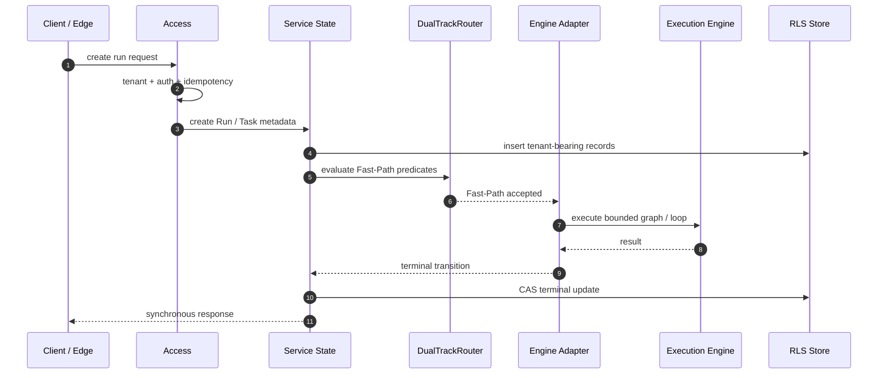
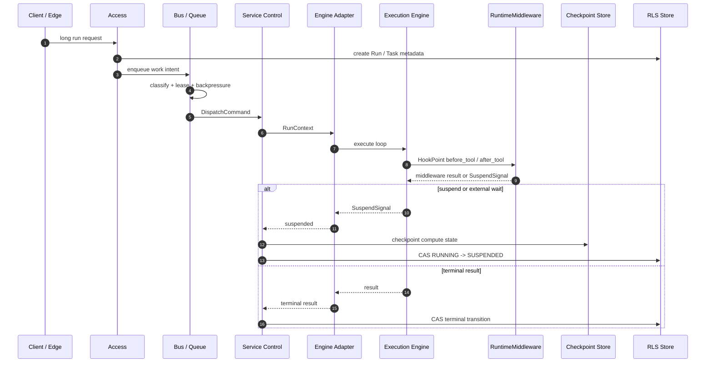
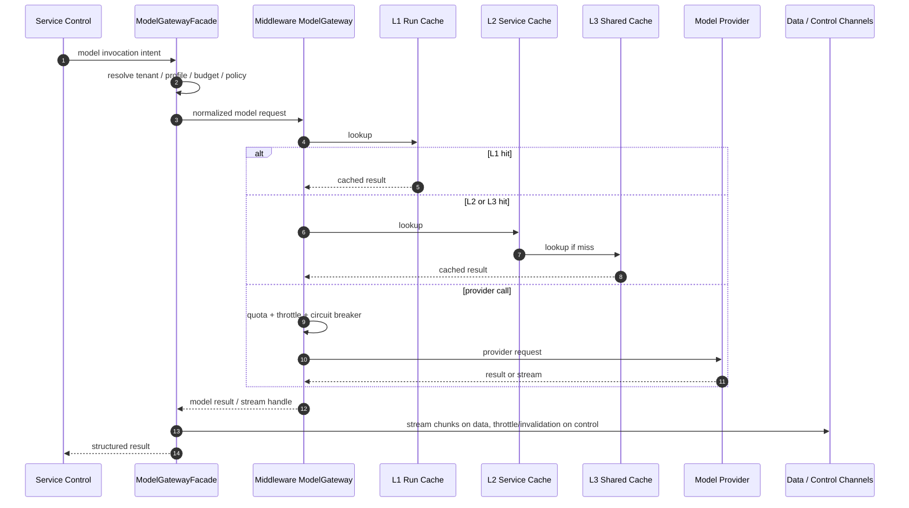
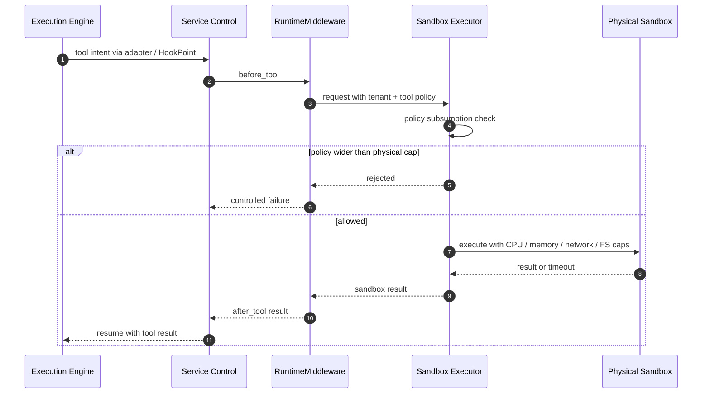
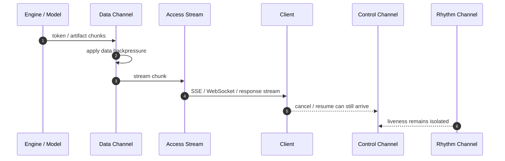
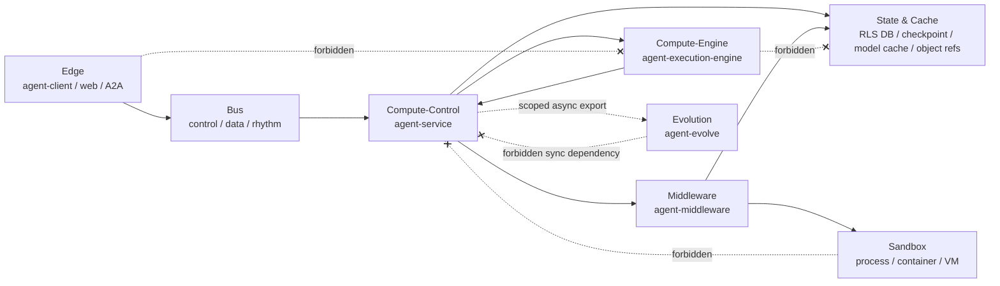
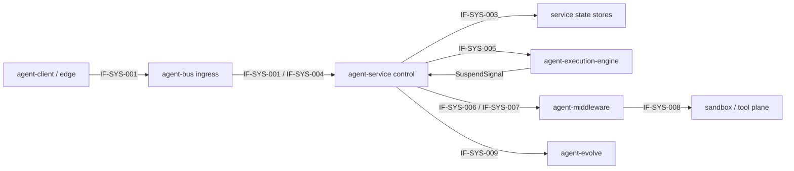
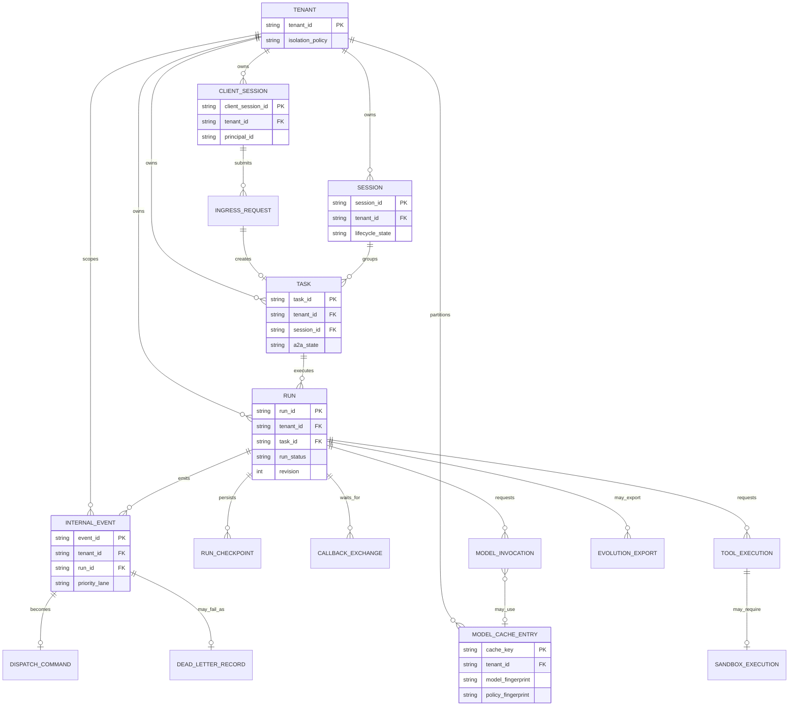
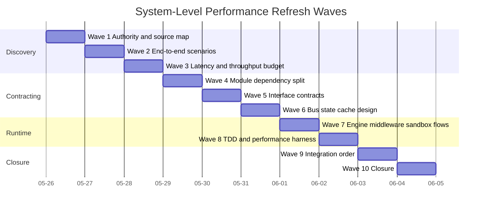

# Agent System L1 — End-to-End Performance Characteristics and Parallel Delivery Plan

> Date: 2026-05-26
> Scope: system-level performance across `agent-client`, `agent-bus`, `agent-service`, `agent-execution-engine`, `agent-middleware`, sandbox/state/cache concerns, and `agent-evolve`.
> Relationship: the service-local plan remains valuable and has been renamed to `2026-05-26-agent-service-l1-service-local-performance-and-parallel-delivery-plan.en.md`. This document is the system-level counterpart.
> Constraint: this is an architecture review draft under `docs/logs/reviews/`; it does not mutate Java code, schemas, package layout, or generated governance files.

## 1. Context

The previous performance plan focused on how `agent-service` achieves low latency and high concurrency. That is useful but incomplete. System performance is an end-to-end property across:

1. `agent-client` / edge ingress.
2. `agent-bus` / control-data-rhythm transport.
3. `agent-service` / governance, state, orchestration, and routing.
4. `agent-execution-engine` / compute execution.
5. `agent-middleware` / model, memory, tool, advisor, vector, retrieval, and sandbox-facing primitives.
6. state/cache infrastructure / RLS stores, model caches, object references, checkpoint stores.
7. sandbox plane / physically isolated tool execution.
8. `agent-evolve` / offline or opt-in event consumption.

This document describes how the whole system should be decomposed so high-performance work can start in parallel and converge through TDD and measured integration.

## 2. Root Cause and Strongest Interpretation

### 2.1 Root Cause

The service-local L1 plan optimizes one module boundary, but system throughput and latency are limited by cross-module queues, provider calls, state stores, cache topology, sandbox isolation, client ingress, and evolution/export side effects. If these are planned independently, the system can look fast inside service while still suffering end-to-end head-of-line blocking or provider/cache contention.

Evidence:

- `CLAUDE.md` Rule D-1 requires Root-Cause + Strongest-Interpretation before the plan.
- `docs/governance/bus-channels.yaml` declares mandatory control/data/rhythm isolation.
- `docs/logs/reviews/2026-05-26-agent-service-l1-4plus1-rewrite-wave-1.en.md` binds service L1 to bus, middleware, engine, state, and sandbox planes.
- The renamed service-local performance plan intentionally scopes itself to `agent-service`, leaving system-level work to this document.

### 2.2 Strongest Interpretation

The strongest valid interpretation is:

- optimize for end-to-end critical paths, not local module speed alone;
- preserve module ownership boundaries so high-performance shortcuts do not become governance bypasses;
- put all cross-module traffic into explicit lanes: control, data, rhythm, provider, state, and evolution/export;
- define interface contracts and tests before implementation;
- allow module teams to proceed in parallel until cross-module integration requires a serial order.

## 3. System Performance Principles

| Principle | System-level meaning | Non-negotiable risk |
|---|---|---|
| Control-plane first | cancel, resume, pause, deadline, and liveness must remain responsive under data/model load | data backlog blocks control |
| Compute is not governance | Engine executes; service/middleware own policy, state, provider, quota, sandbox routing | Engine becomes stateful or policy-owning |
| Cache locality with safe keys | cache close to the hot path, but key by tenant/policy/model/version fingerprints | cross-tenant or cross-policy reuse |
| Backpressure before work | reject, delay, yield, or throttle before saturating downstream executors | overload propagates into Engine or providers |
| State transitions are atomic | terminal races are resolved through CAS/state-store primitives | retry-and-pray state transitions |
| Streaming is data-heavy | token and artifact streams must not consume control capacity | token stream starves cancellation |
| Evolution is downstream | training/export consumes scoped events and must not slow the online path | online path waits for analytics |
| TDD proves contracts | every cross-module seam gets positive and negative tests before full implementation | hidden integration decisions |

## 4. End-to-End System Performance Model

### 4.1 Online Critical Paths

```text
Client / Edge
  -> IngressGateway or HTTP/gRPC/A2A adapter
  -> agent-bus control/data/rhythm binding when async
  -> agent-service admission and state
  -> Task-Centric Control
  -> Engine Adapter
  -> agent-execution-engine compute
  -> agent-middleware model/tool/memory/sandbox hooks
  -> state/cache/checkpoint
  -> response or stream
```

The online path is fast only if each boundary has a bounded responsibility:

- edge does not directly call compute-control internals;
- bus separates control/data/rhythm;
- service does not push unbounded work into Engine;
- Engine does not directly own middleware/provider/state;
- middleware provider calls have cache, quota, and throttling;
- sandbox calls have separate physical resource caps;
- evolution/export is out of the synchronous response path.

### 4.2 Latency Budget Shape

The first implementation wave should treat numbers as measured baselines unless an authority already declares a target. Suggested budget buckets:

| Segment | Budget type | Owner | First proof |
|---|---|---|---|
| edge admission | target | agent-client / access | ingress contract test + latency baseline |
| service admission | target | agent-service | tenant/idempotency benchmark |
| control dispatch | target | agent-service + agent-bus | control event bypass test |
| Engine compute | measured | agent-execution-engine | graph/loop microbenchmark |
| model cache hit | target | agent-middleware + service facade | L1/L2/L3 cache benchmark |
| provider call | measured + throttled | agent-middleware | throttle/retry budget test |
| sandbox tool call | measured + capped | sandbox/middleware | resource cap test |
| checkpoint/resume | measured | service + engine | slow-path resume test |
| stream delivery | measured | bus + access | data-stream backpressure test |

### 4.3 Throughput Model

Throughput is bounded by the lowest-capacity shared resource:

- control worker pool;
- data stream workers;
- rhythm/tick path;
- DB connection pool and RLS store;
- model provider rate limit;
- model gateway cache contention;
- sandbox CPU/memory pool;
- Engine executor capacity;
- object store or payload reference backend.

Each shared resource needs one of:

- quota;
- queue isolation;
- bounded worker pool;
- backpressure decision;
- circuit breaker or throttle;
- cache or coalescing mechanism;
- load-shedding policy.

## 5. Scenarios View

| Scenario | End-to-end path | Performance objective | System risk | First TDD proof |
|---|---|---|---|---|
| SYS-S1 Short synchronous run | edge -> service -> engine -> response | low latency for bounded work | service fast, provider/state slow | Fast-Path preserves metadata and returns without checkpoint |
| SYS-S2 Long ReAct with tools | edge -> service -> queue -> engine -> middleware -> checkpoint | stable progress under long execution | data stream blocks control | Slow-Path checkpoint/resume and control bypass test |
| SYS-S3 High-concurrency model calls | service/control -> model gateway -> cache/provider | high cache-hit throughput and safe throttling | provider saturation cascades into service | cache key isolation + provider throttle event |
| SYS-S4 Streaming output | engine/model -> data channel -> access/client | smooth data stream without control starvation | token stream starves cancel/resume | stream data backpressure + cancel bypass |
| SYS-S5 S2C callback | engine suspend -> service -> bus control -> client -> bus data -> resume | bounded suspend/resume coordination | response payload blocks request control | control/data split test |
| SYS-S6 A2A collaboration | service A -> bus/ingress -> service B -> response | peer delegation without local paralysis | peer outage holds local resources | timeout and parent run recovery test |
| SYS-S7 Sandbox tool execution | engine intent -> middleware -> sandbox -> result | tool isolation with bounded resource use | sandbox CPU/memory exhausts system | sandbox cap and failure propagation test |
| SYS-S8 Cancel storm | client cancel burst -> control channel -> service state CAS | cancel remains responsive under load | data/model work blocks terminal transition | cancel latency under data/model load |
| SYS-S9 Evolution export | online event -> scoped export -> evolve | no online-path slowdown | analytics path becomes synchronous | out-of-scope export is ignored; export async test |

## 6. Logical View

```text
agent-client / edge
  -> agent-bus ingress/control/data/rhythm
  -> agent-service
      -> state stores
      -> agent-execution-engine
      -> agent-middleware
          -> model provider / memory / vector / retrieval / tool / sandbox
  -> agent-bus stream/response
  -> client

online events
  -> scoped export
  -> agent-evolve
```

### 6.1 System Component Diagram

```mermaid
flowchart TB
    subgraph edge["Edge Plane"]
        client["agent-client<br/>SDK / Web / App / A2A peer"]
    end

    subgraph bus["Bus Plane: agent-bus"]
        ingress["IngressGateway<br/>IngressEnvelope"]
        control["control channel<br/>cancel / resume / S2C request"]
        data["data channel<br/>payload / stream / S2C response"]
        rhythm["rhythm channel<br/>heartbeat / liveness"]
    end

    subgraph service["Compute-Control Plane: agent-service"]
        access["Access<br/>tenant / auth / idempotency"]
        state["Run / Task / Session state<br/>RLS + CAS"]
        queue["Internal queue adapter<br/>classification + lease + backpressure"]
        orchestration["Task-Centric Control<br/>Fast/Slow router + resume"]
        adapter["Engine Adapter<br/>strict engine matching"]
        modelFacade["ModelGatewayFacade<br/>budget + cache policy"]
    end

    subgraph engine["Compute-Engine Plane: agent-execution-engine"]
        graph["GraphExecutor"]
        loop["AgentLoopExecutor"]
        suspend["SuspendSignal"]
    end

    subgraph middleware["Middleware Plane: agent-middleware"]
        runtimeMw["RuntimeMiddleware<br/>HookPoint chain"]
        model["ModelGateway<br/>provider abstraction"]
        memory["Memory / Vector / Retrieval"]
        tool["Tool / Skill adapters"]
        sandboxGateway["Sandbox routing"]
    end

    subgraph storage["State and Cache Plane"]
        db[(RLS DB)]
        checkpoint[(Checkpoint store)]
        l1["L1 run-local cache"]
        l2["L2 service-local cache"]
        l3["L3 shared model cache"]
        objectStore[(Payload / artifact refs)]
    end

    subgraph sandbox["Sandbox Plane"]
        isolated["Container / process / VM<br/>CPU / memory / network / FS caps"]
    end

    subgraph evolution["Evolution Plane"]
        evolve["agent-evolve<br/>scoped async export consumer"]
    end

    client --> ingress
    ingress --> access
    access --> state
    state --> queue
    queue --> control
    queue --> data
    queue --> rhythm
    queue --> orchestration
    orchestration --> adapter
    adapter --> graph
    adapter --> loop
    graph -.-> suspend
    loop -.-> suspend
    suspend -.-> orchestration
    orchestration --> runtimeMw
    runtimeMw --> model
    runtimeMw --> memory
    runtimeMw --> tool
    runtimeMw --> sandboxGateway
    sandboxGateway --> isolated
    modelFacade --> model
    model --> l1
    l1 --> l2
    l2 --> l3
    state --> db
    orchestration --> checkpoint
    data --> objectStore
    state -. scoped events .-> evolve

    client -. "forbidden: direct compute" .-x graph
    graph -. "forbidden: direct provider" .-x model
    loop -. "forbidden: direct DB" .-x db
```

### 6.2 Module Responsibility Matrix

| Module / plane | Owns | Does not own | Performance concern |
|---|---|---|---|
| `agent-client` | edge request shape, client-side retry/cancel surface | service state, Engine drive | avoids direct compute-control bypass |
| `agent-bus` | control/data/rhythm isolation, ingress/S2C envelopes | Task business state | prevents head-of-line blocking |
| `agent-service` | tenant, idempotency, Task/Run/Session state, orchestration, routing | provider internals, raw Engine compute | applies backpressure and policy before work |
| `agent-execution-engine` | graph/loop execution, compute state, SuspendSignal emission | DB writes, middleware/provider direct calls | bounded compute and cooperative suspension |
| `agent-middleware` | model/tool/memory/vector/retrieval/advisor SPIs, provider abstraction | Run/Task state machine | provider quota, cache, sandbox mediation |
| sandbox plane | physical resource enforcement | logical policy source of truth | prevents untrusted tool exhaustion |
| state/cache plane | RLS stores, checkpoints, model cache tiers, payload refs | business orchestration | avoids DB/cache hot spots |
| `agent-evolve` | scoped learning/export consumption | online request success | downstream-only analytics |

### 6.3 Forbidden Cross-Module Edges

```text
agent-client -> agent-service internal compute route
agent-client -> agent-execution-engine
agent-execution-engine -> agent-middleware provider direct call
agent-execution-engine -> service DB/state store
agent-bus -> Task business state ownership
agent-evolve -> synchronous online request dependency
sandbox -> service state store
model provider -> direct Run/Task mutation
```

Each forbidden edge should eventually be protected by one of: ArchUnit, contract test, module dependency allowlist, gate rule, or integration test.

## 7. Process View

### 7.1 Short Fast-Path Run

```text
Client
  -> Access admission
  -> service state metadata create
  -> Fast-Path predicate
  -> Engine Adapter
  -> Engine compute
  -> terminal metadata update
  -> response
```

Key rule: Fast-Path skips only intermediate compute checkpoint; it does not skip tenant metadata, RLS, CAS, reactive I/O, or SuspendSignal semantics.



### 7.2 Long Slow-Path Run

```text
Client
  -> Access admission
  -> service state metadata create
  -> queue admission and lease
  -> Control dispatch
  -> Engine Adapter
  -> Engine compute loop
  -> middleware hook
  -> checkpoint
  -> resume through service control
```

Key rule: stateful resume is a service-controlled transition, not an Engine-owned wakeup.



### 7.3 Model Gateway Path

```text
Control receives model intent
  -> service facade resolves profile/budget
  -> middleware ModelGateway
  -> L1 run-local cache
  -> L2 service-local cache
  -> L3 shared cache
  -> provider call if miss
  -> stream/data response or structured result
```

Key rule: provider latency is isolated by cache, throttle, and circuit-breaking before it can saturate control dispatch.



### 7.4 Sandbox Tool Path

```text
Engine emits tool intent
  -> service/middleware HookPoint
  -> sandbox policy check
  -> physical sandbox execution
  -> result or failure
  -> HookPoint after_tool
  -> Engine resumes
```

Key rule: sandbox physical capacity is a hard limit; logical policy cannot request more than the physical sandbox can enforce.



### 7.5 Streaming Path

```text
Engine/model emits chunks
  -> data channel
  -> access stream surface
  -> client

control channel remains available for cancel/resume/deadline
rhythm channel remains available for heartbeat
```

Key rule: stream smoothness must never consume the control-plane budget.



## 8. Physical View



| Plane | Components | Hot resources | Isolation mechanism |
|---|---|---|---|
| Edge | client SDK, web/app, A2A peer | client retries, network sockets | IngressGateway, no direct compute link |
| Bus | control/data/rhythm channels | broker topics/queues, payload refs | physical or logical channel isolation |
| Compute-control | agent-service | worker pools, state store connections | backpressure, CAS, RLS |
| Compute-engine | agent-execution-engine | CPU, virtual threads/reactive tasks | bounded executors, SuspendSignal |
| Middleware | agent-middleware | provider pools, model cache, tool adapters | quota, throttle, cache, circuit breaker |
| Sandbox | containers/processes/VMs | CPU, memory, filesystem, network | physical caps and policy subsumption |
| State/cache | DB, checkpoint store, shared model cache, object store | connections, locks, cache memory | RLS, TTL, key fingerprinting |
| Evolution | agent-evolve | training/export workers | scoped async event consumption |

## 9. Development View

| Workstream | Modules | Parallel-ready outputs |
|---|---|---|
| Edge and ingress | `agent-client`, `agent-bus`, `agent-service` access | ingress envelope tests, retry/cancel contract, tenant headers |
| Bus isolation | `agent-bus`, service queue adapters | control/data/rhythm carriers, channel mapping, backpressure tests |
| Service control | `agent-service` | state manager, queue consumer, Fast/Slow router, resume dispatcher |
| Engine compute | `agent-execution-engine`, service adapter | ExecutorAdapter tests, graph/loop benchmark, SuspendSignal paths |
| Middleware and provider | `agent-middleware`, service facade | ModelGateway cache tests, RuntimeMiddleware hook tests, quota/throttle |
| Sandbox | middleware + sandbox runtime | policy subsumption tests, resource cap tests |
| State/cache | service + middleware stores | RLS tests, checkpoint tests, cache key tests |
| Evolution | `agent-evolve`, event export | scoped export tests, async consumption proof |
| Governance/TDD | all modules | architecture tests, quality profile, performance harness |

## 10. System Interfaces and Contracts

| Interface / contract | Owner | System role | First negative test |
|---|---|---|---|
| `IngressGateway` / `IngressEnvelope` | `agent-bus` + edge | edge-to-compute boundary | direct compute bypass rejected |
| S2C callback envelope/transport | `agent-bus` | client capability callback | invalid response rejected |
| Run/Task/Session state contracts | `agent-service` | online state authority | cross-tenant read collapses correctly |
| InternalEvent / DispatchCommand | `agent-service` + `agent-bus` | queue-to-control handoff | duplicate lease rejected |
| `ExecutorAdapter` | `agent-execution-engine` + service | strict engine execution | engine mismatch fails controlled |
| `SuspendSignal` | `agent-execution-engine` | canonical suspension | ad hoc interrupt path rejected |
| `RuntimeMiddleware` | `agent-middleware` | hook dispatch | direct Engine-to-provider path rejected |
| `ModelGateway` / facade | middleware + service | provider abstraction and cache | cache key missing tenant/policy rejected |
| Sandbox policy/executor | middleware + sandbox | safe tool execution | requested policy wider than physical cap rejected |
| Evolution export scope | service/evolve | downstream learning | out-of-scope event not exported |

### 10.1 Interface Definition Contract

Every system interface in this plan is a reviewable contract, not only a class or method name. Before implementation, the owning module must define these fields:

| Field | Required meaning |
|---|---|
| `interfaceId` | stable review identifier, using `IF-SYS-NNN` |
| `ownerModule` | module accountable for contract evolution |
| `consumerModule` | module allowed to call or subscribe |
| `providerModule` | module that implements or physically serves the contract |
| `visibility` | `external contract`, `public SPI`, or `internal seam` |
| `authority` | ADR, CLAUDE rule, schema, governance file, or this review section |
| `inputCarrier` | request/envelope/event type and required metadata |
| `outputCarrier` | result/ack/stream/event type |
| `errorCarrier` | structured error, rejection, dead-letter, or `SuspendSignal` shape |
| `idempotencyKey` | exact dedupe scope, or explicit `none` for stateless reads |
| `tenantScope` | required tenant binding and cross-tenant not-found semantics |
| `orderingScope` | ordering key, lane, stream, or explicit unordered behavior |
| `backpressureBehavior` | `ACCEPT`, `DELAY`, `REJECT`, `YIELD`, `SHED_LOW_PRIORITY`, or `THROTTLE_PROVIDER` |
| `timeoutBudget` | target budget or `pending benchmark` |
| `retryPolicy` | retryable, non-retryable, or lease/replay rule |
| `observability` | metric, log, trace, audit event, or DFX catalog entry |
| `firstPositiveTest` | first contract test proving happy-path compatibility |
| `firstNegativeTest` | first contract test proving boundary rejection |
| `performanceTarget` | latency/concurrency target, or `pending baseline` |
| `status` | `proposed`, `pending implementation`, `measured`, or `closed` |

### 10.2 System Interface Registry

| ID | Interface | Visibility | Consumer -> Provider | Required carrier boundary | Error and backpressure contract | First tests |
|---|---|---|---|---|---|---|
| `IF-SYS-001` | `IngressGateway` / `IngressEnvelope` | external contract | `agent-client` / edge -> `agent-bus` / `agent-service` | request includes tenant, auth, idempotency, source channel, trace; output is normalized ingress command or rejection | auth, tenant, schema, and duplicate-key failures reject before Engine; overload may `DELAY` or `REJECT` | accept valid request; reject direct Engine bypass and tenant mismatch |
| `IF-SYS-002` | S2C callback transport | external contract | `agent-service` -> `agent-client` through `agent-bus` | callback request/response split by `runId`, `callbackId`, tenant, capability, deadline, and payload reference | invalid response or timeout becomes controlled resume failure; data payload cannot block control lane | resume valid callback; reject stale callback and oversized inline data |
| `IF-SYS-003` | Run/Task/Session state contracts | internal seam with persistent authority | access/control/adapter -> `agent-service` store | state commands carry tenant, revision, state transition intent, and cursor if applicable | illegal transition, stale revision, and cross-tenant read collapse into structured not-found or conflict | valid CAS transition; reject cancel-vs-complete race and cross-tenant access |
| `IF-SYS-004` | `InternalEvent` / `DispatchCommand` | internal seam | producers -> queue -> control | event has eventId, tenant, intent, priority, correlation, causation, trace, payloadRef or bounded inline payload | duplicate lease is rejected; data backlog cannot block control; rhythm remains isolated | lease once; control bypasses data backlog; heartbeat survives saturation |
| `IF-SYS-005` | `ExecutorAdapter` | public SPI between service and Engine | `agent-service` -> `agent-execution-engine` | task spec, injected context, execution config, engine id/version, and resume token if any | engine mismatch fails controlled; Engine returns result, stream, or `SuspendSignal` without owning service state | execute matched adapter; reject mismatched engine and missing injected context |
| `IF-SYS-006` | `RuntimeMiddleware` dispatch | public SPI | control/adapter -> `agent-middleware` | hook point, immutable run metadata, tool/model intent, policy context, and deadline | middleware may return allow/deny/transform/suspend; provider throttling cannot consume all control workers | dispatch valid hook; reject direct Engine-to-provider path |
| `IF-SYS-007` | `ModelGateway` / facade | internal seam plus provider SPI | service/control/middleware -> model provider adapters | invocation intent, cache policy, provider budget, tenant/model/policy/safety fingerprint, and stream preference | cache-key omission rejects; provider pressure emits `THROTTLE_PROVIDER` event and metric | hit/miss cache path; reject cache key without tenant or policy fingerprint |
| `IF-SYS-008` | sandbox policy/executor | provider boundary | middleware -> sandbox/external tool plane | tool request carries policy, isolation mode, resource caps, payloadRef, audit correlation | requested policy wider than physical cap rejects; timeout/audit failure returns structured tool failure | execute within policy; reject privilege expansion |
| `IF-SYS-009` | evolution export scope | downstream contract | service/control -> `agent-evolve` | opt-in export event with tenant-safe summary, learning scope, provenance, and retention policy | out-of-scope data is ignored or rejected; export never sits on online control path | export opt-in summary; reject raw prompt/secret export |

### 10.3 Interface Dependency Diagram



### 10.4 System Entity Relationship View

This ER view complements the interface dependency diagram. The dependency diagram shows who calls whom; this ER view shows which business entities must stay consistent across modules. It is not a physical database schema claim. Physical tables, topics, caches, or document stores may split these entities differently, but the ownership, tenant binding, and cardinality rules must remain visible in implementation and tests.



ER rules:

- Every persistent tenant-bearing entity must include tenant scope and preserve cross-tenant not-found semantics.
- `SESSION`, `TASK`, `RUN`, and `INTERNAL_EVENT` remain separate entities; performance work must not merge them for convenience.
- `MODEL_CACHE_ENTRY` is partitioned by tenant, model, policy, safety, prompt/projection, and parameter fingerprints; it must not store secrets or raw full prompts.
- `EVOLUTION_EXPORT` is downstream and optional. It must not become a synchronous dependency of online run completion.
- If a future physical schema changes cardinality, record the drift in Findings Ledger before implementation proceeds.

## 11. Wave Roadmap — 10 Waves for System-Level Refresh



| Wave | Theme | Output | Verification |
|---|---|---|---|
| 1 | Authority and source map | system red lines, module ownership, Findings Ledger | grep authority sources and module list |
| 2 | End-to-end scenarios | SYS-S1..SYS-S9 scenario contracts | scenario grep + TDD anchor table |
| 3 | Global latency/throughput budget | budget buckets, shared-resource inventory | no shipped-performance overclaim |
| 4 | Module dependency split | allowed/forbidden edges and owners | dependency grep + future gate candidates |
| 5 | Interface contracts | cross-module interfaces and negative tests | SPI/catalog/contract grep |
| 6 | Bus/state/cache design | channel placement, RLS, cache topology | bus manifest + storage/cache checks |
| 7 | Engine/middleware/sandbox process design | compute, hook, provider, sandbox flows | process diagrams + failure paths |
| 8 | TDD and perf harness | test suites, benchmark commands, blocked-command ledger | test matrix coverage |
| 9 | Integration order | parallel vs serial PR order | owner handoff and dependency order |
| 10 | Closure | open/deferred findings, implementation-ready summary | no blocker without owner/action |

Each wave must end with G-A..G-F:

- G-A direct fix.
- G-B findings classification.
- G-C sibling sweep.
- G-D in-scope fix or explicit deferral.
- G-E non-vacuity.
- G-F local documentation.

## 12. Wave-by-Wave Delivery Detail

### 12.1 Wave 1 — Authority and Source Map

Deliver:

- system red-line table;
- module ownership map;
- initial Findings Ledger;
- service-local vs system-level document boundary.

Verify:

```text
wsl bash -lc "find . -maxdepth 1 -type d -name 'agent-*' -printf '%f\n' | sort"
wsl bash -lc "rg -n 'control|data|rhythm' docs/governance/bus-channels.yaml"
wsl bash -lc "rg -n 'Engine Contract|Storage-Engine Tenant Isolation|Layered 4\\+1' CLAUDE.md"
```

Exit:

- all system modules are named;
- no service-local claim is presented as whole-system performance;
- every discovered issue is in Findings Ledger.

### 12.2 Wave 2 — End-to-End Scenarios

Deliver:

- SYS-S1..SYS-S9 scenario table;
- scenario owner and first TDD proof;
- failure path per scenario.

Verify:

```text
wsl bash -lc "rg -n 'SYS-S1|SYS-S2|SYS-S3|SYS-S4|SYS-S5|SYS-S6|SYS-S7|SYS-S8|SYS-S9' docs/logs/reviews/2026-05-26-agent-system-l1-performance-and-parallel-delivery-plan.en.md"
```

Exit:

- every scenario crosses at least two modules;
- every scenario has one online-performance risk;
- model, sandbox, stream, cancel, and evolution paths are represented.

### 12.3 Wave 3 — Global Latency and Throughput Budget

Deliver:

- latency budget buckets;
- shared resource inventory;
- target/measured/pending vocabulary.

Verify:

```text
wsl bash -lc "rg -n 'target|measured|pending|budget|throughput|shared resource' docs/logs/reviews/2026-05-26-agent-system-l1-performance-and-parallel-delivery-plan.en.md"
```

Exit:

- no measured value is invented;
- every target has an owner;
- every shared resource has a backpressure or isolation strategy.

### 12.4 Wave 4 — Module Dependency Split

Deliver:

- allowed dependency graph;
- forbidden-edge table;
- future enforcement candidate per forbidden edge.

Verify:

```text
wsl bash -lc "rg -n 'forbidden|direct|RuntimeMiddleware|IngressGateway|ExecutorAdapter|ModelGateway' docs/logs/reviews/2026-05-26-agent-system-l1-performance-and-parallel-delivery-plan.en.md"
```

Exit:

- no owner needs to infer cross-module call direction;
- Engine remains compute-only;
- evolution remains downstream-only.

### 12.5 Wave 5 — Interface Contracts

Deliver:

- cross-module interface table;
- first negative test per interface;
- schema/ADR/gate authority where available.

Verify:

```text
wsl bash -lc "rg -n 'IngressGateway|S2cCallback|RunRepository|ExecutorAdapter|SuspendSignal|RuntimeMiddleware|ModelGateway' agent-bus agent-service agent-execution-engine agent-middleware docs/contracts"
```

Exit:

- every interface has owner, purpose, and failure test;
- new public fixed vocabulary has schema or ADR authority;
- internal seams are labelled internal.

### 12.6 Wave 6 — Bus, State, and Cache Design

Deliver:

- channel mapping;
- RLS state plan;
- checkpoint store plan;
- model cache L1/L2/L3 placement;
- payload reference strategy.

Verify:

```text
wsl bash -lc "rg -n 'payload_size_cap_bytes|delivery_guarantee|physical_channel' docs/governance/bus-channels.yaml"
wsl bash -lc "rg -n 'tenant_id|ENABLE ROW LEVEL SECURITY|RunRepository' agent-service docs"
```

Exit:

- control/data/rhythm are never merged;
- persistent tenant state has RLS plan;
- cache key safety rules are explicit.

### 12.7 Wave 7 — Engine, Middleware, and Sandbox Process Design

Deliver:

- Engine compute sequence;
- middleware hook sequence;
- model gateway sequence;
- sandbox tool sequence;
- streaming sequence.

Verify:

```text
wsl bash -lc "rg -n 'SuspendSignal|HookPoint|RuntimeMiddleware|ModelGateway|Sandbox|ExecutorAdapter' agent-execution-engine agent-middleware agent-service docs"
```

Exit:

- every process has success and failure path;
- sandbox resource caps are part of the path;
- provider throttling does not consume control capacity.

### 12.8 Wave 8 — TDD and Performance Harness

Deliver:

- test suite matrix;
- benchmark command inventory;
- blocked-command ledger rule.

Verify:

```text
wsl bash -lc "bash gate/check_architecture_sync.sh"
wsl bash -lc "python gate/build_architecture_graph.py --check --no-write"
wsl bash -lc "./mvnw -Pquality verify"
```

Exit:

- failures are recorded with exact evidence;
- no unrun command is reported as successful;
- performance baseline is measured or marked pending.

### 12.9 Wave 9 — Integration Order

Deliver:

- implementation PR order;
- parallel work packages;
- serial integration gates.

Integration order:

1. cross-module carriers and contract tests;
2. bus channel bindings and queue adapters;
3. service state/control integration;
4. engine adapter integration;
5. middleware model/tool/memory integration;
6. sandbox integration;
7. streaming and S2C/A2A integration;
8. evolution export integration;
9. full scenario and performance harness.

Verify:

```text
wsl bash -lc "rg -n 'Integration order|parallel|serial|owner' docs/logs/reviews/2026-05-26-agent-system-l1-performance-and-parallel-delivery-plan.en.md"
```

Exit:

- early work can proceed without cross-team waiting;
- late work has explicit serial gates;
- every team knows the first contract it must satisfy.

### 12.10 Wave 10 — Closure

Deliver:

- final findings sweep;
- open/deferred owner assignment;
- implementation-ready summary.

Verify:

```text
wsl bash -lc "rg -n 'SYS-PERF-|open|deferred|closed' docs/logs/reviews/2026-05-26-agent-system-l1-performance-and-parallel-delivery-plan.en.md"
wsl bash -lc "git diff --check"
```

Exit:

- no blocker lacks owner/action;
- system-level and service-local documents are not confused;
- implementers can proceed without architecture decisions.

## 13. Parallel Work Packages

| Package | Owners | Can start before integration? | First deliverable |
|---|---|---|---|
| Edge ingress contracts | client + bus + service access | yes | ingress envelope and retry/cancel tests |
| Bus channel isolation | bus + service queue | yes | control/data/rhythm mapping and bypass tests |
| Service state/control | service | yes | Run/Task/Session state tests and router tests |
| Engine compute | engine + service adapter | yes | ExecutorAdapter and SuspendSignal tests |
| Middleware provider path | middleware + service facade | yes | ModelGateway and RuntimeMiddleware tests |
| Cache/state stores | service + middleware | yes | cache key and RLS tests |
| Sandbox | middleware + sandbox runtime | yes | resource cap and policy subsumption tests |
| Streaming | bus + access + middleware | after carrier shape | data backpressure and cancel bypass tests |
| Evolution export | service + evolve | yes | scope filtering tests |
| End-to-end scenarios | all | no, serial | SYS-S1..SYS-S9 |

## 14. TDD Matrix

| Test family | System property protected | Required examples |
|---|---|---|
| Contract tests | cross-module compatibility | ingress, S2C, event, model, sandbox, export carriers |
| Dependency tests | forbidden edges | engine cannot call provider/state directly; client cannot bypass ingress |
| State tests | correctness under concurrency | CAS race, idempotency, resume re-auth |
| Queue tests | concurrency isolation | control bypass, rhythm survival, data cap |
| Provider tests | model bottleneck control | cache hit/miss, throttling, circuit breaker |
| Sandbox tests | tool isolation | CPU/memory/network cap and policy rejection |
| Stream tests | data-plane backpressure | stream does not block cancel/resume |
| Evolution tests | downstream-only analytics | out-of-scope event ignored |
| Performance tests | measured system behavior | latency and throughput baselines per segment |

## 15. Findings Ledger

All later system-level findings must be recorded here or in a follow-up review draft. Findings must not live only in chat.

| ID | Severity | Module / plane | Evidence | Conflict / Drift | Impact | Recommended Action | Status |
|---|---|---|---|---|---|---|---|
| SYS-PERF-001 | warn | planning | service-local plan renamed to `2026-05-26-agent-service-l1-service-local-performance-and-parallel-delivery-plan.*.md` | The earlier document described service-local performance but could be misread as whole-system performance. | System bottlenecks outside service would be missed. | Keep service-local plan, add this system-level plan. | closed |
| SYS-PERF-002 | open | system | module list from repository root: `agent-bus`, `agent-client`, `agent-evolve`, `agent-execution-engine`, `agent-middleware`, `agent-service` | System-level performance spans more modules than the previous service-local plan. | Any module omitted from planning can become the bottleneck. | Use module responsibility matrix and wave roadmap as system scope. | open |
| SYS-PERF-003 | open | bus/state/cache | `docs/governance/bus-channels.yaml` declares schema and W0 stubs, with physical implementation deferred. | Channel semantics are declared, but full physical isolation is not necessarily shipped. | Performance claims must not imply production-grade physical channel isolation before implementation evidence. | Phrase isolation as contract/target until implementation and benchmark evidence exist. | open |
| SYS-PERF-004 | warn | docs | this document before Mermaid expansion | System-level performance plan lacked diagrams for module topology, critical paths, physical planes, and wave order. | Reviewers could not see end-to-end bottleneck placement quickly. | Add Mermaid component, sequence, physical, and gantt diagrams. | closed |
| SYS-PERF-005 | warn | verification | this document before WSL command normalization | Verification examples included PowerShell and generic shell commands instead of WSL-first commands. | The validation path could diverge from the team's expected WSL/Linux execution surface. | Convert verification examples to `wsl bash -lc` commands. | closed |
| SYS-PERF-006 | warn | reviewability | user review after Mermaid/WSL pass | The document did not explicitly state how AI readers and human reviewers should interpret normative claims, targets, diagrams, and evidence. | A model could over-infer shipped behavior from targets, or a reviewer could treat diagrams and tables as conflicting authorities. | Add an AI-neutral and human-reviewable interpretation contract. | closed |
| SYS-PERF-007 | warn | interfaces | user review requesting stronger interface definition emphasis | The system-level plan listed interfaces but did not require enough fields to make each interface testable and reviewable without inference. | Module owners could start implementation with different assumptions about carriers, errors, backpressure, idempotency, or performance targets. | Add `IF-SYS-001..009`, a required interface field contract, and an interface dependency diagram. | closed |
| SYS-PERF-008 | warn | entities | user review requesting ER relationships in class-style diagrams | The system-level diagrams showed module and interface dependencies but did not make entity ownership and cardinality explicit. | Implementers could conflate call direction with data ownership or accidentally merge Session/Task/Run/Event boundaries for performance. | Add a system ER view and ER rules for tenant scope, cardinality, cache partitioning, and evolution exports. | closed |

Template:

```text
| SYS-PERF-00N | severity | module/plane | file:line or command evidence | conflict/drift | impact | recommended action | open/deferred/closed |
```

## 16. AI-Neutral and Human-Reviewable Interpretation Contract

This section is part of the document contract. It exists so both LLM agents and human reviewers interpret the plan consistently.

### 16.1 Terms of Interpretation

| Term | Meaning | Review rule |
|---|---|---|
| `must` / `MUST` | Non-negotiable invariant already backed by a rule, ADR, schema, or explicit boundary contract. | Reject if no authority is cited nearby. |
| `target` | Desired benchmark or SLO for future implementation. | Do not read as measured or shipped. |
| `measured` | A benchmark value captured by a named command or test. | Must cite evidence before being accepted. |
| `pending` | A known gap waiting for implementation or benchmark evidence. | Must have owner or Findings Ledger entry. |
| `owner` | Role owner, not a named individual. | Human assignment can happen later without changing architecture. |
| `forbidden` | Edge or behavior that violates an authority boundary. | Should become a test, gate, allowlist rule, or Findings Ledger item. |

### 16.2 Diagram and Table Precedence

- Mermaid diagrams are review aids for topology and flow.
- Tables carry the precise owner, contract, test, and status semantics.
- If a diagram and table disagree, treat the table as the review authority and add a Findings Ledger row.
- If this document and an accepted ADR disagree, the ADR wins until a new ADR changes it.
- If this document and shipped code disagree, record the drift; do not silently reinterpret the document.

### 16.3 Bias and Overclaim Controls

- The plan must not optimize one module by pushing unbounded latency, state, or risk into another module.
- Performance words such as "low latency", "high throughput", and "high concurrency" are goals unless attached to measured evidence.
- The plan must not infer physical bus isolation from schema-only declarations.
- The plan must not infer provider performance from cache design alone.
- The plan must not treat role owners as people, teams, or accountability assignments.

### 16.4 Human Review Checklist

Reviewers should check, in order:

1. Are all system modules represented?
2. Does each critical path have a Mermaid diagram and a table row?
3. Does each target have a test or benchmark plan?
4. Does each forbidden edge have a future enforcement path?
5. Does each open finding have evidence, impact, and recommended action?
6. Are all verification commands WSL-first?

### 16.5 AI Agent Checklist

An AI agent reading this document must:

1. Preserve the distinction between shipped facts, targets, and pending baselines.
2. Prefer explicit tables over prose summaries when extracting tasks.
3. Treat every Findings Ledger row with `open` status as unresolved.
4. Avoid creating implementation steps that violate forbidden edges.
5. Record new ambiguity in the Findings Ledger instead of resolving it silently.
6. Start implementation planning from `IF-SYS-*` rows; do not invent missing carrier, error, or backpressure fields.

## 17. Assumptions

- The service-local document remains useful and is preserved under a clearer name.
- This document is system-level and must not be interpreted as a Java implementation change.
- Performance numbers are targets or pending baselines unless a measured benchmark is cited.
- The first implementation work should be TDD-first and interface-first.
- Bus channel isolation, tenant isolation, Engine sovereignty, and downstream-only evolution are system red lines.
