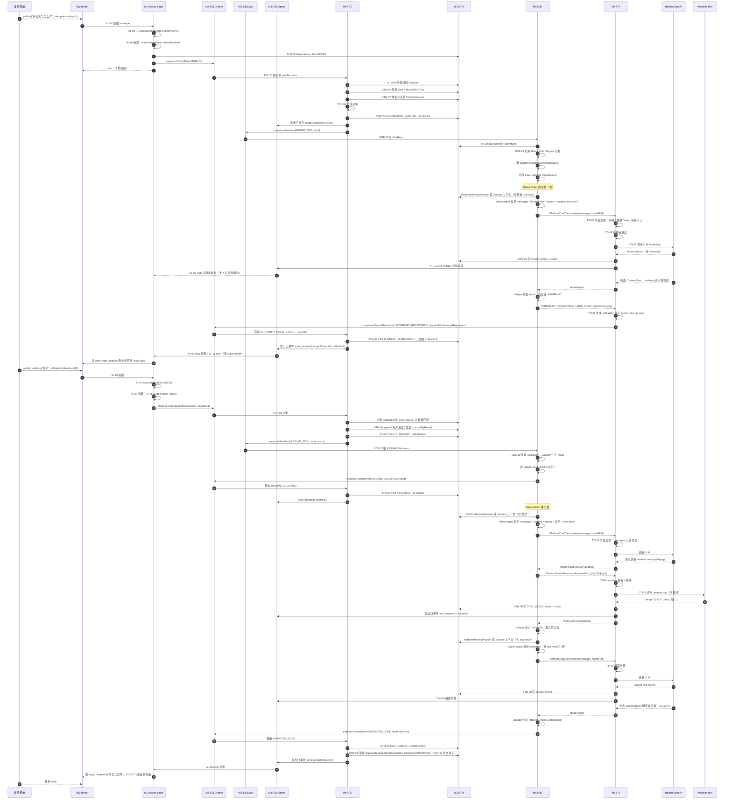

# AgentService 模块 1：Access Layer 功能清单

> 版本：v1（独立设计稿，不引用 spring-ai-ascend 仓库内已有 v1）
> 横切约束（已与用户对齐）：单一内部 Run 状态机 + 对外 A2A TaskState 即时投影；Internal Event Queue 为纯内存实现（保留 SPI 替换能力）。
> 主要参考：A2A-Java SDK（协议契约）、AgentScope-Java A2A 适配器（执行器适配模式）、LangGraph4j（streaming/checkpoint 投影思路）、Conductor（多协议接入与限流幂等模式）。

---

## 1. 模块定位

Access Layer 是 AgentService 的**北向协议接入层**与**对外状态投影层**。

它承担两件事：
1. **入口归一**：把 A2A Server 调用与 MessageQueue 投递两条入口，统一翻译成内部 `AccessIntent` 后投入 Internal Event Queue。
2. **出口投影**：订阅内部 `Run` 事件总线，把内部状态变化即时投影成 A2A `Task` / SSE event / MQ reply / Push Notification 等外部表达。

它**不持有任何执行状态**——Session/Task/Run 都不在这一层。它只做协议⇄内部表达的转换，加上入口侧治理（认证、租户、幂等、限流、deadline、trace）。

## 2. 核心约束

- C1：A2A 协议类型（`io.a2a.spec.*`）严禁泄漏到 Internal Event Queue 下游的任意模块。
- C2：对外 `TaskState` 是内部 Run 状态机的即时投影，不是独立状态机；同一时刻多次查询必须得到一致 snapshot（投影是纯函数）。
- C3：所有写入语义的入口（submit / resume / cancel / callback）必须经过同一治理链后才能进入 IEQ。
- C4：流式与同步出口都不能阻塞 Run 执行；客户端断开后服务端继续完成 Run。
- C5：MQ 消费成功（ack）与业务执行成功是两件事；前者只表示已落入内部责任，后者要走 Run 终态投影回去。
- C6：入口侧承担容量保护责任；下游饱和时必须在 Access Layer 显式拒绝，不许静默丢弃。

## 3. 功能清单总览

| 编号 | 功能名称 | 类别 | 一句话 |
|---|---|---|---|
| AL-01 | A2A Server 端点 | 入口 | 暴露 A2A 规范全部读写方法 |
| AL-02 | MQ 入站消费器 | 入口 | 从外部 broker 拉取 envelope；ack 与业务结果解耦 |
| AL-03 | AccessIntent 归一化 | 入口 | 两种入口统一成同一内部请求对象 |
| AL-04 | 入口治理链 | 入口 | 认证/租户/幂等/限流/deadline/trace，前置于 IEQ 投递 |
| AL-05 | 同步响应投影 | 出口 | Run 终态 → A2A response / MQ reply |
| AL-06 | SSE / Stream 输出投影 | 出口 | 订阅 Run event bus 按 cursor 输出流式事件 |
| AL-07 | 状态查询/拉取 | 出口 | tasks/get 等只读快照查询 |
| AL-08 | Cancel / Resume / Callback 入口 | 入口 | 控制类语义统一入口（取消/补输入/外部回调）|
| AL-09 | Client Capability 注册 | 元数据 | 客户端能力快照（stream/push/inputModes/outputModes）|
| AL-10 | AgentCard 发布 | 元数据 | 对外发布服务自身能力（skills/protocols/inputModes）|
| AL-11 | Push Notification 出站 | 出口 | 状态变更主动 POST 客户端 webhook |
| AL-12 | 入口熔断与降级 | 治理 | 队列满/超限/deadline 不足时显式拒绝 |

## 4. 功能项详述

### AL-01：A2A Server 端点

| 字段 | 内容 |
|---|---|
| 功能描述 | 按 A2A v0.x 规范实现 JSON-RPC over HTTP 端点（必要时同时支持 gRPC），覆盖 `message/send`、`message/stream`、`tasks/get`、`tasks/cancel`、`tasks/resubscribe`、`tasks/pushNotificationConfig/{set,get,list,delete}`、`agent/getCard` 等方法 |
| 输入 | A2A JSON-RPC request、HTTP headers、TLS/JWT 身份材料 |
| 输出 | A2A JSON-RPC response 或 SSE chunked stream；内部投递的 `AccessIntent` |
| 处理流程 | 1) HTTP 接收；2) 解析 JSON-RPC envelope 与 method；3) schema 校验；4) 进入 AL-04 治理链；5) 转 AccessIntent 并提交到 IEQ；6) 等待出口投影返回（同步）或挂载 SSE 写入器（流式）|
| 约束与异常 | 协议版本不兼容→`InvalidParams`/`MethodNotFound`；method 与 payload 冲突直接 400；超时透传 deadline；A2A spec 对象不进入下游 |
| 关联模块 | AL-03（归一化）、AL-04（治理）、AL-05/AL-06（出口投影）、Internal Event Queue（投递点）|
| 参考启发 | `a2a-java/server-common` 中的 TaskManager + AgentExecutor 边界；`spring-ai-a2a` 的 TaskController/MessageController 拆分；`agentscope-extensions-a2a-server` 的 Subscription + cancellation 簿记 |

### AL-02：MQ 入站消费器

| 字段 | 内容 |
|---|---|
| 功能描述 | 订阅外部 broker（RocketMQ/Kafka 等抽象为 SPI），把入站 envelope 翻译为内部 AccessIntent；同时承担消费速率与并发控制 |
| 输入 | broker delivery（topic、key、headers、body）、可选 reply topic / callback descriptor |
| 输出 | 内部 AccessIntent；ack / nack / dead-letter 决策 |
| 处理流程 | 1) 拉取/收到消息；2) 反序列化 envelope；3) 提取 traceCtx / tenantHint / idempotencyKey；4) 进入 AL-04 治理链；5) 异步投递 IEQ；6) 立即 ack（消费层面，业务执行结果由出口侧异步写回 reply 通道）|
| 约束与异常 | 至少一次投递下幂等强制（AL-04 配合）；解析失败/恶意 envelope 进 DLQ；不允许"消费失败 = 业务失败"的混淆；reply topic 不可用时降级为持久化 reply outbox |
| 关联模块 | AL-03、AL-04、AL-05（异步 reply 投影）、Internal Event Queue |
| 参考启发 | Conductor `MessageQueue` + worker poll 模型；AgentScope `rocketmq-transport`；A2A 异步通知方向 |

### AL-03：AccessIntent 归一化

| 字段 | 内容 |
|---|---|
| 功能描述 | 把 A2A / MQ 两种入口的原始 payload 翻译成同一内部请求对象 `AccessIntent`，是 Access Layer 与下游契约的唯一形式 |
| 输入 | 原始 payload、入口类型、reply descriptor、入口附加 metadata |
| 输出 | `AccessIntent { operation, tenantId, principal, sessionHint, taskHint, runHint, payload, replyChannel, deadline, traceCtx, idempotencyKey, clientProfileRef }` |
| 处理流程 | 1) 识别 operation 枚举：SUBMIT / RESUME / CANCEL / QUERY / SUBSCRIBE / CALLBACK；2) 标准化 payload（多模态 content blocks 统一为内部 `ContentBlock` 类型）；3) 解析 hints（sessionId/taskId/runId 可能任意组合存在或缺省）；4) 绑定 replyChannel（SYNC_HTTP / SSE_STREAM / MQ_REPLY / PUSH_NOTIFICATION）；5) 返回 immutable 对象 |
| 约束与异常 | AccessIntent 必须 immutable；下游不得回头读取原始协议对象；多模态 payload 大对象（图/音频）只放引用，不放字节流 |
| 关联模块 | AL-01 / AL-02 → AL-04；STM（消费 hints）；IEQ（投递载荷的实际类型）|
| 参考启发 | AgentScope `AgentRequest` / `AgentRequestOptions`；A2A `MessageSendParams` 字段集合 |

### AL-04：入口治理链

| 字段 | 内容 |
|---|---|
| 功能描述 | 单一治理链统一执行：身份认证 → 租户绑定 → 幂等检测 → 限流 → deadline 预算 → trace 提取，是任何写入语义进入 IEQ 之前的强制门 |
| 输入 | AccessIntent 草稿、入口 metadata（headers/principal/sourceIp 等）|
| 输出 | 加固版 AccessIntent + `IngressContext { authzDecision, idempotencyDecision, traceCtx, deadlineBudget }`；或拒绝响应 |
| 处理流程 | 1) Authentication（解 JWT/mTLS/HMAC 等）；2) Tenant resolve & RBAC；3) idempotency claim：(tenant, idempotencyKey, requestHash) → 新建 or replay；4) 限流：tenant + operation 维度（AL-12 配合）；5) deadline budget：减去入口耗时、判断剩余是否充足；6) traceCtx：W3C TraceContext / B3 头继续 |
| 约束与异常 | 幂等 replay 必须返回等价历史响应（不能再触发执行）；deadline 不足直接 retry-after；treat 任意环节失败为协议级错误，不要进 IEQ；治理结论必须可审计 |
| 关联模块 | AL-01 / AL-02（被调用）；STM（idempotency 存储）；AL-12（容量决策）|
| 参考启发 | Spring Security FilterChain；Stripe-style idempotency；Conductor `idempotent update` |

### AL-05：同步响应投影

| 字段 | 内容 |
|---|---|
| 功能描述 | 对于同步语义入口（HTTP `message/send` 阻塞、MQ 含 reply 标记），等待对应 Run 到达终态或可投影里程碑后，把内部 RunSnapshot 投影为外部协议响应 |
| 输入 | AccessIntent + replyChannel；订阅自 IEQ 的 Run 终态事件 / RunSnapshot |
| 输出 | A2A `Task` JSON-RPC response / MQ reply envelope |
| 处理流程 | 1) 注册 reply 等待器（绑定 runId）；2) 订阅该 Run 的事件流；3) 取到终态或可投影里程碑后，从 STM 拉 RunSnapshot；4) 应用投影函数 `project(RunSnapshot) → A2A.Task`；5) 写回 replyChannel |
| 约束与异常 | 投影必须是**纯函数**（同一 snapshot 输入相同输出）；超过 deadline 返回 "interim Task with state=working" 而不是错误；reply 通道断开不影响 Run 继续 |
| 关联模块 | STM（取 RunSnapshot）；IEQ（订阅终态事件）；状态投影函数与 AL-06 共享 |
| 参考启发 | A2A `Task` 终态投影；AgentScope `AgentScopeAgentExecutor` 的 task updater；Conductor `WorkflowExecutor.getWorkflow` |

### AL-06：SSE / Stream 输出投影

| 字段 | 内容 |
|---|---|
| 功能描述 | 对应 A2A `message/stream` / `tasks/resubscribe`，订阅指定 Run 的事件流，按客户端 cursor 输出 SSE 序列 |
| 输入 | runId、cursor（可选）、客户端 capability、deadline |
| 输出 | SSE event stream：`status-update`、`message-chunk`、`artifact-update`、`tool-progress`、`input-required`、`terminal` |
| 处理流程 | 1) 校验 runId 归属；2) 订阅 Run event bus；3) 按 cursor 跳过已发送事件；4) 应用投影函数把内部 RunEvent 翻译为外部 SSE 事件；5) 写入 HTTP chunked 响应；6) 客户端断开时取消订阅但不取消 Run |
| 约束与异常 | 投影必须 backpressure-aware：慢消费者不得阻塞 Run（用 bounded buffer + drop-oldest 或 disconnect）；cursor 单调递增且与 STM event log 一致；断线 resubscribe 必须能从 cursor 续传 |
| 关联模块 | IEQ（事件订阅）；STM（cursor → eventLog 解析）；AL-12（slow consumer 触发降级）|
| 参考启发 | A2A `message/stream` / `tasks/resubscribe`；AgentScope `Flux<Event>` 模式；LangGraph4j streaming + checkpoint cursor；OpenAI Responses 事件投影 |

### AL-07：状态查询/拉取

| 字段 | 内容 |
|---|---|
| 功能描述 | 处理纯只读查询：`tasks/get`、`tasks/list`（如启用）、自定义只读端点，不触发执行副作用 |
| 输入 | taskId / runId / sessionId、tenantId、可选 fields 投影选择器 |
| 输出 | A2A Task snapshot / 自定义 read DTO |
| 处理流程 | 1) 鉴权 + 租户校验；2) 从 STM 拉 RunSnapshot；3) 应用投影函数（与 AL-05 共享）；4) 返回 |
| 约束与异常 | 严格只读；可能命中过期或已 GC 的 task → 返回明确 NotFound；不可调用 IEQ |
| 关联模块 | STM；与 AL-05 共享投影函数 |
| 参考启发 | A2A `tasks/get`；Conductor `WorkflowResource.getExecutionStatus` |

### AL-08：Cancel / Resume / Callback 入口

| 字段 | 内容 |
|---|---|
| 功能描述 | 把三类控制语义（用户取消、人工补输入 resume、外部 webhook 回调如长耗时第三方工具回调）收敛到同一入口；语义虽不同，但都是**对已存在 Run 的写入控制**而非新 submit |
| 输入 | AccessIntent.operation ∈ {CANCEL, RESUME, CALLBACK}；taskId/runId/callbackId；resume payload 或 callback 回值 |
| 输出 | 控制类内部事件（CancelRequested / ResumeRequested / CallbackArrived）投递到 IEQ |
| 处理流程 | 1) 通过 AL-04 治理；2) 校验 callbackId/taskId 与 tenant、Run、interrupt site 的绑定关系；3) 翻译为对应内部事件；4) 投递 IEQ；5) 同步返回"已受理"（具体 cancel/resume 成败由 TCC 决策） |
| 约束与异常 | callbackId 必须绑定 tenant + run + 具体 interrupt（防止重放到别的 Run）；resume / cancel 必须幂等：重复 resume 同一 callbackId 应返回历史结果而非二次驱动；cancel 与 complete 的竞态在 TCC 用 CAS 决，不在这里决 |
| 关联模块 | AL-04；STM（callback 绑定信息）；IEQ；TCC（控制事件最终消费者） |
| 参考启发 | Temporal signal / cancel；A2A `tasks/cancel`、`input-required` resume；LangGraph4j `updateState` + interrupt resume |

### AL-09：Client Capability 注册

| 字段 | 内容 |
|---|---|
| 功能描述 | 接收并保存客户端能力声明：是否支持 stream / push notification / 哪些 inputModes（text/image/audio/file） / 是否支持 client-hosted tool 等 |
| 输入 | submit/stream 请求中的 capability hint；或独立的 client registration 调用；A2A AgentCard reverse-handshake 信息 |
| 输出 | `ClientProfile { profileId, streamSupported, pushSupported, inputModes, outputModes, hostedSkills, expiresAt }`，由 STM 持久化 |
| 处理流程 | 1) 从入口提取 capability hint；2) 标准化；3) 与已有 profile 合并 or 创建；4) 写入 STM；5) 在 AccessIntent 中携带 profileRef 给下游使用 |
| 约束与异常 | capability 是**时间相关快照**，过期需重新声明；Run 执行中能力失效（如客户端断流）必须可降级为 `input_required` 或 `failed` 而非卡死 |
| 关联模块 | AL-04；STM（持久化 profile）；TCC（决定是否能发起 S2C 调用时读取） |
| 参考启发 | A2A AgentCard / push notification config；AgentScope `clientCapabilities` 提取 |

### AL-10：AgentCard 发布

| 字段 | 内容 |
|---|---|
| 功能描述 | 对外发布本 AgentService 的能力清单：skill 列表、协议（A2A 版本）、inputModes、outputModes、是否支持 streaming/push、认证要求等 |
| 输入 | 来自 Engine Dispatch 的 agent registry summary、安全策略视图、本服务配置 |
| 输出 | A2A AgentCard JSON（按规范），可通过 `agent/getCard` 或独立的 `.well-known/agent.json` 暴露 |
| 处理流程 | 1) 启动时或注册变更时拉 registry summary；2) 经过安全裁剪（去除内部 adapter 细节、密钥、地址等）；3) 缓存并暴露端点 |
| 约束与异常 | 发布能力 ≠ 授权；调用方仍受 AL-04 鉴权约束；不暴露内部 adapter 厂商/版本/路径 |
| 关联模块 | Engine Dispatch（能力源）；AL-01（端点托管） |
| 参考启发 | A2A AgentCard 规范；AgentScope `AgentCardController` |

### AL-11：Push Notification 出站

| 字段 | 内容 |
|---|---|
| 功能描述 | 实现 A2A push notification 语义：客户端预注册 webhook URL + 鉴权方式，Run 状态变更时服务端主动 POST 投影事件给该 webhook |
| 输入 | `tasks/pushNotificationConfig/set` 注册结果；内部 Run 状态变更事件 |
| 输出 | 出站 HTTP POST（携带 A2A push payload + 签名）|
| 处理流程 | 1) 注册时持久化 config（STM）；2) 订阅 Run 事件总线；3) 投影事件；4) 携带签名 POST 到 webhook；5) 失败带指数退避重试 N 次，最终入 DLQ；6) 注销时停止订阅 |
| 约束与异常 | webhook 失败不影响 Run 推进；重试有上限；签名必须包含 tenant/run/timestamp 防重放 |
| 关联模块 | AL-09（client profile 中含 webhook auth）；STM（config 持久化）；IEQ（事件订阅）；AL-12（重试限流） |
| 参考启发 | A2A push notification 规范；Stripe webhook 重试模型 |

### AL-12：入口熔断与降级

| 字段 | 内容 |
|---|---|
| 功能描述 | 在内部资源（IEQ 队列深度、Run 并发数、租户配额、deadline 余量）饱和时，主动在入口拒绝；为不同客户端提供 retry-after 或降级路径 |
| 输入 | IEQ 健康指标；STM 中租户/全局 Run 计数；AccessIntent 的 deadline；ingress 流量计数 |
| 输出 | 拒绝响应：HTTP 429 / A2A `JSONRPCError` / MQ DLQ；附带 retry-after / reason |
| 处理流程 | 1) 周期性采集容量指标；2) 入口每次请求查阈值；3) 触发时按规则拒绝：tenant burst→ 限本租户、global → 限所有、deadline→ 不充足直接拒；4) 关键路径日志与监控埋点；5) 出口慢消费者（AL-06）触发时下游降级 backpressure |
| 约束与异常 | 拒绝必须显式且可观测，禁止静默丢弃；幂等 replay（AL-04 已记录）不被熔断；管理类入口（agent/getCard、tasks/get）应有独立配额池 |
| 关联模块 | IEQ（采集 backlog）；STM（Run 计数）；可观测性 |
| 参考启发 | Resilience4j / Sentinel rate-limiter；Kafka consumer pause；Reactor `onBackpressureDrop` |

## 5. 跨模块数据契约（本模块定义）

```
AccessIntent              -- 北向归一化请求（→ IEQ）
IngressContext            -- 治理链结论（trace/deadline/idempotency）
RunSnapshot               -- 由 STM 提供，用于投影
ClientProfile             -- 客户端能力（→ STM）
PushNotificationConfig    -- 由 AL-11 持久化（→ STM）
```

外部协议形（A2A `Task`、A2A `Message`、A2A AgentCard、SSE chunked、MQ envelope）仅存在于本模块内部，**不向其他模块暴露**。

## 6. 入口⇄出口数据流（最小集）

```
[A2A or MQ ingress] → AccessIntent → AL-04 治理 → IEQ
                                                  ↓
              ┌─────────────────────────────────────────┐
              │  内部模块协作（STM/IEQ/TCC/EDE/TTI）       │
              └─────────────────────────────────────────┘
                                                  ↓
            Run event bus → 投影函数 → SSE / sync reply / push / MQ reply
```

投影函数 = `(RunSnapshot, replyChannel, clientProfile) → ExternalRepresentation`，是 AL-05 / AL-06 / AL-07 / AL-11 共享的纯函数族，必须在本模块内集中实现，禁止下沉到其他模块。

## 7. 与开源参考的对照

| 设计点 | 取自 | 取舍 |
|---|---|---|
| AgentExecutor 边界 | A2A-Java `server-common/AgentExecutor` | 取边界形态，不取实现细节；AgentService 内部用 `EngineEnvelope` 替换 |
| Subscription/Cancellation 簿记 | `agentscope-extensions-a2a-server/AgentScopeAgentExecutor` | 直接借鉴：用 runId 索引 stream subscription，cancel 时一并停掉 |
| Spring Boot 自动装配粒度 | `spring-ai-a2a-server-autoconfigure` | 借鉴 starter 边界划分；不复用其 controller |
| 多入口协议归一 | Conductor `MessageQueue` + REST 双入口 | 借鉴入口侧治理与去重位置 |
| 幂等模型 | Stripe idempotency；Conductor idempotent update | 入口层强制幂等键 + 响应快照 |

## 8. 本模块不做的事（防止职责蔓延）

- 不维护 Session / Task / Run 任何真实状态——状态属于 STM。
- 不直接调度任何 Agent / Tool——这些属于 TCC / EDE / TTI。
- 不进行业务级 prompt 构造或上下文裁剪——这些属于 TTI。
- 不决定 cancel/complete 的竞态结果——属于 TCC。
- 不感知 Run 内部哪个节点正在执行——属于 EDE / TCC。

# AgentService 模块 2：Session Task Manager 功能清单

> 版本：v1（独立设计稿）
> 横切约束：单一内部 Run 状态机 + 对外 A2A TaskState 即时投影；IEQ 纯内存；Session = 一条对话线程；Task 是稳定外部 ID 但不独立持有状态机。
> 主要参考：A2A-Java `TaskManager`/`TaskStore`、AgentScope-Java `AgentSession` 多后端、LangGraph4j `BaseCheckpointSaver`、Conductor `TaskService`/`WorkflowExecutor`、Temporal workflow run attempt。

---

## 1. 模块定位

Session Task Manager（下文简称 STM）是 AgentService 的**状态事实源**。

所有其他模块（M1 / M3 / M4 / M5 / M6）只通过 STM 读写以下实体：

- `Session`：一条对话线程容器，归属于 `(tenantId, userId, agentId)`。
- `Task`：一次外部触发的业务任务的稳定 ID，对外可见，不持有独立状态机。
- `Run`：一次内部完整执行实例。**单一内部状态机的唯一承载者**。一个 Task 可关联多次 Run（多 attempt）。
- `Checkpoint`：Run 内可恢复边界的快照引用。
- `RemoteInvocationHandle`：远端 Agent 协议端点的 handle。
- `ConfigSnapshot`：Run 创建时绑定的模型/工具/adapter/policy 解析快照。
- `IdempotencyRecord`：(tenant, key, hash) → 响应快照。
- `RunEventLog`：Run 顺序事件 + 单调 cursor。
- `ClientProfile` / `PushNotificationConfig`：来自 M1 的客户端元数据。

STM 自身**不调度执行**、**不构造 prompt**、**不调用 tool**——它只对外提供原子化的读写命令与查询。

## 2. 核心约束

- C1：**只有 Run 有真状态机**。Task / Session 没有独立状态机；对外 A2A TaskState 由 latest Run 投影而成。
- C2：**Run 状态迁移必须 CAS + DFA 校验**，禁止非法跃迁；终态不可被覆盖。
- C3：**Session 上下文 append-only**，多并发 resume 不得相互覆盖事实。
- C4：**Task ID 稳定**；retry / 重启不改变 taskId，只产生新 Run。
- C5：**Remote Agent 是协议端点**，不是 Java 对象；handle 丢失不可静默退化为"创建新远端任务"。
- C6：**Checkpoint 必须显式标注外部副作用边界**：未标注的节点不可重放。
- C7：仓储 SPI 化。v1 默认提供内存实现；持久化适配点列清楚但不强制选具体后端。

## 3. 功能清单总览

| 编号 | 功能名称 | 类别 | 一句话 |
|---|---|---|---|
| STM-01 | Session 生命周期 | 实体 | 创建/解析/续命/过期/关闭；复合归属 |
| STM-02 | Task 与 Run 多 attempt 模型 | 实体 | Task 稳定外部 ID；一对多 Run；active pointer |
| STM-03 | Run 状态机存储与原子转移 | 状态 | CAS + DFA；终态不可逆 |
| STM-04 | Session 上下文存储 | 上下文 | 消息历史 / 变量 / memory 引用；append-only |
| STM-05 | Checkpoint 引用与副作用边界 | 恢复 | 可恢复点 + 外部副作用标注 |
| STM-06 | 跨 Run 关联（父子 + 远端协调）| 关联 | parent/child + remote handle；cancel 级联；join 策略 |
| STM-07 | 配置快照 | 一致性 | Run 创建时绑定的模型/工具/adapter/policy 快照引用 |
| STM-08 | 幂等键存储与 replay 决策 | 治理 | (tenant, key, hash) → response snapshot |
| STM-09 | Run Event Log + Cursor | 事件 | 顺序事件 + 单调 cursor；流式续传与审计共享底座 |
| STM-10 | 客户端元数据与 TTL 清理 | 元数据 | ClientProfile / PushConfig 持久化；Session/Task/Run/handle 的 GC |

## 4. 功能项详述

### STM-01：Session 生命周期

| 字段 | 内容 |
|---|---|
| 功能描述 | 定义 Session 的创建、解析、续命、过期、关闭语义。Session 是一条对话线程容器，归属于 `(tenantId, userId, agentId)` |
| 输入 | AccessIntent.sessionHint、tenant、principal、agentId；可选 TTL 配置 |
| 输出 | `SessionRecord { sessionId, tenantId, userId, agentId, createdAt, expiresAt, lastActivityAt, status }` |
| 处理流程 | 1) 入参带 sessionId → 校验归属 + 检查 status；2) 不带 → 在 `(tenant, user, agent)` 下创建新 Session 并发分配 ID；3) 每次活动更新 lastActivityAt；4) 显式 close / 超过 TTL → 标记 closed 但保留事实供审计 |
| 约束与异常 | sessionId 必须 tenant scoped，跨租户引用直接拒绝；同一 `(tenant, user, agent)` 下并发可有多个 Session；匿名/未鉴权请求需独立的短 TTL 池 |
| 关联模块 | M1（sessionHint 来源）、STM-04（上下文挂载点）、STM-10（GC 闭环）|
| 参考启发 | AgentScope `AgentSession` / `InMemoryAgentSession` / `RedisAgentSession`；Solon AI session 多后端；OpenAI Agents sessions |

### STM-02：Task 与 Run 多 attempt 模型

| 字段 | 内容 |
|---|---|
| 功能描述 | 定义 Task 作为对外稳定 ID 与 Run 作为内部 attempt 承载者的关系。一个 Task 可对应多个 Run；最新 Run 为 active；历史 Run 保留 |
| 输入 | submit AccessIntent + sessionId；或 retry/restart 指令 + 原 taskId |
| 输出 | `TaskRecord { taskId, sessionId, tenantId, agentId, createdAt, latestRunId, attemptCount }`，配套创建首个 `RunRecord` |
| 处理流程 | 1) 创建 Task 与第一个 Run；2) retry / 用户驱动重启 → 在 Task 下创建新 Run，更新 latestRunId 与 attemptCount；3) 对外查询 Task 时透传 latest Run 的当前状态投影 |
| 约束与异常 | Task ID 稳定，不随 attempt 变化；attemptCount 必须递增（CAS）；终态 Task 上不应再启动新 Run，除非显式 reopen 策略；Run 间上下文继承经由 Session 而非 Task 内部字段 |
| 关联模块 | STM-01（session 关联）、STM-03（Run 创建）、STM-07（每 Run 绑定 ConfigSnapshot）|
| 参考启发 | A2A `Task` 稳定 ID；Conductor `workflowId` + `workflowRunId`；Temporal `WorkflowExecution.runId` 概念 |

### STM-03：Run 状态机存储与原子转移

| 字段 | 内容 |
|---|---|
| 功能描述 | Run 的状态机持久化与原子转移；状态机为：`CREATED → QUEUED → RUNNING → (SUSPENDED ⇄ RESUMING) → COMPLETED / FAILED / CANCEL_REQUESTED → CANCELLED`。这是全服务**唯一**真实状态机 |
| 输入 | runId、当前期望 fromState、targetState、actor、reason；可选的 stateData patch（如失败原因、终态产物引用） |
| 输出 | 转移结果：`Applied { newState, stateData } / Rejected { reason }`；并发出 Run 事件到 STM-09 |
| 处理流程 | 1) CAS 读取当前 state；2) DFA 校验 fromState→targetState 合法；3) 终态不可逆，已是 COMPLETED/FAILED/CANCELLED 直接 reject；4) 应用并写入；5) 写 RunEvent；6) 触发对应订阅 |
| 约束与异常 | CANCEL_REQUESTED 与 COMPLETED 的竞态：先到先决；SUSPENDED 状态必须绑定 interrupt 元数据（reason、callbackId）；并发 transition 必须串行化（per-runId 序）|
| 关联模块 | M4（唯一驱动转移者）、M1（投影）、STM-09（事件回写）|
| 参考启发 | A2A `TaskState.isFinal()/isInterrupted()`；Temporal workflow state machines；Conductor `WorkflowStatus` CAS；LangGraph4j `RunnableConfig` + `interruptsBefore/After` |

### STM-04：Session 上下文存储

| 字段 | 内容 |
|---|---|
| 功能描述 | 存储 Session 跨 Run 共享的上下文事实：对话消息历史（typed ContentBlock）、用户/系统变量、memory reference、工具结果摘要。**STM-04 是上下文事实源，不参与 prompt 拼装**——上下文读取由 M6 的 `PlatformMemoryProvider` SPI 转发提供，Agent 自取后按自己的 prompt 策略组装 |
| 输入 | sessionId、append item（Msg / Variable / MemoryRef / ToolResultSummary）、actor、causedByRunId |
| 输出 | `SessionSnapshot { sessionId, version, messages, variables, memoryRefs, toolSummaries }`；version 单调递增 |
| 处理流程 | 1) 接收 append；2) 类型校验（Msg 必须含 role、ContentBlock 列表）；3) version + 1 原子写入；4) 暴露按 version cursor 的读 API 供 `PlatformMemoryProvider` 转发；5) 写入路径：M4 TCC-06B resume 注入用户输入 / adapter 经事件让 STM-04 追加 assistant message / TTI-11 写 tool result 摘要 |
| 约束与异常 | **append-only**；多并发 resume 不得相互覆盖；大 payload（图/音频）只存引用，字节流走外部 blob store；version 冲突需返回明确 CAS 错误而非静默合并；**不存"已拼好的 prompt"**——只存原子事实，prompt 形态由 Agent 在调用 model 前临时组装 |
| 关联模块 | M6 PlatformMemoryProvider（读路径）、M4 TCC-06B（resume 时写用户输入）、TTI-11（tool result 摘要写入）、STM-01 |
| 参考启发 | AgentScope `InMemoryMemory` + `WorkspaceSession` 分层；LangGraph4j `AgentState` partial update + reducer 思路 |

### STM-05：Checkpoint 引用与副作用边界

| 字段 | 内容 |
|---|---|
| 功能描述 | 在 Run 的可恢复边界记录 Checkpoint 引用，并对每个 checkpoint 显式标注**是否已产生外部副作用**（如已发出 webhook / 已扣费），决定能否重放 |
| 输入 | runId、checkpointId、nodeKey、engineStateRef、sideEffectFlag、attemptId |
| 输出 | `CheckpointRecord { runId, checkpointId, createdAt, nodeKey, engineStateRef, sideEffect: NONE/PARTIAL/COMMITTED, recoveryPolicy }` |
| 处理流程 | 1) 在执行流到达可恢复边界时由 M4/M5 调用；2) 校验 engineStateRef 有效；3) 写入；4) 关联到当前 Run 的 checkpoint chain |
| 约束与异常 | sideEffect=COMMITTED 的 checkpoint 不可作为 retry 起点（除非显式策略允许"前移"）；nodeKey 必须与 engine 侧 schema 一致；checkpoint 不存执行体本身，只存引用 |
| 关联模块 | M5（创建源）、M4（消费 + 决策 retry 起点）|
| 参考启发 | LangGraph4j `BaseCheckpointSaver`（list/get/put/release）；Temporal retry boundary；AgentScope 工具结果落盘策略 |

### STM-06：跨 Run 关联（父子 + 远端协调）

| 字段 | 内容 |
|---|---|
| 功能描述 | 统一管理 Run-to-Run 的协调引用：子 Run / 子 Agent 的父子关系，以及远端 Agent 协议端点的 handle。两者都需要 cancel 级联 / 完成回写 / 结果路由 |
| 输入 | parentRunId、childKind ∈ {LOCAL_CHILD_RUN, REMOTE_AGENT}、handle 字段（childRunId 或 remoteAgentId/remoteTaskId/remoteThreadId/callbackId）、joinPolicy |
| 输出 | `CorrelationRecord { parentRunId, childKind, handle, joinPolicy ∈ {ALL/ANY/BACKGROUND/FIRE_AND_FORGET}, status }`，其中 `handle` 为 discriminated union：`LocalChildHandle { childRunId }` \| `RemoteAgentHandle { remoteAgentId, remoteTaskId, remoteThreadId, callbackId }`；handle 字段允许 partial（M4 创建时为空骨架，M5 拿到远端 handle 后 CAS 更新） |
| 处理流程 | 1) **M4 TCC-09 创建** CorrelationRecord（带 parentRunId / childKind / joinPolicy / handle=empty / status=PENDING）；2) **M5 在发起子调用拿到 handle 后**通过 CAS 把 handle 字段填实（PENDING→ACTIVE）；3) 子 Run 到终态 / 远端 callback 到达时按 joinPolicy 推进父 Run；4) 父 Run cancel 时按级联策略向子方发 CANCEL 信号 |
| 约束与异常 | 远端 handle 必须完整（缺 callbackId 不允许写入）；handle 丢失绝不能静默重试为新远端任务，必须显式 reject；BACKGROUND 子任务的终态不再阻塞父 Run 但仍记录到 Session；级联 cancel 需带超时与 best-effort 语义 |
| 关联模块 | M4（drive cancel/resume）、M5（发起远端调用 / 子 Run）、STM-03（父 Run 状态推进）|
| 参考启发 | AgentScope Runtime `Runner` / `AgentHandler` 远端语义；A2A 远端 Task；OpenAI Agents handoff；Temporal child workflow + cancel propagation |

### STM-07：配置快照

| 字段 | 内容 |
|---|---|
| 功能描述 | Run 创建时把当时已解析的模型 / 工具集 / Agent adapter / routing policy / 安全策略冻结为快照引用；Run 的整个生命周期内执行/resume/retry 都引用同一快照 |
| 输入 | runId、resolvedConfigSet（模型 ID + 版本、工具白名单 + 版本、adapter 选择、policy hash 等）|
| 输出 | `ConfigSnapshotRef { snapshotId, hash, frozenAt, fields }`，写到 RunRecord 上；其中 `hash` 为 fields 内容的 content-hash，用于 M5 EDE-06 缓存 key 的等价性校验 |
| 处理流程 | 1) Run 创建前由 M4 解析当下生效配置；2) 写入快照；3) Run 内任何执行点引用同一 snapshotId；4) 配置热更需要时生成 drift 事件，不静默改变正在执行的 Run |
| 约束与异常 | 同一 snapshotId 多次读取必须等价；配置中含敏感字段（密钥）只存引用，不存明文；不同 Run（哪怕属同一 Task）可绑定不同 snapshot |
| 关联模块 | M5（执行时读快照）、M4（创建快照）、M1（policy view 输入源）|
| 参考启发 | Temporal deterministic config discipline；Conductor `workflowDefVersion`；LangGraph4j `CompileConfig` immutability |

### STM-08：幂等键存储与 replay 决策

| 字段 | 内容 |
|---|---|
| 功能描述 | 给入口治理链（M1 AL-04）提供幂等基础设施：`(tenantId, idempotencyKey, requestHash)` → 历史响应快照；区分 fresh / replay / conflict 三种决策 |
| 输入 | tenant、idempotencyKey、requestHash、（终态时）responseSnapshot |
| 输出 | `IdempotencyDecision ∈ { FRESH, REPLAY(responseSnapshot), CONFLICT(differingHash) }`；后续 `IdempotencyRecord` 更新 |
| 处理流程 | 1) M1 入口侧调用 claim：键存在且 hash 同 → REPLAY，hash 异 → CONFLICT，否则 FRESH 并占位；2) 业务终态时回填 responseSnapshot；3) 过期清理由 STM-10 |
| 约束与异常 | submit/resume/cancel 都需独立幂等键空间；同一键 fresh 占位但未终态时再次到来 → 直接返回"进行中"而非阻塞；replay 不重新触发执行 |
| 关联模块 | M1（消费者）、STM-10（TTL）|
| 参考启发 | Stripe idempotency；Conductor `idempotentUpdate`；JSON-RPC 重放安全 |

### STM-09：Run Event Log + Cursor

| 字段 | 内容 |
|---|---|
| 功能描述 | 为每个 Run 维护一个**顺序事件日志**（per-run，单调 cursor），覆盖状态转移、可投影里程碑、tool progress、HITL 中断、终态等。是 SSE 续传与审计的共享物质底座 |
| 输入 | runId、event（type、payload、timestamp、causality）|
| 输出 | 写入 cursor；读 API：按 cursor 范围读取；订阅 API：增量 push |
| 处理流程 | 1) STM-03/M4/M5/M6 在关键点 append event；2) cursor 单调递增（per run）；3) M1 AL-06 通过订阅 + cursor 续传；4) v1 内存实现；GC 由 STM-10 |
| 约束与异常 | 同一 run 内 cursor 严格单调；事件 immutable；payload 不携带敏感字段明文（用引用）；事件结构与外部协议解耦——投影由 M1 完成 |
| 关联模块 | STM-03、M1 AL-06/AL-11、M4/M5/M6（多源生产者）|
| 参考启发 | LangGraph4j `getStateHistory` / streaming；A2A `tasks/resubscribe` cursor；Temporal history events |

### STM-10：客户端元数据与 TTL 清理

| 字段 | 内容 |
|---|---|
| 功能描述 | 持久化非状态机类元数据：`ClientProfile`（M1 AL-09 来源）、`PushNotificationConfig`（M1 AL-11 来源）；同时承担所有实体（Session / Task / Run / Checkpoint / Handle / Idempotency / EventLog）的 TTL 与 GC |
| 输入 | profile/config write、TTL 策略（per-tenant / per-entity）、GC 触发器（周期 / 容量阈值）|
| 输出 | metadata 读写 API；GC 报告（清理数量、未清理原因）|
| 处理流程 | 1) profile/config 写入：tenant scoped、过期时间显式；2) GC：终态 Run 保留期 / 未活动 Session 过期 / 失效幂等键 / 已发送 EventLog 截断；3) GC 触发但 active 实体不清理；4) M1 AL-12 通过本模块读到全局存量做容量决策 |
| 约束与异常 | 终态 Run 仍保留审计期内可读；正在被 SSE 订阅的 EventLog 不能在订阅终止前截断；带 PushNotificationConfig 的 Run 在最终 webhook 投递完成前不入 GC 候选 |
| 关联模块 | 所有模块（共同治理对象）|
| 参考启发 | Conductor `archival` policy；Temporal retention；OpenTelemetry / Stripe webhook retention |

## 5. 跨模块数据契约（本模块定义）

```
SessionRecord
TaskRecord
RunRecord                 -- 含 status, latestCheckpointId, configSnapshotRef
SessionSnapshot           -- 带 version cursor
CheckpointRecord
CorrelationRecord         -- 父子 / 远端 handle 统一形
ConfigSnapshotRef
IdempotencyRecord
RunEvent + cursor
ClientProfile
PushNotificationConfig
```

所有契约都是 **immutable value object**，写入命令是原子操作。

## 6. 仓储 SPI 形态（v1）

```
SessionRepo
TaskRepo
RunRepo                   -- 必须支持 per-runId 的 CAS 转移
SessionContextRepo        -- append-only + version cursor
CheckpointRepo
CorrelationRepo
ConfigSnapshotRepo
IdempotencyRepo
RunEventLogRepo           -- append + cursor 订阅
ClientMetadataRepo
```

- v1 默认实现：纯内存（`ConcurrentHashMap` + `AtomicLong cursor` + 简单 lock-per-runId）。
- 持久化适配点保留：每个 Repo 接口的实现可替换为 JPA / Redis / 自定义后端，不强制 v1 选型。
- **唯一硬性要求**：`RunRepo` 的状态转移必须保证 per-runId 串行 + CAS。

## 7. 与开源参考的对照

| 设计点 | 取自 | 取舍 |
|---|---|---|
| Task / Run 分离 | A2A-Java + Temporal | 单一 Task 多 attempt；只有 Run 有真状态机 |
| Session 多后端 SPI | AgentScope `AgentSession` / Solon | v1 不强制选后端，SPI 化 |
| Checkpoint 副作用标注 | LangGraph4j（未原生提供）+ Temporal retry | 平台必须主动加这一层，否则 retry 会破坏外部副作用 |
| Event Log + Cursor | LangGraph4j stateHistory + A2A resubscribe | 作为流式续传与审计共享底座 |
| 配置快照 | Temporal deterministic discipline | 防止运行中配置漂移 |
| 幂等 | Stripe / Conductor | 入口治理 + STM 存储分离 |
| 远端 handle | AgentScope Runtime + A2A 远端 task | handle 丢失绝不静默重建 |

## 8. 本模块不做的事（防止职责蔓延）

- 不构造 prompt / 不裁剪上下文 / 不计算 token 预算——属于 M6。
- 不调度 Run 状态迁移——M4 是唯一的转移驱动者；STM 只提供 CAS 原语。
- 不调用 Engine / 不调用 Tool——属于 M5 / M6。
- 不做投影到外部协议——属于 M1。
- 不做事件路由 / 异步分发——属于 M3。
- 不决定 retry 策略或回退节点——属于 M4（决策）+ M5（执行），STM 只读写事实。

# AgentService 模块 3：Internal Event Queue 功能清单

> 版本：v1（独立设计稿）
> 横切约束：纯内存实现 + SPI 持久化预留；三通道分层（控制 / 数据 / 出口）；每通道**强一致单分区 FIFO**；跨通道无序；per-Run 因果由 STM-09 cursor 担保；cancel/complete race **不在 IEQ 仲裁**，交 STM-03 CAS+DFA 决断。
> 主要参考：Reactor `Sinks` / `Flux` / `onBackpressure*`；Disruptor 单生产者-多消费者环；LangGraph4j stream 投影；Conductor `MessageQueue` SPI；Kafka topic+partition 顺序契约（取语义不取实现）。

---

## 1. 模块定位

Internal Event Queue（下文简称 IEQ）是 AgentService 内部所有异步消息流转的**单一物质底座**。

它承担两件事：
1. **解耦同步入口与异步执行**：M1 / M4 / M5 / M6 之间所有跨模块调用都经 IEQ 投递，禁止直接方法调用驱动跨模块状态。
2. **为出口投影提供 fan-out 与续传衬底**：M1 的 SSE / Push / sync reply / MQ reply 共享同一份内部事件流。

它**不持有任何持久状态**——状态写入交 STM；它只承载**事件在途**这一段语义。它**不仲裁状态机竞态**——race 由 STM-03 CAS+DFA 拒绝非法跃迁。它**不重试业务**——重试由 M4 决策、M5 执行。

## 2. 核心约束

- C1：**三通道分层**：控制平面（Control）、数据平面（Data）、出口平面（Egress）三个独立通道，配额、背压、消费者各自独立。
- C2：**每通道强一致单分区 FIFO**：通道内所有 enqueue 严格按到达顺序对所有消费者可见；不依赖时间戳推断顺序。
- C3：**跨通道无顺序保证**：cancel 信号到达控制通道与某 work item 在数据通道的相对位置无定义；因果由 STM-09 per-Run cursor 担保。
- C4：**bounded buffer + 显式拒绝**：每通道独立水位，满时返回 `RejectedEnqueue`；下游饱和时由 M1 AL-12 转换为外部协议错误，禁止静默丢弃。
- C5：**消费成功 ≠ 业务成功**：consumer 从 IEQ 取出事件即视为消费成功；业务执行结果通过 STM-03 状态转移 + 出口事件回写。
- C6：**event 是 immutable value**：投递后任何模块不得修改 envelope；后续修订需以新事件 append。
- C7：**敏感载荷只放引用**：原始 prompt / 大对象 / 密钥不进入事件载荷；事件携带 STM 引用 ID，由 consumer 按需拉取。
- C8：**SPI 化**：v1 默认 in-memory（基于 `Sinks.Many` / 有界 `LinkedBlockingQueue` + 每通道独立线程池）；持久化适配点保留但不强制具体后端。

## 3. 功能清单总览

| 编号 | 功能名称 | 类别 | 一句话 |
|---|---|---|---|
| IEQ-01 | 三通道拓扑与隔离 | 拓扑 | 控制 / 数据 / 出口三通道；独立背压、独立配额、独立消费者池 |
| IEQ-02 | 控制通道 | 通道 | 投递 AccessIntent / cancel / resume / callback / deadline 信号 |
| IEQ-03 | 数据通道 | 通道 | 投递 RunWorkItem：engine dispatch、tool call、子 Agent 调用 |
| IEQ-04 | 出口通道（Run Event 发布订阅）| 通道 | per-Run topic fan-out 给 SSE / Push / MQ reply |
| IEQ-05 | 单分区 FIFO 顺序契约 | 顺序 | 每通道 FIFO；跨通道无序；per-Run 因果落到 STM-09 cursor |
| IEQ-06 | 背压、bounded buffer 与拒绝策略 | 治理 | 每通道独立水位；满 → `RejectedEnqueue`，由 AL-12 翻译外部错误 |
| IEQ-07 | 通道内优先级与饥饿防护 | 治理 | 控制通道内 cancel/deadline 高于普通 control；数据通道 per-Run fairness |
| IEQ-08 | 消费者注册与并发模型 | 拓扑 | 工厂 + 并发度声明；每通道独立 worker pool；handler 异常隔离 |
| IEQ-09 | 出口订阅 + cursor 续传 | 订阅 | per-Run topic + fromCursor；先 STM-09 backfill 再切 live tail |
| IEQ-10 | 健康指标与水位上报 | 观测 | depth / lag / drop / reject 计数；供 AL-12、运维使用 |
| IEQ-11 | 持久化 SPI 与 outbox 适配点 | 扩展 | v1 内存；SPI 保留替换为 Kafka/Pulsar/JDBC outbox |

## 4. 功能项详述

### IEQ-01：三通道拓扑与隔离

| 字段 | 内容 |
|---|---|
| 功能描述 | 在 AgentService 进程内部署三个语义独立的通道：**Control / Data / Egress**。每通道有自己的 enqueue 入口、bounded buffer、消费者池、水位阈值与拒绝策略；相互不共享线程池与缓冲区 |
| 输入 | 模块在启动时通过 SPI 声明所需通道与 handler；运行时通过通道句柄 enqueue |
| 输出 | `ChannelHandle<TEvent>` 用于发布；`ChannelSubscriber` 用于订阅 |
| 处理流程 | 1) 启动期：注册三通道，绑定独立的有界 buffer 与 worker 工厂；2) 运行期：发布者拿对应通道句柄 enqueue；3) 消费者由通道独立 worker pool 拉取 |
| 约束与异常 | 同一事件不允许跨通道复用；某通道故障（OOM / 死锁）不得拖垮其他通道；每通道资源（buffer / worker）独立配置 |
| 关联模块 | M1 AL-04（投递控制通道入口）、M4（控制 → 数据 工作项产生）、M5（数据消费 + 出口产生）、M1 AL-06/11（出口订阅）|
| 参考启发 | Reactor `Sinks.many().multicast()`；Kafka topic 隔离；Disruptor 多 RingBuffer 隔离 |

### IEQ-02：控制通道

| 字段 | 内容 |
|---|---|
| 功能描述 | 承载所有**写入语义控制信号**：来自 M1 AL-04 治理后的 `AccessIntent`（SUBMIT/RESUME/CANCEL/CALLBACK），以及内部模块产生的 deadline-tick / timeout-fired 等 |
| 输入 | `ControlEvent { kind, tenantId, runHint, payloadRef, traceCtx, deadline, enqueuedAt }` |
| 输出 | 由 M4 控制层 worker 消费 → 触发 STM-03 状态转移或子任务派发 |
| 处理流程 | 1) M1 AL 完成治理后 enqueue；2) 控制 worker 拉取；3) 经 M4 解析 → 调用 STM-03 状态转移；4) 必要时派生数据通道工作项 |
| 约束与异常 | 控制信号必须**显式幂等键**（来自 AL-04 IngressContext.idempotencyKey）；重复投递依据 STM-08 决策 REPLAY；严禁把数据载荷塞进控制通道 |
| 关联模块 | M1 AL-04、M4（唯一消费者）、STM-03/STM-08 |
| 参考启发 | Temporal signal channel；A2A `tasks/cancel`、`input-required` resume |

### IEQ-03：数据通道

| 字段 | 内容 |
|---|---|
| 功能描述 | 承载**Run 内部执行工作项**：engine dispatch、tool call、子 Agent 调用、checkpoint 边界事件等。这是 Run 被实际推进的物质载体 |
| 输入 | `WorkItem { runId, kind ∈ {ENGINE_TICK, TOOL_INVOKE, CHILD_RUN_START, CHECKPOINT, RESUME_TICK}, payloadRef, configSnapshotRef, parentCursor, enqueuedAt }` |
| 输出 | 由 M5 / M6 worker 消费 → 调用 Engine / Tool 适配器；产生新的 work item 或出口事件 |
| 处理流程 | 1) M4 决策后产生工作项；2) 数据 worker 拉取并按 kind 分发到 M5（dispatch）或 M6（tool intercept）；3) 执行结果回写：状态转移走控制通道 / 投影事件走出口通道 |
| 约束与异常 | payloadRef 必须可解析（指向 STM）；configSnapshotRef 与 Run 绑定的快照一致；同一 runId 的工作项不要求严格全局 FIFO，但 per-runId 顺序由 M4 调度保证（IEQ 提供 fairness 配合，不替 M4 排序） |
| 关联模块 | M4（唯一生产者）、M5/M6（消费者）、STM-07（snapshot ref） |
| 参考启发 | Conductor `TaskQueue`；Temporal task queue；LangGraph4j 节点执行队列 |

### IEQ-04：出口通道（Run Event 发布订阅）

| 字段 | 内容 |
|---|---|
| 功能描述 | 承载**对外可见的 Run 投影事件**：状态变化、token chunk、tool progress、artifact、input_required、terminal。以 per-Run topic 形式 fan-out 给多种出口订阅者（SSE / Push / MQ reply / 同步 reply 等待器）|
| 输入 | `RunEvent { runId, cursor, kind, payloadRef, projectionHints, emittedAt }`（cursor 由 STM-09 单调递增分配） |
| 输出 | 多订阅者增量消息流；不同订阅者各自维护本地 cursor |
| 处理流程 | 1) STM-03 状态转移 / M5 / M6 在关键里程碑通过出口通道发布；2) 同步先写 STM-09 cursor，再投递到出口通道（保证 cursor 与事件可见性一致）；3) 订阅者按 runId topic 订阅；4) 关闭订阅不影响 Run 推进 |
| 约束与异常 | 慢消费者必须背压隔离：bounded fan-out buffer + drop-oldest **仅作用于该订阅者**，不得阻塞 publisher；订阅者断开 → 停止订阅但 STM-09 历史保留供 resubscribe；payload 不携带敏感字段明文 |
| 关联模块 | STM-09（事件落库 + cursor 来源）、STM-03/M5/M6（生产者）、M1 AL-05/06/07/11（消费者）|
| 参考启发 | Reactor `Sinks.many().multicast().onBackpressureBuffer()`；Kafka per-key topic；A2A `tasks/resubscribe` |

### IEQ-05：单分区 FIFO 顺序契约

| 字段 | 内容 |
|---|---|
| 功能描述 | 显式定义本平台事件顺序契约：**每通道全局单分区 FIFO**（同一通道所有消费者看到同一序列）；**跨通道无序**；**per-Run 因果**由 STM-09 cursor 与 M4 调度共同担保，而非依赖 IEQ |
| 输入 | enqueue 操作发生时间 |
| 输出 | 通道内 enqueue 顺序 = 消费可见顺序的硬保证 |
| 处理流程 | 1) v1 内存实现：每通道单一线程串行 dispatch（或单生产者 ring）；2) 跨通道事件因果如需建立 → 由 M4 在产生事件时把 parentCursor 写入 envelope；3) 文档化跨通道无序约束，迫使所有消费者不依赖跨通道相对顺序 |
| 约束与异常 | **不依赖系统时钟**进行排序——单分区 FIFO 保证不是时间戳，而是 enqueue 序；分布式部署时单分区可水平扩展为 partition by runId 的多分区，但**单 runId 仍由 M4 串行化保证**，不在 IEQ 解决 |
| 关联模块 | STM-09（per-Run cursor）、M4（per-Run 串行化驱动者）、所有生产者/消费者 |
| 参考启发 | Kafka 单 partition 顺序保证；Disruptor producer barrier；Reactor `publishOn(single())` |

### IEQ-06：背压、bounded buffer 与拒绝策略

| 字段 | 内容 |
|---|---|
| 功能描述 | 每通道独立 bounded buffer + 水位阈值；满载时 `enqueue` 返回**显式 RejectedEnqueue**；不同通道有不同的拒绝语义（控制通道偏向"拒绝并 retry-after"，数据通道偏向"按租户 fairness 拒绝"，出口通道偏向"per-subscriber drop-oldest"） |
| 输入 | enqueue 调用、当前 depth、配置阈值（lowWatermark / highWatermark / hardCap）|
| 输出 | `EnqueueResult ∈ { ACCEPTED, REJECTED(reason, retryAfterHint) }` |
| 处理流程 | 1) enqueue 前查 depth；2) 超 hard cap → REJECTED；3) 介于 high/hard 之间 → 按通道策略（控制通道仍接受 cancel/timeout 关键信号；普通信号拒绝）；4) 出口通道每订阅者独立 buffer，slow subscriber 触发 drop-oldest 而非阻塞 publisher |
| 约束与异常 | **绝不静默丢弃**——拒绝必须可观测、计数；rejected 信号回传 AL-12 决定外部协议响应；buffer 大小可 per-tenant 调优（v1 全局即可，hooks 留好） |
| 关联模块 | M1 AL-12（消费拒绝信号）、IEQ-10（指标）、所有生产者 |
| 参考启发 | Reactor `onBackpressureBuffer/Drop/Latest`；Kafka producer `block.on.buffer.full`；Sentinel limit policy |

### IEQ-07：通道内优先级与饥饿防护

| 字段 | 内容 |
|---|---|
| 功能描述 | 在 FIFO 基础上为关键事件提供有限的优先级覆盖：**控制通道**支持 `priority ∈ {CRITICAL, NORMAL}`，CRITICAL 用于 cancel / deadline-fired 等不能排队等待的信号；**数据通道**采用 per-Run fairness（轮转分配 worker），防止单 Run 大量 work item 饿死其他 Run |
| 输入 | enqueue 时携带 priority hint；运行时 fairness 调度状态 |
| 输出 | 调度顺序（CRITICAL 跳过 NORMAL；同 priority 内 FIFO） |
| 处理流程 | 1) 控制通道：双队列结构，CRITICAL 队列优先取；NORMAL 队列饥饿时按比例提升；2) 数据通道：per-runId 子队列轮转；3) 出口通道：纯 FIFO，**不引入优先级**（避免投影乱序） |
| 约束与异常 | 优先级仅是**通道内**调度，不破坏 IEQ-05 跨事件可见性单调；CRITICAL 滥用会反向阻塞 → 限定来源仅限 M1 AL-04（cancel）与 M4 内部 deadline-tick |
| 关联模块 | M1 AL-04（产生 CANCEL CRITICAL）、M4（产生 deadline-tick CRITICAL；per-Run fairness 配合）|
| 参考启发 | RabbitMQ priority queue；Java `PriorityBlockingQueue`；Linux CFS fairness |

### IEQ-08：消费者注册与并发模型

| 字段 | 内容 |
|---|---|
| 功能描述 | 提供消费者注册 SPI：模块声明 `(channel, handlerFactory, concurrency, errorPolicy)`；IEQ 据此创建 worker pool，handler 在 worker 线程上执行；handler 异常隔离不下一条工作项 |
| 输入 | `ConsumerSpec { channelKind, handlerFactory, concurrency, errorPolicy ∈ {LOG_AND_CONTINUE, NACK, DLQ} }` |
| 输出 | `ConsumerHandle`（停止 / 健康查询） |
| 处理流程 | 1) 启动期注册；2) 创建 N 个 worker 线程（虚线程或受限平台线程）；3) 每个 worker 取事件 → 调用 handler；4) handler 抛异常按策略处理；5) 优雅关停时排空 in-flight |
| 约束与异常 | handler 必须**纯异步语义安全**（不长时间 block worker；阻塞调用必须切到独立 IO 线程）；同一 channel 多 handler 时事件由 IEQ 选择**单一 handler 投递**（不多消费者同事件，避免重复执行）；出口通道是例外——多订阅者各自独立投递 |
| 关联模块 | M4 / M5 / M6（消费者声明者）、IEQ-10（worker 健康指标）|
| 参考启发 | Spring `@KafkaListener` containerFactory；Conductor worker；Reactor `subscribeOn` 调度 |

### IEQ-09：出口订阅 + cursor 续传

| 字段 | 内容 |
|---|---|
| 功能描述 | 出口通道的特殊订阅 API：订阅者可以传入 `fromCursor`（来自上次断开位置）。IEQ **先从 STM-09 拉历史事件 backfill**，到达 live tail 后**原子切换**到实时订阅，全过程对消费者表现为单调递增的事件流 |
| 输入 | `SubscribeRequest { runId, fromCursor?, subscriberId }` |
| 输出 | `Flux<RunEvent>` / `Flow.Publisher<RunEvent>`；保证 cursor 单调递增、不重不漏 |
| 处理流程 | 1) 校验 runId 与 tenant；2) 若 fromCursor < tail：先注册 live buffer（避免 backfill 期间漏事件），再从 STM-09 按 cursor 拉历史；3) 发完历史后将 live buffer 中 cursor > 已发位的事件去重投递；4) 转入实时；5) 客户端断开 → 取消订阅 |
| 约束与异常 | backfill 期间产生的实时事件必须保留在 live buffer 中（per-subscriber），防止漏事件；cursor 单调严格——即便 backfill+live 切换处也不重复 / 不跳变；只读，不能 replay 控制 / 数据通道（C 与 D 的事件不开放重放——避免重复执行） |
| 关联模块 | STM-09（cursor + 历史事件源）、M1 AL-06/11（消费者）|
| 参考启发 | Kafka `seek` + consumer poll；A2A `tasks/resubscribe`；Reactor `concat(historical, live)` 模式 |

### IEQ-10：健康指标与水位上报

| 字段 | 内容 |
|---|---|
| 功能描述 | 为每通道、每消费者、每 per-Run subscriber 暴露指标：queue depth、enqueue rate、consume rate、reject count、drop count、handler exception count、p50/p95/p99 处理时延 |
| 输入 | 内部计数器与采样 |
| 输出 | metrics snapshot（pull）+ event 通知（push 给 AL-12）|
| 处理流程 | 1) 每次 enqueue / dequeue / reject / drop 更新计数；2) 周期采样形成 snapshot；3) 跨过水位阈值时主动通知 AL-12；4) 暴露给 OpenTelemetry / Micrometer 适配 |
| 约束与异常 | 指标采集本身**不能成为热路径瓶颈**——使用 lock-free 计数器；指标 readonly，不影响 enqueue/dequeue 决策路径 |
| 关联模块 | M1 AL-12（消费水位告警）、运维与可观测性 |
| 参考启发 | Micrometer / Prometheus；Reactor `MeterRegistry` 集成 |

### IEQ-11：持久化 SPI 与 outbox 适配点

| 字段 | 内容 |
|---|---|
| 功能描述 | v1 默认全部内存；但所有 Channel / Subscribe API 通过 SPI 暴露，允许将控制 / 数据 / 出口任一通道替换为外部 broker（Kafka、Pulsar、RocketMQ、本地 JDBC outbox）。出口通道的 cursor 续传契约要求适配后端能提供等价 cursor 语义 |
| 输入 | SPI 接口：`ChannelTransport`、`EventStore`、`SubscriberRegistry` |
| 输出 | 替换实现后行为契约不变（FIFO / 背压 / cursor）|
| 处理流程 | 1) v1 提供 in-memory 默认实现；2) 适配后端时实现 SPI 并绑定到通道；3) 适配后端必须满足通道顺序契约，否则视为不合规适配 |
| 约束与异常 | 适配 Kafka 时单 runId 必须落同一 partition；outbox 模式下需配套 STM 写入与 IEQ enqueue 的事务边界；切换后端不影响上游模块代码 |
| 关联模块 | 所有上游模块（透明替换）；STM-09（在 outbox 模式下与 IEQ 共享事务边界）|
| 参考启发 | Conductor `MessageQueue` SPI；Spring `MessageChannel` 抽象；transactional outbox pattern |

## 5. 跨模块数据契约（本模块定义）

```
ControlEvent              -- 控制通道载荷
WorkItem                  -- 数据通道载荷
RunEvent                  -- 出口通道载荷（与 STM-09 RunEvent 同形）
EnqueueResult             -- ACCEPTED / REJECTED(reason, retryAfterHint)
SubscribeRequest          -- runId + fromCursor + subscriberId
ConsumerSpec              -- channelKind + handlerFactory + concurrency + errorPolicy
ChannelHealthSnapshot     -- depth / lag / reject / drop 指标
```

所有 envelope 都是 **immutable value object**；payload 大对象只放引用。

## 6. 通道契约速查

| 通道 | 生产者 | 消费者 | 顺序 | 优先级 | replay |
|---|---|---|---|---|---|
| Control | M1 AL-04、M4（deadline-tick）| M4 | FIFO（CRITICAL 跳级）| CRITICAL/NORMAL | 不允许 |
| Data | M4 | M5 / M6 | FIFO + per-Run fairness | 单级 | 不允许 |
| Egress | STM-03 / M4 / M5 / M6 | M1 AL-05/06/07/11（多订阅者）| FIFO | 单级 | 允许（fromCursor backfill via STM-09）|

## 7. 与 STM 的协作边界

- **顺序源**：跨通道因果不在 IEQ 担保；如 M5 完成 tool 调用既要写 STM-03 状态转移又要发出口事件，必须**先**让 STM 写入并产出 cursor，**再**通过出口通道发布——否则 cursor 与可见事件可能不一致。
- **race 仲裁**：cancel 与 complete 同时到达不在 IEQ 比拼到达顺序；它们各自被消费后通过 STM-03 CAS+DFA 决断，已是 COMPLETED 的不被 CANCELLED 覆盖，反之亦然。
- **重放保护**：控制 / 数据通道事件**严禁 replay**（避免 cancel 重复 / engine 重复启动）；只允许出口通道按 STM-09 cursor backfill。

## 8. 与开源参考的对照

| 设计点 | 取自 | 取舍 |
|---|---|---|
| 三通道分层 | Reactor + 工业实践 | 主动引入控制/数据/出口隔离，避免单通道阻塞引发雪崩 |
| 单分区 FIFO | Kafka topic+partition | 不依赖时钟；分布式扩展时按 runId partition |
| Backpressure 策略 | Reactor `onBackpressure*` | publisher 永不阻塞；slow subscriber drop-oldest 不影响他人 |
| Cursor 续传 | Kafka seek + A2A `tasks/resubscribe` | 历史 → 实时切换无缝；STM-09 是事件唯一持久源 |
| Worker pool + handler 工厂 | Spring container factory | SPI 化，便于替换与并发调优 |
| Outbox 适配点 | transactional outbox pattern | 持久化场景与 STM 写入共享事务边界 |
| Cancel 不在队列仲裁 | Temporal signal + STM CAS | 队列只搬运，状态机决断在 STM-03 |

## 9. 本模块不做的事（防止职责蔓延）

- 不写状态——状态属于 STM。
- 不仲裁 cancel/complete race——属于 STM-03 CAS+DFA。
- 不调度 Run 内部节点顺序——属于 M4。
- 不调用 Engine / Tool——属于 M5 / M6。
- 不做协议投影——属于 M1。
- 不做业务重试 / 退避决策——属于 M4（决策）+ M5（执行）。
- 不做长期事件归档——属于 STM-09（落库）+ STM-10（GC）。

# AgentService 模块 4：Task-Centric Control 功能清单

> 版本：v1（独立设计稿）
> 横切约束：M4 是**Run 状态机的唯一驱动者**；per-Run 单写者串行；控制循环采用 **Loop 驱动**；retry 默认**同 Run 推进**，仅当需要跳回已 COMMITTED 副作用边界之前的节点时才新开 Run。
> 主要参考：Temporal Workflow Worker（决策 vs 活动分离）、Conductor `WorkflowExecutor`（决策器）、LangGraph4j scheduler-driven 推进、AgentScope `Runner`/`AgentHandler`（控制循环）。

---

## 1. 模块定位

Task-Centric Control（下文简称 TCC）是 AgentService 的**决策大脑**。

它承担三件事：
1. **消费控制信号**（来自 IEQ-02），把 SUBMIT / CANCEL / RESUME / CALLBACK / DEADLINE 翻译为状态机决策。
2. **驱动 Run 状态机**（唯一调用 STM-03 的模块），按 DFA 推进 / 拒绝 / 终态化。
3. **派生工作项**（写入 IEQ-03），把"下一步该做什么"分发给 M5 / M6，并在它们回报后再次推进。

它**不构造 prompt / 不调用 Engine / 不调用 Tool**——只负责"接下来要做什么"的判断；具体执行属于 M5 / M6。它**不写 Session 上下文 / 不写事件日志**——这些是 STM 的职责，M4 只通过事件附带原因供审计。

## 2. 核心约束

- C1：**唯一状态机驱动者**。STM-03 只接受来自 M4 的转移调用；其他模块若要变更状态必须发送控制事件经 IEQ-02 进入 M4。
- C2：**per-Run 单写者串行化**。同一 runId 任何时刻只有一个 M4 决策线程在推进；跨 Run 并发不受限。
- C3：**Loop 驱动**。每次拿到 Run 推进信号 → 读取 latest snapshot + recent events → 决策一步 → 写状态 + 派工 → 等回报。
- C4：**决策即事件**。每个决策必须落 RunEvent（含 reason），不允许"沉默推进"。
- C5：**Retry 默认同 Run**。失败时优先在原 Run 内从最近合法 checkpoint 续推；仅当要跳回 COMMITTED 副作用之前的位置才创建新 Run（与 STM-02 attempt 模型联动）。
- C6：**Cancel 与 Complete 的 race 仲裁交 STM-03 CAS**。M4 不试图推断"哪个先到"，而是按 DFA 写入；终态不可被覆盖。
- C7：**远端 handle 丢失不静默重建**。子 Run / 远端 Agent handle 缺失时直接进入失败决策，不创建新远端任务。

## 3. 功能清单总览

| 编号 | 功能名称 | 类别 | 一句话 |
|---|---|---|---|
| TCC-01 | 控制信号消费与分发 | 入站 | 从 IEQ-02 拉控制事件，路由到对应决策器 |
| TCC-02 | Run Loop 调度（per-Run 单写者）| 调度 | per-runId 串行 actor；锁定状态机更新者身份 |
| TCC-03 | 状态机转移驱动（STM-03 唯一调用者）| 状态 | fromState→targetState CAS；DFA 校验；事件回写 |
| TCC-04 | Submit 启动决策 | 入站 | 创建 Task / Run / ConfigSnapshot；派发首个 WorkItem |
| TCC-05 | Cancel 决策与级联 | 控制 | CANCEL_REQUESTED → 子 Run / 远端 handle 级联取消 |
| TCC-06A | INTERRUPT 决策（RUNNING→SUSPENDED）| 控制 | 消费 INTERRUPT_REGISTERED → 写 SUSPENDED 元数据 + 发 input_required |
| TCC-06B | Resume / Callback 决策（SUSPENDED→RESUMING）| 控制 | 绑定 callbackId → 注入用户输入 → 派 RESUME_TICK |
| TCC-07 | Retry / Checkpoint 起点决策 | 决策 | 失败 → 看 sideEffect / policy → 选起点 → 同 Run 续推或新 Run |
| TCC-08 | Deadline / Timeout 治理 | 决策 | per-Run / per-WorkItem 超时；触发 CRITICAL 控制信号 |
| TCC-09 | 子 Run / 远端 handle 协调 | 协调 | 派生子 Run / 远端调用；按 joinPolicy 推父 Run |
| TCC-10 | 配额、并发与调度公平 | 治理 | 全局 / per-tenant / per-session 并发上限 + fairness |
| TCC-11 | 决策审计与可观测 | 观测 | 决策落 RunEvent（含 reason）；供回放与排障 |

## 4. 功能项详述

### TCC-01：控制信号消费与分发

| 字段 | 内容 |
|---|---|
| 功能描述 | 从 IEQ-02 控制通道作为唯一消费者拉取 ControlEvent，按 kind（SUBMIT / CANCEL / RESUME / CALLBACK / **INTERRUPT_REGISTERED** / DEADLINE_FIRED / CHILD_DONE / WORKITEM_DONE / WORKITEM_FAILED / **RESUME_ACCEPTED** / **SPAWN_CHILD**）路由到对应决策器；每个决策器是无状态函数，状态从 STM 拉取 |
| 输入 | `ControlEvent { kind, tenantId, runHint, payloadRef, traceCtx, deadline }` |
| 输出 | 投递到对应决策器的内部任务；解析失败 → 进 DLQ + 记 RunEvent |
| 处理流程 | 1) IEQ-08 注册 M4 为控制通道唯一消费者；2) 取出事件按 kind 路由；3) 路由到 per-runId actor（TCC-02）排队；4) 错误隔离不影响下条；5) handler 严禁阻塞 worker，重负载切到独立 IO 线程 |
| 约束与异常 | M4 是控制通道**唯一消费者**，禁止其他模块订阅；ControlEvent 必须能解析出 runId（特殊：SUBMIT 时 runId 由本模块新分配）；解析失败的 ControlEvent → DLQ，不重投 |
| 关联模块 | IEQ-02（生产）、TCC-02（下游 actor）、IEQ-08（消费者注册）|
| 参考启发 | Temporal worker poll；Conductor decider service；Reactor `Flux.flatMap(routingKey)` |

### TCC-02：Run Loop 调度（per-Run 单写者）

| 字段 | 内容 |
|---|---|
| 功能描述 | 为每个活跃 runId 维护一个**虚拟 actor 队列**，所有针对该 Run 的决策任务串行通过这个队列。actor 在虚线程上运行，无任务时不占用资源。这是确保 STM-03 单写者语义的物质载体 |
| 输入 | `RunDecisionTask { runId, reason, payload }` |
| 输出 | 决策序列对该 Run 的串行执行 |
| 处理流程 | 1) 入参带 runId 时查找/创建 per-runId actor 队列；2) 任务进入队列尾部；3) 单 worker 串行 take + 调用 dispatcher（TCC-04 ~ TCC-09）；4) 空闲超时 → 释放 actor；5) 异常隔离 + 决策失败本身落 RunEvent |
| 约束与异常 | per-runId 串行是**强约束**，任何决策器都必须在自己的 actor 内做状态读写；跨 Run 决策（如父 Run 等子 Run）走事件而非直接调用；actor 队列长度有上限，溢出 → 拒绝 + RejectedDecision 事件 |
| 关联模块 | TCC-01（任务来源）、TCC-03（在 actor 内调用）、IEQ-10（队列指标）|
| 参考启发 | Akka actor mailbox；Temporal workflow stickiness；virtual thread + per-key mutex |

### TCC-03：状态机转移驱动（STM-03 唯一调用者）

| 字段 | 内容 |
|---|---|
| 功能描述 | M4 决策得出"该把 Run 从 X 推进到 Y"后，调用 STM-03 进行 CAS+DFA 转移；这是全服务**唯一**调用 STM-03 写 API 的位置 |
| 输入 | `Transition { runId, fromState, targetState, reason, stateData? }` |
| 输出 | `Applied / Rejected`；同时落出口 RunEvent |
| 处理流程 | 1) 在 per-Run actor 内读 STM-03 当前 state；2) 判断 targetState 合法性（DFA + 上下文）；3) 调 STM-03 CAS；4) 成功 → 通过 IEQ-04 出口通道发布 StateChanged 事件；5) **若 targetState ∈ {COMPLETED, FAILED, CANCELLED} 即终态，则在转移成功后调 STM-08 回填 responseSnapshot（finalArtifactRef + terminal state + reason），让幂等键关联终态响应可供后续 REPLAY**；6) 失败（如已是终态）→ 记录拒绝原因，按上下文决定是否需要 cancel 级联或 fail 上抛 |
| 约束与异常 | targetState 不合法直接抛 `IllegalTransitionException`，不重试；终态不可逆——已 COMPLETED 上发起 CANCEL → STM 拒绝 → M4 仅落审计事件，不报错给客户端；**CANCEL_REQUESTED 状态收到 WORKITEM_DONE 时，M4 选择"延迟落 COMPLETED"语义——继续等待子方 settle 后 CANCEL_REQUESTED→CANCELLED；若没有任何子方，则视 RetryPolicy 与本次 done 是否含完整 final artifact 决定走 COMPLETED（用户已拿到结果）或 CANCELLED（无意义结果）；该决策记 RunEvent reason=`CANCEL_RACE_RESOLVED_AS_xxx`**；状态写成功**才**允许派发对应 WorkItem |
| 关联模块 | STM-03（被调用方）、IEQ-04（事件发布）、所有决策器（调用方）|
| 参考启发 | Temporal workflow state mutation discipline；Conductor `WorkflowStatus` CAS update |

### TCC-04：Submit 启动决策

| 字段 | 内容 |
|---|---|
| 功能描述 | 处理 `ControlEvent.SUBMIT`：创建 Task（如不存在）+ 创建首个 Run + 解析并冻结 ConfigSnapshot + 校验 session 归属 + 派发首个 WorkItem 进入数据通道 |
| 输入 | `AccessIntent`（来自 M1 治理后投递）+ session/agent context |
| 输出 | 新 RunRecord（CREATED）→ QUEUED → 派发首个 ENGINE_TICK WorkItem |
| 处理流程 | 1) 解析 sessionId（不存在则经 STM-01 创建）；2) 解析 / 创建 Task（STM-02），约束 idempotencyKey 与 STM-08 一致性；3) 创建 Run，绑定 ConfigSnapshot（M5 解析当下生效配置写 STM-07）；4) 经 TCC-03 转移 CREATED→QUEUED；5) 经 TCC-10 检查并发配额，通过则继续 QUEUED→RUNNING；6) 派发首个 ENGINE_TICK WorkItem 到 IEQ-03 |
| 约束与异常 | tenant / session / agent 三元归属校验失败 → reject；并发配额满 → 转入 QUEUED 但不发 WorkItem，等 TCC-10 唤醒；ConfigSnapshot 解析失败（如 model 未注册）→ Run 直接 FAILED 并发出口事件 |
| 关联模块 | STM-01/02/07/08（创建 + 快照）、TCC-03（状态转移）、TCC-10（配额）、IEQ-03（派发）|
| 参考启发 | Temporal workflow start；Conductor workflow create + first task schedule；A2A `message/send` 入口 |

### TCC-05：Cancel 决策与级联

| 字段 | 内容 |
|---|---|
| 功能描述 | 处理 `ControlEvent.CANCEL`：将 Run 推进至 CANCEL_REQUESTED；对正在进行的子 Run（STM-06 LOCAL_CHILD_RUN）发送级联 CANCEL；对远端 Agent handle（REMOTE_AGENT）按协议发送 cancel；最终在 M5 / 远端确认后 CANCEL_REQUESTED→CANCELLED |
| 输入 | `ControlEvent.CANCEL { runId, actor, reason }` |
| 输出 | STM-03 转移 + 子方 cancel 信号 + 出口 StateChanged 事件 |
| 处理流程 | 1) 在 per-Run actor 内读当前 state；2) 已是终态（COMPLETED/FAILED/CANCELLED）→ STM-03 reject，仅落审计；3) 进行中 → 转移到 CANCEL_REQUESTED；4) 查 STM-06 子方 handle，对每个发 cancel 信号（带超时）；5) 等待子方回报或超时；6) 全部子方 settled 后 CANCEL_REQUESTED→CANCELLED |
| 约束与异常 | CANCEL 与 COMPLETED 的 race 由 STM-03 CAS 自然仲裁，先到先决；级联 cancel 是 best-effort，超时后强制把父 Run 推进到 CANCELLED 并标注 dangling-children；远端 handle 缺失（CorrelationRecord 不完整）→ 不静默重建，登记 dangling 并继续 cancel 父 Run |
| 关联模块 | STM-03（状态写）、STM-06（子方 handle 查询）、M5（远端 cancel 执行）、IEQ-04（事件）|
| 参考启发 | Temporal child workflow cancel propagation；A2A `tasks/cancel`；structured concurrency cancellation |

### TCC-06A：INTERRUPT 决策（RUNNING→SUSPENDED）

| 字段 | 内容 |
|---|---|
| 功能描述 | 处理 `ControlEvent.INTERRUPT_REGISTERED`（由 M6 TTI-09 产出）：把当前 RUNNING 的 Run 推进到 SUSPENDED，并把 InterruptRegistration（含 callbackId / interruptKind / schemaHint / promptToUserRef）写入 SUSPENDED 元数据；通过 IEQ-04 发出 `input_required` 出口事件 |
| 输入 | `ControlEvent { kind=INTERRUPT_REGISTERED, runId, payloadRef → InterruptRegistration }` |
| 输出 | STM-03 RUNNING→SUSPENDED + SUSPENDED 元数据写入 + IEQ-04 input_required |
| 处理流程 | 1) 在 per-Run actor 内读 STM-03 当前 state；2) 非 RUNNING 状态收到 INTERRUPT → reject + 审计；3) RUNNING → 经 TCC-03 转移到 SUSPENDED，stateData patch 含 InterruptRegistration；4) 通过 IEQ-04 emit `input_required(promptToUserRef, callbackId)`；5) 不派 WorkItem——等待 callback |
| 约束与异常 | callbackId 由 M6 生成，M4 仅校验与持久化；同一 Run 同时不可有多个 active interrupt（DFA 不允许嵌套 SUSPEND）；INTERRUPT_REGISTERED 也是控制事件，受 STM-08 幂等保护，重复投递不重复转移 |
| 关联模块 | M6 TTI-09（生产者）、STM-03、IEQ-04、M1 AL-05/06/11（投影消费者）|
| 参考启发 | LangGraph4j `interrupt`；A2A `input-required` 状态 |

### TCC-06B：Resume / Callback 决策（SUSPENDED→RESUMING）

| 字段 | 内容 |
|---|---|
| 功能描述 | 处理 `ControlEvent.RESUME` / `ControlEvent.CALLBACK`：校验 callbackId 与 Run 当前 SUSPENDED 状态绑定；将入参注入 Session 上下文；推进 SUSPENDED→RESUMING→RUNNING 并派发续推 WorkItem |
| 输入 | `ControlEvent.RESUME/CALLBACK { runId, callbackId, payload }` |
| 输出 | STM-04 上下文 append + STM-03 状态转移 + 续推 WorkItem |
| 处理流程 | 1) 校验 Run 是 SUSPENDED 且 SUSPENDED 元数据中的 callbackId 匹配；2) 经 STM-08 幂等检查（重复 resume 同 callbackId → REPLAY，返回历史决策结果，不二次驱动）；3) 通过 STM-04 append 用户输入或回调结果（causedByRunId = 当前 runId）；4) TCC-03 转移 SUSPENDED→RESUMING；5) 派发 RESUME_TICK WorkItem 到 IEQ-03，并附带 STM-04 cursor；6) **M5 EDE-07 完成 adapter 接管后向 IEQ-02 投递 `ControlEvent.RESUME_ACCEPTED { runId }`**；M4 收到 RESUME_ACCEPTED 后由 TCC-03 转 RESUMING→RUNNING |
| 约束与异常 | callbackId 不匹配 → reject 并审计（防止跨 Run 重放）；非 SUSPENDED 状态 resume → 拒绝；resume 期间用户提交多次 → 第一次 ACCEPTED，后续按 idempotencyKey REPLAY |
| 关联模块 | STM-03/04/08（多方写入）、IEQ-03（派发续推）、M5（消费续推）|
| 参考启发 | Temporal signal + workflow resume；LangGraph4j `updateState` after interrupt；A2A `input-required` resume |

### TCC-07：Retry / Checkpoint 起点决策

| 字段 | 内容 |
|---|---|
| 功能描述 | 处理 `WORKITEM_FAILED`：综合 Run policy（max attempts、退避策略）、最近 Checkpoint 链（STM-05）、副作用标注（NONE / PARTIAL / COMMITTED），决定**是否 retry / 从哪个 checkpoint 起 / 在同 Run 续推还是新开 Run** |
| 输入 | failure event + RunRecord + CheckpointChain + RetryPolicy |
| 输出 | 三种结果：`RetryInPlace(checkpointId)` / `RetryNewRun(rootCheckpointId)` / `Fail` |
| 处理流程 | 1) 查 attemptCount 是否超 policy 上限 → 超 → Fail；2) 找最近合法起点：从最新 Checkpoint 倒推，跳过 sideEffect=COMMITTED 的，找到第一个 NONE/PARTIAL；3) 若起点位于当前 Run 时间线之后 → RetryInPlace；4) 若需要回到更早位置且越过了 COMMITTED → RetryNewRun（开新 Run，attemptCount + 1）；5) 计算退避 delay；6) 通过 STM-03 转移到 RUNNING（同 Run）或创建新 Run；7) 派发 WorkItem 带 startCheckpointId |
| 约束与异常 | sideEffect=COMMITTED 的 checkpoint 不可作为 retry 起点（除非 policy 显式允许"前移"且业务确认幂等）；新 Run 与原 Run 通过 Task 关联，session context 共享，但 Run-local 状态各自独立；最大 attemptCount 内部硬上限 + tenant 级覆盖 |
| 关联模块 | STM-02（attempt + 新 Run 创建）、STM-05（checkpoint chain）、STM-07（policy 来自 ConfigSnapshot）、TCC-03、IEQ-03 |
| 参考启发 | Temporal retry policy + continueAsNew；Conductor task retry；LangGraph4j checkpoint replay；Saga compensation |

### TCC-08：Deadline / Timeout 治理

| 字段 | 内容 |
|---|---|
| 功能描述 | 维护 per-Run / per-WorkItem 的 deadline；到期时通过 IEQ-02 投递 CRITICAL `DEADLINE_FIRED` 事件，由 M4 自身消费转化为 cancel 决策或失败决策 |
| 输入 | Run 创建时的 `deadline`（来自 IngressContext.deadlineBudget）；WorkItem 派发时的 per-step deadline |
| 输出 | DEADLINE_FIRED 控制事件 + 后续 cancel / fail 决策 |
| 处理流程 | 1) Run 启动时注册 deadline 定时器（per Run）；2) 每次派发 WorkItem 时注册 per-step 定时器；3) 定时器触发 → 投 IEQ-02 CRITICAL；4) M4 消费 → 检查当前是否仍在该 step → 是则发 cancel；否则忽略（已通过）；5) Run 整体 deadline 到 → 强制 CANCEL_REQUESTED |
| 约束与异常 | 定时器是逻辑时钟事件，不依赖系统时钟做 race 判断；定时器在 Run 终态后必须自动取消，避免幽灵 cancel；per-step deadline 不能超过 Run 整体 deadline |
| 关联模块 | IEQ-02（投递）、IEQ-07（CRITICAL 优先级）、TCC-05（cancel 决策接力）|
| 参考启发 | Temporal `WorkflowOptions.workflowExecutionTimeout`；Reactor `Mono.timeout` |

### TCC-09：子 Run / 远端 handle 协调

| 字段 | 内容 |
|---|---|
| 功能描述 | 处理父 Run 派生子 Run（本地 Agent 调用另一本地 Agent）或远端调用（A2A 远端 Task）的协调；按 STM-06 中的 joinPolicy（ALL / ANY / BACKGROUND / FIRE_AND_FORGET）推进父 Run |
| 输入 | M5 / M6 决定要派生子调用的请求 + joinPolicy |
| 输出 | CorrelationRecord 写入 + 父 Run 暂停（如需要）+ 子方完成时事件回流 |
| 处理流程 | 1) M5/M6 通过控制事件 `SPAWN_CHILD` 提交派生请求；2) M4 在父 Run actor 内创建 CorrelationRecord（STM-06）；3) 同步发起子 Run（本地）或远端调用；4) 按 joinPolicy 决定父 Run 行为：ALL/ANY → 父 Run 暂停为 SUSPENDED 等待；BACKGROUND → 父 Run 继续推进，子方完成事件追加 Session；FIRE_AND_FORGET → 父 Run 完全不等；5) 子方 settle → CHILD_DONE 控制事件 → M4 检查 join 条件 → 满足则唤醒父 Run |
| 约束与异常 | 远端 handle 必须完整登记（缺 callbackId 直接 reject）；远端 handle 丢失不静默重建；joinPolicy=ALL 时任一子方 fail → 父 Run 进入失败决策（按 TCC-07）；级联 cancel 同 TCC-05 |
| 关联模块 | STM-06（CorrelationRecord）、M5（远端调用执行）、TCC-03/05/07 |
| 参考启发 | Temporal child workflow + handle；structured concurrency；Reactor `Mono.zip/firstWithSignal`；A2A 远端 Task |

### TCC-10：配额、并发与调度公平

| 字段 | 内容 |
|---|---|
| 功能描述 | 全局 / per-tenant / per-session 三级 Run 并发上限；超限的 Run 滞留 QUEUED；释放时按 fairness 策略唤醒（per-tenant 轮转优先短任务）|
| 输入 | Run 启动 / 终态事件；当前活跃 Run 计数；配额配置 |
| 输出 | QUEUED→RUNNING 的唤醒决策 |
| 处理流程 | 1) TCC-04 启动时检查三级配额，超限则停在 QUEUED；2) 任一 Run 终态 / cancel 时触发 quota release；3) per-tenant FIFO + 轮转保证不同租户公平；4) 同租户内按 enqueue 顺序；5) QUEUED 状态过久（超 deadline budget）→ 主动失败而非饿死 |
| 约束与异常 | 配额满时拒绝由 M1 AL-12 与本节配合：超 hard cap 由 AL-12 在入口拒；介于 soft/hard 之间则由 TCC-10 让 Run 进入 QUEUED；配额变更不影响已 RUNNING 的 Run |
| 关联模块 | M1 AL-12（与入口配合）、STM-02（计数源）、TCC-04（启动检查）|
| 参考启发 | Resilience4j bulkhead；Conductor task queue concurrency；Linux CFS fairness |

### TCC-11：决策审计与可观测

| 字段 | 内容 |
|---|---|
| 功能描述 | 每次决策无论结果如何，必须落 RunEvent，包含 decision kind、reason code、from/to state、相关 cursor 引用、本次决策耗时；用于回放与排障；结构化 reason code 便于聚合分析 |
| 输入 | 各决策器输出 |
| 输出 | RunEvent（kind=DECISION）写入 STM-09 并通过 IEQ-04 发布 |
| 处理流程 | 1) 决策器返回前由公共 wrapper 自动落事件；2) reason code 标准化（如 `RETRY_DUE_TO_TOOL_TIMEOUT`、`CANCEL_PROPAGATED_FROM_PARENT`）；3) 决策耗时纳入指标；4) 投影时按 projectionHints 决定是否对外可见（多数决策内部审计，不投到 SSE） |
| 约束与异常 | 决策事件必须 immutable；敏感载荷（用户原始输入）只放引用；decision event 与 state change event 是两种事件 kind，可以共存 |
| 关联模块 | STM-09（事件源）、IEQ-04（出口）、M1（投影时按 hint 过滤）|
| 参考启发 | Temporal history events；Conductor task log；OpenTelemetry trace + structured logs |

## 5. 跨模块数据契约（本模块定义）

```
RunDecisionTask           -- per-Run actor 任务载荷
Transition                -- M4 → STM-03 的转移指令
RetryDecision             -- RetryInPlace / RetryNewRun / Fail
JoinDecision              -- ALL/ANY/BACKGROUND/FIRE_AND_FORGET 推进结果
DecisionEvent             -- decision kind + reason code + 引用
QuotaCheckResult          -- ACCEPTED / QUEUED / REJECTED
```

所有契约都是 **immutable value object**；payload 大对象只放引用。

## 6. 状态机投影（速查）

```
CREATED ──submit accepted──▶ QUEUED ──quota free──▶ RUNNING
                                                       │
                            interrupt (HITL/callback)  │
RUNNING ◀──resume tick(M5 ack)── RESUMING ◀────────────┤
   │                                                   │
   │                                                   ▼
   │                                                SUSPENDED
   │
   ├──complete──▶ COMPLETED  (terminal)
   ├──fail (no retry)──▶ FAILED  (terminal)
   └──cancel──▶ CANCEL_REQUESTED ──children settled──▶ CANCELLED  (terminal)
```

- **唯一驱动者**：每条 `──...──▶` 只能由 M4 触发；其他模块通过控制事件请求转移。
- **终态不可逆**：COMPLETED / FAILED / CANCELLED 一旦写入，再来的 cancel/complete 由 STM-03 拒绝。
- **重试不在状态机里**：失败 → RetryInPlace 不改变状态机视图（仍 RUNNING，由 M4 重发 WorkItem）；RetryNewRun 在 Task 下创建新 Run，旧 Run 保留终态。

## 7. 与 STM / IEQ / 其他模块的协作

| 协作面 | 谁主动 | 谁被动 | 备注 |
|---|---|---|---|
| 状态机转移 | M4 | STM-03 | M4 是唯一调用者；CAS 失败由 M4 处理 |
| 控制事件投递 | M1 / M4 自身 / M5 / M6 | IEQ-02 → M4 | 跨模块状态请求都走 IEQ-02 |
| 数据通道工作项 | M4 | IEQ-03 → M5/M6 | M4 派工，M5/M6 执行 |
| 出口事件发布 | M4（决策事件 + 状态事件）| IEQ-04 | M5/M6 也产出口事件，但 M4 的事件最具决策语义 |
| Session 上下文写入 | TCC-06 resume 注入 | STM-04 | resume 是 M4 唯一直接写 STM-04 的场景 |

## 8. 与开源参考的对照

| 设计点 | 取自 | 取舍 |
|---|---|---|
| 决策器 / 活动分离 | Temporal Worker | 决策（M4）vs 活动（M5/M6）严格分层；决策无副作用 |
| Per-Run 单写者 | Temporal sticky workflow + Akka actor | per-runId 串行 actor 是 STM-03 单写者的物质实现 |
| Loop 驱动 vs 事件驱动 | LangGraph4j scheduler-driven | Loop 在 M4 内部；跨步通过 IEQ 解耦 |
| Retry 起点决策 | Saga + Temporal retry policy + LangGraph4j checkpoint | sideEffect 标注 + checkpoint chain 才能正确回退 |
| 同 Run 续推 vs 新 Run | Temporal continueAsNew | 同 Run 节省开销；越过 COMMITTED 才新 Run |
| Cancel 级联 | structured concurrency | best-effort + 超时；handle 丢失不重建 |
| Quota fairness | Linux CFS / Conductor | per-tenant 轮转；防大租户压垮共享池 |

## 9. 本模块不做的事（防止职责蔓延）

- 不构造 prompt / 不裁剪上下文——属于 M6。
- 不调用 Engine / Tool / Agent—— M5 的事；M4 只发 WorkItem。
- 不存储事件——属于 STM-09；M4 只 emit。
- 不做协议投影——属于 M1。
- 不做 Engine Adapter 选型—— M5 的事；M4 只携带 ConfigSnapshotRef。
- 不持有 Session / Task / Run / Checkpoint 的真实数据——属于 STM。
- 不订阅出口通道——出口归 M1。

# AgentService 模块 5：Engine Dispatch Execution 功能清单

> 版本：v1（独立设计稿）
> 横切约束：统一 **ExecutorAdapter SPI**（本地原生 / 三方库 / 远端 A2A 三种 Agent 同形）；进程内 **Engine 实例缓存**复用；远端协议封装在适配器内对 M4 透明；**SPI 原生支持 streaming**；错误**结构化类别**上报供 M4 决策。
> 主要参考：Temporal Activity / Worker（活动执行 + 错误分类）、AgentScope Runtime `AgentHandler` / `Runner`（执行边界）、LangGraph4j `CompiledGraph` / `RunnableConfig`（执行实例）、a2a-java SDK（远端协议端点）、Spring AI / Spring AI Alibaba（Agent 抽象参考）。

---

## 1. 模块定位

Engine Dispatch Execution（下文简称 EDE）是 AgentService 的**Agent 实例供给方与执行者**。

它承担三件事：
1. **抽象出 ExecutorAdapter SPI**，把本地原生 Agent、三方库 Agent、远端 Agent 三种形态统一到同一执行契约。
2. **管理 Engine 实例生命周期**：按 `(agentSpec, configSnapshot)` 缓存复用 Engine 实例，避免冷启动开销。
3. **消费数据通道 WorkItem**：从 IEQ-03 取工作项，路由到对应 adapter 执行；执行结果以结构化错误类别或成功结果回报到 M4 控制通道与 M1 出口通道。

它**不决策 retry / 不写状态机 / 不构造 prompt**——决策属 M4、状态属 STM、prompt 与上下文裁剪属 M6。M5 是 M4 决策的"双手"，是 Agent 与平台之间的桥。

## 2. 核心约束

- C1：**SPI 同形**。三种 Agent（native / third-party / remote）必须经同一 ExecutorAdapter SPI 表达，M4 / 上游不感知差异。
- C2：**Engine 实例不持久化业务状态**。Run 状态权威源在 STM；Engine 实例 idle 释放后基于 STM 重建可恢复执行。
- C3：**远端 Agent 是协议端点**。Remote Adapter 必须保持 (`remoteAgentId, remoteTaskId, remoteThreadId, callbackId`) 完整登记；handle 丢失绝不静默重建。
- C4：**streaming first-class**。SPI 返回 `Flow.Publisher<AgentEvent>`（或等价响应式 publisher）；adapter 自行选择是 token 级还是 step 级 emit。
- C5：**错误结构化**。Adapter 抛出错误必须落到平台定义的错误类别枚举（详见 EDE-09），不直接抛底层异常。
- C6：**M6 强制经过**。Adapter 内部要调用任何 model / tool / memory / RAG / client-hosted skill / remote agent → 必须经由 M6 拦截，不允许 adapter 直连外部资源。
- C7：**ConfigSnapshot 不可变**。整个 Run 生命周期 adapter 看到的 snapshot 内容必须等价；热更需新 Run 才生效。

## 3. 功能清单总览

| 编号 | 功能名称 | 类别 | 一句话 |
|---|---|---|---|
| EDE-01 | ExecutorAdapter SPI | 抽象 | 统一三种 Agent 的执行契约 |
| EDE-02 | Native Agent Adapter | 适配 | spring-ai-ascend 原生 Agent 实现 |
| EDE-03 | Third-party Agent Adapter | 适配 | langgraph4j / agentscope-java / Spring AI Alibaba 等三方库桥接 |
| EDE-04 | Remote Agent Adapter（A2A 客户端）| 适配 | 远端协议端点封装为同形 SPI |
| EDE-05 | Agent Registry & Spec 解析 | 注册 | AgentSpec / version / capability 元数据；M5 启动期注册 |
| EDE-06 | Engine 实例缓存与生命周期 | 生命周期 | LRU + idle TTL；(agentSpec, snapshot) 复用 |
| EDE-07 | WorkItem 消费与分发 | 入站 | 从 IEQ-03 取 WorkItem 按 kind 路由到 adapter |
| EDE-08 | 资源访问拦截集成（与 M6 协作）| 协同 | adapter 调外部资源统一走 M6 |
| EDE-09 | 执行结果回写与错误分类 | 出站 | 成功 / 失败结构化类别回 M4；streaming 事件回 IEQ-04 |
| EDE-10 | 远端 handle 与回调匹配 | 远端 | remoteTaskId/threadId/callbackId 持久化 + 回调到达定位 Run |
| EDE-11 | Adapter 健康检查与隔离 | 治理 | adapter 故障熔断；不可用 Agent 主动失败决策 |

## 4. 功能项详述

### EDE-01：ExecutorAdapter SPI

| 字段 | 内容 |
|---|---|
| 功能描述 | 定义所有 Agent 执行入口的统一契约。SPI 接受 `ExecutionRequest`（含 runId / configSnapshotRef / sessionContextRef / startCheckpointRef? / inputPayloadRef / capabilityHints），返回 `Flow.Publisher<AgentEvent>`；adapter 不持久化 Run 状态，只产出事件 |
| 输入 | `ExecutionRequest { runId, agentSpecRef, configSnapshotRef, sessionContextRef, startCheckpointRef?, inputPayloadRef, capabilityHints }` |
| 输出 | `Flow.Publisher<AgentEvent>`；事件类型：TOKEN / STEP / TOOL_REQUEST / MEMORY_REQUEST / MODEL_REQUEST / INTERRUPT_REQUEST / CHECKPOINT_HINT / FINISHED / FAILED |
| 处理流程 | 1) M5 通过工厂为指定 agentSpec 拿到 adapter 实例；2) 调 adapter.execute(request)；3) 订阅 publisher 把事件路由给 M6（资源调用拦截）/ STM-09（事件落库）/ IEQ-04（出口）/ IEQ-02（控制信号） |
| 约束与异常 | adapter 必须**非阻塞订阅或显式异步**；TOKEN/STEP 是可投影事件；TOOL_REQUEST 等"请求型"事件由 M6 拦截后回 inject 结果；adapter **不直接调用 IEQ / STM / M4**——经由 M5 桥接 |
| 关联模块 | M4（dispatch 入口）、M6（资源调用拦截）、STM-09（事件落库）、IEQ-04（出口）|
| 参考启发 | Temporal Activity interface + heartbeat；AgentScope `AgentHandler` + `Flux<Event>`；LangGraph4j `CompiledGraph.stream` |

### EDE-02：Native Agent Adapter

| 字段 | 内容 |
|---|---|
| 功能描述 | spring-ai-ascend 自研原生 Agent 的 ExecutorAdapter 实现。原生 Agent 与平台共享内部数据模型（ContentBlock / Msg / Run 概念），适配开销最低 |
| 输入 | ExecutionRequest |
| 输出 | AgentEvent 流 |
| 部署假设 | v1 取 **in-process library**——Native Agent 以 Spring bean 形式加载到 AgentService 同一 JVM；Agent 代码通过 DI 引用 platform 提供的 `PlatformChatClient` / `PlatformToolCallback` / `PlatformMemoryProvider` / `PlatformRetriever` Spring bean，**不允许** `new` 任何 vendor SDK 实例。脱离 in-process 假设的"自研 Agent"必须通过 EDE-04 Remote Adapter 接入 |
| Prompt 拼装责任 | **Prompt 拼装（system instruction + history + retrieval chunk + tool spec 组装）由原生 Agent 代码自己完成**——属于 Agent 业务逻辑（ReAct / Plan-Execute / Reflexion 等形态各异）。Agent 通过 `PlatformMemoryProvider` 拉 STM-04 上下文，按自己的窗口策略组装 messages，再通过 `PlatformChatClient.invoke(messages, modelRef, ...)` 调 M6；M6 在 messages 上做边界治理切面（TTI-02），不替 Agent 拼 |
| 处理流程 | 1) 从 STM-07 拉 configSnapshot；2) 启动原生 Agent 执行环路；3) Agent 在每轮推理前自己拉 STM-04 上下文 + 组装 messages（system / history / retrieval / tool spec 自决）；4) 通过 platform bean 同步直调 M6（不必走 AgentEvent 桥接）；5) TOKEN / STEP / INTERRUPT_REQUEST / CHECKPOINT_HINT / FINISHED 等流式或控制信号通过 SPI publisher emit |
| 约束与异常 | 原生 Agent 直连 LLM / Tool 必须经 M6——通过 platform bean 注入硬约束；不能在 adapter 内直接调用 Spring AI `ChatClient.call()` 的非 platform 实现；checkpoint 提示按平台 CheckpointHint 事件结构 emit，由 M5 转 STM-05 |
| 关联模块 | EDE-01（实现 SPI）、M6（资源拦截 + PlatformMemoryProvider 提供方）、STM-04（事实源）、STM-05/07 |
| 参考启发 | AgentScope ReActAgent / Hook lifecycle；Spring AI `ChatClient` 抽象（仅参考） |

### EDE-03：Third-party Agent Adapter

| 字段 | 内容 |
|---|---|
| 功能描述 | 把第三方 Agent 框架（langgraph4j / agentscope-java / Spring AI Alibaba 等）桥接到 ExecutorAdapter SPI；对每个三方框架单独提供桥接器，统一暴露相同事件流 |
| 输入 | ExecutionRequest + 三方框架特定 Spec（CompiledGraph / ReActAgent / Workflow） |
| 输出 | AgentEvent 流 |
| 部署假设 | v1 取 **in-process library**——三方框架以 jar 形式与 AgentService 同 JVM 加载。**拦截策略：通过替换框架自带的资源访问抽象层为平台桥接实现，强制资源调用回到 M6**：以 AgentScope-java 为例，其 `Model` / `Toolkit` / `Memory` 抽象的实例在 adapter 启动时**全部替换**为 `PlatformModelBridge / PlatformToolkitBridge / PlatformMemoryBridge`（内部分别调 M6 TTI-03/04/05）；LangGraph4j 同理替换 `ChatModel` / `ToolCallback` 注册表。脱离 in-process 假设的三方 Agent（如部署在独立进程的 Python 框架）必须通过 EDE-04 接入 |
| Prompt 拼装责任 | **Prompt 拼装由三方框架自身的 Formatter / Prompt 装配链完成**——AgentScope-java 用 `Formatter`，LangGraph4j 在 node 内组装，Spring AI Alibaba 用 `PromptTemplate`。M6 **无法**也**不应当**接管：(a) 三方框架不会调 M6 来拼，只会调自己的 Formatter；(b) 接管即意味着重写三方框架的核心装配逻辑，违反"桥接"语义。M6 能拦的是框架最终出口 `Model.invoke(messages)`，此时 messages 已是三方框架拼好的成品 |
| 处理流程 | 1) 加载或重用三方框架 Engine 实例（EDE-06 缓存）；2) **启动期合规校验**：扫描三方 agent spec 的 model / tool / memory 注册表，凡不是平台桥接版本的条目 → 直接拒绝注册并失败上抛；3) 把 ExecutionRequest 翻译为三方框架的输入（如 LangGraph4j RunnableConfig / AgentScope AgentRequest）；4) 三方框架内部按其 Formatter 自行拼装 messages → 调 `PlatformModelBridge.invoke(messages)` → bridge 透明转入 M6 TTI-02 边界治理切面；5) 订阅三方框架的流式输出 → 翻译为平台 AgentEvent；6) 三方框架 interrupt → INTERRUPT_REQUEST；三方框架的 checkpoint 引用 → CheckpointHint |
| 约束与异常 | **桥接抽象注入必须完整**——任何缺失 → adapter 注册失败；用户在三方 Hook / 自定义 Tool 实现里仍可能直接 new vendor SDK 绕过——v1 通过 ClassLoader 隔离 + 静态扫描禁用清单兜底，但不保证 100% 防御；三方框架内部的资源调用走 platform bridge = 走 M6 同步调用入口，不必产出 *_REQUEST 事件；M6 切面只在 messages 层面做治理，不重写 messages 的语义内容 |
| 关联模块 | EDE-01、EDE-06、M6（platform bridge 提供方 + TTI-02 切面消费方） |
| 参考启发 | LangGraph4j `CompiledGraph` + `interrupt` + `updateState`；AgentScope `AgentRequest` + `Runner` + `AgentHandler` + `Formatter` / `Toolkit/Model/Memory` 抽象层；Spring AI Alibaba（仅参考） |

### EDE-04：Remote Agent Adapter（A2A 客户端）

| 字段 | 内容 |
|---|---|
| 功能描述 | 把远端 A2A Agent 协议端点封装为同形的 ExecutorAdapter；M4 / M5 上层不感知远端差异。Adapter 内部实现 A2A 客户端调用、handle 管理、流式订阅、cancel 代转、callback 接受 |
| 输入 | ExecutionRequest + 远端 endpoint config（URL / auth / protocol version） |
| 输出 | AgentEvent 流（来自远端事件的翻译） |
| 部署假设 | **out-of-process / network-distant**——远端 Agent 在独立进程/独立服务中运行，自治其内部资源调用栈。**M6 不参与远端 Agent 内部的 model/tool/memory/RAG 调用拦截**（既无法拦也不应当拦——远端可能跨网络、跨语言、跨组织）。本进程 M6 仅在 A2A 协议边界做出域审计与 PII 脱敏（经 TTI-08 策略链作用于 A2A 出站消息内容） |
| Prompt 拼装责任 | **完全由远端服务自治**——远端 Agent 在自己的进程内拼 prompt（用什么 system instruction、用什么 history 策略、是否做 retrieval），本进程不可见、不参与、不限制。A2A 协议只传业务消息（user message + 可选元数据），远端服务收到后用自己的逻辑组装。**上下文是否跨调用持久化也由远端决定**——A2A 协议层面的 `threadId` 表达"会话归属"，远端服务自行决定如何把同 threadId 的历史 message 引入本次调用 |
| 处理流程 | 1) 解析远端 endpoint；2) **A2A 出站消息送 M6 TTI-08 走策略链**（出域审计 / PII 脱敏 / 敏感词扫描）；3) 第一次调用时通过 a2a-java SDK 发起 `message/stream` 或 `message/send`；4) 拿到 remoteTaskId / threadId / callbackId 并通过 EDE-10 登记到 STM-06；5) 订阅远端流，翻译为 AgentEvent；6) 远端 input_required → INTERRUPT_REQUEST；7) cancel 信号 → 调 a2a `tasks/cancel`；8) 重试时**优先 same remote invocation recovery**，handle 丢失才创建新远端任务 |
| 约束与异常 | handle 完整性是硬约束，缺 callbackId 直接 FAILED 上报；远端协议错误（版本不兼容、auth 失败）属 `REMOTE_PROTOCOL_ERROR` 类别；不允许把远端原始 A2A Task 对象暴露给上层——必须翻译为平台 AgentEvent；**远端服务的内部审计/合规由远端服务自治**，本进程只在协议边界审计 |
| 关联模块 | EDE-01、EDE-10、STM-06、M6 TTI-08（A2A 出站策略链）、a2a-java SDK |
| 参考启发 | a2a-java client SDK；AgentScope Runtime A2A executor；A2A 远端 Task 规范 |

### EDE-05：Agent Registry & Spec 解析

| 字段 | 内容 |
|---|---|
| 功能描述 | 维护 Agent 元数据注册表：`AgentSpec { agentId, version, kind ∈ NATIVE/THIRD_PARTY/REMOTE, capabilities, defaultConfigSchema, endpointHint? }`；启动期由 Spring Boot 自动装配扫描，运行期支持 SPI 增量注册 |
| 输入 | starter 扫描的 AgentSpec / 远端 AgentCard 探测结果 |
| 输出 | `AgentSpec` 查询 API（只读 pull）；**M1 AL-10 按需 pull 注册表生成 AgentCard**；EDE 不主动 push 到 M1 |
| 处理流程 | 1) 启动期：Spring auto-config 扫描 + 远端 AgentCard 探测；2) 注册到内存表（per-tenant 可选 override）；3) M4 创建 Run 时调 lookup(agentId) 拿 spec；4) M1 AL-10 启动期/变更通知时 pull registry summary；5) version 升级 → 旧 Run 仍持原 snapshot，新 Run 见新版本 |
| 约束与异常 | 同 agentId 多 version 共存；version 不指定时 lookup latest stable；远端 AgentCard 探测失败不影响本地 Agent 注册；不发布给外部的 capability 字段必须裁剪后才能出现在 AgentCard |
| 关联模块 | EDE-06（缓存 key 来源）、M1 AL-10（AgentCard 发布源）、STM-07（snapshot 解析）|
| 参考启发 | Spring `ApplicationContext` bean registry；Conductor `WorkflowDefService`；A2A AgentCard |

### EDE-06：Engine 实例缓存与生命周期

| 字段 | 内容 |
|---|---|
| 功能描述 | 按 `(agentSpec.agentId + version, configSnapshotId.hash)` 为 key 缓存 Engine 实例（如 LangGraph4j CompiledGraph / AgentScope ReActAgent 已初始化实例）。LRU + idle TTL 释放；命中复用避免重编译 |
| 输入 | (agentSpec, configSnapshotRef) lookup |
| 输出 | EngineInstance handle（用于 SPI execute 调用） |
| 处理流程 | 1) lookup(key)；2) 命中 → 返回；3) 未命中 → 通过 adapter factory 构建（按 configSnapshot 编译/初始化）；4) 写入缓存；5) idle TTL 到 → 调 adapter dispose 释放；6) LRU 满 → 淘汰最久未用 |
| 约束与异常 | 缓存命中**必须**保证 configSnapshot 内容完全一致——通过 hash 验证；远端 Adapter 实例本身可缓存但每次 execute 是独立的远端调用；缓存淘汰时正在执行的 Run 不受影响（持有引用计数） |
| 关联模块 | EDE-01/02/03/04（adapter factory）、STM-07（snapshot hash 来源） |
| 参考启发 | LangGraph4j CompiledGraph cache 思路；Spring `BeanFactory` 缓存；Guava Cache + ref count |

### EDE-07：WorkItem 消费与分发

| 字段 | 内容 |
|---|---|
| 功能描述 | 从 IEQ-03 数据通道消费 WorkItem，按 kind（ENGINE_TICK / RESUME_TICK / CHILD_RUN_START 等）路由：交给 Engine 实例执行或新 spawn 子 Run；执行期间订阅 SPI publisher 把事件分发到 M6 / IEQ |
| 输入 | `WorkItem { runId, kind, payloadRef, configSnapshotRef, parentCursor, ... }` |
| 输出 | 订阅 SPI publisher 的全过程事件路由 |
| 处理流程 | 1) IEQ-03 worker 取 WorkItem；2) 解析 runId → 通过 EDE-05 + STM-07 拿 agentSpec + snapshot；3) EDE-06 取/建 Engine 实例；4) 构造 ExecutionRequest（含 sessionContextRef、startCheckpointRef）；5) 调 adapter.execute；6) **若是 RESUME_TICK：经 EDE-10 把 callback payload 注入 adapter 后，立即向 IEQ-02 投递 `ControlEvent.RESUME_ACCEPTED { runId }`，让 M4 把 RESUMING→RUNNING 推进**；7) 订阅 publisher：TOOL_REQUEST/MEMORY_REQUEST/MODEL_REQUEST → 转 M6；TOKEN/STEP → 转 IEQ-04（先写 STM-09 拿 cursor）；INTERRUPT_REQUEST → 转 IEQ-02 控制信号；FINISHED/FAILED → 转 IEQ-02 控制信号 |
| 约束与异常 | 单 Run 在 worker 上执行期间不允许并发被另一 worker 取——通过 IEQ-03 数据通道的 per-Run fairness 与 M4 的 per-Run 单写者共同保证（M4 不为同一 Run 同时派两个 WorkItem）；adapter 抛同步异常 → 翻译为 FAILED 控制信号；订阅泄漏须由超时 + cancel 兜底 |
| 关联模块 | IEQ-03（消费）、EDE-05/06、M6（资源回调）、STM-09、IEQ-02/04 |
| 参考启发 | Temporal Activity Worker 调度；Conductor SystemTaskWorker；Reactor `Flux.subscribe + onNext routing` |

### EDE-08：资源访问拦截集成（与 M6 协作）

| 字段 | 内容 |
|---|---|
| 功能描述 | 把 adapter 的资源访问统一收口到 M6。**Injection 模式按部署拓扑而异**（见下表），M5 负责为每种 adapter 形态选择正确的注入路径并保证 result 回流到 adapter。**远端 Agent（EDE-04）不参与本节"5 类内部资源拦截"——其本进程只对 A2A 出站消息做边界审计** |
| Injection 模式表 | **Native（in-process）**：通过 DI 注入 platform bean（`PlatformChatClient` 等）→ adapter 代码内同步直调 M6 TTI 入口，**无 *_REQUEST 事件桥**；**Third-party（in-process）**：替换三方框架的 Model/Toolkit/Memory 抽象层为 platform bridge → adapter 调用三方 API 时由 bridge 透明转入 M6 同步入口，对三方代码本身不可见；**Remote（out-of-process）**：本进程 **不拦** 远端内部资源调用；EDE-04 仅在 A2A 协议边界经 TTI-08 策略链做出域审计 / PII 脱敏 |
| 输入 | adapter 产出的 *_REQUEST 事件（仅 third-party 框架 interrupt 等少数路径会用到）；或 platform bean / bridge 内部直接收到的同步调用 |
| 输出 | 对 adapter 透明的 result 回流（同步返回 / future 完成 / publisher inject 三种之一） |
| 处理流程 | 1) Native：platform bean 直接调 M6 → 拿 result 同步返回 adapter；2) Third-party：platform bridge 在三方 API 实现里调 M6 → 拿 result 同步返回三方框架；3) 如 adapter 仍以事件形式 emit *_REQUEST（如某些 third-party 框架 interrupt / approval 回流）→ M5 订阅事件 → 调 M6 → 把 result 通过 adapter 声明的 InjectionMode（future / sink / poll）写回；4) M6 拦截失败（策略拒绝、资源不可达）→ ErrorResult，adapter 视作业务失败继续 |
| 约束与异常 | 三种 adapter 形态的 injection 路径**不混用**；adapter 注册时声明自己的 InjectionMode（NATIVE_DI / THIRD_PARTY_BRIDGE / EVENT_RELAY / NONE），M5 据此选路径；远端 Adapter 的 InjectionMode = NONE，禁止伪装为可拦截 |
| 关联模块 | EDE-01（SPI 元数据声明 InjectionMode）、M6（拦截执行）、TTI-08（远端协议边界审计） |
| 参考启发 | Spring `BeanFactory` DI；LangGraph4j tool callback；AgentScope Toolkit + ToolResult injection；Spring AI `ToolCallback` |

### EDE-09：执行结果回写与错误分类

| 字段 | 内容 |
|---|---|
| 功能描述 | adapter 完成或失败时通过 SPI 产出 FINISHED / FAILED 事件；M5 把它翻译为控制信号投递 IEQ-02 给 M4 决策。失败必须落到结构化错误类别枚举 |
| 输入 | adapter 终态事件 + Throwable（若有） |
| 输出 | 控制信号 `WORKITEM_DONE` 或 `WORKITEM_FAILED { errorClass, retryable, message, cause }`|
| 处理流程 | 1) 监听 publisher 终态信号；2) 成功 → emit WORKITEM_DONE（含 finalArtifactRef）；3) 失败 → 通过错误分类器把异常映射到平台错误类别；4) 投到 IEQ-02 控制通道；5) M4 拿到后按 TCC-07 决策 |
| 错误类别（v1）| `MODEL_UNAVAILABLE` / `MODEL_RATE_LIMITED` / `TOOL_FAILED` / `TOOL_TIMEOUT` / `REMOTE_PROTOCOL_ERROR` / `REMOTE_UNREACHABLE` / `INPUT_VALIDATION_ERROR` / `CONTEXT_OVERFLOW` / `POLICY_DENIED` / `ENGINE_INTERNAL_ERROR` / `ADAPTER_UNAVAILABLE` / `RESOURCE_EXHAUSTED` / `DEADLINE_EXCEEDED` / `UNKNOWN`。每类带 `retryable: boolean` 默认值。**这是全平台错误类别枚举的唯一权威来源**，M6 / TCC-07 / EDE-11 / TCC-08 等均必须使用本枚举，不得自造类别 |
| 约束与异常 | 分类器**绝不返回原始 Throwable**给 M4；retryable 默认值可被 RetryPolicy 覆盖；UNKNOWN 默认 retryable=false 保守处理 |
| 关联模块 | IEQ-02（控制通道）、M4 TCC-07（消费方）|
| 参考启发 | Temporal `ActivityFailure` + cause 链；gRPC status codes；Spring `RuntimeException` 层级 |

### EDE-10：远端 handle 与回调匹配

| 字段 | 内容 |
|---|---|
| 功能描述 | Remote Agent Adapter 在第一次发起远端调用后拿到 (`remoteAgentId, remoteTaskId, remoteThreadId, callbackId`)，通过 STM-06 CorrelationRecord 持久化；远端推送 callback 到达时由 M1 AL-08 投到 IEQ-02 callback 事件，本节负责通过 callbackId 反查到 Run 与 adapter 实例 |
| 输入 | 远端调用首次返回的 handle；远端 callback 投递的 callbackId |
| 输出 | callbackId → (runId, adapterRef, remoteHandle) 的反查；adapter 内 result injection |
| 处理流程 | 1) Remote Adapter 第一次调远端 → 拿 handle → STM-06 写入 CorrelationRecord；2) 同时在本地 EDE 内部维护 callbackId → adapter local context 索引；3) callback 到达（M1 AL-08 → IEQ-02 → M4 TCC-06 → 经 STM-06 反查 runId → 派 RESUME WorkItem 到 IEQ-03）；4) M5 消费 RESUME WorkItem 时定位到对应 adapter，调用 adapter 注入 callback result 接口 |
| 约束与异常 | callbackId 跨进程持久化在 STM-06；本地内存映射在进程重启后丢失 → M5 重启时基于 STM-06 重建索引；callbackId 跨租户冲突由 tenant scope 隔离防御 |
| 关联模块 | STM-06、M1 AL-08、M4 TCC-06、EDE-04 |
| 参考启发 | Temporal signal binding；Webhook idempotent callback；A2A push notification |

### EDE-11：Adapter 健康检查与隔离

| 字段 | 内容 |
|---|---|
| 功能描述 | 周期性对每个 adapter / Engine 实例做健康探测（远端：ping AgentCard；本地：实例可用性）；不健康时熔断该 adapter，正在执行的 Run 收到 `ADAPTER_UNAVAILABLE` 错误进入失败决策；恢复后自动放开 |
| 输入 | 健康探测周期、阈值；adapter 内部错误率指标 |
| 输出 | adapter 状态 ∈ {HEALTHY, DEGRADED, UNAVAILABLE}；状态变更事件 |
| 处理流程 | 1) 周期探测；2) 超阈值进入 DEGRADED → 不接新 Run，已存在的 Run 仍走；3) 持续恶化 → UNAVAILABLE 熔断；4) 影响 Run 收到结构化错误（EDE-09 类别）→ M4 TCC-07 决策；5) 探测恢复后回到 HEALTHY |
| 约束与异常 | 熔断不影响其他 adapter；远端 adapter 探测必须独立超时（不阻塞本地路径）；DEGRADED 期间允许已分配的 Engine 实例继续完成手头工作 |
| 关联模块 | EDE-06（影响实例淘汰）、M4（消费错误信号）、可观测性 |
| 参考启发 | Resilience4j Circuit Breaker；K8s readiness probe；Conductor `WorkerStatus` |

## 5. ExecutorAdapter SPI（核心契约）

```
interface ExecutorAdapter {
    AgentKind kind();                   // NATIVE / THIRD_PARTY / REMOTE
    AgentSpec spec();                   // 注册元数据

    Flow.Publisher<AgentEvent> execute(ExecutionRequest request);
                                        // 流式产出事件；订阅即开始执行

    CompletionStage<Void> dispose();    // Engine 实例释放
    HealthStatus health();              // EDE-11 探测
    InjectionMode injectionMode();      // 声明 *_RESULT 回注方式（future / sink / poll）
}

interface AgentEvent { Kind kind(); Map<String,Object> payload(); }
// Kind: TOKEN, STEP, TOOL_REQUEST, MEMORY_REQUEST, MODEL_REQUEST,
//       RAG_REQUEST, CLIENT_HOSTED_SKILL_REQUEST,
//       INTERRUPT_REQUEST,
//       CHECKPOINT_HINT, FINISHED, FAILED
// 注：Remote Adapter（EDE-04）内部直接发起远端 A2A 调用，不通过 AgentEvent 暴露 REMOTE_AGENT_INVOKE_REQUEST
```

## 6. 跨模块数据契约（本模块定义）

```
ExecutionRequest          -- 给 adapter 的入参
AgentEvent                -- adapter 产出的事件
ExecutorAdapter SPI       -- 三种 Agent 统一契约
WorkItemDone / WorkItemFailed  -- 给 M4 的控制信号
ErrorClass                -- 结构化错误类别枚举
EngineInstanceHandle      -- 缓存中的 Engine 实例引用
```

## 7. 三种 Agent 形态对照

| 形态 | 部署拓扑 | 适配器 | 实例缓存 | 资源调用拦截 | InjectionMode | 错误类别 | 关键约束 |
|---|---|---|---|---|---|---|---|
| Native | in-process（JVM 内 Spring bean） | EDE-02 | 是 | 经 M6（DI platform bean 同步调用） | NATIVE_DI | 平台标准 | 必须依赖 platform bean，禁止 new vendor SDK |
| Third-party | in-process（jar 同 JVM） | EDE-03 | 是 | 经 M6（替换框架 Model/Toolkit/Memory 抽象层）| THIRD_PARTY_BRIDGE | 翻译为平台类别 | 启动期合规校验 + ClassLoader 隔离兜底 |
| Remote | out-of-process / network | EDE-04 | 是（adapter 实例缓存） | **本进程不拦**；远端服务自治；A2A 出站经 TTI-08 边界审计 | NONE | 含 REMOTE_* 子类 | handle 完整性、cancel 协议代转 |

**部署拓扑 vs 代码归属是两个独立维度**：自研原生 Agent 若部署在独立进程，应走 Remote 形态；三方框架若以 sidecar / 独立 service 形式提供，也应走 Remote 形态。v1 默认形态绑定如上表（native = in-process，third-party = in-process，remote = out-of-process）；其他组合属 v2。

## 8. 与开源参考的对照

| 设计点 | 取自 | 取舍 |
|---|---|---|
| Activity / Worker 分离 | Temporal | adapter = activity，M5 = worker；决策仍在 M4 |
| 工具回调注入 | LangGraph4j / AgentScope Toolkit | 三方框架必须配置回调注入器，否则资源调用绕过 M6 |
| 远端协议端点 | A2A Java SDK | handle 完整性硬约束；不静默重建 |
| Engine 实例缓存 | LangGraph4j CompiledGraph | (agentId, snapshotHash) 双键；LRU + idle TTL |
| 错误结构化 | Temporal ActivityFailure / gRPC status | 错误类别枚举 + retryable 标志 |
| Streaming first-class | Reactor / AgentScope `Flux<Event>` | SPI 原生 publisher；不补打补丁 |
| 健康熔断 | Resilience4j / K8s readiness | adapter 级 → DEGRADED → UNAVAILABLE |

## 9. 本模块不做的事（防止职责蔓延）

- 不决策 retry / 状态机转移——属于 M4。
- 不持有 Run / Task / Session / Checkpoint 真实数据——属于 STM。
- 不构造 prompt / 不裁剪上下文 / 不计算 token 预算——属于 M6。
- 不直接调用 model / tool / memory / RAG——属于 M6。
- 不做协议投影到外部（A2A Task 投影、SSE 投影）——属于 M1。
- 不存事件——只 emit，落库由 STM-09 完成。
- 不做幂等与限流——属于 M1 / TCC-10。

# AgentService 模块 6：Translation Tool-Intercept 功能清单

> 版本：v1（独立设计稿）
> 横切约束：拦截 5 类资源调用（model / tool / memory / RAG / client-hosted skill）；prompt 构造与上下文裁剪在 M6；HITL interrupt 由 M6 网关化；远端 Agent 调用归 EDE-04 自行处理。
> 主要参考：LangGraph4j `interrupt` / `updateState`、AgentScope `Toolkit` / `ToolResponse`、Spring AI `ToolCallback` / `Advisor`、AgentScope Runtime sandbox lifecycle hook、Conductor `SystemTask`（外部系统调用边界）。

---

## 1. 模块定位

Translation Tool-Intercept（下文简称 TTI）是 AgentService 的**资源访问统一拦截层 + 边界治理切面**。

它承担三件事：
1. **统一拦截** Agent 对外的 5 类资源调用：LLM model、function tool、memory、RAG、client-hosted skill。所有调用必须经过 M6，禁止 adapter 直连。
2. **在已构造 messages 上做边界治理切面**：策略校验、PII 脱敏、token 预算审计、必要时的兜底裁剪、审计落事件。**M6 不构造 prompt**——prompt 拼装属于 Agent 业务逻辑，由 Agent 自己（native code / 三方框架 Formatter / 远端服务）完成。
3. **HITL interrupt 网关**：当 adapter 抛出"需要人工输入"意图时，生成 callbackId、绑定 interrupt site 元数据、通过控制信号驱动 Run 进入 SUSPENDED；callback 到达时把入参注入回 adapter。

它**不持有状态机 / 不存事件 / 不调度 Run / 不构造 prompt / 不拥有上下文**——状态属 STM，调度属 M4，执行属 M5，prompt 属 Agent，上下文事实源属 STM-04。M6 是"动作发生前"的**最后一道治理与翻译**。

## 2. 核心约束

- C1：**统一拦截 5 类**（限 in-process adapter）。`MODEL_REQUEST / TOOL_REQUEST / MEMORY_REQUEST / RAG_REQUEST / CLIENT_HOSTED_SKILL_REQUEST` 全部经 M6；adapter 不允许绕过。**适用范围 = Native（EDE-02）+ Third-party（EDE-03）两种 in-process 形态。**
- C2：**远端 Agent 内部资源调用不拦**（拓扑约束）。Remote Adapter（EDE-04）通过 A2A 协议直连远端 Agent，**远端 Agent 在远端进程内的 model/tool/memory/RAG 调用由远端服务自治**——本进程既无法拦也不应当拦。M6 仅在 A2A 协议**出站边界**做策略链审计（TTI-08：出域审计 / PII 脱敏 / 敏感词扫描），不重入远端的 5 类资源拦截。
- C3：**Prompt 不由 M6 构造**。Prompt 拼装属 Agent 业务逻辑（native code / 三方框架 Formatter / 远端服务自治），M6 只在已构造 messages 上做切面式治理（策略、脱敏、token 预算审计、必要时兜底裁剪）；上下文事实源在 STM-04，M6 提供 `PlatformMemoryProvider` 让 Agent 自取，不替 Agent 拉取并组装。
- C4：**策略校验前置于实际调用**。每次拦截先过策略链（白名单 / 配额 / 数据出域 / 敏感词），不通过直接拒绝并产出 ErrorResult。
- C5：**HITL = 一种特殊资源**。HITL interrupt 也以 *_REQUEST 事件形式呈现，M6 翻译为 InterruptRequest → 控制信号；与其他资源调用走同一框架。
- C6：**结果归一**。所有调用返回到 adapter 的 result 必须为平台标准 `ContentBlock` / `ToolResult` 数据类型，禁止泄漏底层 vendor SDK 对象。
- C7：**敏感载荷只放引用**：原始 prompt、retrieval chunk、tool 入参出参等大对象只走引用（落 STM 或 blob store），M6 内部计算时按需展开。
- C8：**调用入口形态适配 InjectionMode**。M6 TTI-01 同时暴露同步入口（NATIVE_DI / THIRD_PARTY_BRIDGE 直调）与事件桥接入口（EVENT_RELAY，用于三方框架 interrupt / approval 异步回流）；adapter 注册时声明用哪种。两种入口落到同一处理链（TTI-02~08），结果归一保持一致。

## 3. 功能清单总览

| 编号 | 功能名称 | 类别 | 一句话 |
|---|---|---|---|
| TTI-01 | 请求拦截器入口与路由 | 入站 | 接收 5 类 *_REQUEST，按 kind 分发到对应处理器 |
| TTI-02 | Messages 切面治理（边界审计 + 兜底裁剪） | 治理 | 对 Agent 已构造好的 messages 做策略 / 脱敏 / token 预算审计 / 必要时兜底裁剪；不构造 prompt |
| TTI-03 | 模型调用拦截 | 资源 | 策略 → vendor adapter → 归一 ContentBlock |
| TTI-04 | 工具调用拦截 | 资源 | tool schema 归一；入参校验；策略；vendor 执行；结果归一 |
| TTI-05 | Memory 调用拦截 | 资源 | 读 / 写 memory；与 Session 上下文协作 |
| TTI-06 | RAG 调用拦截 | 资源 | 召回 + rerank + chunk 引用归一（注入与否由 Agent 自决）|
| TTI-07 | Client-hosted skill 调用拦截 | 资源 | 经 M1 反向通道下发到客户端；callbackId 绑定回写 |
| TTI-08 | 策略链与数据出域控制 | 治理 | 白名单 / 配额 / 数据分级 / 敏感词 / 审计 |
| TTI-09 | HITL interrupt 网关 | 中断 | INTERRUPT_REQUEST → callbackId 绑定 → 控制信号 SUSPEND |
| TTI-10 | Vendor Adapter 注册与版本管理 | 注册 | ModelProvider / ToolProvider / MemoryProvider 等 SPI 与版本绑定 |
| TTI-11 | 结果归一与可投影事件产出 | 出站 | 把 vendor 结果翻译为 ContentBlock + 产出 IEQ-04 投影事件 |

## 4. 功能项详述

### TTI-01：请求拦截器入口与路由

| 字段 | 内容 |
|---|---|
| 功能描述 | 提供统一拦截入口；按 adapter 的 InjectionMode 暴露两种调用形态：**(a) 同步入口**——Native（NATIVE_DI）与 Third-party（THIRD_PARTY_BRIDGE）直接 `intercept(InterceptRequest): InterceptResult`，由 platform bean / bridge 在 adapter 进程内同步调用；**(b) 事件桥接入口**——少数 third-party 框架的异步 interrupt / approval 路径（EVENT_RELAY），M5 通过 EDE-08 把 *_REQUEST 事件桥到此入口。两种入口落到同一处理链（TTI-02~08），结果归一保持一致 |
| 输入 | `InterceptRequest { runId, kind ∈ {MODEL, TOOL, MEMORY, RAG, CLIENT_HOSTED_SKILL, INTERRUPT}, payloadRef, sessionContextRef, configSnapshotRef, traceCtx }` |
| 输出 | `InterceptResult { kind, status ∈ {OK, POLICY_DENIED, RESOURCE_FAILED, INTERRUPT_PENDING}, resultRef? }` |
| 处理流程 | 1) 接收同步入口调用 / 或 EDE-08 桥接来的事件；2) 装配 `InvocationContext`（拉 ConfigSnapshot、Session 上下文 cursor、policy view）；3) 走策略链（TTI-08）；4) 通过策略 → 路由到资源处理器（TTI-03~07）；5) 拒绝 → 直接返回 POLICY_DENIED；6) INTERRUPT 路径走 TTI-09；7) 同步入口直接 return；事件桥接入口经 M5 InjectionMode 回写 |
| 约束与异常 | 入参必须可解析（runId 与 sessionContextRef 一致）；处理路径异常用结构化错误返回，禁止抛原始 vendor 异常；每个拦截都产出审计事件（TTI-08 配合）；**远端 Agent 内部资源调用不进入本入口**——EDE-04 仅在 A2A 出站消息送 TTI-08 边界审计 |
| 关联模块 | EDE-08（事件桥接源）、EDE-02/03（同步入口调用方）、TTI-03~07（路由目标）、TTI-08（策略链）、TTI-09（HITL）|
| 参考启发 | Spring AI `Advisor` chain；AgentScope Hook 优先级；Conductor `SystemTask` 边界 |

### TTI-02：Messages 切面治理（边界审计 + 兜底裁剪）

| 字段 | 内容 |
|---|---|
| 功能描述 | **MODEL_REQUEST 到达 M6 时，messages 已由 Agent 拼好**（native code 内部拼 / 三方框架 Formatter 拼 / 远端不经此入口）。M6 在这串现成 messages 上做边界治理切面：策略链审计（TTI-08）、PII 脱敏、敏感词扫描、token 预算审计、必要时兜底裁剪、产出审计事件。**M6 不组装 system instruction，不注入 history，不注入 retrieval chunk，不注入 tool spec**——这些都是 Agent 自己在调 M6 之前完成的 |
| 输入 | adapter 提交的现成 `List<Msg>`（typed ContentBlock 列表）+ `modelRef` + `samplingHints` + `toolSpecs?`（如果 Agent 已经声明）+ ConfigSnapshotRef |
| 输出 | `GovernedMessages { messages: List<Msg>, toolSpecs?, budgetSnapshot, masks?, denials? }`：原 messages 经过策略链作用后的结果（可能含字段级脱敏标注、可能因兜底裁剪而少掉若干旧消息），budgetSnapshot 用于审计 |
| 处理流程 | 1) 解析 modelRef → modelLimits（context window / max output tokens）；2) 估算 prompt token；3) 走 TTI-08 策略链（出域 / PII / 敏感词 / 配额）；4) 拒绝路径直接返回 POLICY_DENIED；5) 通过路径若 token 仍超预算 → **兜底裁剪**（按 recency drop oldest non-system 对，保留最近 tool call 上下文）→ 仍超 → 返回 `CONTEXT_OVERFLOW`；6) 产出审计事件（含被裁剪的消息引用、被脱敏的字段路径） |
| 约束与异常 | **严禁**在本节内做"组装 prompt"动作（不读 STM-04 上下文然后拼到 messages 里、不调 RAG 然后注入 chunk）；裁剪是**兜底**而非常规策略——常规裁剪应由 Agent 自己用 PlatformMemoryProvider + 自己的窗口策略完成；本节裁剪触发即在审计事件里标注 `BUDGET_FALLBACK_TRIM`，运营面可以告警此 Agent 的窗口管理逻辑有问题 |
| 关联模块 | STM-07（modelLimits + policy view 来源）、TTI-03（消费者）、TTI-08（策略链） |
| 参考启发 | API Gateway request governance；HTTP middleware（不改 body 形态，只做 header / size / policy）；Spring AI `Advisor` 切面 |

### TTI-03：模型调用拦截

| 字段 | 内容 |
|---|---|
| 功能描述 | 接收 MODEL_REQUEST（已包含 Agent 拼好的 messages）→ 经 TTI-02 边界治理切面 → 通过 vendor adapter（OpenAI / Anthropic / Bailian / 本地 vLLM 等）调用 → 把 vendor 响应归一为 `ContentBlock` 列表回写 |
| 输入 | MODEL_REQUEST { modelRef, messages: List<Msg>, samplingHints, toolSpecs? } |
| 输出 | `ModelResult { contentBlocks, usage, finishReason, raw? }` 或结构化 ErrorResult |
| 处理流程 | 1) 解析 modelRef → 通过 TTI-10 找到 ModelProvider；2) **TTI-02 对现成 messages 做切面治理**（不构造，不注入）→ 得到 GovernedMessages；3) 配额检查（per-tenant / per-model）；4) 调 vendor adapter（流式或非流式）传入 GovernedMessages；5) 订阅 vendor stream → 翻译为 ContentBlock chunk + 产出 TOKEN 事件（TTI-11）；6) 完成时归一最终 ContentBlock 列表与 usage；7) 调用失败 → 映射到 `MODEL_UNAVAILABLE / MODEL_RATE_LIMITED / INPUT_VALIDATION_ERROR / CONTEXT_OVERFLOW / ...` |
| 约束与异常 | **messages 由 Agent 自带**——M6 不读 STM-04 拼 history、不调 RAG 拼 chunk、不读 ConfigSnapshot 拼 system；不暴露 vendor SDK 对象；streaming 时 chunk 必须保证可拼接 |
| 关联模块 | TTI-02、TTI-10、TTI-11（事件产出）、STM-08（幂等：相同 hash 不重复调用，可选） |
| 参考启发 | Spring AI `ChatClient`；Bailian / OpenAI SDK；AgentScope `Formatter` + `Model`（Agent 侧拼装参考） |

### TTI-04：工具调用拦截

| 字段 | 内容 |
|---|---|
| 功能描述 | 接收 TOOL_REQUEST → tool schema 归一 → 入参 schema 校验 → 策略校验 → 经 ToolProvider 执行 → 结果归一为 ToolResult；统一处理 tool failure / timeout |
| 输入 | TOOL_REQUEST { toolRef, inputJson, declaredSchemaRef? } |
| 输出 | `ToolResult { contentBlocks, success, errorClass?, usage }` 或 ErrorResult |
| 处理流程 | 1) 解析 toolRef → TTI-10 找 ToolProvider；2) 取 tool 实际 schema 与 declaredSchemaRef 比对（不一致 → 视 policy 决定 reject 或 warn）；3) 入参按 schema 校验；4) 策略校验（TTI-08）；5) 调 ToolProvider 执行（带超时）；6) 翻译 result 为 ContentBlock；7) 错误归类到 TOOL_FAILED / TOOL_TIMEOUT / POLICY_DENIED |
| 约束与异常 | tool schema 在 prompt 构造时必须与执行端一致——通过 ToolProvider 单一来源；超时使用 ConfigSnapshot 中声明的值；不同租户的同名 tool 隔离 |
| 关联模块 | TTI-02（spec 注入 prompt）、TTI-08、TTI-10、TTI-11 |
| 参考启发 | Spring AI `ToolCallback`；AgentScope `Toolkit.callFunction` + `ToolResponse`；LangChain Tool spec 归一 |

### TTI-05：Memory 调用拦截

| 字段 | 内容 |
|---|---|
| 功能描述 | 接收 MEMORY_REQUEST（read / write / search）→ 路由到 MemoryProvider；与 STM-04 Session 上下文协作但不混淆——Memory 是"跨 Session 长期记忆"，Session 上下文是"当前会话事实" |
| 输入 | MEMORY_REQUEST { opKind ∈ READ/WRITE/SEARCH, scope ∈ SESSION/USER/AGENT/GLOBAL, payload } |
| 输出 | `MemoryResult { records?, ack? }` |
| 处理流程 | 1) 路由到 MemoryProvider（按 scope）；2) 校验访问范围（用户只能访问自己的 USER 记忆）；3) 调 provider；4) 翻译为 ContentBlock 或 records；5) WRITE 同时附带写出口事件（如必要）以供审计 |
| 约束与异常 | scope=SESSION 的读写必须与当前 sessionId 一致——M6 不允许 adapter 跨 Session 读 Session 级记忆；写入容量受配额约束（TTI-08）；MemoryProvider SPI 与 Session 上下文存储 SPI 解耦——后者属 STM-04 |
| 关联模块 | TTI-10（Provider 注册）、STM-04（协作但不混淆）、TTI-08 |
| 参考启发 | AgentScope `Memory` / `InMemoryMemory` / 跨后端；OpenAI Agents `Sessions` |

### TTI-06：RAG 调用拦截

| 字段 | 内容 |
|---|---|
| 功能描述 | 接收 RAG_REQUEST（query + retrievalSpec）→ 路由到 RetrievalProvider → 拿召回 + rerank → 返回 chunk 引用列表给 Agent；**chunk 是否注入 prompt、注入到哪个位置、怎么拼接，由 Agent 自决**——M6 不在 prompt 构造阶段注入 |
| 输入 | RAG_REQUEST { query, indexRef, topK, rerankerHint? } |
| 输出 | `RAGResult { chunks: List<ChunkRef>, scores }` |
| 处理流程 | 1) 路由到对应索引的 RetrievalProvider；2) embedding 召回 + 可选 rerank；3) chunk 内容只存引用，metadata 含 source / score；4) 返回给 Agent；5) Agent 收到 chunks 后自行决定如何融入下一次 MODEL_REQUEST 的 messages |
| 约束与异常 | chunk 引用必须可后续解析（在 audit / SSE 投影时按需展开）；跨租户索引隔离；RAG 调用失败按 retryable 默认 true 上报，但 retry 次数上限低（避免雪崩）；**M6 不在 prompt 阶段注入 chunk**——Agent 拿到 chunks 后，按自己的提示词策略写入下一轮 messages |
| 关联模块 | TTI-10、TTI-08（策略链）|
| 参考启发 | Spring AI `VectorStore`；AgentScope `LongTermMemory` + RAG；LangChain Retriever 接口 |

### TTI-07：Client-hosted skill 调用拦截

| 字段 | 内容 |
|---|---|
| 功能描述 | 接收 CLIENT_HOSTED_SKILL_REQUEST：Agent 需要在客户端环境执行某能力（如浏览器动作、本地文件、本地命令）。M6 校验 ClientProfile（M1 AL-09）是否声明支持，并通过 M1 反向通道（S2C）派发到客户端；callback 到达后注入回 adapter |
| 输入 | CLIENT_HOSTED_SKILL_REQUEST { skillId, params, requestedCapabilities } |
| 输出 | `SkillResult { contentBlocks, errorClass? }` 或 InterruptPending |
| 处理流程 | 1) 查 ClientProfile（STM-10）能力是否覆盖；2) 不覆盖 → POLICY_DENIED + 降级建议；3) 覆盖 → 生成 callbackId、绑定 (runId, skillId, interrupt site)；4) 通过 M1 反向通道（SSE forward channel / Push notification / MQ）发出 client-hosted invocation envelope；5) Run 在 M4 协作下进入 SUSPENDED；6) 客户端完成 → 通过 M1 AL-08 callback ingress → IEQ-02 → M4 TCC-06 → M6 注入 result |
| 约束与异常 | callbackId 必须 tenant + run + skill 三元绑定，防止跨 Run 重放；client 不可达或不支持 → 不静默 fallback；callback 超时由 TCC-08 deadline 决策 |
| 关联模块 | M1 AL-08/09（反向通道 + capability）、TCC-06、STM-10、TTI-09（共享 interrupt 机制）|
| 参考启发 | A2A push notification + client capability；OpenAI Agents handoff；AgentScope Runtime sandbox |

### TTI-08：策略链与数据出域控制

| 字段 | 内容 |
|---|---|
| 功能描述 | 在每次拦截执行实际调用前，过一组可组合策略：调用方白名单 / per-tenant 配额 / 数据出域分级 / PII 脱敏 / 敏感词扫描 / 审计落事件。策略可按租户配置 |
| 输入 | InvocationContext + 策略集 |
| 输出 | `PolicyDecision { allow, requireMask?, requireApproval?, denyReason? }` |
| 处理流程 | 1) 加载租户策略视图（来自 ConfigSnapshot）；2) 按声明顺序执行；3) 任一拒绝 → 直接 POLICY_DENIED；4) requireApproval → 触发 HITL（TTI-09）；5) requireMask → 在出域前做字段级脱敏；6) 全过 → 通过；7) 所有决策落审计事件（DECISION kind） |
| 约束与异常 | 策略变更不影响进行中的拦截（用 snapshot）；HITL approval 路径 = 把策略校验转化为 interrupt，避免 adapter 卡死；审计事件含 reason code |
| 关联模块 | STM-07（policy view 来源）、TTI-09、所有 TTI-03~07（被前置校验） |
| 参考启发 | OPA / Cedar 策略引擎；Spring Security `AccessDecisionManager`；OpenAI Moderations endpoint |

### TTI-09：HITL interrupt 网关

| 字段 | 内容 |
|---|---|
| 功能描述 | 把 adapter 产出的 INTERRUPT_REQUEST（或 TTI-08 触发的 approval 需要）翻译为平台 interrupt：分配 callbackId、登记 interrupt site（节点位置 + 等待入参 schema）、产出控制信号让 M4 把 Run 推进到 SUSPENDED；callback 到达时把入参注入回 adapter |
| 输入 | INTERRUPT_REQUEST { runId, interruptKind ∈ {USER_INPUT, APPROVAL, CLIENT_SKILL_PENDING}, schemaHint, promptToUserRef } |
| 输出 | 控制信号 `ControlEvent { kind=INTERRUPT_REGISTERED, runId, payloadRef → InterruptRegistration { callbackId, interruptKind, schemaHint, promptToUserRef } }`（投 IEQ-02 给 M4） |
| 处理流程 | 1) 生成 callbackId（tenant scoped、UUID）；2) 把 (callbackId, interruptKind, schemaHint, promptToUserRef) 组装为 `InterruptRegistration` 写入 STM 作为 payloadRef；3) 通过 IEQ-02 发送 `INTERRUPT_REGISTERED` 控制信号；4) **M4 TCC-06A 决策器**消费控制信号，调 STM-03 把 Run 推进到 SUSPENDED 并把 callbackId 写入 SUSPENDED 元数据；5) M4 通过 IEQ-04 发出 `input_required` 出口事件；6) callback 到达 → M4 TCC-06B 决策 RESUME → 派 RESUME_TICK WorkItem → M5 消费时通过 EDE-10 反查 → M6 把 callback payload 翻译为 adapter 注入 |
| 约束与异常 | callbackId 绑定**严格**：runId + interrupt site + tenant；callback 进入时按 STM-08 幂等检查；INTERRUPT_REQUEST 的 promptToUserRef 在投影时按 policy 脱敏 |
| 关联模块 | STM-03（SUSPENDED 元数据）、STM-08（幂等）、M4 TCC-06、M1 AL-06/AL-08 |
| 参考启发 | LangGraph4j `interrupt` + `updateState`；Temporal signal；A2A `input-required` resume |

### TTI-10：Vendor Adapter 注册与版本管理

| 字段 | 内容 |
|---|---|
| 功能描述 | 为 5 类资源各定义一个 Provider SPI：`ModelProvider / ToolProvider / MemoryProvider / RetrievalProvider / ClientHostedSkillProvider`；启动期由 Spring 自动装配注册，运行期支持热更（新版本注册不影响进行中 Run，由 ConfigSnapshot 锁定） |
| 输入 | SPI 实现声明：`(kind, name, version, capabilities, configSchema)` |
| 输出 | Provider lookup API（按 ref 解析） |
| 处理流程 | 1) 启动期扫描；2) 注册到表 keyed by (kind, name, version)；3) 拦截器按 ref 解析；4) version 漂移：旧 Run 持有 snapshot ref 指向旧 version；新 Run 用新 version；5) Provider 健康检查与熔断（类似 EDE-11） |
| 约束与异常 | 同 (kind, name) 多 version 共存；不允许删除被 active Run 引用的 version；vendor 升级时需要发起 drift 事件，但绝不静默覆盖 |
| 关联模块 | STM-07（snapshot 引用）、所有 TTI-03~07（消费者） |
| 参考启发 | Spring `BeanDefinitionRegistry`；Conductor `TaskDef` versioning；Maven coordinates |

### TTI-11：结果归一与可投影事件产出

| 字段 | 内容 |
|---|---|
| 功能描述 | 把每类调用的 vendor 结果归一为平台 ContentBlock / ToolResult；同时产出可投影事件（TOKEN / TOOL_PROGRESS / TOOL_RESULT / RAG_RESULT / MEMORY_WRITE_ACK 等），落 STM-09 并经 IEQ-04 出口 |
| 输入 | vendor 原生 result；当前 InvocationContext |
| 输出 | 标准 ContentBlock 列表 + RunEvent 流 |
| 处理流程 | 1) 调用完成 → 翻译；2) 大对象只放引用；3) 产出 RunEvent（先写 STM-09 拿 cursor，再 IEQ-04）；4) projectionHints 决定外部是否可见（如 tool 进度可见、memory 写 ack 仅内部审计）；5) usage 字段汇总到 STM-09 用于配额计费 |
| 约束与异常 | ContentBlock 是 typed（不是 Map<String,Object>）；vendor SDK 类型严禁穿透；事件 cursor 与 STM-09 一致 |
| 关联模块 | STM-09（事件源）、IEQ-04（出口）、M1 AL-06（消费投影）|
| 参考启发 | AgentScope ContentBlock + ToolResponse；OpenAI Responses event projection |

## 5. 跨模块数据契约（本模块定义）

```
InterceptRequest          -- 5 类拦截入口载荷
InterceptResult           -- 拦截输出（OK / POLICY_DENIED / RESOURCE_FAILED / INTERRUPT_PENDING）
GovernedMessages          -- TTI-02 切面后的 messages（含 budgetSnapshot / 脱敏标注）；M6 不构造 prompt
ContentBlock              -- 平台标准内容块（typed）
ToolResult / ModelResult / MemoryResult / RAGResult / SkillResult
PolicyDecision            -- 策略链结论
InterruptRegistration     -- (runId, callbackId, interruptKind, schemaHint)
ProviderRef               -- (kind, name, version) 三元解析
```

所有契约都是 **immutable value object**；payload 大对象只放引用。

## 6. 拦截流量速查（5 类）

| Kind | 处理器 | 是否走策略链 | 是否流式 | 典型可投影事件 |
|---|---|---|---|---|
| MODEL | TTI-03 | 是 | 是 | TOKEN / FINAL_MESSAGE |
| TOOL | TTI-04 | 是 | 否（result 一次性） | TOOL_PROGRESS / TOOL_RESULT |
| MEMORY | TTI-05 | 是 | 否 | MEMORY_WRITE_ACK（仅审计）|
| RAG | TTI-06 | 是 | 否 | RAG_RESULT（含 chunk refs） |
| CLIENT_HOSTED_SKILL | TTI-07 | 是 | 否（异步 callback） | SKILL_PENDING / SKILL_RESULT |
| INTERRUPT | TTI-09 | N/A | N/A | input_required（M1 投影）|

## 7. 与 EDE / STM / M4 的协作

| 协作面 | M6 角色 | 协作模块 |
|---|---|---|
| 接收 *_REQUEST（同步入口） | 被 platform bean / bridge 直接调用 | EDE-02 / EDE-03（in-process adapter） |
| 接收 *_REQUEST（事件桥接） | 被调用方 | M5 EDE-08（少数三方框架异步路径） |
| 远端 A2A 出站消息边界审计 | 仅过 TTI-08 策略链（不重入 5 类拦截） | M5 EDE-04 |
| 拉 ConfigSnapshot / Session 上下文 | 只读 | STM-07 / STM-04 |
| 写 RunEvent | 通过 STM-09 落库 + IEQ-04 出口 | STM-09 / IEQ-04 |
| HITL SUSPEND | 产生控制信号给 M4 | IEQ-02 / TCC-06 |
| 反向通道下发 client skill | 经 M1 出口 | M1 AL-11 / 反向通道 |
| 拒绝调用 / 终止 Run 上抛 | 返回 ErrorResult 给 adapter；adapter 终态时 M5 转 WORKITEM_FAILED 给 M4 | EDE-09 |

## 8. 与开源参考的对照

| 设计点 | 取自 | 取舍 |
|---|---|---|
| Advisor / Hook chain | Spring AI Advisor + AgentScope Hook | 统一 5 类拦截 + 策略链组合 |
| Prompt 构造 + 上下文裁剪 | LangChain ContextStuffer + AgentScope Formatter | 在平台侧统一，禁止 adapter 私组装 |
| Tool schema 归一 | Spring AI `ToolCallback` + AgentScope Toolkit | 单一来源 spec；prompt 与执行端一致 |
| Provider SPI + version | Spring beans + Conductor TaskDef versioning | (kind, name, version) 三元；ConfigSnapshot 锁定 |
| HITL interrupt | LangGraph4j interrupt + A2A input-required | callbackId + interrupt site 绑定，跨进程持久化 |
| 数据出域策略 | OPA / Cedar / OpenAI Moderation | 策略链 + 可触发 HITL approval |
| 结果归一为 typed ContentBlock | AgentScope ContentBlock | 禁止穿透 vendor SDK 类型 |

## 9. 本模块不做的事（防止职责蔓延）

- **不构造 prompt**——prompt 拼装是 Agent 业务逻辑，native code / 三方框架 Formatter / 远端服务自行完成；M6 只在 Agent 拼好的 messages 上做切面治理（TTI-02）。
- 不拥有上下文事实源——属 STM-04；M6 提供 `PlatformMemoryProvider` 转发，让 Agent 自取。
- 不持有状态机 / 不写 STM-03——状态机由 M4 调用 STM-03；M6 只对 HITL site 触发控制信号。
- 不调用 Engine / 不实现 Agent loop——属于 M5。
- 不做 retry 决策—— M4 TCC-07。
- 不做协议投影——属于 M1（M6 只 emit 事件，由 M1 决定外部表达）。
- 不存事件——通过 STM-09 落库。
- 不做远端 Agent invocation——交 EDE-04，远端的资源调用由远端服务自治。

# AgentService 场景：天气澄清流程（端到端）

> 版本：v1（独立设计稿，配套 M1~M6 功能清单）
> 入口形态：MQ 入站 + reply 通道
> Agent 形态：Native ReAct Agent（spring-ai-ascend 自研，经 EDE-02 适配）
> 目的：用一个最具代表性的 HITL + Tool 调用复合场景，把 6 个模块串起来验证职责边界与契约一致性。

---

## 1. 场景描述

业务系统通过外部 MQ 投递一条消息：「明天天气怎么样」。

预期行为：
1. AgentService 接收消息 → 创建 Session / Task / Run，启动 Native Weather Agent。
2. Agent 第一轮 LLM 推理判定缺少城市信息 → 抛 `INTERRUPT_REQUEST`，请求用户补充城市。
3. AgentService 把 `input_required` 通过 reply 通道异步通知业务系统（同时落 STM-09）。
4. 业务系统稍后通过 callback 渠道补充：「北京」。
5. AgentService 恢复 Run → Agent 第二轮 LLM 推理决定调 weather tool → tool 返回北京天气。
6. Agent 第三轮 LLM 推理整合 tool 结果生成最终回复 →通过 reply 通道返回业务系统。
7. Run 进入 COMPLETED；STM-09 完整保留事件链；Session 上下文 append-only 记录三轮交互。

## 2. 角色与组件速查

| 角色/组件 | 类型 | 职责 |
|---|---|---|
| 业务系统 | 外部 | 投递 MQ 消息、接收 reply、提交 callback |
| MQ Broker | 外部 | 至少一次投递 |
| AgentService - M1 Access Layer | 平台 | MQ 消费 + 治理 + 投影 |
| AgentService - M2 STM | 平台 | Session / Task / Run / Checkpoint / 事件持久化 |
| AgentService - M3 IEQ | 平台 | 三通道事件流转（控制 / 数据 / 出口） |
| AgentService - M4 TCC | 平台 | per-Run 决策大脑、状态机驱动 |
| AgentService - M5 EDE | 平台 | Adapter 调度、Engine 实例缓存 |
| AgentService - M6 TTI | 平台 | 资源调用拦截、prompt 构造、HITL 网关 |
| Native Weather Agent | 自研 Agent | ReAct 循环：LLM → tool → LLM |
| Bailian / OpenAI | 外部 | LLM Provider |
| Weather Tool | 工具实现 | 内部 HTTP 客户端调外部天气 API |

## 3. 端到端时序图



## 4. 各模块在场景中扮演的关键节点

### 4.1 M1 Access Layer

| 步骤 | M1 关键动作 | 引用功能 |
|---|---|---|
| 1 | MQ 消费 + envelope 反序列化 | AL-02 |
| 2 | 归一化为 AccessIntent(SUBMIT) | AL-03 |
| 3 | 治理链：authn / tenant / idemKey=K1 / deadline / trace；幂等占位（responseSnapshot 由 M4 终态钩子回填） | AL-04 / STM-08 claim |
| 4 | callback 入站 → AccessIntent(CALLBACK, callbackId) | AL-08 |
| 5 | 终态投影到 reply topic | AL-05 |
| 6 | 中间 input_required 投影 | AL-05（reply）/ AL-11（push）|
| 7 | MQ ack 与业务结果解耦 | AL-02 |

### 4.2 M2 STM

| 步骤 | STM 关键动作 | 引用功能 |
|---|---|---|
| 启动 | 创建 Session + Task + Run + ConfigSnapshot | STM-01/02/07 |
| 状态转移 | CREATED→QUEUED→RUNNING→SUSPENDED→RESUMING→RUNNING→COMPLETED | STM-03（M4 唯一调用者）|
| 上下文 | append "用户问"→"input_required"→"北京"→"tool result"→"final" | STM-04 |
| 事件链 | 写每条 TOKEN/TOOL_RESULT/StateChanged 并分配 cursor | STM-09 |
| 幂等 | K1 / K2 各自独立 claim + responseSnapshot 回填 | STM-08 |
| 客户端能力 | 业务 reply topic 与 push config | STM-10 |

### 4.3 M3 IEQ

| 通道 | 该场景中流转的事件 |
|---|---|
| Control（IEQ-02） | SUBMIT, INTERRUPT_REGISTERED, CALLBACK, RESUME_ACCEPTED, WORKITEM_DONE |
| Data（IEQ-03） | ENGINE_TICK, RESUME_TICK |
| Egress（IEQ-04） | StateChanged(RUNNING), TOKEN, input_required, tool_result, terminal |

每通道独立 FIFO；本场景不出现拒绝；出口通道 cursor 按 STM-09 分配，断线 resubscribe 可从历史 backfill。

### 4.4 M4 TCC

| 步骤 | M4 决策 | 引用功能 |
|---|---|---|
| 启动 | 创建 Run + ConfigSnapshot + 派首个 ENGINE_TICK | TCC-04 |
| INTERRUPT | 消费 INTERRUPT_REGISTERED → RUNNING→SUSPENDED + 写 callbackId 元数据 + 出 input_required | TCC-06A |
| CALLBACK | 校验 callbackId 匹配 → SUSPENDED→RESUMING → 派 RESUME_TICK | TCC-06B |
| RESUME_ACCEPTED | 收到 M5 ack → RESUMING→RUNNING | TCC-06B |
| WORKITEM_DONE | RUNNING→COMPLETED + STM-08 回填 responseSnapshot + 出 terminal | TCC-03 |
| 决策审计 | 每决策落 RunEvent(reason code) | TCC-11 |

per-Run actor 串行确保 STM-03 单写者；本场景无 retry / 无 cancel race。

### 4.5 M5 EDE

| 步骤 | EDE 关键动作 | 引用功能 |
|---|---|---|
| 拉起 | 按 (NativeWeatherAgent, snapshot) 复用实例 | EDE-06 |
| 派工 | 取 ENGINE_TICK / RESUME_TICK 路由到 Native Adapter | EDE-07 |
| 桥接 | 把 adapter 的 *_REQUEST 桥到 M6；把 result 注入回 adapter | EDE-08 |
| RESUME ack | adapter 接管后 emit RESUME_ACCEPTED 控制信号 | EDE-07 |
| 终态 | FINISHED → 控制信号 WORKITEM_DONE | EDE-09 |
| 反查 | callbackId → adapter local context 注入 "北京" | EDE-10 |

本场景全为本地 Native；不涉及 EDE-04 远端路径。

### 4.6 M6 TTI

| 步骤 | TTI 关键动作 | 引用功能 |
|---|---|---|
| 三轮 LLM | 每轮在 Agent 已拼好的 messages 上做切面治理（策略 / 脱敏 / token 预算审计 / 必要时兜底裁剪），**不构造 prompt** | TTI-02 |
| LLM 调用 | 调 ModelProvider stream + 翻译 ContentBlock | TTI-03 |
| Tool 调用 | schema 校验 + 策略 + 执行 + 归一 | TTI-04 |
| 上下文读 SPI | PlatformMemoryProvider 转发 STM-04 给 Agent，自取自拼 | TTI-05 / STM-04 |
| HITL | INTERRUPT_REQUEST → callbackId 绑定 → 控制信号 | TTI-09 |
| 策略链 | 每次拦截前过策略；本场景全过 | TTI-08 |
| 事件 | 每个调用产出 TOKEN / TOOL_RESULT 等可投影事件 | TTI-11 |

## 5. 数据契约穿透速查

| 契约 | 出现在哪几步 | 来源模块 |
|---|---|---|
| AccessIntent | submit, callback | M1 AL-03 |
| IngressContext | submit, callback | M1 AL-04 |
| ControlEvent | SUBMIT/INTERRUPT_REGISTERED/CALLBACK/WORKITEM_DONE | M3 IEQ-02 |
| WorkItem | ENGINE_TICK / RESUME_TICK | M3 IEQ-03 / M4 派发 |
| RunEvent | TOKEN / TOOL_RESULT / StateChanged / terminal | STM-09 / M3 IEQ-04 |
| ExecutionRequest | M5 给 adapter | M5 EDE-01 |
| AgentEvent | adapter 输出 | M5 EDE-01 |
| InterceptRequest / Result | M5↔M6 桥接 | M6 TTI-01 |
| GovernedMessages | TTI-02 切面后传给 TTI-03 | M6 TTI-02 |
| ContentBlock / ToolResult | M6 归一回 adapter | M6 TTI-11 |
| ConfigSnapshotRef | 整个 Run 引用 | STM-07 |
| CorrelationRecord | 本场景未出现（无子 Run / 无远端） | STM-06 |
| InterruptRegistration | INTERRUPT_REGISTERED 事件载荷 | M6 TTI-09 |

## 6. 关键约束的现场验证

| 约束 | 在该场景如何被验证 |
|---|---|
| C1: 状态机唯一在 Run | 全场景仅 STM-03 一个状态机被驱动；Task / Session 没有独立状态 |
| C2: M4 是 STM-03 唯一调用者 | 三次状态转移（→RUNNING / →SUSPENDED / →RESUMING / →RUNNING / →COMPLETED）全部由 M4 触发 |
| C3: 协议类型不出 M1 | A2A/MQ envelope 在 AL-02/03 之后被丢弃；下游只见 AccessIntent / 内部事件 |
| C4: per-Run 单写者 | 同 Run 的所有决策在 M4 同一 actor 队列内串行 |
| C5: 资源调用统一经 M6 | 三次 MODEL_REQUEST + 一次 TOOL_REQUEST + 一次 INTERRUPT 都从 M6 走 |
| C6: 出口事件 cursor 单调 | TOKEN/StateChanged/tool_result/terminal 全部分配 STM-09 cursor，单调递增 |
| C7: 幂等 | K1/K2 各自占位；重复投递返回 REPLAY，不二次驱动 |
| C8: HITL 不破坏状态机 | INTERRUPT 走控制信号 → SUSPENDED；callback 走另一个 idemKey 进入 RESUMING |

## 7. 故障与边界变体（非本场景主流程，但需说明覆盖性）

下列变体能在不改任何模块设计的前提下被吸收：

| 变体 | 主要影响模块 | 处理 |
|---|---|---|
| LLM 限流 | M6 TTI-03 → MODEL_RATE_LIMITED → M5 EDE-09 → M4 TCC-07 | retry in place（同 Run）|
| Weather Tool 超时 | M6 TTI-04 → TOOL_TIMEOUT → 同上 | retry in place 或 fail |
| 用户在 SUSPENDED 时取消 | M1 AL-08 CANCEL → M4 TCC-05 | SUSPENDED→CANCEL_REQUESTED→CANCELLED |
| Callback 超 deadline | TCC-08 deadline-fired CRITICAL | SUSPENDED→FAILED with REASON=CALLBACK_TIMEOUT |
| Callback 重复到达 | M1 AL-04 idempotency / TCC-06 | REPLAY，不二次 RESUME |
| MQ 消费 retry 到达重复 | STM-08 K1 命中已存在 REPLAY | 返回历史 reply，不二次执行 |
| 业务系统支持 streaming | M1 AL-06 与 reply topic 协议升级 | 出口事件直接 stream |

## 8. 流程之外但必须存在的横切

- **trace**：W3C TraceContext 从 MQ headers 进入，贯穿所有模块；每个 IEQ envelope 与 RunEvent 都携带 spanId。
- **审计**：M4 TCC-11 决策事件 + M6 TTI-08 策略事件 → STM-09 → 长期归档（STM-10 GC 策略保留）。
- **可观测**：M3 IEQ-10 指标 + M5 EDE-11 健康 + M1 AL-12 拒绝计数。
- **配额**：TCC-10 在并发高峰下让本 Run 留在 QUEUED 直到额度释放；本场景假设额度充足。

## 9. 与 6 个模块清单的反向覆盖矩阵

| 模块功能 | 是否在本场景显性出现 | 节点 |
|---|---|---|
| AL-01~12 | AL-02/03/04/05/08/11 显性；AL-01/06/07/09/10/12 与本场景非主路径但兼容 | 见 §4.1 |
| STM-01~10 | 全部显性除 STM-06（远端协调）| 见 §4.2 |
| IEQ-01~11 | IEQ-01/02/03/04/05/06/07/08 显性；IEQ-09/10/11 兼容（reply 不需要 cursor backfill）| 见 §4.3 |
| TCC-01~11 | TCC-01/03/04/06/11 显性；其余兼容（无 retry / 无 cancel / 无 deadline-fired）| 见 §4.4 |
| EDE-01~11 | EDE-01/02/06/07/08/09 显性；EDE-03/04/10/11 与本场景兼容 | 见 §4.5 |
| TTI-01~11 | TTI-01/02/03/04/08/09/10/11 显性；TTI-05/06/07 与本场景兼容 | 见 §4.6 |

> 矩阵显示：天气澄清场景对模块清单产生强密度覆盖，未显性出现的功能项都属于"补集"性质（远端 / RAG / memory / 重试 / 客户端能力），不影响场景闭环。
