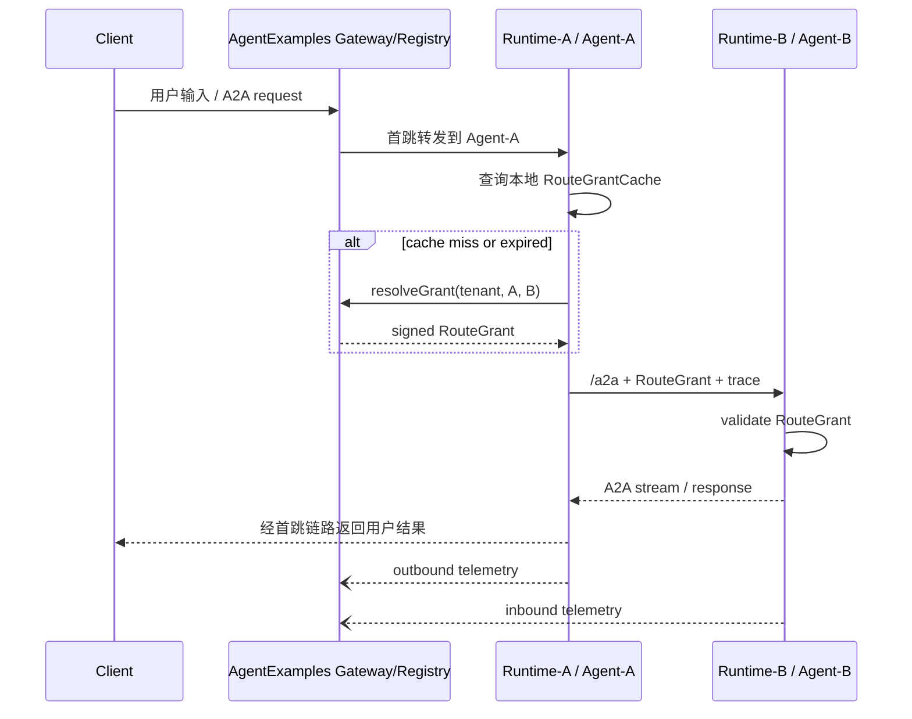

# Proposal: AgentExamples A2A Route Grant Cache And Runtime Interaction Telemetry

> **Date:** 2026-06-05
> **Status:** Pending Review / 非 ADR / 非已批准设计
> **Affects:** `agent-examples` Gateway facade sample、`agent-runtime` runtime-to-runtime A2A client shape、后续正式 Gateway facade service 设计。

## 0. 摘要

本提案修正 `agent-examples` Gateway facade 的 east-west 调用边界：

- 用户输入仍优先进入 `agent-examples` Gateway facade，由它完成北向入口、AgentCard 列表、首跳路由与样例转发。
- runtime 之间的 A2A 调用不默认经由 `agent-examples` 转发，避免把 examples 层变成超高可用数据面。
- runtime 不缓存裸 A2A endpoint，而是缓存由 `agent-examples` 签发的、短 TTL 的、tenant-scoped `RouteGrant`。
- 目标 runtime 必须校验 `RouteGrant`，不能因为调用方知道 endpoint 就允许访问。
- runtime 间调用事件通过异步 telemetry hook 回传 `agent-examples`，使 examples 能还原 A2A 拓扑、耗时和失败原因，但不接管 runtime 间调度。

最终定位：

```text
agent-examples = 北向 Gateway facade + A2A Registry + Route Policy Authority + Telemetry Collector
agent-runtime  = 本地授权路由缓存 + 直接 A2A 调用 + 目标侧授权校验
```

## 1. Background

前一版 Gateway facade 设计已经解决了“每个 runtime 单业务 Agent、examples 收集多个 runtime 的 AgentCard 与 endpoint、对外提供统一发现和最小转发入口”的问题。

新的问题出现在 runtime-to-runtime 调用：

1. 如果 runtime-A 每次调用 runtime-B 前都同步询问 `agent-examples` 做 route resolve，`agent-examples` 会成为 east-west 热路径强依赖。
2. 如果 runtime-A 定期拉取并缓存所有可用 A2A endpoint，则 `agent-examples` 短时离线不影响 runtime 内部链路，但裸 endpoint 可能绕过 tenant / agent 授权。
3. 企业级平台可能有百万级 tenant、万级 Agent；不能把 `tenantId × sourceAgentId × targetAgentId × runtimeReplica` 全量物化为授权路由表。

因此需要一个兼顾高可用、权限隔离和规模可控的新模型。

## 2. Scope Statement

- **主要层级**：L1。
- **主要视图**：Logical。
- **次级视图**：Process（route grant 获取、刷新、调用、上报）、Development（RouteGrant / RouteCache / Observer 接口）、Physical（examples 控制面短时不可用时 runtime 继续工作）、Scenarios（百万 tenant、撤权、离线、runtime 间互调）。

本轮只写 proposal；后续实现建议先在 `examples/agent-runtime-a2a-llm-e2e` 中补最小 route grant / telemetry sample，再考虑是否提升到正式 runtime SPI。

## 3. Root Cause / Strongest Interpretation

1. **Observed failure / motivation**：runtime 间 A2A 调用既需要低耦合高可用，又需要 `tenantId` 级权限控制和可观测拓扑。
2. **Execution path**：用户请求进入 `agent-examples` → examples 首跳转发给 runtime-A → runtime-A 需要调用 runtime-B → runtime-A 需要发现 runtime-B endpoint 并证明自己有权调用。
3. **Root cause**：当前 `RuntimeA2aGateway` 在每次转发时同步调用 `AgentDiscoveryApi.resolveRoute`，适合北向 gateway sample，但如果复用于 runtime-to-runtime 热路径，会让 examples 成为强依赖；反过来，`InMemoryRuntimeRegistry` 当前只存 runtime endpoint / health / AgentCard 视图，尚未定义 tenant-scoped route grant 和目标侧授权校验。
4. **Evidence**：`examples/agent-runtime-a2a-llm-e2e/src/main/java/com/huawei/ascend/examples/a2a/gateway/core/RuntimeA2aGateway.java:57`；`examples/agent-runtime-a2a-llm-e2e/src/main/java/com/huawei/ascend/examples/a2a/gateway/core/InMemoryRuntimeRegistry.java:113`；`agent-runtime/src/main/java/com/huawei/ascend/runtime/bootstrap/AbstractRuntimeAgentHandler.java:46`。

**Strongest interpretation**：`agent-examples` 应成为 route policy authority 和 telemetry collector，而不是 runtime 间所有 A2A 调用的数据面代理；runtime 应缓存短期授权路由，并由目标 runtime 做 fail-closed 校验。

## 4. Final Position For Review

### 4.1 不把 examples 做成 east-west 强代理

`agent-examples` 可以处理北向入口：

```text
client -> agent-examples gateway -> runtime-A
```

但 runtime 间调用默认不走：

```text
runtime-A -> agent-examples gateway -> runtime-B
```

推荐：

```text
runtime-A -> runtime-B
     \          /
      \        /
       telemetry -> agent-examples
```

原因：

- 避免 `agent-examples` 承担所有 streaming / backpressure / retry / timeout。
- 避免 examples 从样例层滑成生产网关。
- 客户已有 gateway 时，可以替换北向入口，但 runtime 间授权缓存和 telemetry 模式仍可复用。
- examples 短时离线时，runtime 已缓存的授权路由仍可工作。

### 4.2 runtime 不缓存裸 endpoint，而缓存 RouteGrant

裸 endpoint 不能作为权限依据。runtime 本地缓存的对象必须是 `RouteGrant`：

```text
RouteGrant
  grantId
  tenantId
  sourceAgentId
  targetAgentId
  targetRuntimeId
  a2aEndpoint
  allowedMethods
  allowedScopes
  policyVersion
  issuedAt
  expiresAt
  signature
```

语义：

- `tenantId`：授权只在该 tenant 内有效。
- `sourceAgentId`：只有该调用方 Agent 可以使用。
- `targetAgentId`：只能调用该目标 Agent。
- `targetRuntimeId` / `a2aEndpoint`：本次授权解析出的实例和 endpoint。
- `allowedMethods`：例如 `message/send`、`message/stream`。
- `policyVersion`：用于撤权和策略升级。
- `expiresAt`：短 TTL，避免长期泄漏。
- `signature`：examples / policy authority 签名，目标 runtime 必须验证。

### 4.3 目标 runtime 必须校验 RouteGrant

runtime-B 收到 runtime-A 的 A2A 请求时，不能只依赖网络可达性。它必须校验：

| 校验项 | 失败行为 |
|---|---|
| signature 有效 | `ROUTE_GRANT_INVALID` |
| `tenantId` 匹配 | `TENANT_FORBIDDEN` |
| `sourceAgentId` 被允许调用 | `SOURCE_AGENT_FORBIDDEN` |
| `targetAgentId` 是当前 runtime 承载的 Agent | `TARGET_AGENT_MISMATCH` |
| `allowedMethods` 包含当前 A2A method | `A2A_METHOD_FORBIDDEN` |
| `expiresAt` 未过期 | `ROUTE_GRANT_EXPIRED` |
| `policyVersion` 未被撤销 | `ROUTE_GRANT_REVOKED` |

这意味着 endpoint 泄漏本身不等于越权；真正的授权边界在 `RouteGrant` 和目标侧校验。

### 4.4 examples 是 policy authority，不是每次调用的在线依赖

`agent-examples` 提供：

- route grant 签发；
- route grant 刷新；
- AgentCard / endpoint / health registry；
- policy version；
- telemetry collector；
- 北向 gateway facade 打样。

runtime 提供：

- 本地 `RouteGrantCache`；
- 定时 refresh；
- 按需 resolve；
- 目标侧 grant validation；
- A2A 调用 telemetry 上报；
- examples 不可用时的本地降级策略。

## 5. Scale Model

### 5.1 不可接受的全量物化模型

百万 tenant、万级 Agent 下，不能这样建表：

```text
tenantId × sourceAgentId × targetAgentId × runtimeReplica
```

粗略量级：

```text
1,000,000 tenants × 10,000 agents = 10^10 tenant-agent visible rows
1,000,000 tenants × 10,000 × 10,000 agent pairs = 10^14 pair rows
```

这在存储、缓存、推送、撤权和审计上都不可接受。

### 5.2 推荐的分层模型

| 层级 | 数据规模 | 说明 |
|---|---:|---|
| GlobalAgentRegistry | 万级 | `agentId`、AgentCard、capabilities、runtime endpoints、version、tags。 |
| PolicyTemplate | 百/千级 | 套餐、行业、区域、数据等级、Agent group、allow/deny rule。 |
| TenantPolicyBinding | 百万级 | `tenantId -> policyTemplateId + overrides`，单列映射可接受。 |
| RuntimeRouteGrantCache | 与热点 QPS / TTL 成正比 | 只缓存实际被调用的 `tenantId + sourceAgentId + targetAgentId`。 |
| RevocationIndex | 小规模热点 | 高危撤权、冻结 tenant、被撤销 policyVersion。 |

关键点：

- `tenantId` 不展开为所有 Agent pair。
- route grant 按需生成，不全量下发。
- runtime 可预取小集合，不预取全租户全集。
- 权限真相在 policy authority，runtime cache 只是短期授权副本。

## 6. Route Grant Acquisition Model

### 6.1 按需 resolve

runtime-A 首次需要调用 runtime-B：

```text
runtime-A -> examples: resolveGrant(tenantId, sourceAgentId, targetAgentId, context)
examples -> runtime-A: RouteGrant
runtime-A -> runtime-B: A2A request + RouteGrant
runtime-B -> runtime-A: A2A response / stream
```

适用：

- 冷启动；
- 新 target agent；
- cache miss；
- grant 过期；
- policy version 变化。

### 6.2 小范围预取

runtime-A 可以按场景预取：

```text
prefetchGrants(tenantId, sourceAgentId, workflowId | agentGroup | topK)
```

限制：

- 返回 topK 或 agent group 内的小集合。
- 不返回整个 tenant 的全量 Agent。
- 每个 grant 都有短 TTL 和签名。

适用：

- 已知 workflow 会调用固定几个 Agent；
- 减少首个 tool/agent hop 的 route resolve 延迟；
- examples 短时不可用时提升可用性。

### 6.3 变更推送

examples 可以在注册信息或策略变化时推送：

- Agent endpoint changed；
- runtime lease expired；
- policyVersion updated；
- revoke grant；
- tenant frozen。

但推送只是优化，不是唯一安全机制。runtime 仍必须依赖 TTL / version / target validation fail-closed。

## 7. Runtime Route Cache

建议 cache key：

```text
tenantId + sourceAgentId + targetAgentId + method
```

cache value：

```text
RouteGrant + target AgentCard summary + lastKnownHealth + observedLatency
```

推荐策略：

| 策略 | 建议 |
---|---|
| TTL | 30s 到 5min，按风险等级配置。 |
| 容量 | 按 runtime 内存和热点调用数限制，例如 LRU / Caffeine-like 策略；样例可先用 JDK Map + 定时清理。 |
| refresh | 过期前异步刷新；刷新失败时可在 grace window 内降级使用，但必须受高危撤权限制。 |
| fail closed | 无 grant、grant 过期、签名无效、policyVersion 被撤销时拒绝调用。 |
| endpoint health | 本地可记录最近失败，短时间内避免重复调用坏 endpoint。 |

## 8. Telemetry Model

examples 需要知道 runtime 间拓扑，但不需要承接数据面。

### 8.1 调用端事件

runtime-A 上报：

- `A2A_OUTBOUND_ROUTE_CACHE_HIT`
- `A2A_OUTBOUND_ROUTE_RESOLVE`
- `A2A_OUTBOUND_STARTED`
- `A2A_OUTBOUND_FIRST_BYTE`
- `A2A_OUTBOUND_COMPLETED`
- `A2A_OUTBOUND_FAILED`

### 8.2 接收端事件

runtime-B 上报：

- `A2A_INBOUND_RECEIVED`
- `A2A_INBOUND_GRANT_ACCEPTED`
- `A2A_INBOUND_GRANT_REJECTED`
- `A2A_INBOUND_ADMITTED`
- `A2A_INBOUND_FIRST_OUTPUT`
- `A2A_INBOUND_COMPLETED`
- `A2A_INBOUND_FAILED`

### 8.3 InteractionEvent 字段

```text
AgentInteractionEvent
  eventId
  eventType
  occurredAt
  tenantId
  sourceRuntimeId
  sourceAgentId
  targetRuntimeId
  targetAgentId
  sessionId
  taskId
  correlationId
  traceId
  grantId
  a2aMethod
  status
  routeResolveMs
  firstByteMs
  totalMs
  requestBytes
  responseBytes
  errorCode
  payloadHash
  payloadRef
```

默认不上传完整 prompt / response。调试模式如果需要 payload，也应走脱敏和大小限制。

## 9. Proposed Interfaces

### 9.1 RouteGrantService

```text
RouteGrantService
  resolveGrant(RouteGrantRequest request) -> RouteGrant
  prefetchGrants(RouteGrantPrefetchRequest request) -> List<RouteGrant>
  renewGrant(RouteGrantRenewal request) -> RouteGrant
```

### 9.2 RouteGrantValidator

```text
RouteGrantValidator
  validate(RouteGrant grant, InboundA2aContext context) -> GrantValidationResult
```

### 9.3 RuntimeRouteCache

```text
RuntimeRouteCache
  get(RouteCacheKey key) -> Optional<RouteGrant>
  put(RouteGrant grant)
  invalidate(RouteCacheKey key)
  invalidateByPolicyVersion(String tenantId, long policyVersion)
```

### 9.4 RuntimeA2aClient

```text
RuntimeA2aClient
  send(RuntimeA2aRequest request) -> RuntimeA2aResponse
  stream(RuntimeA2aRequest request) -> Stream<RuntimeA2aEvent>
```

该 client 内部负责：

- 本地 route cache；
- cache miss 时 resolve grant；
- 注入 grant / trace header；
- 直接调用目标 runtime `/a2a`；
- 上报 outbound telemetry；
- 映射错误码。

### 9.5 AgentInteractionObserver

```text
AgentInteractionObserver
  onCallStarted(AgentInteractionEvent event)
  onFirstByte(AgentInteractionEvent event)
  onCallCompleted(AgentInteractionEvent event)
  onCallFailed(AgentInteractionEvent event)
```

默认实现为 no-op。examples sample 可提供 HTTP observer。

## 10. Security Decisions

### 10.1 tenant 权限不能只靠 discovery

即使 runtime-A 看到了 runtime-B endpoint，也不能直接访问。访问必须带 `RouteGrant`。

### 10.2 RouteGrant 必须短 TTL

TTL 是高可用和撤权延迟之间的平衡：

- TTL 长：examples 离线时 runtime 可工作更久，但撤权延迟更大。
- TTL 短：权限更安全，但 examples 抖动时影响更明显。

建议默认按场景配置：

| 场景 | TTL |
|---|---:|
| 高风险金融动作 | 10s - 30s |
| 普通内部查询 | 1min - 5min |
| 开发样例 | 5min |

### 10.3 撤权策略

| 撤权类型 | 机制 |
|---|---|
| 普通权限变更 | 等 TTL 自然过期。 |
| 高危 agent 禁用 | 推送 revoke + target runtime denylist。 |
| tenant 冻结 | target runtime 维护 tenant deny cache。 |
| policy 全局升级 | `policyVersion` 单调递增，旧 grant 拒绝或按 grace period 处理。 |

## 11. Availability Decisions

### 11.1 examples 短时不可用

如果 examples 不可用：

- runtime 仍可使用未过期 grant 调用目标 runtime。
- runtime 不能获取新 grant。
- runtime 不能刷新过期 grant。
- runtime 仍可本地缓冲 telemetry，待 examples 恢复后批量上报。
- 北向用户入口如果必须走 examples，则新用户请求仍可能受影响。

### 11.2 telemetry 上报失败

telemetry 上报不得阻塞 runtime-to-runtime 调用。建议：

- best effort；
- bounded buffer；
- overflow drop with counter；
- 定期 retry；
- 关键安全事件可单独走 audit channel。

### 11.3 目标 runtime 校验失败

目标 runtime 校验失败必须 fail closed，并上报 inbound rejection event。调用方不得自动降级为裸 endpoint 调用。

## 12. Process View



## 13. Alternatives Considered

| Alternative | Decision | Reason |
|---|---|---|
| 每次 runtime 间调用都同步询问 examples | Rejected | examples 成为 east-west 热路径强依赖，DFX 压力过大。 |
| runtime 缓存所有 endpoint | Rejected | 百万 tenant / 万级 Agent 下规模不可控，且容易绕过 tenant 授权。 |
| runtime 缓存裸 endpoint + examples 做观测 | Rejected | endpoint 泄漏即可越权，目标 runtime 无法 fail closed。 |
| runtime 缓存 tenant-scoped signed RouteGrant | Accepted | 高可用、可撤权、可审计、规模按热点增长。 |
| 所有 telemetry 走同步 RPC | Rejected | 观测不能阻塞业务调用；应异步 best effort。 |

## 14. Rollout

- **W1 Design**：本文 proposal 评审，确认 `RouteGrant` / runtime local cache / telemetry collector 方向。
- **W2 Examples Contract**：在 examples gateway sample 定义最小 `RouteGrantService`、`AgentInteractionEvent` DTO。
- **W3 Runtime Hook**：在 runtime 增加可选 `RuntimeA2aClient` / `AgentInteractionObserver` no-op 扩展点。
- **W4 E2E**：新增 runtime-A 调 runtime-B 的 full-stack E2E，并验证 examples 能查询到 interaction graph。
- **W5 Production Gap Review**：评估是否提升为正式 service / runtime SPI，补 registry backend、签名密钥、审计、撤权机制。

## 15. Verification Plan

文档检查：

- [ ] `git diff --check -- docs/logs/reviews/2026-06-05-agent-examples-a2a-route-grant-and-telemetry-proposal.cn.md`
- [ ] `rg -n "RouteGrant|RouteGrantCache|AgentInteractionEvent|tenant-scoped|Telemetry|runtime-A|runtime-B" docs/logs/reviews/2026-06-05-agent-examples-a2a-route-grant-and-telemetry-proposal.cn.md`

后续代码验收：

- [ ] runtime-A cache miss 时向 examples 获取 `RouteGrant`。
- [ ] runtime-A 使用未过期 `RouteGrant` 直接调用 runtime-B。
- [ ] examples 停止服务后，未过期 `RouteGrant` 仍可用于 runtime-to-runtime 调用。
- [ ] `RouteGrant` 过期后调用 fail closed。
- [ ] tenant 不匹配、sourceAgent 不匹配、targetAgent 不匹配均被 runtime-B 拒绝。
- [ ] runtime-A / runtime-B 均异步上报 telemetry。
- [ ] examples 能按 `correlationId` 查询到 `A -> B` 调用边和耗时。

## 16. Self-Audit

| Finding | Severity | Status | Note |
|---|---|---|---|
| RouteGrant 签名和密钥管理未裁决 | High | Open | 代码实现前必须决定使用 JWT、JWS、macaroon 或内部签名结构。 |
| 撤权延迟取决于 TTL | High | Open | 高危场景需要 denylist / policyVersion 快速撤权。 |
| runtime 本地缓存可能被滥用 | Medium | Open | 需要容量限制、TTL、按 tenant 隔离和 metrics。 |
| telemetry best effort 可能丢事件 | Medium | Open | 生产态需要 bounded buffer、retry 和关键安全事件单独审计通道。 |
| examples 仍是北向入口可用性依赖 | Medium | Open | 本文只解决 runtime-to-runtime 链路对 examples 的强依赖，不解决用户入口 HA。 |

## 17. 2026-06-08 补充决议与后续 TODO

### 17.1 本轮进入 examples sample 的最小闭环

1. Gateway facade 北向转发入口在转发前签发短 TTL `RouteGrant`。
2. Gateway facade 将 `grantId`、签名、tenant、source agent 作为请求头透传给目标 runtime。
3. Gateway facade 使用流式响应体把 runtime A2A 响应回传给调用方，避免等待完整响应体落内存后再返回。
4. Gateway facade 在响应体结束后记录一条 `A2A_GATEWAY_FORWARD_COMPLETED` telemetry 事件。
5. Telemetry 查询接口增加 `limit`，默认 100，上限 1000。
6. 增加 `/v1/gateway-health`，展示样例级注册表和 telemetry 事件计数。
7. `SAA_SAMPLE_GATEWAY_ROUTE_GRANT_SECRET` / `sample.gateway.route-grant-secret` 成为 route-grant 签名 secret 的显式配置入口；默认值只用于本地样例。

### 17.2 明确暂缓项

1. tenant-agent 授权策略接口暂缓。该能力和 access 层鉴权、租户模型、客户侧 IAM/网关有耦合，需要与 access 负责人一起定义。
2. runtime 注册身份校验暂缓。该能力会影响 runtime 自注册协议和 runtime 身份模型，需要与 runtime 负责人确认后再实现。
3. 注册表线性扫描暂缓。当前 sample 保持简单内存实现；生产态应演进到 `tenantId -> agentId -> runtime replicas` 索引或外部 registry。

### 17.3 后续刷新 TODO

1. 增加 `RoutePolicy` / `AgentAccessAuthorizer` 的最小策略接口，并在 `RouteGrantService.resolveGrant` 前裁决。
2. 增加 registry version / etag / delta discovery，避免 2w+ runtime 场景下全量拉取。
3. 增加 `policyVersion` bump 或 revoke store，用于短 TTL 之外的主动撤权。
4. 收敛错误响应模型：`errorCode`、`message`、`correlationId`、`retryable`、`latencyStage`。
5. 将 `/v1/gateway-health` 的内存计数演进为正式 metrics / actuator / dashboard 入口。

## 18. Authority

- `docs/logs/reviews/2026-06-04-agent-examples-a2a-runtime-registry-facade-proposal.cn.md`：上一版多 runtime registry / Gateway facade sample proposal。
- ADR-0016：A2A federation 和 AgentCard / registry 概念预留。
- AgentScope Runtime 对照：其 `AgentApp` 将业务 Agent 包装为服务，A2A adapter 可注册 AgentCard，registry 失败不阻塞 runtime 启动；本文借鉴其 registry / runtime 解耦方向，但将 tenant-scoped grant 和 telemetry collector 作为本项目企业级平台补充。
